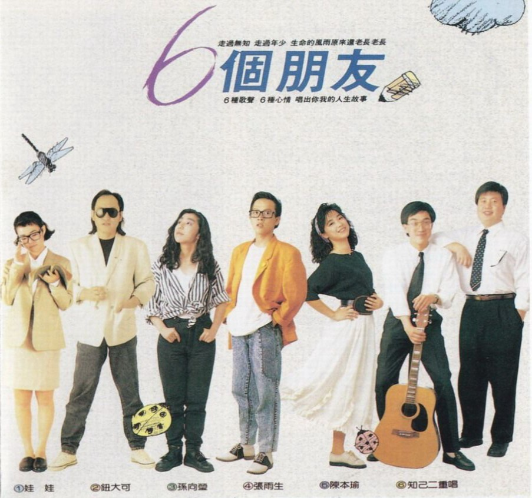
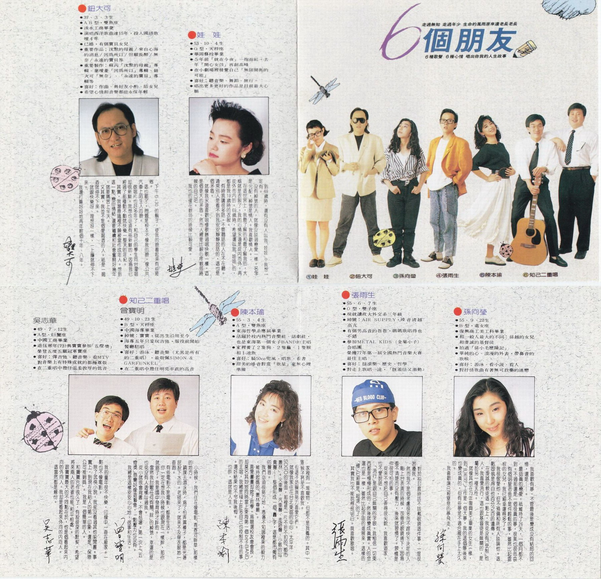
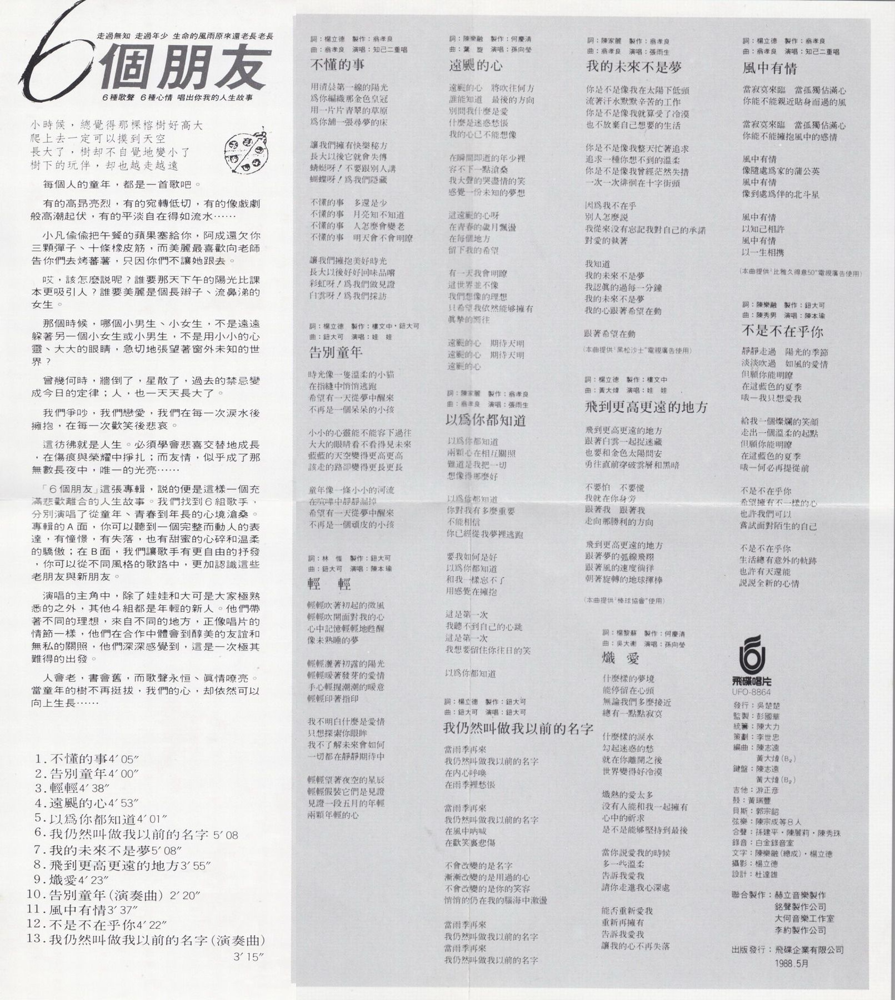
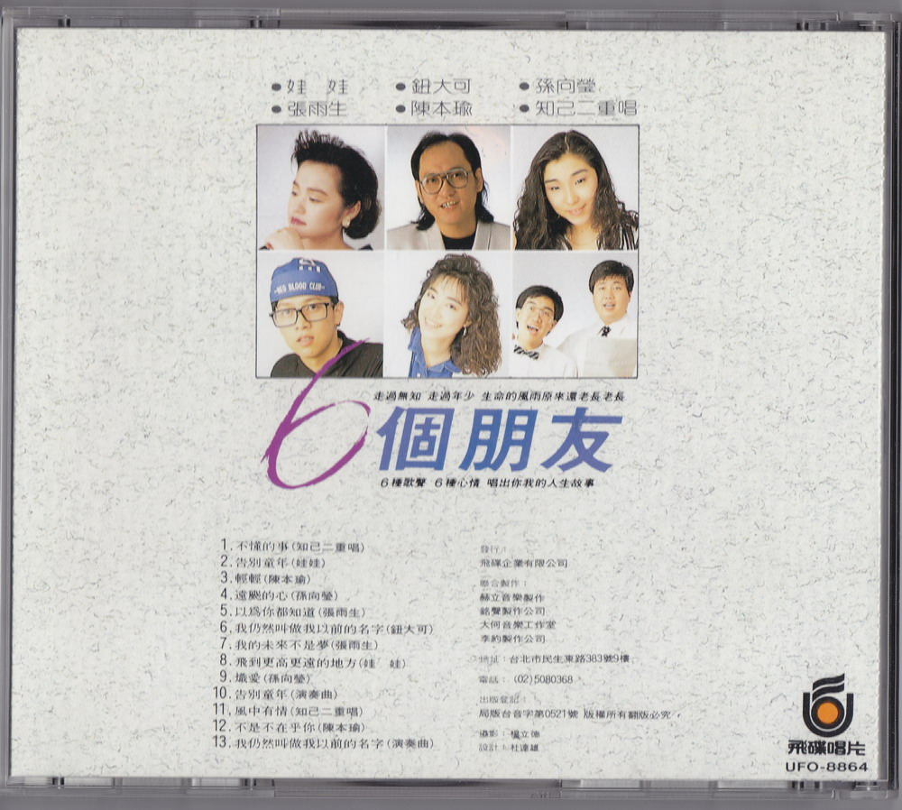

# 6 个朋友

# 文案

走过无知 走过年少 生命的风雨原来还老长老长  
6 种歌声 6 种心情 唱出你我的人生故事

小时候，总觉得那棵榕树好高大  
爬上去一定可以摸到天空  
长大了，树却不自觉地变小了  
树下的玩伴，却也越走越远

每个人的童年，都是一首歌吧。

有的高昂亮烈，有的宛转低切，有的像戏剧般高潮起伏，有的平淡自在得如流水……

小凡偷偷把午餐的苹果塞给你，阿成还欠你三颗弹子、十条橡皮筋，而美丽最喜欢向老师告你们去烤番薯，只因你们不让她跟去。

哎，该怎么说呢？谁要那天下午的阳光比课本更吸引人？谁要美丽是个长辫子、流鼻涕的女生。

那个时侯，哪个小男生、小女生，不是远远躲着另一个小女生或小男生，不是用小小的心灵、大大的眼睛，急切地张望着窗外未知的世界。

曾几何时，墙倒了，星散了，过去的禁忌变成今日的定律；人，也一天天长大了。

我们争吵，我们恋爱，我们在每一次泪水后拥抱，在每一次欢笑后悲哀。

这仿佛就是人生。必须学会悲喜交替地成长，在伤痕与荣耀中挣扎；而友情，似乎成了那无数长夜中，唯一的光亮……

「6 个朋友」这张专辑，说的便是这样一个充满悲欢离合的人生故事。我们找到 6 组歌手，分别演唱了从童年、青春到年长的心境沧桑。专辑的 A 面，你可以听到一个完整而动人的表达，有憧憬，有失落，也有甜蜜的心碎和温柔的骄傲；在 B 面，我们让歌手有更自由的抒发，你可以从不同风格的歌路中，更加认识这些老朋友与新朋友。

演唱的主角中，除了娃娃和大可是大家极熟悉的之外，其他 4 组都是年轻的新人。他们带着不同的理想，来自不同的地方，正像唱片的情节一样，他们在合作中体会到醇美的友谊和无私的关照，他们深深感觉到，这是一次极其难得的出发。

人会老，书会旧，但歌声永恒、真情嘹亮。当童年的树不再挺拔，我们的心，却依然可以向上生长……

# 歌手介绍

## 钮大可

-   37·3·3 生
-   AB 型，双鱼座
-   淡水工商毕业
-   演唱西洋歌曲达 15 年，投入国语歌坛 4 年
-   已婚，有个宝贝女儿
-   重要作品：沉默的母亲 / 来自心海的消息 / 因为所以 / 但愿长醉 / 无奈 / 永远的宝贝等
-   重要制作：苏芮「沉默的母亲」专辑、叶瑷菱「因为所以」专辑、钮大可「无奈」、「永远的宝贝」专辑等
-   喜好：作曲、与好友小酌、陪女儿
-   希望心情和音乐都能永保年轻

下午 5:30 的胡子，使我的脸看起来有些疲倦。  
这也罢了。问题是根本不像我的脸，像公共汽车上陌生人的脸。  
做唱片也好多年了，和自己的学生同台灌唱却很新鲜。我想也必须有些新鲜的，因为我已经过了那种动不动就快乐一整天的年纪。  
其实，我潜意识里不愿被当做成年人。想到这一点「恋母情结」还要继续和社会奋斗好几年，就要痛苦上半天。  
又其实，我并不是个爱喝酒的人。只是一喝酒就停不下来。  
就跟快乐呀、理想呀一样，一上瘾就停不下来。  
我还打算好好地再年轻个十年、八年。

## 娃娃

-   53·10·4 生
-   O 型，天秤座
-   华冈艺校毕业
-   5 年前「就在今夜」一炮而红，去年「开心女孩」再创高峰
-   在小剧场里发觉自己「无限开拓的可能」
-   喜好：听音乐、舞蹈、旅行
-   唱出更多更好的作品是目前最大心愿

到 69 岁时，还有没有人叫我「娃娃」？我想一定有。  
没有绰号的人，就像没谈过恋爱一样。名字是元配，绰号是情人。我喜欢情人。  
在这个世界上，我最了解的和最了解我的，大概就是衣服了。我的心情永远是从内而外，再从外而内的。69 岁时，希望还叫我「娃娃」的，都是我 19 岁时的衣服。  
有时我讲很多话，不管听话的人在不在听。通常别人是看不到我安安静静说话的，这也是个矛盾。  
就像我永远喜欢唱慢歌胜过唱快歌一样，这是个更大的矛盾。然而人总是比较心疼软弱时候的自己吧。  
我也的确在软弱的时候比较可爱。

## 知己二重唱

### 吴志华

-   49·7·12 生
-   A 型· 巨蟹座
-   中国工商毕业
-   退伍那年（73）与宝宝参加「五灯奖」荣获五度五关冠军宝座
-   喜好：弹吉他、听音乐、看 MTV
-   在二重唱中担任温柔敦厚的低音

我的童年很不快乐，印象中一直在搬家。一点也不像电影。
除了武侠小说，我从没看过其他的闲书。事实上，到现在我给人的第一印象，还是「保险公司推销员」。我是一个简单的人。
和宝宝合作很久了，有股很深的默契，希望将来两人的老婆也能「和平相处」。
跟宝宝最大的不同点在于，他是个看起来内向的外向人，我却是看起来外向的内向人。
这当然都是缘分。

### 曾宝明

-   49·10.23 生
-   B 型，天秤座
-   中国海军毕业
-   绰号：宝宝，从出生沿用至今
-   海军五年只爱玩吉他，服役前开始餐厅驻唱
-   喜好：游泳、听音乐（尤其是所有的二重唱），最敬佩 SIMON & GARFUNKEL
-   在二重唱中担任明亮直率的高音

小时候，我们住在像电影「青青河畔草」那样的地方。  
翘课去游泳时，为了怕弄湿裤子，都是光着屁股下水的。老师来了，就来不及穿衣服地一直跑。  
有些电影不是电影，都是生活。  
你一定在想我小时候也跟现在一样胖，那你就错了。我是国中发育时才发胖的。  
当然我讨厌任何有关「胖」的绰号，幸运的是也从没有人这样叫过我。  
从小就很会背书，不会怯场。第一次上「五灯奖」感觉好像游艺会，一点压力也没有。  
我总是这样安安心心地，做事和生活。

## 陈本瑜

-   55·3·4 生
-   A 型，双鱼座
-   东海哲学系应届毕业
-   活跃于校内热门音乐社、话剧社，也是东海第一个女子 BAND 的主唱
-   家里养了 2 只狗、2 只龟，1 只猴和 1 池鱼
-   喜好：骑 50cc 兜风、唱歌、看书
-   甜美的嗓音对于「歌星」毫无心理准备

家里有一堆宠物，但都不是我养的。其中一只猴子甚至不喜欢我。  
但这不妨碍我努力喜爱它们。  
就像我家住在台北东区的中心，太平洋 SOGO 的后面，那里是一片不折不扣的「都市丛林」。火车声、汽车声、走路声、小贩的叫卖声……整个形成一个「轰」字，这是都市独有的声音。  
我们必须很努力地，凭着不知哪里来的毅力，维持起码的「丛林尊严」。  
喜爱画画却念起了哲学，为竞选校友会会长，却莫名其妙地同时当上东海第一个女子 BAND 的主唱，我总是碰上许多自己也控制不住的事。还好结果也不令我后悔。  
也许，这就是人生。

## 张雨生

-   55·6·7 生
-   O 型，双子座
-   现就读政大外交系三年级
-   绰号：AIR SUPPLY，嗓音清越高亢
-   有个男高音的爸爸，妈妈歌唱得也不错
-   参加 METAL KIDS（金属小子）合唱团  
    荣获 77 年第一届全国热门音乐大赛最佳主唱
-   喜好：摇滚乐、历史、哲学
-   对走上唱歌一途，「既羞怯又激动」

对于拍封套时该不该戴眼镜这件事，一度很困扰我。  
然而我不是个考虑很多而不赶快下决定的人。  
刚上台表演的时候，故意把眼镜摘下，因为看不清楚而没有压力，后来就习惯了。习惯是件很可怕的事。  
从来不想把自己弄得很尖锐，我喜欢道家，也不爱说话。  
「流行」是跟自己无关的字眼。我相信一切东西都是慢慢形成的，然后就变成真实。人的命运也是一样，虽然比起宇宙的进展来，这样的「慢」已经算是「超速」的了。  
其实我也不能说得很明白。我喜欢歌唱。

## 孙向莹

-   55·9·22 生
-   B 型，处女座
-   复兴商工美工科毕业
-   与一般人最大的不同：孙越的女儿和虔诚的基督徒
-   拍过「孙小毛历险记」
-   单纯的心、烂漫的外表、带鼻音的歌喉
-   喜好：游泳、看小说、看人
-   对抒情歌曲有着无可救药的迷恋

我喜欢有梦，不管最后是变成没有结局的回忆，还是……。  
最认真的恋爱，只维持了 26 天，一个月都不到。不过那还是一个很真的梦，很美也很悲哀。  
有个明星老爸不是件轻松的事，虽然比起雷根的女儿，我已经幸运得多了。  
我很敬爱他，但不预备和所有人谈论他。这点固执是得自他百分之百的遗传。  
在虔诚的教徒这一点上，我从没有「受制」他人。我喜爱流行，这也跟基督徒是无关的，是属于另一种天性。  
就像其他在 73 年复兴美工毕业的女生一样，到「巴而可」工作是一个大梦，我的这个梦后来也变成真的，但有些梦是不适合握在手上太久的。  
我喜欢让已经窒息的梦飞走。

# 以为你都知道

作词：陈家丽  
作曲：翁孝良  
制作：翁孝良  
演唱：张雨生

以为你都知道  
两颗心在相互关照  
难道是我  
把一切想象得那么好

以为你都知道  
你对我有多么重要  
不能相信  
你已经从我梦里逃跑

要我如何是好  
以为你都知道  
和我一样忘不了  
用感觉在拥抱

这是第一次  
我听不到自己的心跳  
这是第一次  
我想要留住你往日的笑

以为你都知道

# 我的未来不是梦

作词：陈家丽  
作曲：翁孝良  
制作：翁孝良  
演唱：张雨生

你是不是像我在太阳下低头  
流着汗水默默辛苦地工作  
你是不是像我就算受了冷落  
也不放弃自己想要的生活

你是不是像我整天忙着追求  
追求一种你想不到的温柔  
你是不是像我曾经茫然失措  
一次一次徘徊在十字街头

因为我不在乎  
别人怎么说  
我从来没有忘记我对自己的承诺
对爱的执着

我知道  
我的未来不是梦  
我认真地过每一分钟  
我的未来不是梦  
我的心跟着希望在动

跟着希望在动

（本曲提供“黑松沙士”电视广告使用）

# 制作团队

|   负责   |                         人员 / 工作室                          |
| :------: | :------------------------------------------------------------: |
|   发行   |                             吴楚楚                             |
|   监制   |                             彭国华                             |
|   统筹   |                             陈大力                             |
|   策划   |                             李世忠                             |
|   编曲   |                   陈志远 黄大炜（$B_2$）                    |
|   键盘   |                   陈志远 黄大炜（$B_2$）                    |
|   吉他   |                             游正彦                             |
|    鼓    |                             黄瑞丰                             |
|   贝斯   |                             郭宗韶                             |
|   弦乐   |                         陈宗成等 8 人                          |
|   合声   |                     孙建平，陈丽莉，陈秀珠                     |
|   录音   |                           白金录音室                           |
|   文字   |                     陈乐融（总成），杨立德                     |
|   摄影   |                             杨立德                             |
|   设计   |                             杜达雄                             |
| 联合制作 | 赫立音乐制作 铭声制作公司 大何音乐工作室 李约制作公司 |
| 出版发行 |                 飞碟企业有限公司 1988.5 月                  |

# 专辑照片

整理：健健，Finn & Rain

当前页面缺陷：

1. 发行时间无法精确到日
