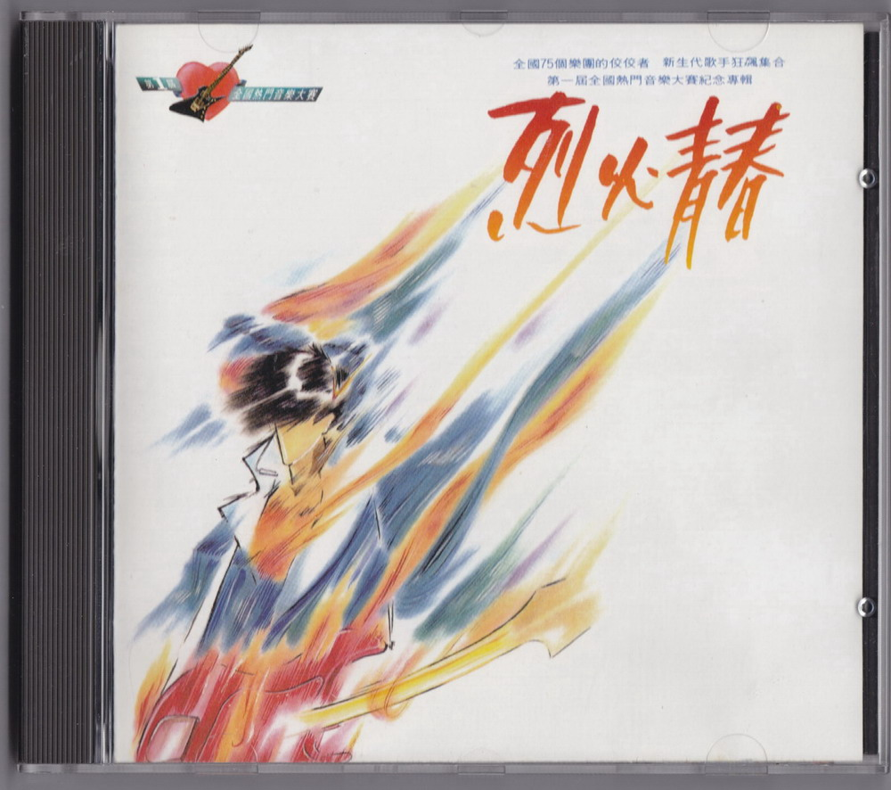
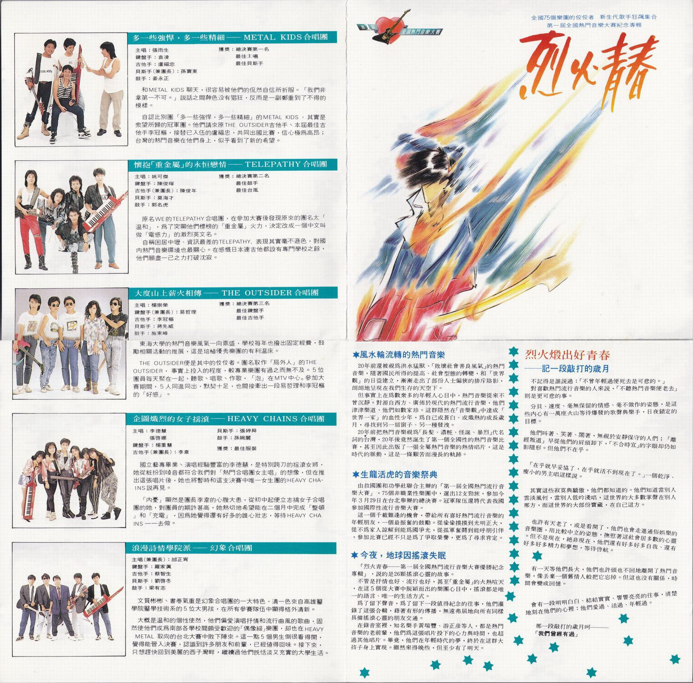

# 烈火青春

# 乐队介绍

## 多一些强悍，多一些精细 —— METAL KIDS 合唱团

主唱：张雨生  
键盘手：袁凌  
吉他手：卢福忠  
贝斯手（兼团长）：孙寰东  
鼓手：姜永正

获奖：

-   总决赛第一名
-   最佳主唱
-   最佳贝斯手

和 METAL KIDS 聊天，很容易被他们的侃然自信所折服。「我们非拿第一不可。」说话之间神色没有猖狂，反而是一副郑重到了不得的模样。

自认比别团「多一些强悍，多一些精细」的 METAL KIDS，其实是众望所归的冠军团。他们请来原 THE OUTSIDER 吉他手、本届最佳吉他手李冠枢，接替已入伍的卢福忠，共同出国比赛，信心极为高昂；台湾的热门音乐在他们身上，似乎看到了新的希望。

## 怀抱「重金属」的永恒恋情——TELEPATHY 合唱团

主唱：姚可杰  
键盘手：陈俊晖  
吉他手（兼团长）：陈俊年  
贝斯手：莫海才  
鼓手：郭名虎

获奖：

-   总决赛第二名
-   最佳鼓手
-   最佳台风

原名 WE 的 TELEPATHY 合唱团，在参加大赛后发现原来的团名太「温和」，为了突显他们标榜的「重金属」火力，决定改成一个中文叫做「电感力」的激烈英文名。

自称困居中坜、资讯最差的 TELEPATHY，表现其实毫不逊色，对国内热门音乐环境也最关心。在感慨日本连吉他都设有事门学校之余，他们愿尽一己之力打破沉寂。

## 大度山上薪火相傅——THE OUTSIDER 合唱团

主唱：杨崇荣  
键盘手（兼团长）：易哲理  
吉他手：李冠枢  
贝斯手：蒋先威  
鼓手：施东峰

获奖：

-   总决赛第三名
-   最佳键盘手
-   最佳吉他手

东海大学的热门音乐风气一向鼎盛，学校每年也拨出固定经费，鼓励相关活动的推展，这是培植优秀乐团的有利温床。

THE OUTSIDER 便是其中的佼佼者。名取作「局外人」的 THE OUTSIDER，事实上投入的程度，较专业乐团有过之而无不及。5 位团员每天聚在一起，听歌、唱歌、作歌，「泡」在 MTV 中心。参加大赛期间，5 人同进同出，默契十足，也间接牵出一段易哲理和李冠枢的「好感」。

## 企图炽烈的女子摇滚——HEAVY CHAINS 合唱团

主唱：李德慧、张启娜  
键盘手：杨重慧  
吉他手（兼团长）：李韦  
贝斯手：张婷舜  
鼓手：孙婉丽

获奖：最佳服装

国立艺专毕业、演唱经验丰富的李德慧，是特别跨刀的摇滚女将，她从妝扮到嗓音都符合我们对「热门合唱团女主唱」的想像，但在推出这张唱片后，她也将暂时和这支决赛中唯一女生团的 HEAVY CHAINS 说再见。

「内忧」，显然是团长李韦的心腹大患，从初中起便立志搞女子合唱团的她，对团员的期许甚高，她热切地希望能在二个月中完成「整顿」和「充电」，因为她觉得还有好多的雄心壮志，等待 HEAVY CHAINS 一一去做。

## 浪漫诗情学院派——幻象合唱团

主唱（兼团长）：邰正宵  
键盘手：罗家真  
吉他手：蔡智生  
贝斯手：刘启冬  
鼓手：梁有志

文质彬彬、书卷气重是幻象合唱团的一大特色，清一色来自高雄医学院医学技术系的 5 位大男孩，在所有参赛队伍中显得格外清新。

大概是温和的个性使然，他们偏爱演唱抒情和流行曲风的歌曲，固然使他们成为南部各学校间颇受欢迎的「偶像级」乐团，却也在 HEAVY METAL 取向的台北大赛中败下阵来。这一点 5 个男生倒很看得开，觉得能晋入决赛，认识到许多朋友和前辈，已值得回味。接下来，只想赶快回到美丽的西子湾畔，继续过他们既恬淡又充实的大学生活。

# 烈火煅出好青春——记一段敲打的岁月

## 风水轮流转的热门音乐

20 年前还被视为洪水猛兽、「败坏社会善良风气」的热门音乐，随着国民所得的提高、社会型态的转变，和「世界观」的日益建立，渐渐走出了部份人士偏狭的排斥阴影朗朗地呈现在我们生存的天空下。

但事实上在为数众多的年轻人心目中，热门音乐从来不曾沉静。对源自西方、广布于现代的热门流行音乐，他们津津乐道、他们如数家珍。这群隐然在「音乐观」中达成「世界一家」的血性少年，为自己或苍白、或炽热的成长岁月，寻找到另一扇窗子、另一种发泄。

20 年前把热门音乐视为「长发、浓粧、怪诞、暴烈」代名词的台湾，20 年后竟然诞生了第一个全国性的热门音乐比赛，甚至因此出版了一张全属热门音乐的热情唱片，这是时代的脉动，这是一条艰苦而漫长的轨迹。

## 生龙活虎的音乐祭典

由救国团和功学社联合主办的「第一届全国热门流行音乐大赛」，75 个非职业性乐团中，选出 12 支劲旅，参加今年 3 月 29 日在台北举办的总决赛。冠军队伍还将代表我国参加国际性流行音乐大赛。
这一个千载难逢的机会，带给所有喜好热门流行音乐的年轻朋友，一个最振奋的鼓励。从偷偷摸摸到光明正大，从不为家人谅解到能为国争光，从孤军奋关到能呼朋引伴参加比赛已经不只是为了争取荣誉，更为了寻求肯定。

## 今夜，地球因摇滚失眠

「烈火青春——第一届全国热门流行音乐大赛优胜纪念专辑」，说的是 26 颗摇滚心灵的故事。

不管是抒情也好、流行也好，甚至「重金属」的火热喧天，在这 5 个从大赛中脱颖而出的乐团心目中，摇滚都是唯一的语言、唯一的生活方式。

为了留下声音，为了留下一段值得纪念的往事，他们灌录了这张合辑，借着有形的传播，无远弗届地向所有同样具备摇滚心灵的朋友交通。

在录音室里，知名乐手黄瑞丰、游正彦等人，都是热门音乐的老前辈，他们为这张唱片投下的心力与时间，也超过其他唱片。毕竟，他们在年轻时代的梦，终于在这群大孩子身上实现。虽然来得晚些，但至少有了明天。

不记得是谁说过：「不曾年轻过便死去是可悲的。」

对喜欢热门流行音乐的人来说，「不听热门音乐便老去」则是更可悲的事。

分贝、速度、毫无保留的情感、毫不做作的姿态，是这些内心有一万座火山等待爆发的歌声与乐手，日夜锁定的目标。

他们叫着、笑着、闹着，无视于安静保守的人们；「离经叛道」早从他们的肩头卸下，「不合时宜」的字眼却仍如影随形。但他们不在乎。

「在乎就早妥协了，在乎就活不到现在了。」一个干净、瘦小的男主唱这样说。

其实这些寂寞与骄傲，他们都知道的。他们知道当别人云淡风轻，当别人低吟浅唱，这世界的大多数掌声在别人那方，而这世界的大部份宝藏，在自己这方。

也许有天老了，或是看开了，他们也会走进通俗娱乐的音乐圈，用比较中立的姿态，抚慰着这社会居多数的心灵。但不是现在，绝非现在，他们还有好多好多自我、还有好多好多精力和梦想，等待启航。

有一天等他们长大，他们也许头也不回地离开了热门音乐，像丢弃一个旧情人般把它忘掉。但这也没有关系，时间会变成回忆。

会有一段明明白白、结结实实、响响亮亮的往事，清楚地刻在他们的心里：他们爱过、活过、年轻过。

那一段敲打的岁月呵——「我们会经有过」

# 烈火青春

作词：陈乐融  
作曲：陈志远  
编曲：陈志远

沸腾的夜在跳动  
跟着摇滚的节奏  
敲打的岁月在你和我  
嘹亮的歌声在风中

用感觉擦亮你我期待的脸庞  
用心灵温暖黑夜孤独的泪光  
让青春烈火燃烧永恒  
让生命闪电划过天边  
用所有热情换回时间  
让年轻的梦没有终点

这一刻我将远走  
爱是我唯一所有  
外面的世界如此辽阔  
年轻的我不再回头

用感觉擦亮你我期待的脸庞  
用心灵温暖黑夜孤独的泪光  
让青春烈火燃烧永恒  
让生命闪电划过天边  
向浩瀚星空许下诺言  
让年轻的心永不改变

# Heaven On Fire

作词：孙寰东  
作曲：孙寰东

Walking on lonely streets in a darkened night  
Midnight sun rolling down my eye  
Living in a forest of fallen dreams  
And life's a big hand strangling me till I die  
But your giving hand rising up to my heart  
So keep the fire burning my love

> 在这漆黑的夜晚我走在寂寞的街道上  
> 午夜的阳光直射我的眼睛  
> 活在凄凉堕落的梦魇里  
> 生活如一只巨手扼住我直到我死去  
> 但这时你向我的心灵伸出援助之手  
> 让火焰燃烧我的爱永不停息

Feeling your heat burning  
Makes my body temperature rise  
Heaven on fire shining like an angle flying  
Heaven burning my love  
Never gonna have you leave me  
Heaven on fire burning love

> 我感到你的内心在燃烧  
> 使我的身体热血沸腾  
> 火焰如天使般闪耀着我们的天堂  
> 在天堂我的爱炽热燃烧  
> 永远不会让你离开我  
> 燃烧爱的天堂

Sharing pretty nights. Hold me till I die  
Falling in love is so sweet  
Oh~ Flying like the dust  
What kind of fool am I. Burning love

> 共度这美妙之夜，抱着我直到我死去  
> 坠入爱河是如此的甜蜜  
> 哦~ 像飞扬的尘埃  
> 我是如炽热般燃烧爱情的傻瓜

# 制作团队

|         负责         |         人员 / 工作室          |
| :------------------: | :----------------------------: |
|         发行         |             吴楚楚             |
|         监制         |             彭国华             |
|         统筹         |             陈大力             |
|         策划         |         陈光陆、邓廷琤         |
|         制作         | 天鼎传播公司（大学城制作中心） |
|        制作人        |             马兆骏             |
|       助理制作       |         吕晓楝、涂佩岑         |
|      编曲/键盘       |             陈志远             |
|         吉他         |             游正彦             |
|        打击乐        |             黄瑞丰             |
|         贝斯         |             郭宗韶             |
|         和音         |           林美满 等            |
|         混音         |             陈建平             |
|        录音室        |           雅弦录音室           |
|       文案总监       |             陈乐融             |
|       封面绘图       |             李仁毅             |
|         摄影         |           ADU STUDIO           |
|         设计         |             杜达雄             |
| MTV 导演（烈火青春） |              未知              |

飞碟唱片 UFO-8870 局版台音字第 0521 号  
Ⓟ&Ⓒ 飞碟企业有限公司

# 扫描照片

参考：

-   [烈火青春，第一届全国热门音乐大赛纪念专辑 - TOMCHANG.CN](https://tomchang.cn/music/collection/Rumble-Ages.html)

整理：健健

当前页面缺陷：

-   缺少专辑扫描照片
-   发行时间无法精确到日
