# 天天想你

# 文案

我认识你 不假修饰的真诚  
我认识你 带着梦想的眼神  
我认识你 毫不保留的歌声  
我认识你 你是张雨生！

张雨生，这个出身澎湖眷村、12 岁开始接触西洋歌曲，歌声里有自足的单纯与喜悦的一个大男孩，从 '88 年暑假起风靡了台湾。

他唱「我的未来不是梦」，让所有人陡然相信：自己可以飞得更高、做得更好；他唱「以为你都知道」，证明只要有真情，小小年纪一样懂得爱情的美好；甚至他参与合唱的「烈火青春」，都明白告诉人们：年轻不一定代表叛逆，摇滚一样很热情！

大家喜欢张雨生，不只是因为他像我们邻家谦虚上进的小兄弟，更因为他自己相信、也让我们相信了：「真实地爱、自然地活」，是可以做到的人生信仰。

张雨生的歌唱之路才刚开始，张雨生的人生故事还很长，他还有好多的心愿要去实现，还有好多的困难要去担当，他不会每件事都幸运得不假思索，但是他知道自己征途的尽头，会有光亮。

让我们祝福他，像祝福自己心中的一抹阳光。

# 独白

两年前，从小与我最亲的妹妹，在梨山附近的山涧不幸溺毙，那一年她才 15 岁。

虽然从头到尾，我没有掉一滴眼泪，但这个伤口一直在我心中。

她是那么可爱，那么懂事，而且歌声又那么好。老天真不公平，妹妹她一直比我更爱唱歌，唱得比我更好。

这件事对我的打击太大，在此之前，我从来不曾公开演唱过。是她去世后，我报名了「木船」民歌比赛，开始加入热门合唱团，一场又一场地唱下来。

像是背负了什么使命，心里不断有个声音催着我：「喜欢，就赶快去做！」不要等到一切都已太迟。

今天我站在台上，受到许许多多的欢迎，除了高兴，更多的是感激，感激上天让我唱出了自己，也唱出每一个人永远渴望的纯真与勇气。

这是我的第一张专辑，我把它献给所有喜欢音乐，喜欢生命的朋友。

谢谢妳，老妹。谢谢你们，爸妈。

谢谢你，我的朋友！

张雨生  
77.10.22

# 跟着我

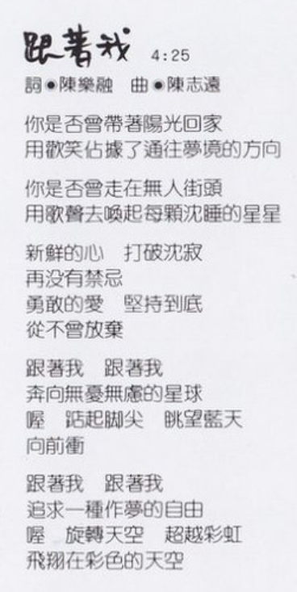

时长：4:25  
作词：陈乐融  
作曲：陈志远

你是否曾带着阳光回家  
用欢笑占据了通往梦境的方向

你是否曾走在无人街头  
用歌声去唤起每颗沉睡的星星

新鲜的心 打破沉寂  
再没有禁忌  
勇敢的爱 坚持到底  
从不曾放弃

跟着我 跟着我  
奔向无忧无虑的星球  
喔 踮起脚尖 眺望蓝天  
向前冲

跟着我 跟着我  
追求一种做梦的自由  
喔 旋转天空 超越彩虹  
飞翔在彩色的天空

# 天天想你

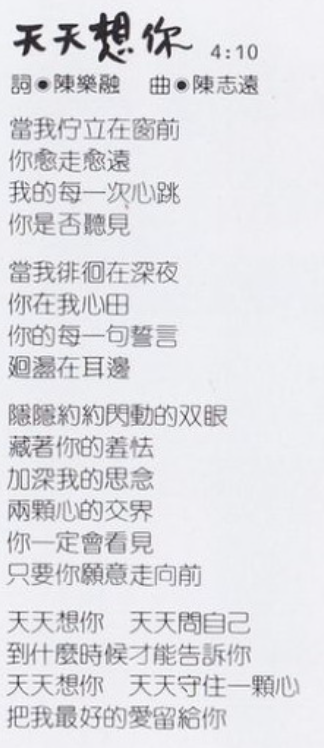

时长：4:10  
作词：陈乐融  
作曲：陈志远

当我伫立在窗前  
你愈走愈远  
我的每一次心跳  
你是否听见

当我徘徊在深夜  
你在我心田  
你的每一句誓言  
回荡在耳边

隐隐约约闪动的双眼  
藏着你的羞怯  
加深我的思念  
两颗心的交界  
你一定会看见  
只要你愿意走向前

天天想你 天天问自己  
到什么时候才能告诉你  
天天想你 天天守住一颗心  
把我最好的爱留给你

# 永远都像才认识

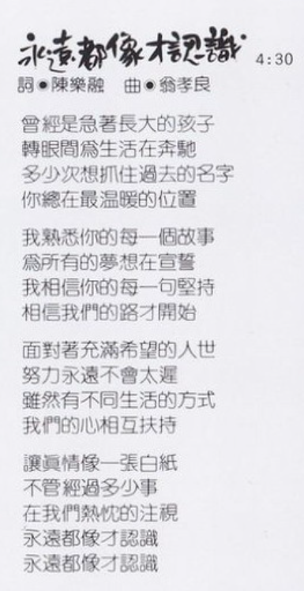

时长：4:30  
作词：陈乐融  
作曲：翁孝良

曾经是急着长大的孩子  
转眼间为生活在奔驰  
多少次想抓住过去的名字  
你总在最温暖的位置

我熟悉你的每一个故事  
为所有的梦想在宣誓  
我相信你的每一句坚持  
相信我们的路才开始

面对着充满希望的人世  
努力永远不会太迟  
虽然有不同生活的方式  
我们的心相互扶持

让真情像一张白纸  
不管经过多少事  
在我们热忱的注视  
永远都像才认识  
永远都像才认识

# 我的阳光我的风

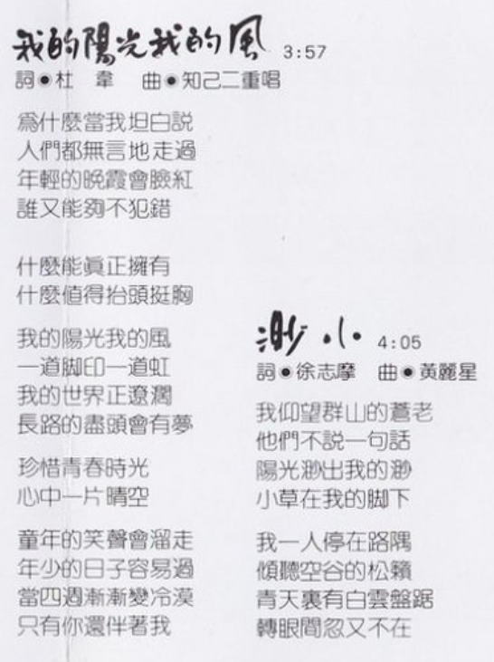

时长：3:57  
作词：杜韦  
作曲：知己二重唱

为什么当我坦白说  
人们都无言地走过  
年轻的晚霞会脸红  
谁又能够不犯错

什么能真正拥有  
什么值得抬头挺胸

我的阳光我的风  
一道脚印一道虹  
我的世界正辽濶  
长路的尽头会有梦

珍惜青春时光  
心中一片晴空

童年的笑声会溜走  
年少的日子容易过  
当四周渐渐变冷漠  
只有你还伴着我

# 渺小

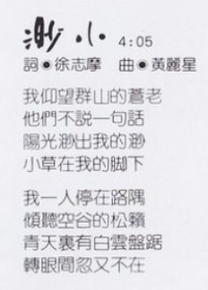

时长：4:05  
作词：徐志摩  
作曲：黄丽星

我仰望群山的苍老  
他们不说一句话  
阳光渺出我的渺  
小草在我的脚下

我一人停在路隅  
倾听空谷的松籁  
青天里有白云盘踞  
转眼间忽又不在

# 和天一样高

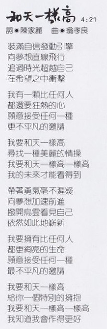

时长：4:21  
作词：陈家丽  
作曲：翁孝良

装满自信发动引擎  
向梦想直线飞行  
追过时光超越自己  
在希望之中冲击

我有一颗比任何人  
都还要狂热的心  
愿意接受任何一种  
最不平凡的邀请

我要和天一样高  
寻找一种美丽的情操  
我要和天一样高一样高  
我的未来才能看得到

带着勇气毫不迟疑  
向梦想加速前进  
拨开乌云看见自己  
竟[^1]然如此地崭新

我要拥有比任何人  
都更绚亮的生命  
愿意接受任何一种  
最不平凡的邀请

我要和天一样高  
给你一个特别的拥抱  
我要和天一样高一样高  
我知道我会作得更好

# 告诉我亲爱的

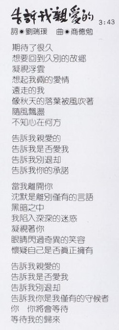

时长：3:43  
作词：刘瑞瑗  
作曲：商德勉

期待了很久  
想要回到久别的故乡  
凝视浮云  
想起我俩的爱情  
远走的我  
像秋天的落叶被风吹着  
随风飘荡  
不知心在何方

告诉我亲爱的  
告诉我是否爱我  
告诉我别退却  
告诉我你的承诺

当我离开你  
沉默是离别仅有的言语  
黑暗之中  
我陷入深深的迷惑  
凝视着你  
眼睛闪过奇异的笑容  
怀疑自己是否真正拥有  
告诉我亲爱的  
告诉我是否爱我  
告诉我别退却  
告诉我你是我仅有的守候者  
你 你将会等待  
等待我的归来

# 没有不可能的事

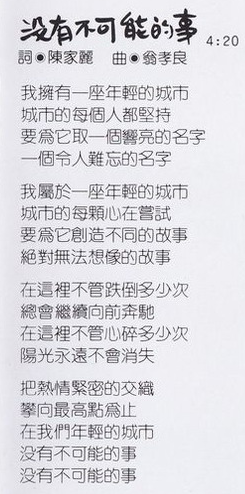

时长：4:20  
作词：陈家丽  
作曲：翁孝良

我拥有一座年轻的城市  
城市的每个人都坚持  
要为它取一个响亮的名字  
一个令人难忘的名字

我属于一座年轻的城市  
城市的每颗心在尝试  
要为它创造不同的故事  
绝对无法想象的故事

在这里不管跌倒多少次  
总会继续向前奔驰  
在这里不管心碎多少次  
阳光永远不会消失

把热情紧密的交织  
攀向最高点为止  
在我们年轻的城市  
没有不可能的事  
没有不可能的事

# 不是因为寂寞

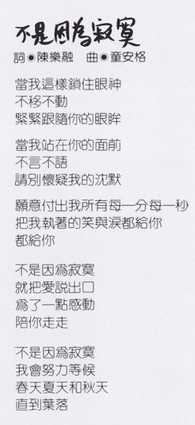

时长：4:55  
作词：陈乐融  
作曲：童安格

当我这样锁住眼神  
不移不动  
紧紧跟随你的眼眸

当我站在你的面前  
不言不语  
请别怀疑我的沉默

愿意付出我所有每一分每一秒  
把我执着的笑与泪都给你  
都给你

不是因为寂寞  
就把爱说出口  
为了一点感动  
陪你走走

不是因为寂寞  
我会努力等候  
春天夏天和秋天  
直到叶落

# 就算为你，也是为我

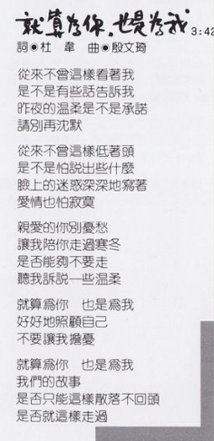

时长：3:42  
作词：杜韦  
作曲：殷文琦

从来不曾这样看着我  
是不是有些话告诉我  
昨夜的温柔是不是承诺  
请别再沉默

从来不曾这样低着头  
是不是怕说出些什么  
脸上的迷惑深深地写着  
爱情也怕寂寞

亲爱的你别忧愁  
让我陪你走过寒冬  
是否能够不要走  
听我诉说一些温柔

就算为你 也是为我  
好好地照顾自己  
不要让我担忧

就算为你 也是为我  
我们的故事  
是否只能这样散落不回头  
是否就这样走过

# 制作团队

|   负责    |       人员/资讯        |
| :-------: | :--------------------: |
|   发行    |         吴楚楚         |
|   监制    |         彭国华         |
|   统筹    |         陈大力         |
|   策划    |         李世忠         |
|   制作    |         翁孝良         |
| 编曲/键盘 |         陈志远         |
|    鼓     |         黄瑞丰         |
|   贝斯    |         郭宗韶         |
|   吉他    |     游正彦、李庭匡     |
|   和音    | 孙建平、陈丽莉、陈秀珠 |
|   录音    |   成功录音室 林明阳    |
| 文案总监  |         陈乐融         |
|   化妆    |         战霈绮         |
|   摄影    |       ADU STUDIO       |
|   设计    |         杜达雄         |

飞碟企业股份有限公司  
1988 年 11 月出版发行  
Ⓟ1988 飞碟企业有限公司  
Ⓒ1988 飞碟企业有限公司

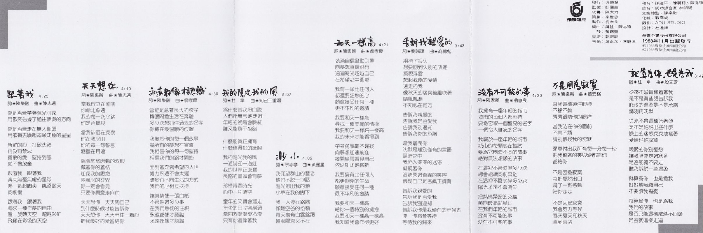

# 参考

相关链接：

-   [张雨生 \- 经典隽永「天天想你」](https://www.facebook.com/share/p/ZThWZgKe88hw9A3U/)
-   [天天想你\-专辑\-张雨生网站 \- TOMCHANG\.CN](https://www.tomchang.cn/music/album/10.html)

当前页面缺陷：

-   独白需要更清晰的照片
-   发行时间没有精确到日

整理：郈斐，健健

[^1]: 虽然写着「依」，唱的是「竟」
