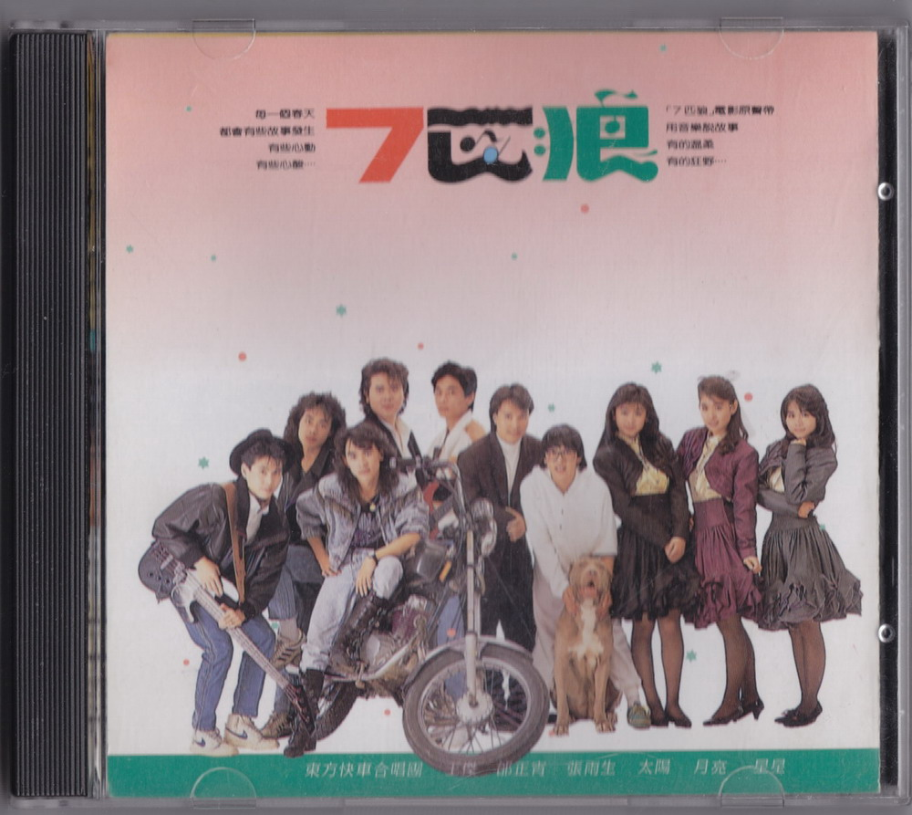
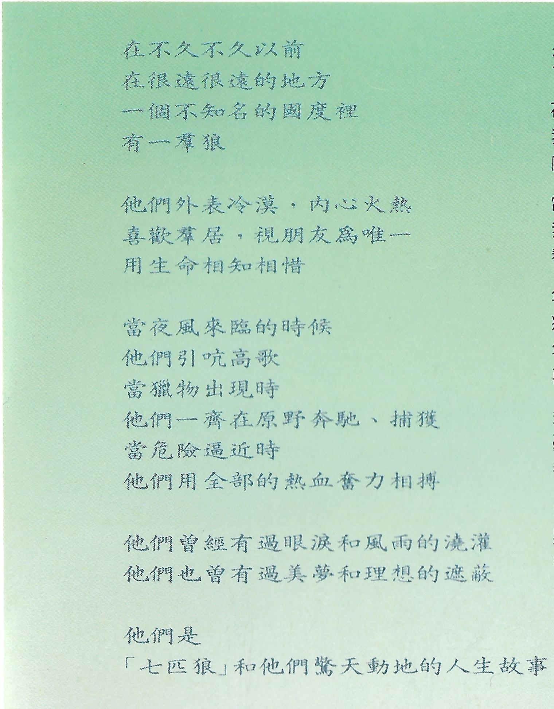
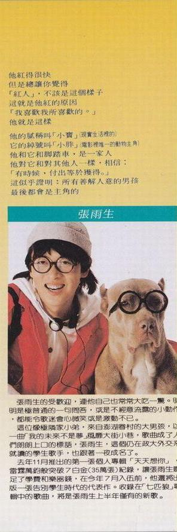
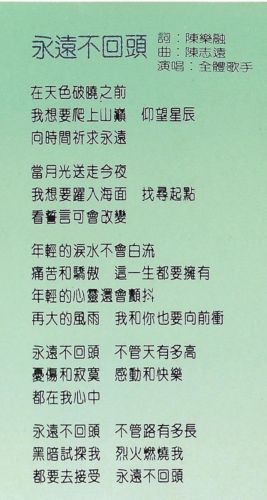
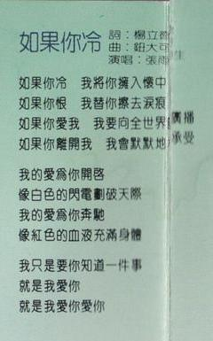
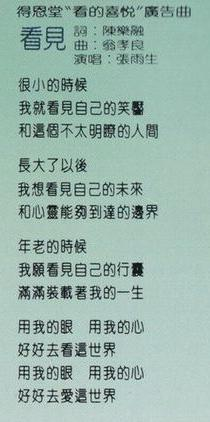
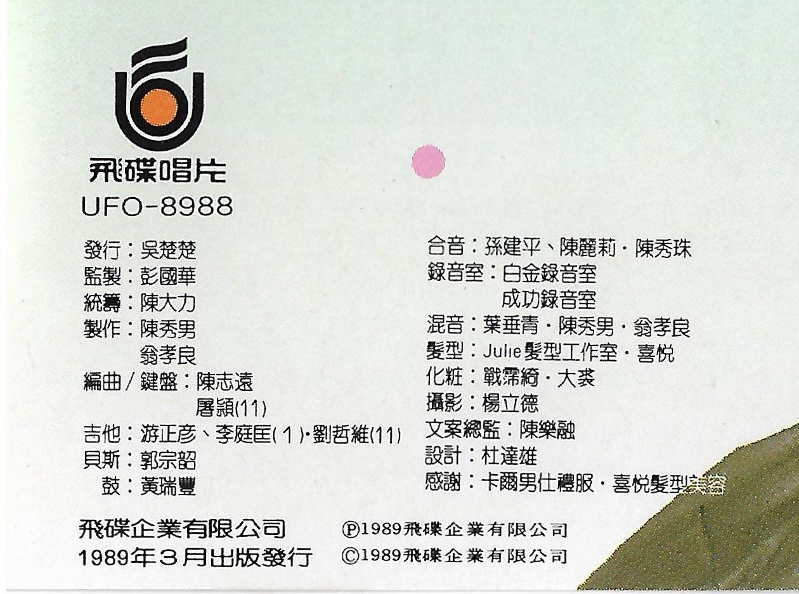
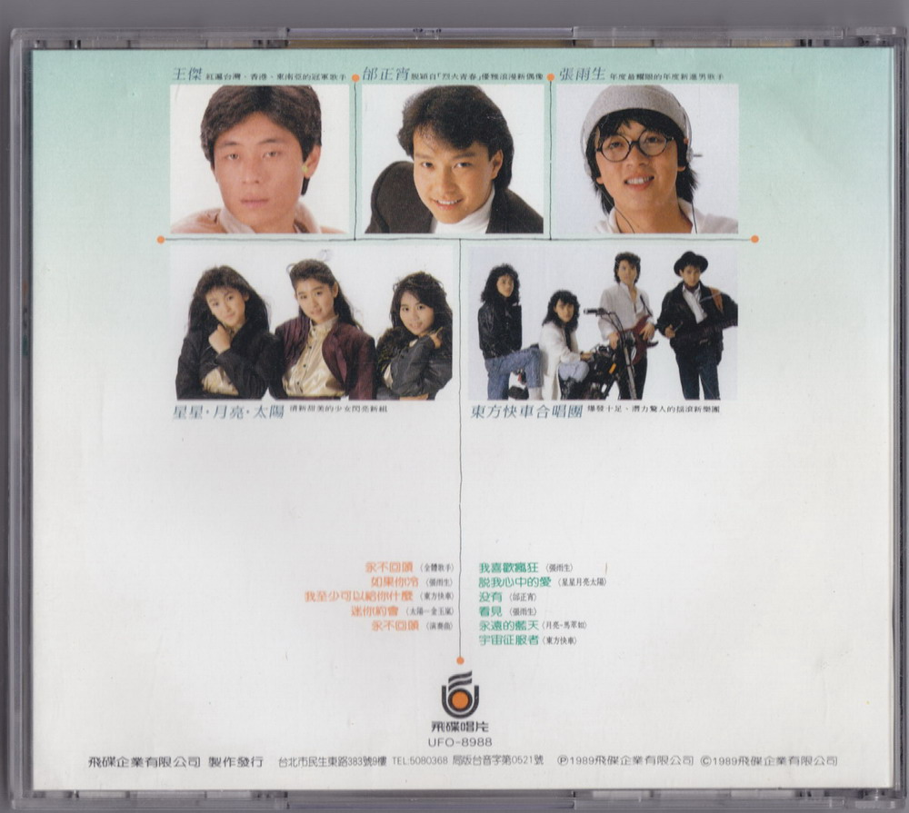

# 7 匹狼 电影原声带
 

# 封面文案

每一个春天  
都会有些故事发生  
有些心动  
有些心酸……

「7 匹狼」电影原声带  
用音乐说故事  
有的温柔  
有的狂野……

# 内页文案

在不久不久以前  
在很远很远的地方  
一个不知名的国度里  
有一群狼

他们外表冷漠、内心火热  
喜欢群居、视朋友为唯一  
用生命相知相惜

当夜风来临的时候  
他们引吭高歌  
当猎物出现时  
他们一齐在原野奔驰、捕获  
当危险逼近时  
他们用全部的热血奋力相搏

他们曾经有过眼泪和风雨的浇灌  
他们也曾有过美梦和理想的遮蔽

他们是「七匹狼」和他们惊天动地的人生故事

他红得很快  
但是总让你觉得  
「红人」，不该是这个样子  
这就是他红的原因  
「我喜欢我所喜欢的。」  
他就是这样

他的昵称叫「小宝」（现实生活里的）  
他的绰号叫「小胖」（电影里唯一的动物主角）  
他和它和脚踏车，是一家人  
他对它和对其他人一样，相信：  
「有时候，付出等于获得。」  
这似乎证明：所有善解人意的男孩  
最后都会是主角的

张雨生的受欢迎，连他自己也常常大吃一惊。明明是极普通的一句问答，或是不经意流露的小动作，都能令歌迷会心微笑或是激动不已。  
这位像极邻家小弟，来自澎湖眷村的大男孩，以一曲「我的未来不是梦」风靡大街小巷，歌曲成了人们朗朗上口的标语，张雨生，这个仍在政大外交系就读的学生歌手，也跟着一夜成名了。  
去年 11 月推出的第一张个人专辑「天天想你」，雷霆万钧般突破 7 白金（35 万张）纪录，让张雨生赚足了雪费和乐器钱，在今年 7 月入伍前，他还将出版一张告别学生时代的代表作。收录在「七匹狼」专辑中的歌曲，将是张雨生上半年仅有的新歌。

# 永远不回头

UFO-8988-01

作词：陈乐融  
作曲：陈志远  
编曲：陈志远  
演唱：全体歌手[^1]
MV 导演：朱延平

## 歌词

在天色破晓之前  
我想要爬上山巅 仰望星辰  
向时间祈求永远

当月光送走今夜  
我想要跃入海面 找寻起点  
看誓言可会改变

年轻的泪水不会白流  
痛苦和骄傲 这一生都要拥有  
年轻的心灵还会顫抖  
再大的风雨 我和你也要向前冲

永远不回头 不管天有多高  
忧伤和寂寞 感动和快乐  
都在我心中

永远不回头 不管路有多长  
黑暗试探我 烈火燃烧我  
都要去接受 永远不回头

# 如果你冷

UFO-8988-02

作词：杨立德  
作曲：钮大可  
编曲：陈志远  
演唱：张雨生

## 歌词

如果你冷 我将你拥入怀中  
如果你恨 我替你擦去泪痕  
如果你爱我 我要向全世界广播  
如果你离开我 我会默默地承受  

我的爱为你开启  
像白色的闪电划破天际  
我的爱为你奔驰  
像红色的血液充满身体

我只是要你知道一件事  
就是我爱你  
就是我爱你 爱你

# 我喜欢疯狂

UFO-8988-06

作词：杨立德  
作曲：小虫  
编曲：陈志远  
演唱：张雨生
MV 导演：张荣贵

## 歌词

找一个没有人知道的方向  
找个没有人能打扰的地方  
找个理由对着自己说话  
找个空房让我大声地唱

哈……… 我喜欢
自由自在就像来到天堂

哈……… 我喜欢
一颗会跳舞的心脏

哈……… 我喜欢
让我可以多得一点点成就感

哦！我喜欢疯狂
被大雨淋得全身打颤
哦！我喜欢疯狂
因为雨天之后还是会有阳光
哦！我喜欢疯狂
找一个夜晚不睡也不想
哦！我喜欢疯狂
因为梦醒之后
它还是会有夜晚

# 看见

UFO-8988-08

作词：陈乐融  
作曲：翁孝良  
编曲：陈志远  
演唱：张雨生

得恩堂“看的喜悦”广告曲

## 歌词

很小的时候  
我就看见自己的笑靥  
和这个不太明了的人间

长大了以后  
我想看见自己的未来  
和心灵能够到达的边界

年老的时候  
我愿看见自己的行囊  
满满装载着我的一生

用我的眼 用我的心  
好好去看这世界  
用我的眼 用我的心  
好好去爱这世界

# 制作团队

飞碟唱片
UFO-8988

|   负责    |                人员                 |
| :-------: | :---------------------------------: |
|   发行    |               吴楚楚                |
|   监制    |               彭国华                |
|   统筹    |               陈大力                |
|   制作    |           陈秀男 翁孝良            |
| 编曲/键盘 |        陈志远 屠颖 (11)[^2]        |
|   吉他    | 游正彦，李庭匡 (1)[^3]，刘哲雄 (11) |  |
|   贝斯    |               郭宗韶                |
|    鼓     |               黄瑞丰                |
|   合音    |       孙建平，陈丽莉，陈秀珠        |
|  录音室   |       白金录音室 成功录音室        |
|   混音    |       叶垂青，陈秀男，翁孝良        |
|   发型    |       Julie 发型工作室，喜悦        |
|   化妆    |            战霈绮，大裘             |
|   摄影    |               杨立德                |
| 文案总监  |               陈乐融                |
|   设计    |               杜达雄                |
|   感谢    |     卡尔男仕礼服，喜悦发型美容      |

飞碟企业有限公司  
1989 年 3 月出版发行  
Ⓟ1989 飞碟企业有限公司  
Ⓒ1989 飞碟企业有限公司

整理：向晚  
校对：向晚

# 参考

相关链接

-   [想念雨生 - tomchang.cn](https://www.tomchang.cn/music/collection/22.html)

[^1]: 全体歌手：王杰、邰正宵、张雨生、星星·月亮·太阳、东方快车合唱团
[^2]: 本专辑第 11 首曲目为东方快车合唱团演唱的《宇宙征服者》
[^3]: 本专辑第 1 首曲目为全体歌手演唱的《永远不回头》