# 想念我

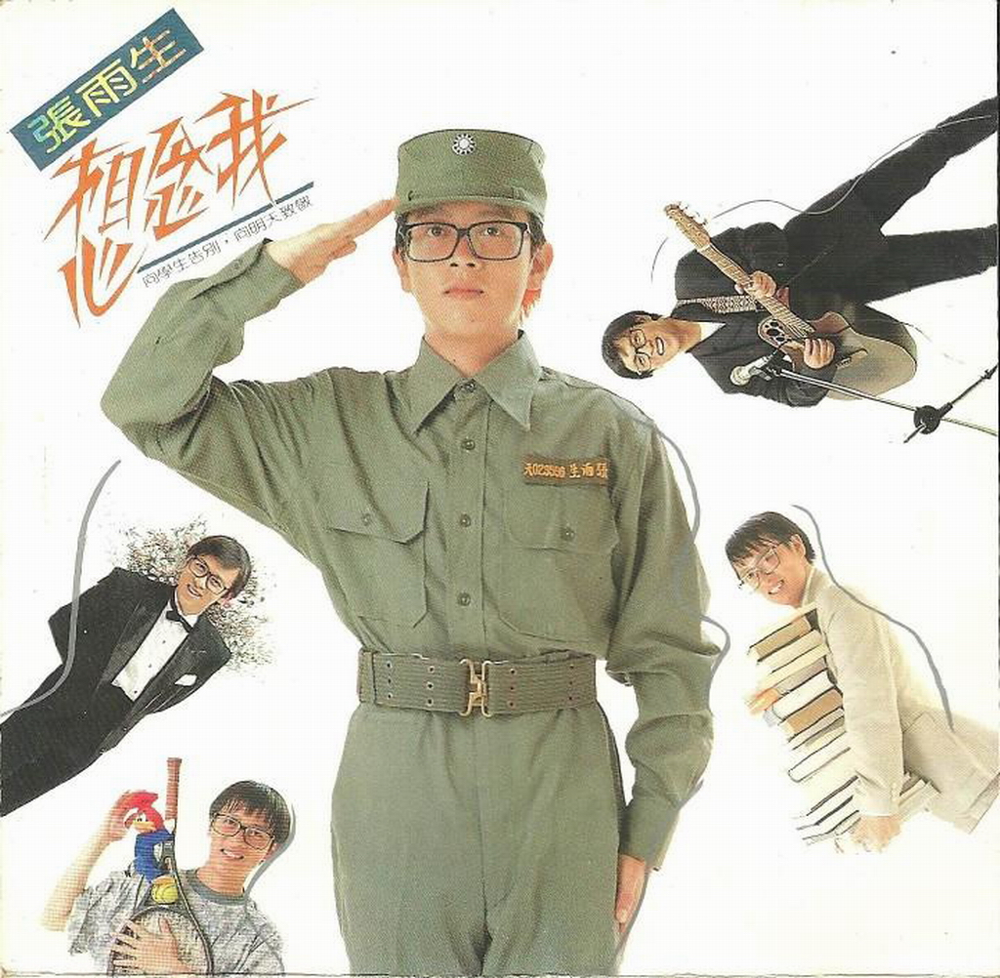

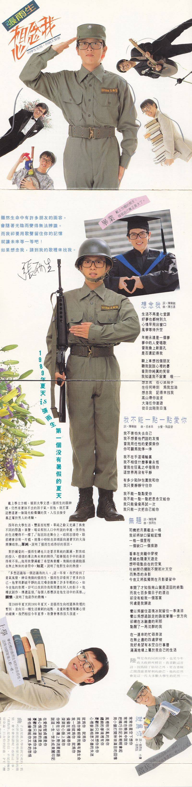

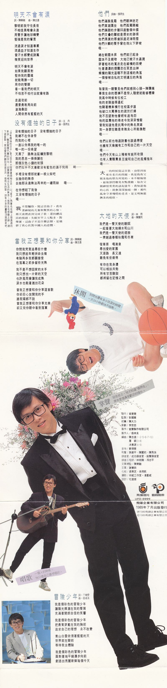

# 唱片详情

**1989 年夏天 is 张雨生第一个没有暑假的夏天**  
戴上学士方帽，领到大学文凭，张雨生的眼神里，仍然有着抹不去的孩子气。而他，就打算这么漾着一脸阳光般灿烂的笑，入伍去接受真正属于男人的考验。

四年的大学生活，丰富而短暂，单纯之余又充满了与众不同的际遇。掌声、喝彩和别人口中所说的幸运，使得他的生活变得不一样了。「每回站在舞台上，唱到忘情时，眼前总会浮现一片蓝，就像小时候在澎湖面向连着天的大海开怀唱歌。」单纯，说明了张雨生唱得好的原因。

对于钟爱的，张雨生总也只是要求单纯的圆满，对歌唱的投入、感情的专注与未来的期待，「能够握在手中的最是得来不易。」他用歌声满载了希望与荣耀，飞扬的情绪饱涨在无止无休的音符中。知足，说明了他对生命的热情。

「多想认识每一个认识我的人。」这一年来，我们看到了意气风发、神采飞扬的张雨生，张雨生却看到了更多的自己。他曾用划破平静的高亢嗓音鼓舞了许多年轻的心，如今在他的歌里，却可以找到你我和周遭任何人的影子。他尝试创作、传递温情，「每个人都应该是他生活中的英雄。」关怀，说明了他创作的动机。

从 1989 年夏天到 1991 年夏天，是张雨生向校园与歌坛的暂别、是向另一种生活冲刺的起点、是重新整理复杂心情的缓冲。我们相信今年夏季，歌声会传得很久很远。

**上学**  
学校里的张雨生特别自由自在，  
因为他跟每个人都一样。

**毕业**  
戴上方帽的那天，  
发现自己真正长大了。

**当兵**  
别看他高高兴兴的模样，  
对于这码事还是心里七上八下。

**休闲**  
别问他还有多少玩耍的时间，  
一天 24 小时都快不够用。

**掌声**  
站在台上，他才知道「张雨生」，  
原来是个满受欢迎的家伙。

**唱歌**
一个人的时候，  
他只唱自己最想唱的。

# 专辑文案

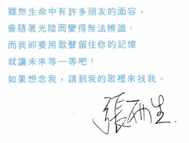
虽然生命中有许多朋友的面容，  
会随着光阴而变得无法辨识。  
而我却要用歌声留住你的记忆，  
就让未来等一等吧！  
如果想念我，请到我的歌里来找我。

张雨生

# 想念我

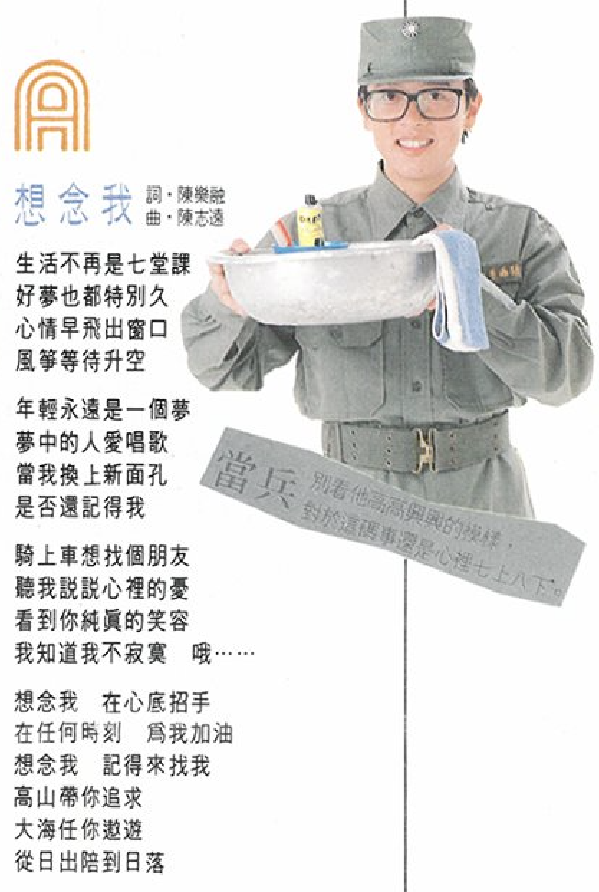
词：陈乐融  
曲：陈志远

## 歌词

生活不再是七堂课  
好梦也都特别久  
心情早飞出窗口  
风筝等待升空

年轻永远是一个梦  
梦中的人爱唱歌  
当我换上新面孔  
是否还记得我

骑上车想找个朋友  
听我说说心里的忧  
看到你纯真的笑容  
我知道我不寂寞 哦......

想念我 在心底招手  
在任何时刻 为我加油  
想念我 记得来找我  
高山带你追求  
大海任你遨游  
从日出陪到日落

# 我不能一点一点爱你

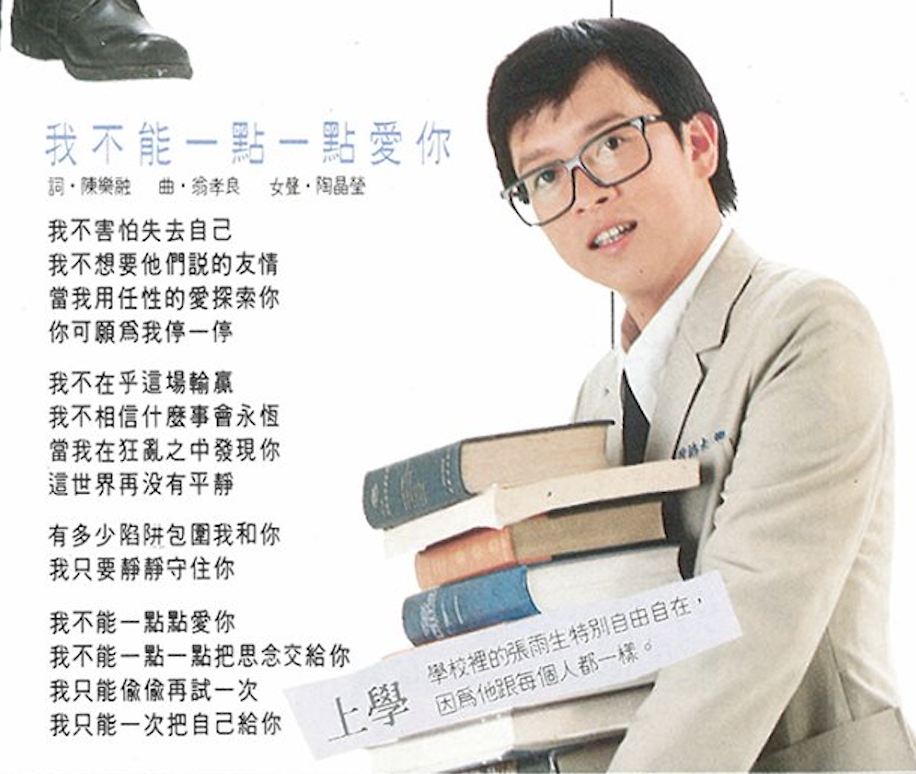

词：陈乐融  
曲：翁孝良  
女声：陶晶莹

## 歌词

我不害怕失去自己  
我不想要他们说的友情  
当我用任性的爱探索你  
你可愿为我停一停

我不在乎这场输赢  
我不相信什么事会永恒  
当我在狂乱之中发现你  
这世界再没有平静

有多少陷阱包围我和你  
我只要静静守住你  
我不能一点一点爱你  
我不能一点一点把思念交给你

我只能偷偷再试一次  
我只能一次把自己给你

# 无题

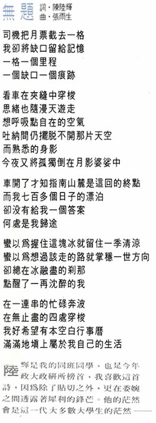

词：陈陆辉  
曲：张雨生

## 导引

陆辉是我的同班同学，也是今年政大政研所榜首，我喜欢这首诗，因为除了贴切之外，更在委婉之间透露着犀利的锋芒。他的茫然会是这一代大多数大学生的茫然——

## 歌词

司机把月票截去一格  
我却将缺口留给记忆  
一格一个里程  
一个缺口一个痕迹

看车在夹缝中穿梭  
思绪也随漫天游走  
想呼吸点自在的空气  
吐纳间仍摆脱不开那片天空  
而熟悉的身影  
今夜又将孤独倒在月影婆娑中

车开了才知指南山麓是这回的终点  
而我七百多个日子的漂泊  
却没有给我一个答案  
何处是我归途

蛮以为握住这块冰就留住一季清凉  
蛮以为想过该走的路就掌稳一世方向  
却总在冰融尽的刹那  
点醒了一再沉醉的我

在一连串的忙碌奔波  
在无止尽的四处穿梭  
我好希望有本空白行事历  
满满地填上属于我自己的生活

# 就为你

  
词：张雨生 小澜（邱连枝）  
曲：张雨生

## 导引

曲子该是进大学前就完成的，低吟于前的浪漫和暴烈于后的激情，会不会和谐呢？感情这一事，「就为你」是我的自信，不是消极的宿命论，只在恰到好处，才有“醺醺然”的感觉。

## 歌词

常常在星空下想你  
常常在晚风中说你  
把精巧日记本轻轻拿起  
用小锁打开琳琅满目的回忆

风里吹不乱的是你  
缠绵的梦境里有你  
忧郁的只是我想你念你  
心里装满相思不尽的失迷

就为你 就为你  
就为你曾经使我拥有过生命  
我一切就为你 就为你  
偷偷在倩笑里寻你  
深深在心版上写你  
你爱在沙滩上对流星轻语  
说这一生一世永成美丽印记

在爱的坚贞里是你  
为心情流泪的是你  
忧郁的只是我想你念你  
害怕会带给你太多的愁悒

# 明天不会有泪

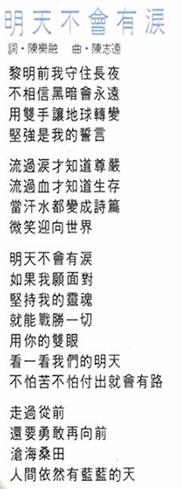  
词：陈乐融  
曲：陈志远

## 歌词

黎明前我守住长夜  
不相信黑暗会永远  
用双手让地球转变  
坚强是我的誓言

流过泪才知道尊严  
流过血才知道生存  
当汗水都变成诗篇  
微笑迎向世界

明天不会有泪  
如果我愿面对  
坚持我的灵魂  
就能战胜一切  
用你的双眼  
看一看我们的明天  
不怕苦不怕付出就会有路

走过从前  
还要勇敢再向前  
沧海桑田  
人间依然有蓝蓝的天

# 没有烟抽的日子

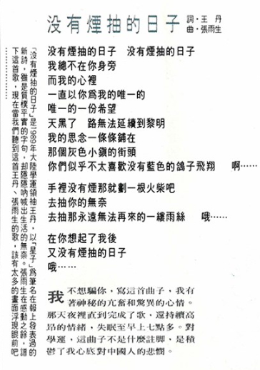  
词：王丹  
曲：张雨生

## 导引

我不想骗你，写这首曲子，我有着神秘的亢奋和惊异的心情。那天夜里直到完成了歌，还持续高昂的情绪，失眠至早上七点多。对学运，这曲子不是什么注脚，是积郁了我心底对中国人的悲悯。

（「没有烟抽的日子」是 1989 年大陆学运领袖王丹，以「星子」为笔名在报上发表过的新诗，虽是质朴平实的字句，却隐隐呐喊出生活的无奈。张雨生在感动之余，谱下这首歌，现在当我们听到这首王丹、张雨生的歌，该有太多的画面浮现眼前吧………………）

## 歌词

没有烟抽的日子 没有烟抽的日子  
我总不在你身旁  
而我的心里  
一直以你为我的唯一的  
唯一的一份希望  
天黑了 路无法延续到黎明  
我的思念一条条铺在  
那个灰色小镇的街头  
你们似乎不太喜欢没有蓝色的鸽子飞翔 啊……

手里没有烟那就划一根火柴吧  
去抽你的无奈  
去抽那永远无法再来的一缕雨丝 哦……

在你想起了我后  
又没有烟抽的日子  
哦……

# 当我正想要和你分享

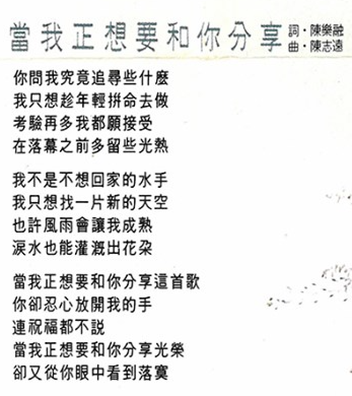

词：陈乐融  
曲：陈志远

## 歌词

你问我究竟追寻些什么  
我只想趁年轻拼命去做  
考验再多我都愿接受  
在落幕之前多留些光热

我不是不想回家的水手  
我只想找一片新的天空  
也许风雨会让我成熟  
泪水也能灌溉出花朵

当我正想要和你分享这首歌  
你却忍心放开我的手  
连祝福都不说  
当我正想要和你分享光荣  
却又从你眼中看到落寞

# 他们

词曲：张雨生

## 导引

大一的时候写这首歌，没想到后来有老兵的问题，我是为我父亲及他的朋友所写的，本不愿煽情，最后却仍难免有点激动，每次父亲神情奕奕的谈起当年，我知道他的心底，就会深深抽痛一阵，那些孤身守着残灯的老者，是文明无能抚及的疤痕。

## 歌词

他们满脸风霜 他们眼神迷茫  
他们箕踞围坐 他们孤独蜷缩  
他们蹒跚的步履踩过整个中国  
他们交叠的皱纹是历史的迹痕  
他们黑黄的唇齿舐过泥泞雨雪  
他们抖颤的双手曾在炮火下穿梭  
哦……

总在朝霞未升 他们就已起身  
露珠不及亲吻 大地已被汗水湿润  
穿着粗布的宽衣走在纵横的田梗  
吐着浓浓的烟雾恣任冥思出神  
灿烂的阳光温暖不到这样的角落  
一个惨被自私的文明遗忘的角落  
哦……

每当我一眼瞥见他们就感到心头一阵隐痛  
毕竟生命的历练不是旁人随便就能够体会  
我高中时候有位校工  
他的老脸涨得通红  
他骑着机车横行在校区步道  
他破口大骂学生的疏于打扫  
我不否认对他曾经有过抱怨  
他的跋扈他的倚老令我深深憎厌  
当我知道他是抗战中的无名英雄  
我一身罪愆难是卑微良心所能抚慰  
哦……

他们以前也念过诗书也谈过恋爱  
也拥有天伦拥有工作和自己的一片天空  
哦……  
他们今天有山上种树有厕所收钱  
也有人卖面卖臭豆腐和自己的风烛残年  
哦……

# 大地的天使

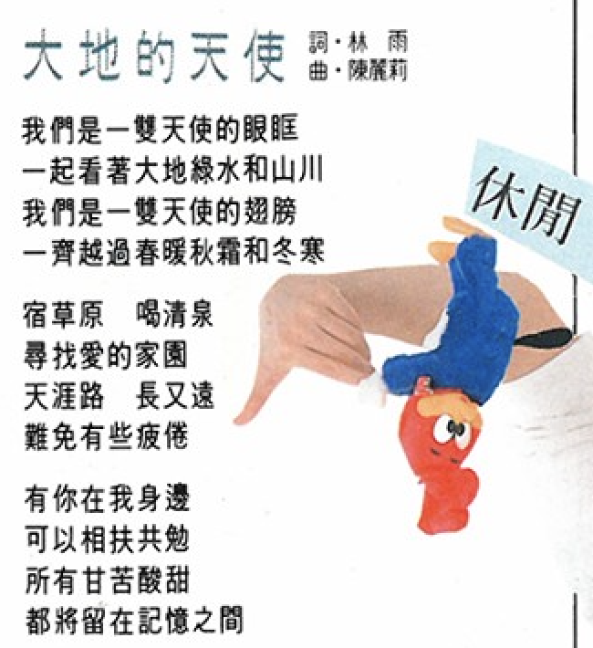

词：林雨  
曲：陈丽莉

# 歌词

我们是一双天使的眼眶  
一起看着大地绿水和山川  
我们是一双天使的翅膀  
一齐越过春暖秋霜和冬寒

宿草原 喝清泉  
寻找爱的家园  
天涯路 长又远  
难免有些疲倦

有你在我身边  
可以相扶共勉  
所有甘苦酸甜  
都将留在记忆之间

# 冒险少年

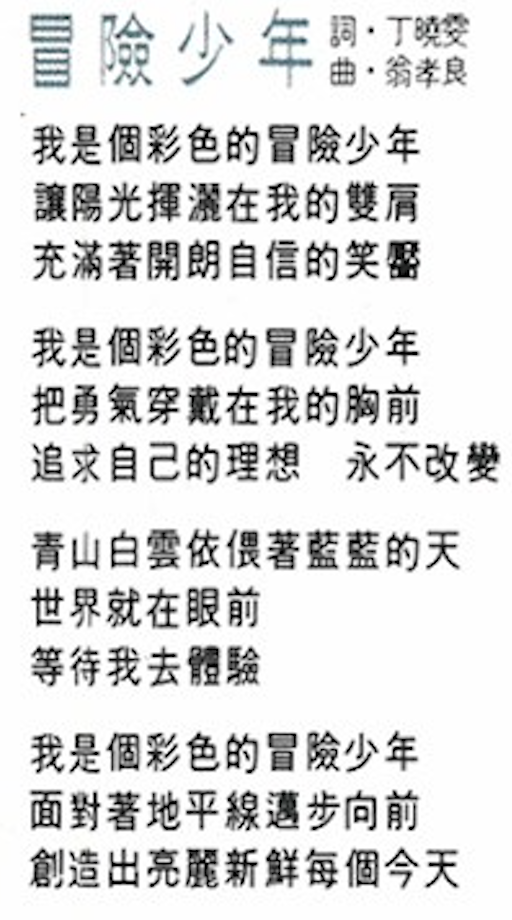

词：丁晓雯  
曲：翁孝良

# 歌词

我是个彩色的冒险少年  
让阳光挥洒在我的双肩  
充满着开朗自信的笑靥

我是个彩色的冒险少年  
把勇气穿戴在我的胸前  
追求自己的理想 永不改变

青山白云依偎着蓝蓝的天  
世界就在眼前  
等待我去体验

我是个彩色的冒险少年  
面对着地平线迈步向前  
创造出亮丽新鲜 每个今天

# 负责团队

|      负责      |                         人员 / 工作室                         |
| :------------: | :-----------------------------------------------------------: |
|      发行      |                            吴楚楚                             |
|      监制      |                            彭国华                             |
|      统筹      |                            陈大力                             |
|      策划      |                            李世忠                             |
|      制作      |                       铭声制作有限公司                        |
|     制作人     |                            翁孝良                             |
|      编曲      | 陈志远（1、2、5、6、7、10） 屠颖（3、8） 涂惠源（4、9） |
|      吉他      |                            苏德华                             |
|      和声      |                    孙建平、陈丽莉、陈秀珠                     |
|     录音室     |                    成功录音室、铭声录音室                     |
|   录音工程师   |                        林明阳、冯志平                         |
|    文案总监    |                            陈乐融                             |
|      文案      |                            谢慧铃                             |
|      化妆      |                        裘素芝、吴翔凯                         |
|      摄影      |                      祥威工作室 - 潘重威                      |
|      设计      |                            杜达雄                             |
| 音乐录影带导演 |          想念我（朱延平）、没有烟抽的日子（张荣贵）           |

飞碟唱片 铭声制作  
UFO - 8999  
飞碟企业有限公司  
1989 年 7 月 22 日出版发行  
Ⓟ1992 飞碟企业股份有限公司  
Ⓒ1992 飞碟企业股份有限公司

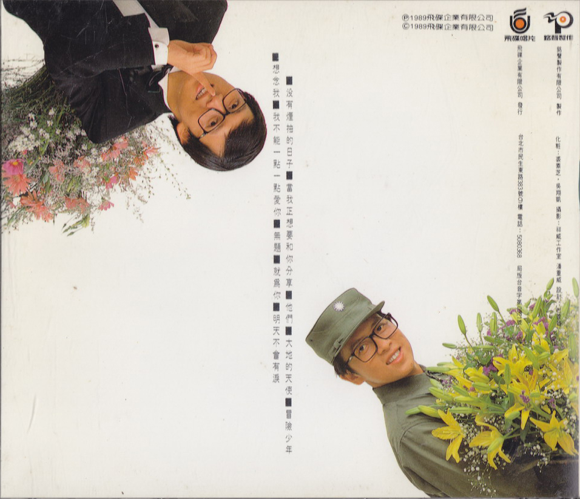

# 参考

相关链接：

-   [想念雨生「想念我」 - 男神卡卡的卡带人生@facebook.com](https://www.facebook.com/livingtapes/posts/pfbid0kvDCafRvK9Jcje3wAsbpaGXJjRUnH7k9FUfuyZuBbS5mi2DabbJydwZMPrNRZqQvl)
-   [想念我 \- 维基百科，自由的百科全书](https://zh.wikipedia.org/wiki/%E6%83%B3%E5%BF%B5%E6%88%91)

当前页面缺陷：

1. 维基百科和 tomchang.cn 关于专辑的发行时间冲突，目前以维基百科为准

整理：cora，健健
