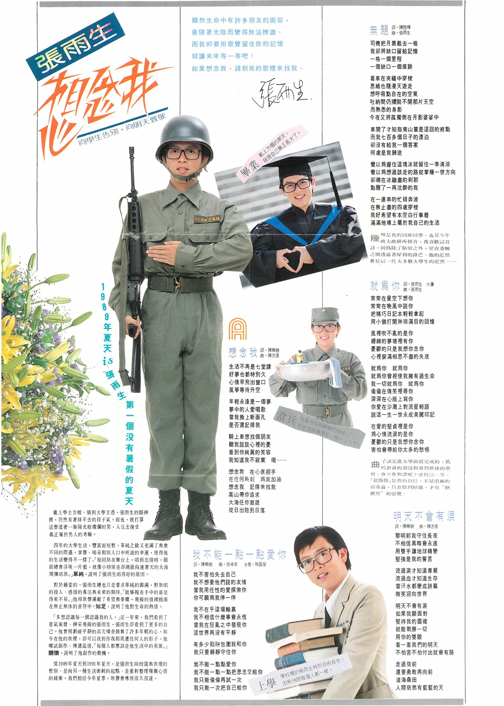
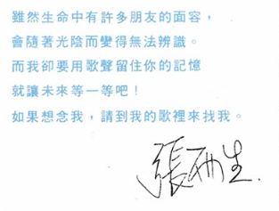
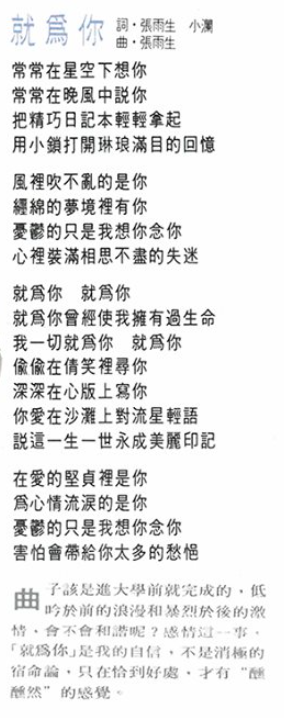
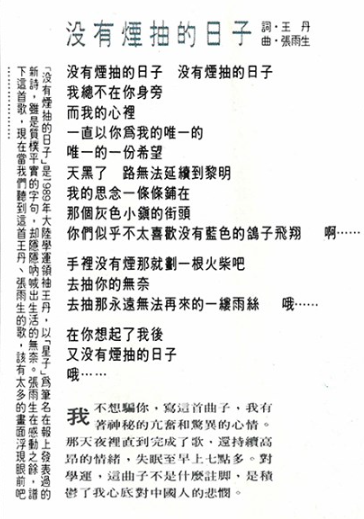
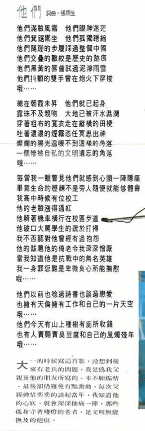

# 想念我

# 文案

虽然生命中有许多朋友的面容，  
会随着光阴而变得无法辨识。  
而我却要用歌声留住你的记忆，  
就让未来等一等吧！  
如果想念我，请到我的歌里来找我。

张雨生

# 无题

词：陈陆辉  
曲：张雨生

## 导引

陆辉是我的同班同学，也是今年政大政研所榜首，我喜欢这首诗，因为除了贴切之外，更在委婉之间透露着犀利的锋芒。他的茫然会是这一代大多数大学生的茫然——

## 歌词

司机把月票截去一格  
我却将缺口留给记忆  
一格一个里程  
一个缺口一个痕迹

看车在夹缝中穿梭  
思绪也随漫天游走  
想呼吸点自在的空气  
吐纳间仍摆脱不开那片天空  
而熟悉的身影  
今夜又将孤独倒在月影婆娑中

车开了才知指南山麓是这回的终点  
而我七百多个日子的漂泊  
却没有给我一个答案  
何处是我归途

蛮以为握住这块冰就留住一季清凉  
蛮以为想过该走的路就掌稳一世方向  
却总在冰融尽的刹那  
点醒了一再沉醉的我

在一连串的忙碌奔波  
在无止尽的四处穿梭  
我好希望有本空白行事历  
满满地填上属于我自己的生活

# 就为你

词：张雨生 小澜  
曲：张雨生

## 导引

曲子该是进大学前就完成的，低吟于前的浪漫和暴烈于后的激情，会不会和谐呢？感情这一事，「就为你」是我的自信，不是消极的宿命论，只在恰到好处，才有“醺醺然”的感觉。

## 歌词

常常在星空下想你  
常常在晚风中说你  
把精巧日记本轻轻拿起  
用小锁打开琳琅满目的回忆

风里吹不乱的是你  
缠绵的梦境里有你  
忧郁的只是我想你念你  
心里装满相思不尽的失迷

就为你 就为你  
就为你曾经使我拥有过生命  
我一切就为你 就为你  
偷偷在倩笑里寻你  
深深在心版上写你  
你爱在沙滩上对流星轻语  
说这一生一世永成美丽印记

在爱的坚贞里是你  
为心情流泪的是你  
忧郁的只是我想你念你  
害怕会带给你太多的愁悒

# 没有烟抽的日子

词：王丹  
曲：张雨生

## 导引

我不想骗你，写这首曲子，我有着神秘的亢奋和惊异的心情。那天夜里直到完成了歌，还持续高昂的情绪，失眠至早上七点多。对学运，这曲子不是什么注脚，是积郁了我心底对中国人的悲悯。

## 歌词

没有烟抽的日子 没有烟抽的日子  
我总不在你身旁  
而我的心里  
一直以你为我的唯一的  
唯一的一份希望  
天黑了 路无法延续到黎明  
我的思念一条条铺在  
那个灰色小镇的街头  
你们似乎不太喜欢没有蓝色的鸽子飞翔 啊……

手里没有烟那就划一根火柴吧  
去抽你的无奈  
去抽那永远无法再来的一缕雨丝 哦……

在你想起了我后  
又没有烟抽的日子  
哦……

# 他们

词曲：张雨生

## 导引

大一的时候写这首歌，没想到后来有老兵的问题，我是为我父亲及他的朋友所写的，本不愿煽情，最后却仍难免有点激动，每次父亲神情奕奕的谈起当年，我知道他的心底，就会深深抽痛一阵，那些孤身守着残灯的老者，是文明无能抚及的疤痕。

## 歌词

他们满脸风霜 他们眼神迷茫  
他们箕踞围坐 他们孤独蜷缩  
他们蹒跚的步履踩过整个中国  
他们交叠的皱纹是历史的迹痕  
他们黑黄的唇齿舐过泥泞雨雪  
他们抖颤的双手曾在炮火下穿梭  
哦……

总在朝霞未升 他们就已起身  
露珠不及亲吻 大地已被汗水湿润  
穿着粗布的宽衣走在纵横的田梗  
吐着浓浓的烟雾恣任冥思出神  
灿烂的阳光温暖不到这样的角落  
一个惨被自私的文明遗忘的角落  
哦……

每当我一眼瞥见他们就感到心头一阵隐痛  
毕竟生命的历练不是旁人随便就能够体会  
我高中时候有位校工  
他的老脸涨得通红  
他骑着机车横行在校区步道  
他破口大骂学生的疏于打扫  
我不否认对他曾经有过抱怨  
他的跋扈他的倚老令我深深憎厌  
当我知道他是抗战中的无名英雄  
我一身罪愆难是卑微良心所能抚慰  
哦……

他们以前也念过诗书也谈过恋爱  
也拥有天伦拥有工作和自己的一片天空  
哦……  
他们今天有山上种树有厕所收钱  
也有人卖面卖臭豆腐和自己的风烛残年  
哦……

# 参考

相关链接：

-   [想念雨生 「想念我」 - 男神卡卡的卡帶人生@facebook.com](https://www.facebook.com/livingtapes/posts/pfbid0kvDCafRvK9Jcje3wAsbpaGXJjRUnH7k9FUfuyZuBbS5mi2DabbJydwZMPrNRZqQvl)
