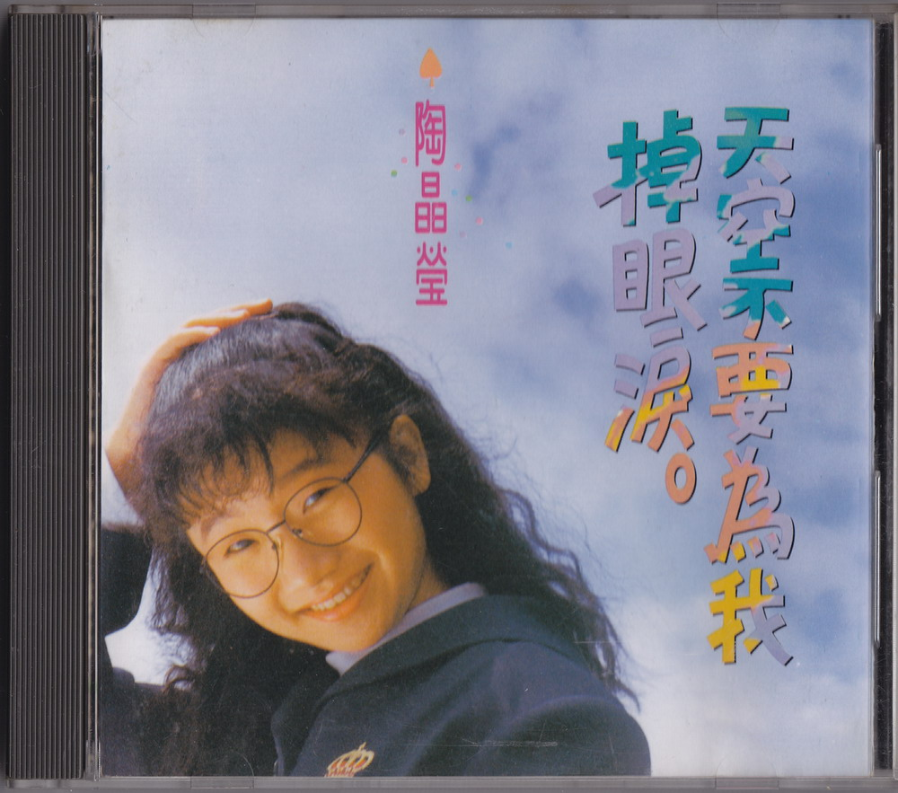
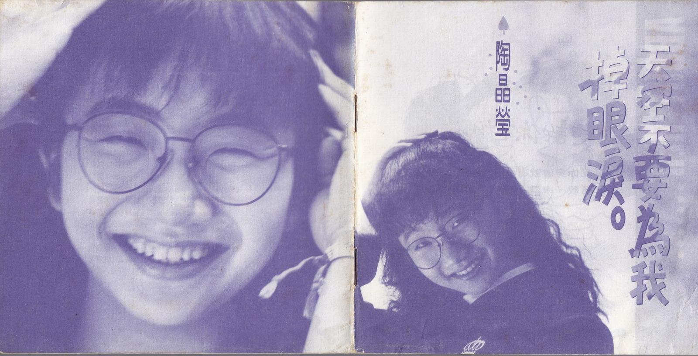
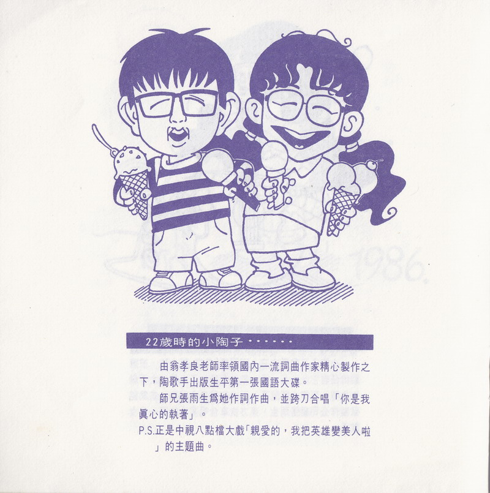
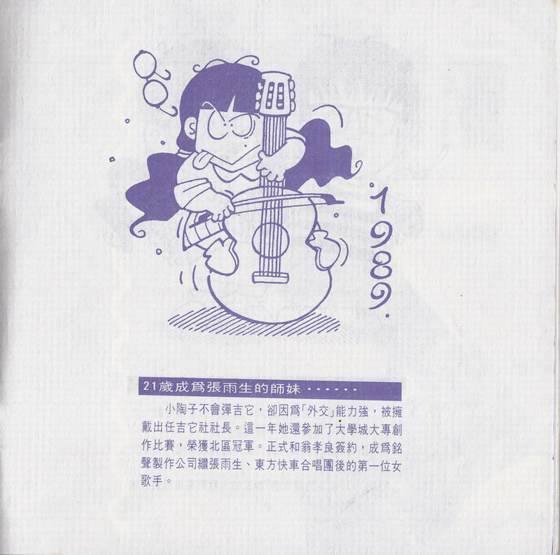
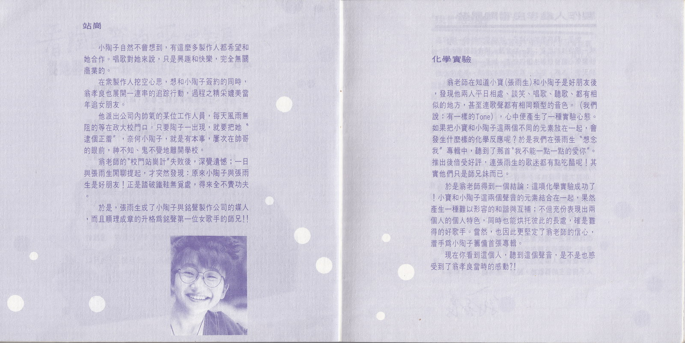
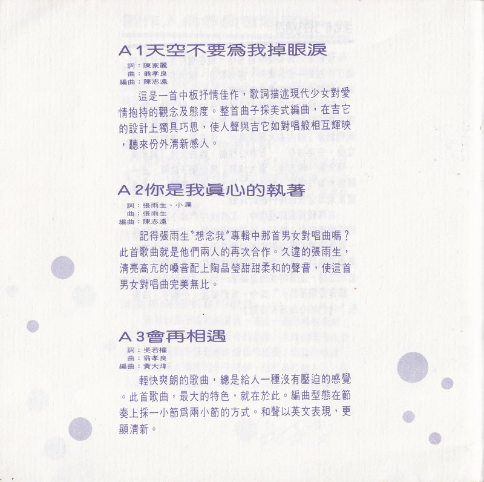
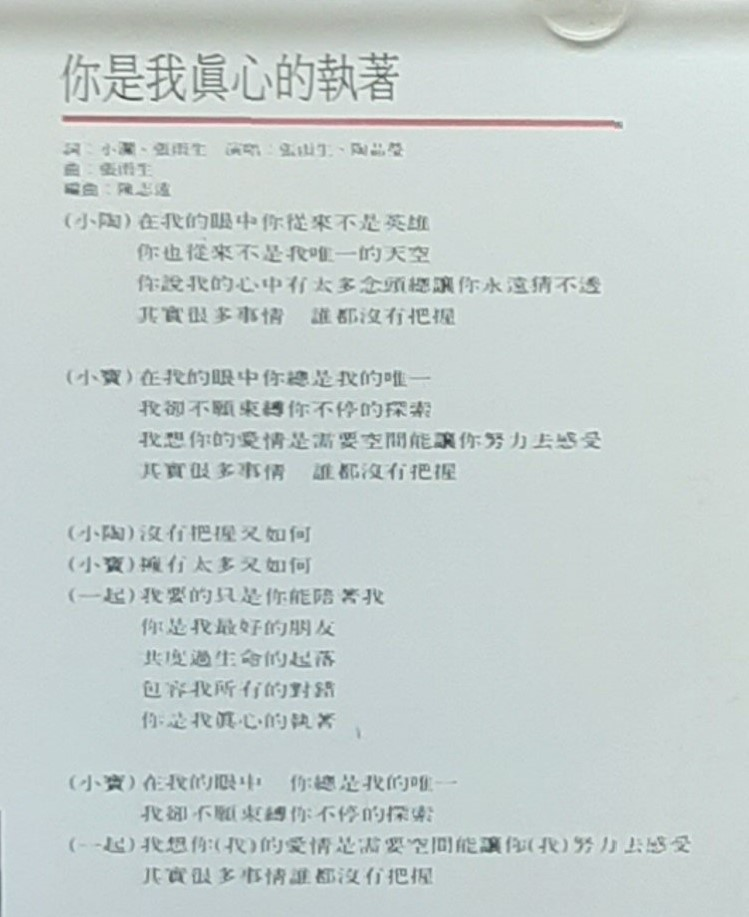
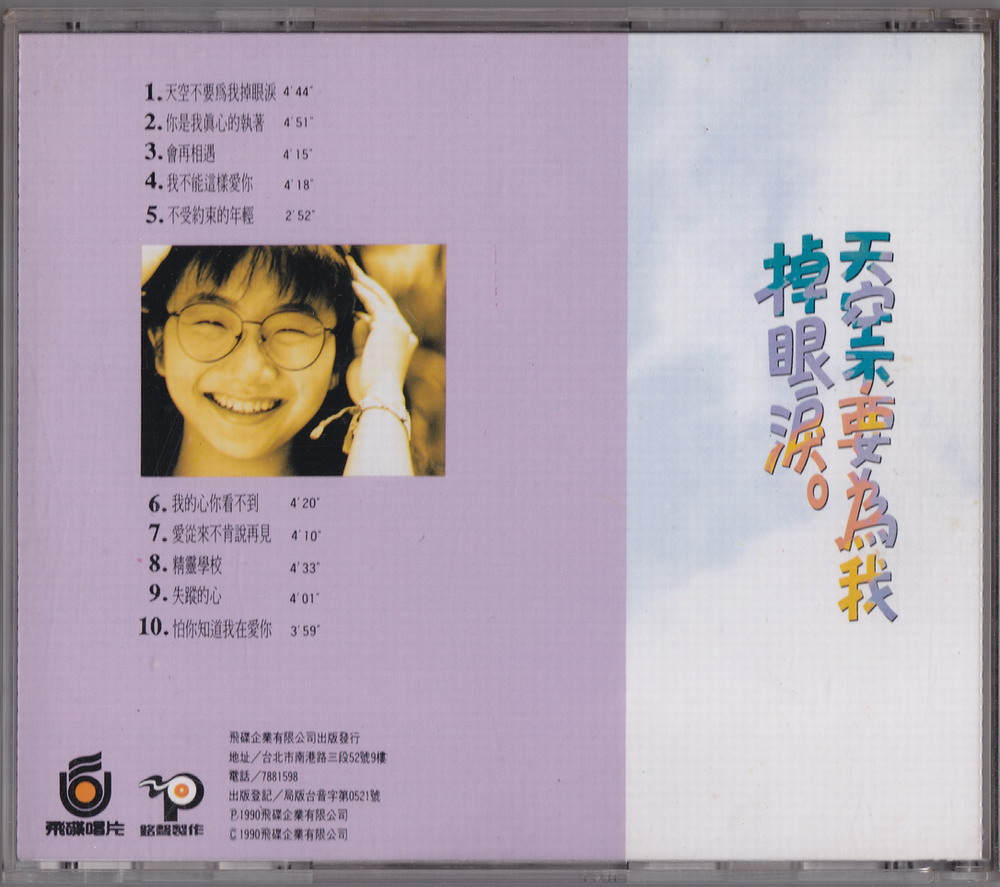

# 天空不要为我掉眼泪

# 文案

**22 岁时的小陶子 · · · · · ·**  
由翁孝良老师率领国内一流词曲作家精心制作之下，陶歌手出版生平第一张国语大碟。  
师兄张雨生为她作词作曲，并跨刀合唱「你是我真心的执着」。  
P.S.正是中视八点档大戏「亲爱的，我把英雄变美人啦」的主题曲。

**21 岁成为张雨生的师妹 · · · · · ·**  
小陶子不会弹吉它，却因为「外交」能力强，被拥戴出任吉它社社长。这一年她还参加了大学城大专创作比赛，荣获北区冠军。正式和翁孝良策约，成为铭声制作公司继张雨生、东方快车合唱围后的第一位女歌手。

**站岗**  
小陶子自然不会想到，有这么多制作人都希望和她合作。唱歌对她来说，只是兴趣和快乐，完全无关商业的。  
在众制作人挖空心思，想和小陶子签约的同时，翁孝良也展开一连串的追踪行动，过程之精采媲美当年追女朋友。  
他派出公司内帅气的某位工作人员，每天风雨无阻的等在政大校门口。只要陶子一出现，就要把她“逮个正着”，奈何小陶子，就是有本事，屡次在帅哥的眼前，神不知、鬼不觉地离开学校。  
翁老师的“校门站岗计”失败后，深觉遗憾；一日与张雨生间聊提起，才突然发现：原来小陶子舆张雨生是好朋友！正是踏破铁鞋无觅处，得来全不费功夫。  
于是，张雨生成了小陶子与铭声制作公司的媒人，而且顺理成章的升格为铭声第一位女歌手的师兄！

**化学实验**  
翁老师在知道小宝(张雨生)和小陶子是好朋友后，发现他两人平日相处、谈笑、唱歌、听歌、都有相似的地方，甚至连歌声都有相同类型的音色。(我们说：有一样的 Tone)，心中便产生了一种实验心态。 如果把小宝和小陶子这两个不同的元素放在一起，会发生什么样的化学反应呢？于是我们在张雨生“想念我”专辑中，听到了那首“我不能一点一点爱你”。 推出后倍受好评，连张雨生的歌迷都有点吃醋呢！其实他们只是师兄妹而已。  
于是翁老师得到一个结论：这项化学实验成功了！小宝和小陶子这两个声音的元素结合在一起，果然产生一种难以形容的和谐与互补；不但充份表现出两个人的个人特色，同时也能烘托彼此的长处，确是难得的好歌手。当然，也因此更坚定了翁老师的信心，着手为小陶子筹备首张专辑。
现在你看到这个人，听到这个声音，是不是也感受到了翁孝良当时的感动？！

# 你是我真心的执着

作词：张雨生、小澜（邱连枝）  
作曲：张雨生  
编曲：陈志远

## 导引

记得张雨生”想念我”专辑中那首男女对唱曲吗？此首歌曲就是他们两人的再次合作。久违的张雨生，清亮高亢的嗓音配上陶晶莹甜甜柔和的声音，使这首男女对唱曲完美无比。

## 歌词

在我的眼中你从来不是英雄  
你也从来不是我唯一的天空  
你说我的心中有太多念头总让你永远猜不透  
其实很多事情 谁都没有把握

在我的眼中你总是我的唯一  
我却不愿束缚你不停的探索  
我想你的爱情是需要空间能让你努力去感受  
其实很多事情 谁都没有把握

没有把握又如何  
拥有太多又如何  
我要的只是你能陪着我  
你是我最好的朋友  
共渡过生命的起落  
包容我所有的对错  
你是我真心的执着

在我的眼中 你总是我的唯一  
我却不愿束缚你不停的探索  
我想你（我）的爱情是需要空间能让你（我）努力去感受  
其实很多事情谁都没有把握

# 制作团队

|    负责    |      人员 / 工作室       |
| :--------: | :----------------------: |
|    发行    |          吴楚楚          |
|    监制    |          彭国华          |
|    统筹    |          陈大力          |
|    策划    |          李世忠          |
|  制作策划  |     铭声制作有限公司     |
|   制作人   |          翁孝良          |
|  助理制作  |          吴志华          |
|  吉他演奏  |          苏德华          |
|    和声    |  吴志华、陈丽莉、黄丽星  |
|    录音    | 铭声录音室 、成功录音室  |
| 录音工程师 |          冯志平          |
|  混音合成  |  冯志平、翁孝良、吴志华  |
|    摄影    |          杨立德          |
|    化妆    |           Anny           |
|    发行    |           高明           |
|    漫画    |          王言中          |
|  平面设计  | AD 李明道、DESIGN 汪筱平 |
|  专案执行  |     飞碟国内事业一部     |

飞碟企业有限公司出版发行  
地址/台北市南港路三段 52 号 9 楼  
电话/7881598  
出版登记/局版台音字第 0521 号  
Ⓟ1990 飞碟企业有限公司  
Ⓒ1990 飞碟企业有限公司

# 扫描图片

整理：cora
