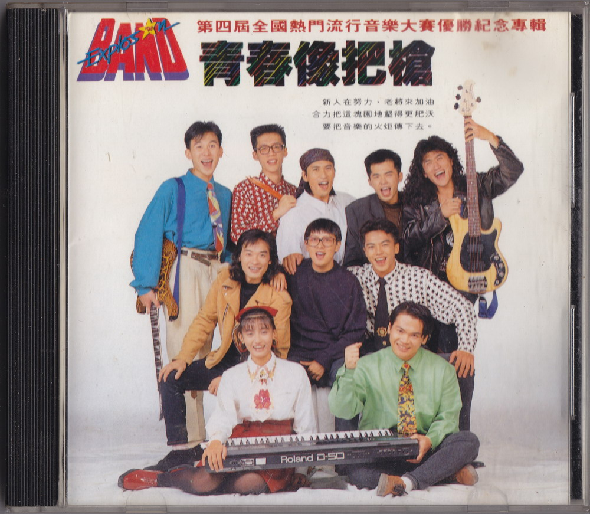
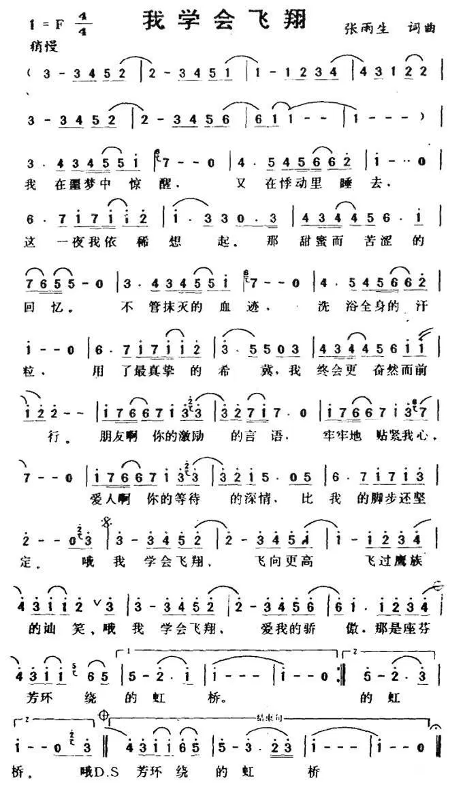

# 青春像把枪

# 文案

青春像把枪，第四届全国流行音乐大赛优胜纪念专辑

转眼，全国热门流行音乐大赛已经第四届了。回想当时，我们还引用合办单位之一救国团李钟桂主任的话：「喜爱音乐的孩子不会变坏」，来祛除社会大众中部分疑虑不屑的眼光，然而至今，我们早已能让歌手和听众，都挺直腰杆地站在阳光下。张雨生、邰正宵、姚可杰、王天佑…乃至国内女子摇滚乐团前躯「铁之女」的前身，都出自这个园地。他们幸运地随着时代人心的驿动，而以另一种风貌赢得多数人的肯定，进而从校园跃身歌坛，甚至成为努力的词曲创作者或幕后工作者，让少年时期的挚爱，能演变为一生的挑战，全国热门流行音乐大赛，应该功不容没。

而现在，经历了「烈火青春」、「美梦成真」「呐喊天空」三张专辑多样的尝试，热门大赛的歌手，找到了新的一种表达热情的方式。不但如前例从数支优胜队伍中，萃取了八位演唱及演奏的代表组成精华团，第一届最佳主唱张雨生和第三届最佳主唱王天佑，也重披战袍，带着他们的新作与「小老弟们」一较高下。这种师兄弟同台竞技的气氛，和热门大赛一贯标榜的生猛有劲的精神相映照，戏味，就更浓了。
其实较劲也好，传承也好，打气也好，这样的安排设想都奠立在音乐上，一次扬名立万不够，再接再励、贯彻始终才厉害。张雨生、王天佑不过是想给学弟妹们一点鼓励、一点示范，当然，也给自己无限压力。

从现在起，我们每个人的眼睛，都要牢牢盯紧台上的每一个身影。前人看着后人，后人看着前人，观众看着歌手，歌手催促着知音。大学城和飞碟唱片，每年都以最开放的心，给国内的新人、新团和新的音乐在这片园地上大声说、大声唱，因为我们衷心希望大家可以一齐说，一齐唱，让我们共同构成热门音乐与年轻生命间，一个善的循环。

# 分不清

作词：张雨生  
作曲：张雨生  
编曲：张雨生  
演唱：王天佑

## 歌词

无缘无故想起你 和败坏的心情  
输赢的念头盘旋着 揉酸我眼睛  
莫非我也不能自己 不能摒息  
当记忆还有些 小碎片要整理

无嗔无喜想起你 和掉泪的情绪  
并没有空间来安放 失落的感情  
只是我又不能自己 不能摒息  
当欢呼声过去 那熟悉的声音

分不清 我一直紧紧距离这样近 却抓不住你  
分不清 时间把生活棱角都磨平 我们一无转机  
分不清 我一直紧紧距离这样近 却抓不住你  
分不清 恶醉在人群喧闹的中间 我却格外清醒  
想起你

# 我学会飞翔

作词：张雨生  
作曲：陈志远  
演唱：张雨生

## 歌词

我在噩梦里惊醒  
又在悸动里睡去  
这一夜我依稀想起  
那甜美而苦涩的回忆

不曾磨灭的血迹  
洗浴全身的汗粒  
用了最真挚的希冀  
我终会更奋然而前行

朋友啊 你的激励的言语 牢牢地贴近我心  
爱人啊 你的等待的深情 比我的脚步还坚定

哦 我学会飞翔 飞向最高 飞过鹰族的讪笑  
哦 我学会去爱 爱我的骄傲 那是座芬芳环绕的虹桥

# 这一刻钟妳在想什么

作词：张雨生  
作曲：张雨生  
演唱：Shadows 合唱团

### 歌词

这一刻钟妳在想什么 我爱的容颜往哪边斜  
那些我熟稔的小动作 那双我心醉的草莓眼

夜风吹乱桌上书页 这阵清凉实在费解  
临风遥想温存情话 相思深处谁怕肉麻

这一刻钟妳在想什么 寻梦之前听我唱首歌  
这一刻钟我在想什么 喜悦与宁谧浇洒心胸

# 制作团队

|     负责     |                    人员/团队                     |
| :----------: | :----------------------------------------------: |
|     发行     |                      吴楚楚                      |
|     监制     |                      彭国华                      |
|     统筹     |                      陈大力                      |
|    总策划    |                      陈光陆                      |
|     制作     | 大学城制作中心（天鼎傅播）、飞碟企业股份有限公司 |
|    制作人    |                      吴大卫                      |
|     吉他     |                      江建民                      |
|     和声     |          孙建平、陈丽莉、马国萍、罗添洲          |
|    录音室    |                    加合录音室                    |
|    录音师    |                  何庆堂、王家栋                  |
|     混音     |                  王家栋、吴大卫                  |
|   项目策划   |                      李世忠                      |
|     文案     |                  陈乐融、雷建中                  |
|     化妆     |                  林叶亭、陈玫如                  |
|     发型     |                     华隆发型                     |
|     摄影     |                      潘重威                      |
|   平面设计   |                Album Design Unit                 |
|      AD      |                      杜达雄                      |
|     设计     |                      王鹤治                      |
|   MTV 导演   |               朱延平（我学会飞翔）               |
|   专案执行   |                 飞碟国内事业一部                 |
| 活动主办单位 |         中国青年救国团、功学社、中国时报         |

飞碟唱片 UFO-91193  
Ⓟ&Ⓒ 飞碟企业股份有限公司  
1991 年 10 月出版发行

# 专辑扫描

# 简谱

# 参考

-   [张雨生『这一刻钟你在想什么』demo 高清音质版\_哔哩哔哩\_bilibili](https://www.bilibili.com/video/BV1aU4y117U4/)
-   [张雨生《分不清》Demo\_哔哩哔哩\_bilibili](https://www.bilibili.com/video/BV1as411N7Nm/)

整理：洋昆，健健

当前页面缺陷：

1. 发行时间没有精确到日
2. 缺少专辑扫描图片
