# 张雨生创作专辑（带我去月球）[^1]
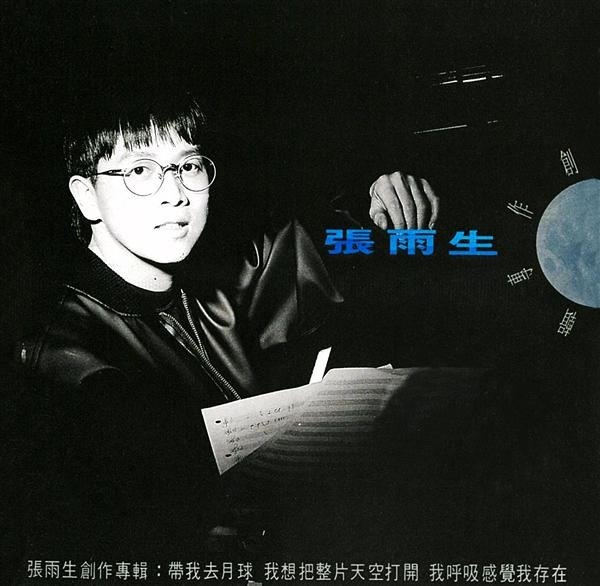  

# 张雨生创作专辑·制作概念·企划情报

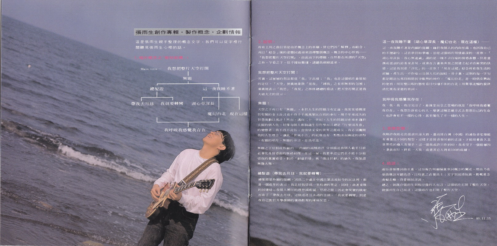  

## 唱片概念之「树状结构」
<svg xmlns="http://www.w3.org/2000/svg" viewBox="0 0 800 450">
  
  
  <rect width="100%" height="100%" fill="white"/>
  
  <!-- Main title label -->
  <text x="130" y="50" class="small-text">Main title——</text>
  
  <!-- Main title -->
  <text x="400" y="50" text-anchor="middle" font-size="20">我想把整片天空打开</text>
  
  <!-- First level -->
  <line class="line" x1="400" y1="60" x2="400" y2="90" />
  <text x="400" y="110" text-anchor="middle">无题</text>
  
  <!-- Second level -->
  <line class="line" x1="400" y1="120" x2="400" y2="140" />
  <line class="line" x1="200" y1="140" x2="600" y2="140" />
  <line class="line" x1="200" y1="140" x2="200" y2="170" />
  <line class="line" x1="600" y1="140" x2="600" y2="170" />
  <text x="200" y="190" text-anchor="middle">总发游</text>
  <text x="600" y="190" text-anchor="middle">这一夜我睡不著</text>
  
  <!-- Third level left -->
  <line class="line" x1="200" y1="200" x2="200" y2="220" />
  <line class="line" x1="100" y1="220" x2="300" y2="220" />
  <line class="line" x1="100" y1="220" x2="100" y2="250" />
  <line class="line" x1="300" y1="220" x2="300" y2="250" />
  <text x="100" y="270" text-anchor="middle">带我去月球</text>
  <text x="300" y="270" text-anchor="middle">我就要转弯</text>
  
  <!-- Third level right -->
  <line class="line" x1="600" y1="200" x2="600" y2="220" />
  <line class="line" x1="500" y1="220" x2="700" y2="220" />
  <line class="line" x1="500" y1="220" x2="500" y2="250" />
  <line class="line" x1="600" y1="220" x2="600" y2="300" />
  <line class="line" x1="700" y1="220" x2="700" y2="300" />
  <text x="500" y="270" text-anchor="middle">湖心草深长</text>
  <text x="600" y="320" text-anchor="middle">魔幻台北</text>
  <text x="700" y="320" text-anchor="middle">现在这样</text>
  
  <!-- Special connection line -->
  <path d="M 200 330 L 200 350 H 600 V 330" fill="none" stroke="black" class="line"/>
  <line class="line" x1="400" y1="350" x2="400" y2="410" />
  
  <!-- Final text -->
  <text x="400" y="430" text-anchor="middle">我呼吸我感觉我存在</text>
</svg>

## 说明
所有上列之曲目皆是由于概念上的串联，使它们因「解释」而结合，再以「结合」后的姿态回过头来诠释整个概念。概念的中心即为——『我想把整片天空打开』，由此而下的标题，自然都在所谓的『天空』之外。乍看之下，似乎暖味难懂，请听我细细道来。  

**我想把整片天空打开：**  
其实，这层层的想法都是从「我」字出发：「我」也是这张唱片最原始的定位。「天空」狭义地象征「从我」「缚我」之有形无形的包袱；广义地表示「我思」「我见」之林林总总的看法，把天空打开正是我大破大立的宣示。

**无题：**  
天空之下所以有「无题」，本于人生的问题没有定论。我常常感慨伟哲圣贤的金玉良言竟不得千千万万黎民百姓的奉行，几千年来流失的智慧真数以万计！然而，迈向二十一世纪，人生的问题却愈来愈趋于尖锐的个人化，好像每人都胸蕴生存哲学而且总是「行乐须及春」的变态者。我不得不流俗，当情情爱爱的世界泛滥成灾，我必须摊开我的人生理念，让此「世风不古」的红尘也有一点点淡而幽远的清醇。有题的唱片，无题的弁言、是为吊诡。  
无题之下切割成外显的，内显的两种路径、分类描述我个人截至目前社会化及情感面的脉络纹理。在这一层，我要承认它们并不能十分贴切我的真实感受。对于「辞溢于情」与「情浮于辞」的缺失，我保证无伤大雅。

**总发游（带我去月球、我就要转弯）————**  
总发游是外显提纲。因为二十岁在中国古算法或如今的民法里，都是一个成年的表示。我正好假借为一里程碑的界定。同时，藉着童稚的回忆暗示我个人向往的理想国蓝图。悠游之间，因社会现实的映射而有了「带我去月球」这个遁逃且诙谐的念头。「我就要转弯」则是我自己对于升学挂帅的填鸦教育的陈痛反思。

**这一夜我睡不着（湖心草深长、魔幻台北、现在这样）————**  
这一夜我睡不着是内显的提纲。缘于我个人的内向怕羞。也因我自己的不擅辞令。这首歌彷如梦呓，却是这张唱片用情最深的一首歌。「湖心草深长，我心无处藏」讲的是一种不言自喻的情感表态，但是当换成摇滚的节奏来表现，就会在含蓄与奔放之间建立起矛盾冲突的快感。这是我刻意「洋化」的一首歌！「现在这样」综合所有我生活的经验，产生出一不作喻示且个人化的归结。骨子里，这歌的每一字句都是刚退伍那段期间抗争艰熬的呻吟。「魔幻台北」是一时俏皮兴起的涂鸦，用好整以暇的态度看待吵嚷不休的台北；用简单流畅的旋律消化寓有深意的歌词。

**我呼吸我感觉我存在：**  
我、我、我、我没完没了，最后堂而皇之登场的就是「我呼吸我感觉我存在」。我想告诉有心的人，顺着这种思维方式去想想自己的生命，也许会有不一样的心得，甚至催化了不一样的人生。

## 音乐型态
我期许我能走出摇滚坦荡大路，进而使台湾（中国）的通俗音乐[^2]能有专业且不同的类型，这样才是使音乐升级的正途，才能培养长久且世界性的艺人及乐手。这一张我或许只作到60。我希望下一张能够70。秉此而行，终有一天我、或者其它人将有100的成绩。

## 结语
通俗音乐应词曲并重。这份报告明显偏重歌词概念的阐述，理由乃在乐曲应该耳听为凭，以聆赏之直觉为主；文字则狡猾脱跳，动辄意念南辕北辙，得要细加详说。  
总之，就既存张雨生刻板印像的人而言，这张唱片打开了整片天空。就张雨生自己而言，这张唱片也打开了整片天空。  
张雨生 80.11.15

# 文案
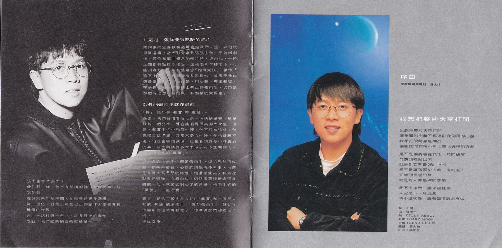  
张雨生当然长大了  
像你我一样，他也有想讲的话、想做的事、想唱的歌  
在分别两年多中间，他经历过更多洗礼  
从一退伍，就马上栽进自己的创作天地和专辑筹备的世界  
台北——洛杉矶——台北，许多日夜的奔忙成就了我们眼前的这张成绩单——

## 1. 这是一张你要冒点险的唱片
如同张雨生喜欢制造惊喜给我们，这一次他玩得真过瘾。当大伙儿拿到这张由他一手包办创作、制作和编曲概念的唱片时，坦白说，一时之间都有点难以接受。这张唱片乍听之下，可能很青涩，可能有些意念『跑得太快』，让你『追不上去』 ；也可能有些歌很吵，或者不像你想象得『好听』—— 但是，用心听，整张听完，整张听进去，你会听出真正的张雨生，仍然是那个有理想、有抱负、有热情的大男生。

## 2. 真的张雨生就在这里
『真』，指的是『真实』和『真诚』。  
过去，我们习惯看待他是一个快快乐乐、单单纯纯、个儿小、声音能唱得很高的大学生，但是，真实生活中和个性里，他不只有这些。他偶而自信满满，又常常忧心忡忡，他也会睡不着，他也会害怕跌倒，也会看到许多不该看到的事，或去同情许多本来似乎可以无关的人。这是他显露的『真实』。  
另一方面，张雨生还是张雨生，哪怕思想再成熟，观察再敏锐，心里的烦恼再多再重，他还是有着本质憨憨的特性。他还是爱笑，有时沉默有时呱噪，心直口快。仍然很单纯地处理身边的一切，就像面对心爱的音乐。张雨生式的『真诚』，一直没变。  
现在，结合了较少为人知的『真实』和一直为人知的『真诚』的张雨生，『真的张雨生』，就站在你面前的这张专辑里了。你准备开门迎接他了吗？  
祝你幸运！

---

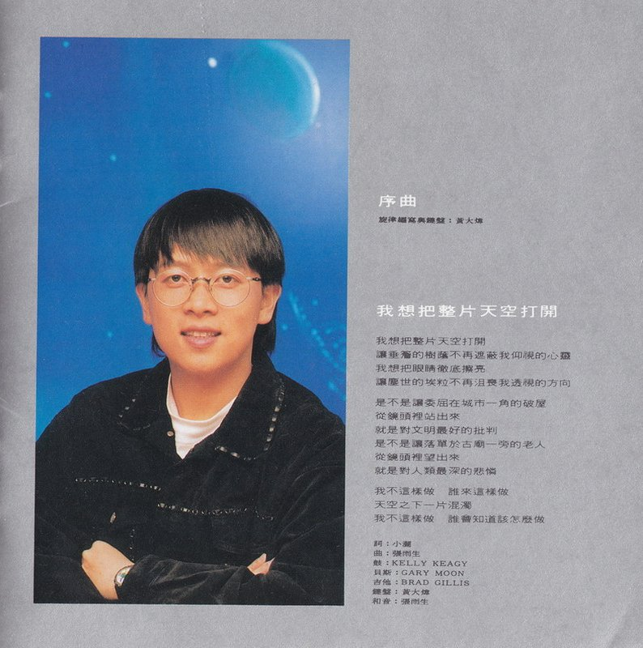  

# 序曲
| 负责           | 人员   |
|--------------|------|
| 旋律编写与键盘 | 黄大炜 |

# 我想把整片天空打开
## 歌词  
我想把整片天空打开  
让垂檐的树荫不再遮蔽我仰视的心灵  
我想把眼睛彻底擦亮  
让尘世的埃粒不再沮丧我透视的方向

是不是让委屈在城市一角的破屋  
从镜头里站出来  
就是对文明最好的批判  
是不是让落单于古庙一旁的老人  
从镜头里望出来  
就是对人类最深的悲怜

我不这样做 谁来这样做  
天空之下一片混浊  
我不这样做 谁会知道该怎么做

| 负责 | 人员         |
|-----|--------------|
| 词   | 小澜（邱连枝） |
| 曲   | 张雨生       |
| 鼓   | KELLY  KEAGY |
| 贝斯 | GARY MOON    |
| 吉他 | BRAD GILLIS  |
| 键盘 | 黄大炜       |
| 和音 | 张雨生       |

# 无题
## 导引  
我不是喜欢无题，我只想表示我个人对答案的不置可否。生命的意义不是问与答，而是对于所有追寻的期待。  
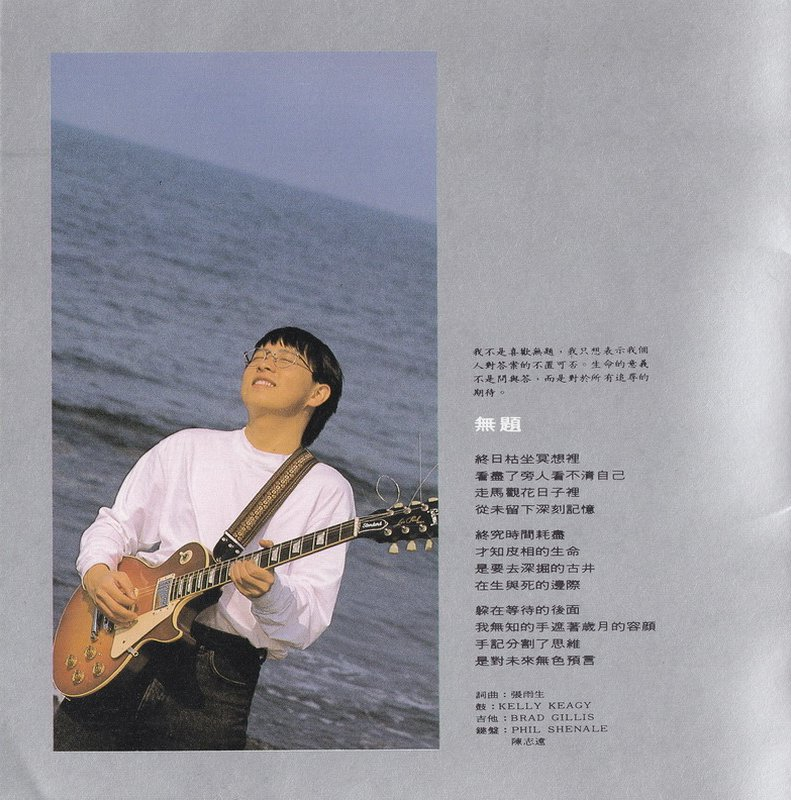  
## 歌词  
终日枯坐冥想里  
看尽了旁人看不清自己  
走马观花日子里  
从未留下深刻记忆

终究时间耗尽  
才知皮相的生命  
是要去深掘的古井  
在生与死的边际

躲在等待的后面  
我无知的手遮著岁月的容颜  
手记分割了思维  
是对未来无色预言

| 负责 | 人员                   |
|-----|------------------------|
| 词曲 | 张雨生                 |
| 鼓   | KELLY KEAGY            |
| 吉他 | BRAD GILLIS            |
| 键盘 | PHIL SHENALE 陈志远 |

# 这一夜我睡不着
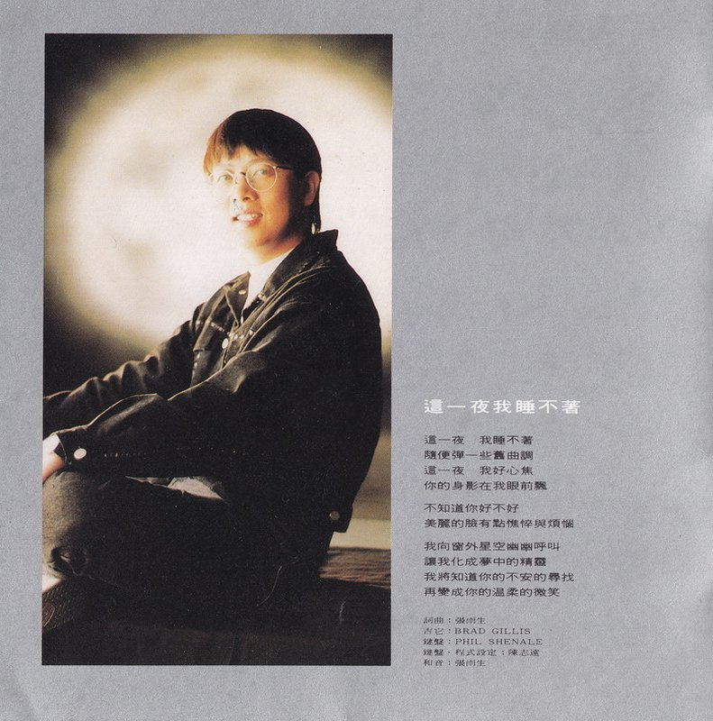  
## 歌词  
这一夜 我睡不着  
随便弹一些旧曲调  
这一夜 我好心焦  
你的身影在我眼前飘

不知道你好不好  
美丽的脸有点憔悴与烦恼

我向窗外星空幽幽呼叫  
让我化成梦中的精灵  
我将知道你的不安的寻找  
再变成你的温柔的微笑

| 负责          | 人员         |
|-------------|--------------|
| 词曲          | 张雨生       |
| 吉他          | BRAD GILLIS  |
| 键盘          | PHIL SHENALE |
| 键盘·程序设定 | 陈志远       |
| 和音          | 张雨生       |

# 我就要转弯
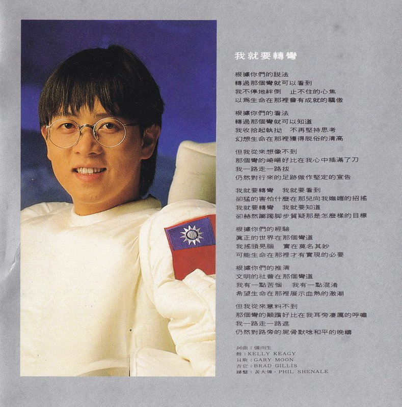  
## 歌词  
根据你们的说法  
转过那个弯就可以看到  
我不停地绊倒 止不住的心焦  
以为生命在那里会有成就的骄傲

根据你们的看法  
转过那个弯就可以知道  
我收拾起执拗 不再坚持思考  
幻想生命在那里获得脱俗的清高

但我从来想象不到  
那个弯的崎岖好比在我心中插满了刀  
我一路走一路拔  
仍然对行来的足迹做作坚定的宣告

我就要转弯 我就要看到  
却猛的[^3]害怕什么在那儿向我妩媚的招摇  
我就要转弯 我就要知道  
却赫然踯躅脚步质疑那是怎么样的目标

根据你们的经验  
真正的世界在那个弯道  
我摇头晃脑 实在莫名其妙  
可能生命在那里才有实现的必要

根据你们的推演  
文明的社会在那个弯道  
我有一点苦恼 我有一点混淆  
希望生命在那里展示血热的激潮

但我从来意料不到  
那个弯的颠踬好比在我耳旁凄厉的呼啸  
我一路走一路遮  
仍然对路旁的尸骨默念和平的晚祷

| 负责 | 人员                |
|-----|---------------------|
| 词曲 | 张雨生              |
| 鼓   | KELLY KEAGY         |
| 贝斯 | GARY MOON           |
| 吉它 | BRAD GILLIS         |
| 键盘 | 黄大炜・PHIL SHENALE |

# 总发游
## 导引  
『总发』语出陶诗。谓「结发也。少年总聚其发于顶结束之。」借来比拟今日的少年虽有点不符实际，但我的年少也曾为了『落发』而有过一番心灵交战！  
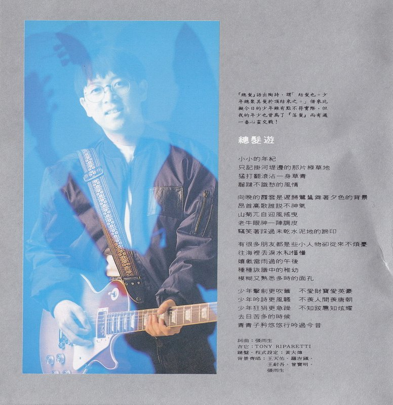  
## 歌词  
小小的年纪  
只记挂河堤边的那片绿草地  
猛打翻滚沾一身草青  
蹓跶不识愁的风情

向晚的霞云是迟归鹭鸶舞着夕色的背景  
昂首高歌谁说不神气  
山菊兀自迎风摇曳  
老牛眼神一阵调皮  
窃笑着踩过未干水泥地的蹄印

有很多朋友都是些小人物却从来不烦忧  
往海里丢泪水和懵懂  
嬉戏雷雨过的午后  
种种诙谐中的稚幼  
模糊又熟悉多时的面孔

少年击剑更吹箫 不爱财宝爱英豪  
少年吟诗更风骚 不羡人间羡唐朝  
少年狂狷更急躁 不知跋扈知炫耀  
去日苦多的时候  
青青子衿悠悠行吟过今昔

| 负责          | 人员                                       |
|-------------|--------------------------------------------|
| 词曲          | 张雨生                                     |
| 吉它          | TONY RIPARETTI                             |
| 键盘·程序设定 | 黄大炜                                     |
| 背景齐唱      | 王天佑、罗吉镇、 王耐吾、曾宝明、 张雨生 |

# 湖心草深长
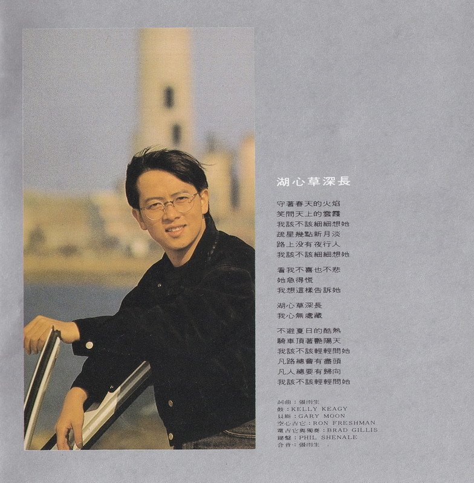  
## 歌词  
守着春天的火焰  
笑问天上的云霞  
我该不该细细想她  
疏星几点新月淡  
路上没有夜行人  
我该不该细细想她

看我不喜也不悲  
她急得慌  
我想这样告诉她

湖心草深长  
我心无处藏  
不避夏日的酷热  
骑车顶着艳阳天  
我该不该轻轻问她  
凡路总会有尽头  
凡人总要有归向  
我该不该轻轻问她

| 负责         | 人员         |
|-------------|--------------|
| 词曲         | 张雨生       |
| 鼓           | KELLY KEAGY  |
| 贝斯         | GARY MOON    |
| 空心吉它     | RON FRESHMAN |
| 电吉他与独奏 | BRAD GILLIS  |
| 键盘         | PHIL SHENALE |
| 合音         | 张雨生       |

  

# 魔幻台北
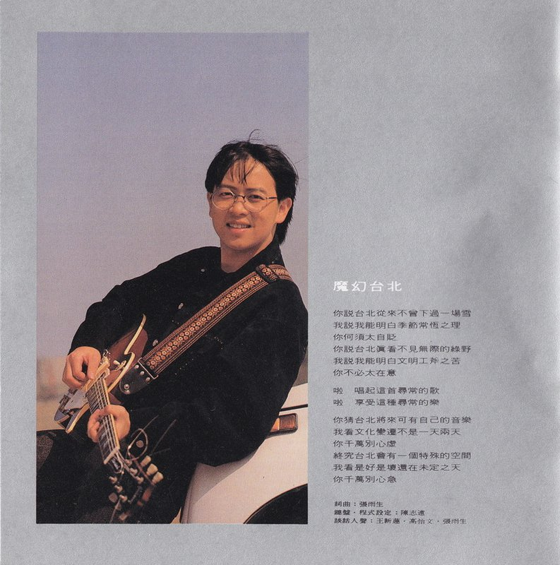  
## 歌词  
你说台北从来不曾下过一场雪  
我说我能明白季节常恒之理  
你何须太自贬  
你说台北真看不见无际的绿野  
我说我能明白文明工斧之苦  
你不必太在意

啦 唱起这首寻常的歌  
啦 享受这种寻常的乐

你猜台北将来可有自己的音乐  
我看文化变迁不是一天两天  
你千万别心虚  
终究台北会有一个特殊的空间  
我看是好是坏还在未定之天  
你千万别心急 

| 负责          | 人员                 |
|-------------|--------------------|
| 词曲          | 张雨生               |
| 键盘·程序设定 | 陈志远               |
| 谈话人声      | 王新莲・高怡文・张雨生 |

# 现在这样
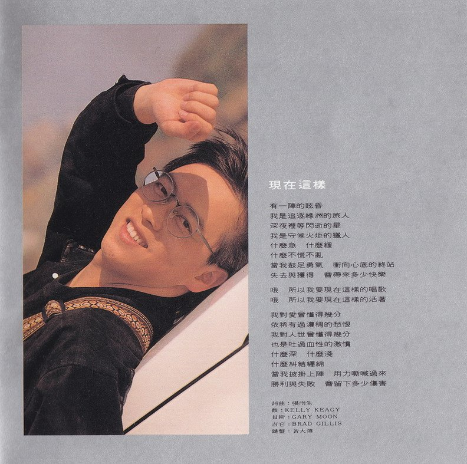  
## 歌词  
有一阵的眩昏  
我是追逐绿洲的旅人  
深夜里等闪逝的星  
我是守候火炬的猎人  
什么急 什么缓  
什么不慌不乱  
当我鼓足勇气 冲向心底的终站  
失去与获得 会带来多少快乐

哦 所以我要现在这样的唱歌  
哦 所以我要现在这样的活着

我对爱曾懂得几分  
依稀有过浓稠的愁恨  
我对人世曾懂得几分  
也是吐过血性的激愤  
什么深 什么浅  
什么纠结缠绵  
当我披挂上阵 用力嘶喊过来  
胜利与失败 会留下多少伤害

| 负责 | 人员        |
|-----|-------------|
| 编曲 | 张雨生      |
| 鼓   | KELLY KEAGY |
| 贝斯 | GARY MOON   |
| 吉它 | BRAD GILLIS |
| 键盘 | 黄大炜      |

# 我呼吸我感觉我存在[^4]
## 导引  
这歌传达一种回归原始的想法，只用吉它和人声作不复杂的表演。业余演出尽管生涩，却因此诠得相当称职。  
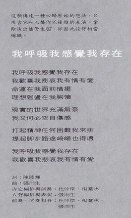  
## 歌词  
我呼吸我感觉我存在  
我欢喜我悲哀我有情有爱  
命运在我面前横摆  
理想回荡在我胸怀

现实的世界充满无奈  
我又何必空自伤感

打起精神任何困难我来排  
提起脚步路途崎岖也得迈

我呼吸我感觉我存在  
我欢喜我悲哀我有情有爱

| 负责           | 人员                     |
|---------------|------------------------|
| 词             | 陈陆辉                   |
| 曲             | 张雨生                   |
| 吉它编排与演奏 | 杜仲杰・杨业承            |
| 人声编排与表演 | 张雨生                   |
| 前奏、尾奏和音  | 杜仲杰、杨业承、 张雨生 |

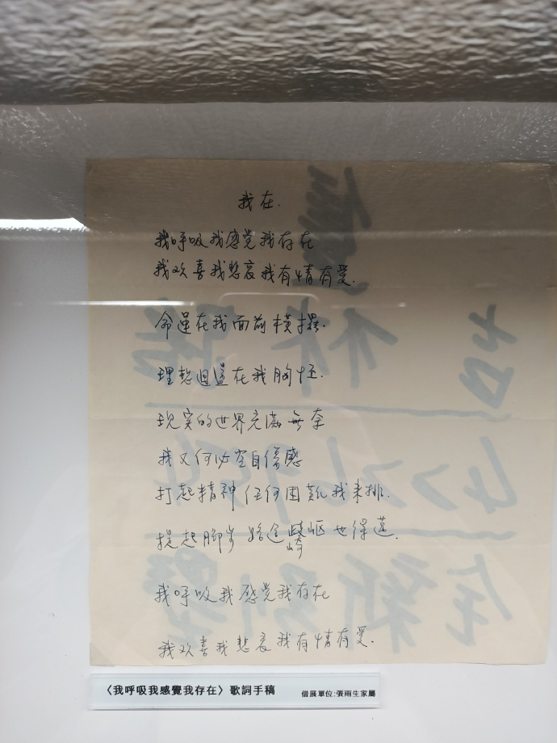  
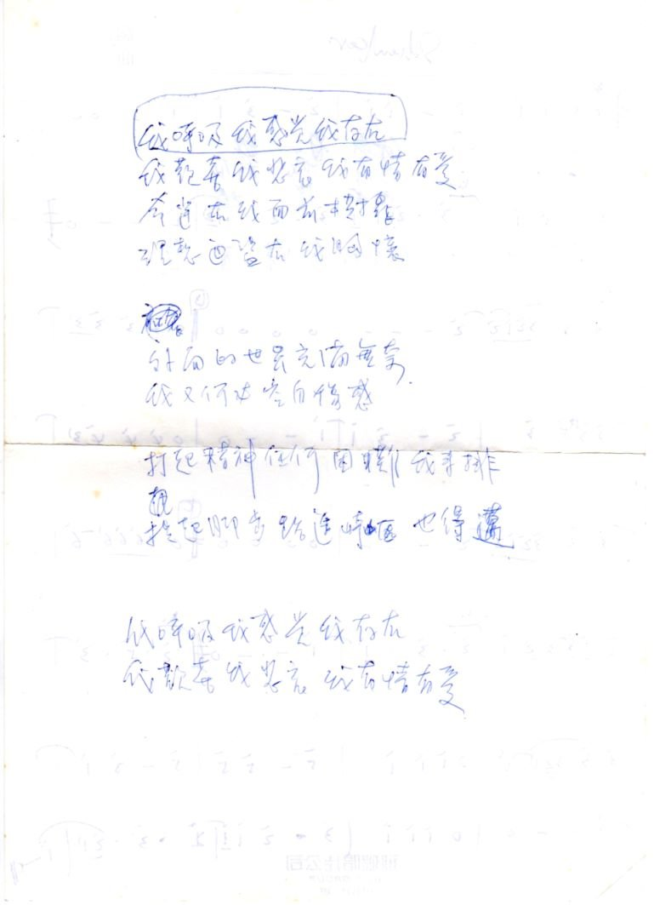  
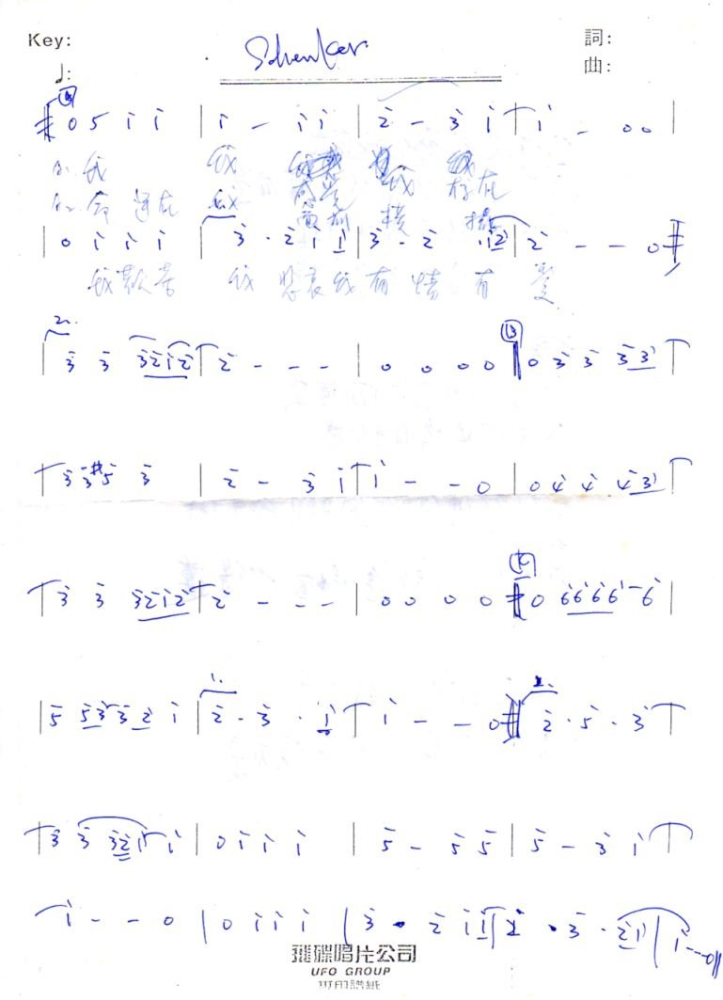  

# 我想把整片天空打开
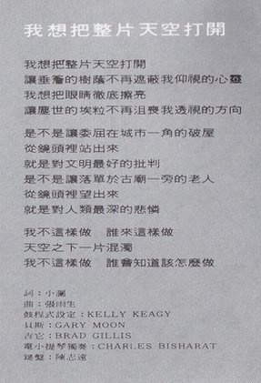  
## 歌词  
我想把整片天空打开  
让垂檐的树荫不再遮蔽我仰视的心灵  
我想把眼睛彻底擦亮  
让尘世的埃粒不再沮丧我透视的方向

是不是让委屈在城市一角的破屋  
从镜头里站出来  
就是对文明最好的批判  
是不是让落单于古庙一旁的老人  
从镜头里望出来  
就是对人类最深的悲怜

我不这样做 谁来这样做  
天空之下一片混浊  
我不这样做 谁会知道该怎么做

| 负责         |                  |
|-------------|------------------|
| 词           | 小澜（邱连枝）     |
| 曲           | 张雨生           |
| 鼓程序设定   | KELLY  KEAGY     |
| 贝斯         | GARY MOON        |
| 吉它         | BRAD GILLIS      |
| 电小提琴独奏 | CHARLES BISHARAT |
| 键盘         | 陈志远           |

# 致谢
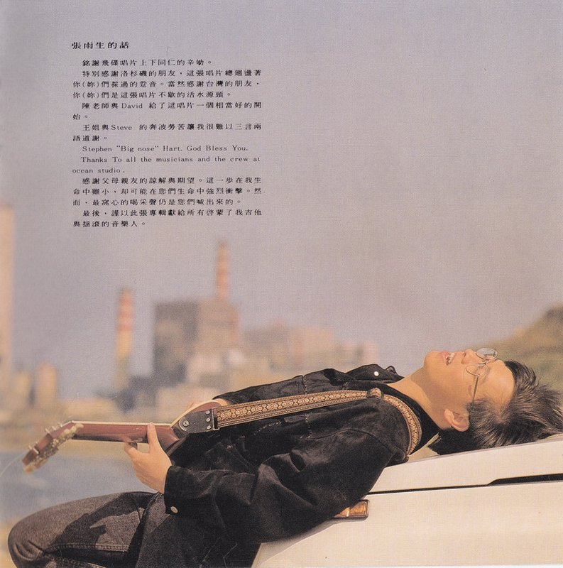
**张雨生的话**
衷心感谢唱片上下同仁的辛劬。  
特别感谢洛杉矶的朋友，这张唱片总廻荡著你（妳）们踩[^5]过的跫音。当然感谢台湾的朋友，你（妳）们是这张唱片不歇的活水源头。  
陈老师与David给了这唱片一个相当好的开始。  
王姐与Steve的奔波劳苦让我很难以三言两语道谢。  
Stephen "Big nose" Hart. God Bless You.  
Thanks To all the musicians and the crew at ocean studio.  
感谢父母亲友的谅解与期望。这一步在我生命中虽小，却可能在您们生命中强烈冲击。然而，最窝心的喝采声仍是您们喊出来的。  
最后，谨以此张专辑献给所有启蒙了我吉他与摇滚的音乐人。

# 制作团队
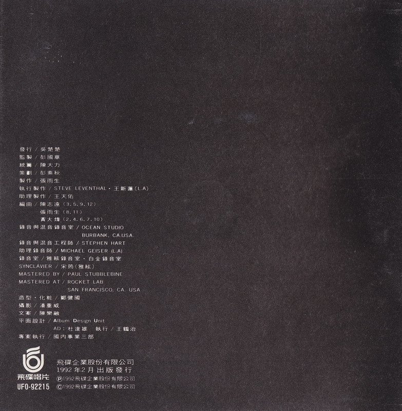  

| 负责             | 人员/资讯                                                                    |
|------------------|------------------------------------------------------------------------------|
| 发行             | 吴楚楚                                                                       |
| 监制             | 彭国华                                                                       |
| 统筹             | 陈大力                                                                       |
| 策划             | 彭素秋                                                                       |
| 制作             | 张雨生                                                                       |
| 执行制作         | STEVE LEVENTHAL・王新莲 (L. A)                                                |
| 助理制作         | 王天佑                                                                       |
| 编曲             | 陈志远（3・5・9・12） 张雨生（8・11） 黄大炜（2・4・6・7・10）                       |
| 录音与混音录音室 | OCEAN STUDIO BURBANK. CA.USA                                              |
| 录音与混音工程师 | STEPHEN HART                                                                 |
| 助理录音师       | MICHAEL GEISER (L. A)                                                        |
| 录音室           | 雅弦录音室・白金录音室                                                        |
| SYNCLAVIER       | 宋筠（雅弦）                                                                   |
| MASTERED BY      | PAUL STUBBLEBINE                                                             |
| MASTERED AT      | ROCKET LAB SAN FRANCISCO. CA .USA                                         |
| 造型・化妆        | 郑健国                                                                       |
| 摄影             | 潘重威                                                                       |
| 文案             | 陈乐融                                                                       |
| 平面设计         | Album Design Unit AD：杜达雄 执行：王鹤治                                   |
| 专案执行         | 国内事业三部                                                                 |
| 音乐录影带导演   | 带我去月球（彭文淳） 我想把整片天空打开（彭文淳） 我呼吸我感觉我存在（未知） |

飞碟唱片  
UFO-92215  
飞碟企业股份有限公司  
1992年2月24日出版发行  
1992 飞碟企业股份有限公司  
1992 飞碟企业股份有限公司  

# 张雨生特展的照片
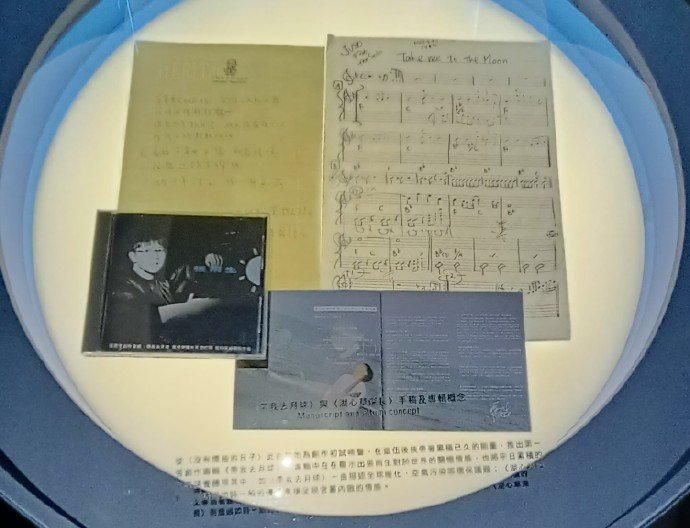

# 参考

相关链接

-   [张雨生创作专辑-专辑-张雨生网站 - https://www.tomchang.cn/](https://www.tomchang.cn/music/album/12.html)
-   [【图片】1992创作专辑【张雨生吧】_百度贴吧 - https://tieba.baidu.com/](https://tieba.baidu.com/p/2084189468#!/l/p1)
-   [张雨生手稿 - tieba.baidu.com](https://tieba.baidu.com/p/2084189476#!/l/p1)
-   [想你到月球 張雨生特展 08 - 蓁芯 0607@weibo.com​](https://weibo.com/2567125954/MmMWq3p44)
-   [帶我去月球 - https://supersky0.tripod.com/](https://supersky0.tripod.com/a-3.htm)

整理：露水、郈斐  
校对：、郈斐

[^1]: 也有大量资料将此专辑的名称记为「带我去月球」。
[^2]: 文案为「通俗音樂樂」，应是误植。
[^3]: 简体专辑做「猛然」，应该是打错了。
[^4]: 词作者为陈陆辉，收录原因是张雨生写了文案。
[^5]: 文案为「採過的跫音」，应是错字。