# 大海

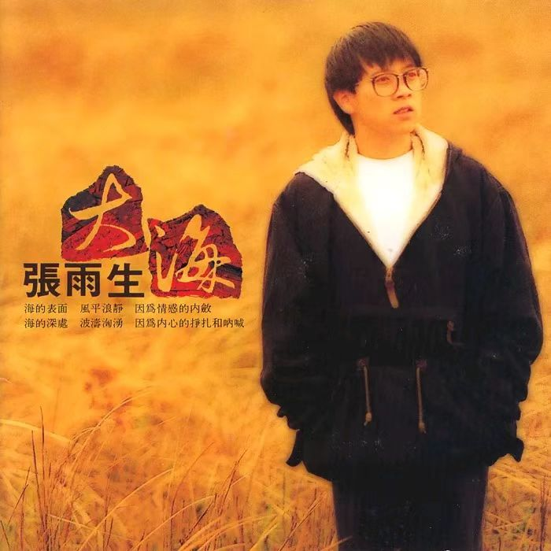

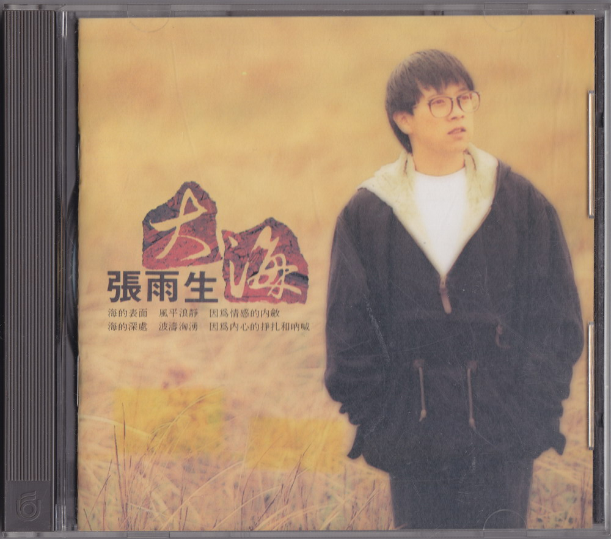

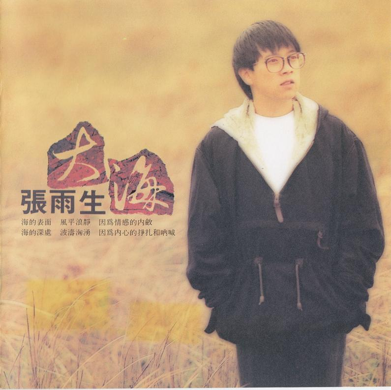

# 文案

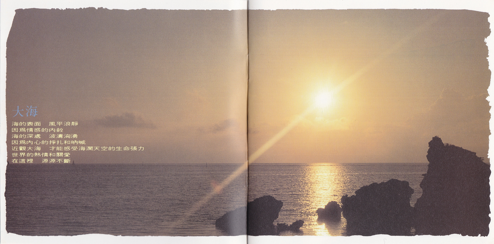

**大海**  
海的表面 风平浪静  
因为情感的内敛  
海的深处 波涛汹涌  
因为内心的挣扎和呐喊  
近观大海 才能感受海阔天空的生命张力  
世界的热情和关爱  
在这里 源源不断

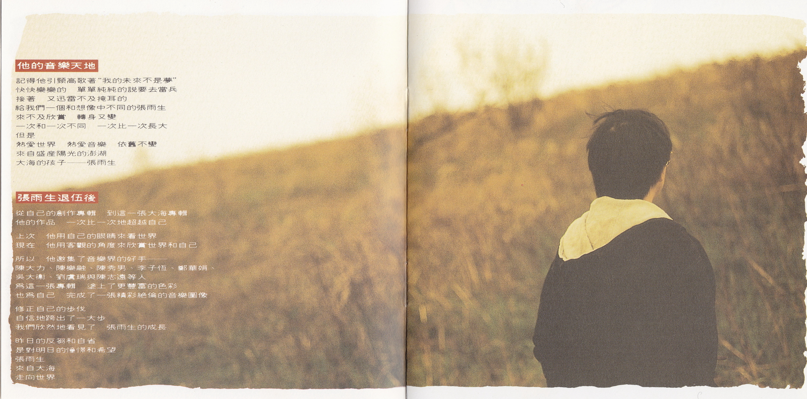

**他的音乐天地**  
记得他引颈高歌着“我的未来不是梦”  
快快乐乐的 单单纯纯的说要去当兵  
接着 又迅雷不及掩耳的  
给我们一个和想像中不同的张雨生  
来不及欣赏 转身又变  
一次和一次不同 一次比一次长大  
但是  
热爱世界 热爱音乐 依旧不变  
来自盛产阳光的澎湖  
大海的孩子——张雨生

**张雨生退伍后**  
从自己的创作专辑 到这一张大海专辑  
他的作品 一次比一次地超越自己

上次 他用自己的眼睛来看世界  
现在 他用客观的角度来欣赏世界和自己

所以 他邀集了音乐界的好手——  
陈大力、陈乐融、陈秀男、李子恒、郑华娟、  
吴大卫、刘虞瑞与陈志远等人  
为这一张专辑 涂上了更丰富的色彩  
也为自己 完成了一张精彩绝伦的音乐图像

修正自己的步伐  
自信地跨出了一大步  
我们欣然地看见了 张雨生的成长

昨日的反刍和自省  
是对明日的憧憬和希望  
张雨生  
来自大海  
走向世界

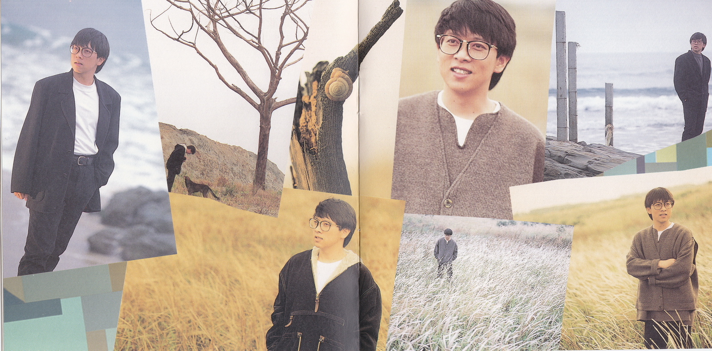
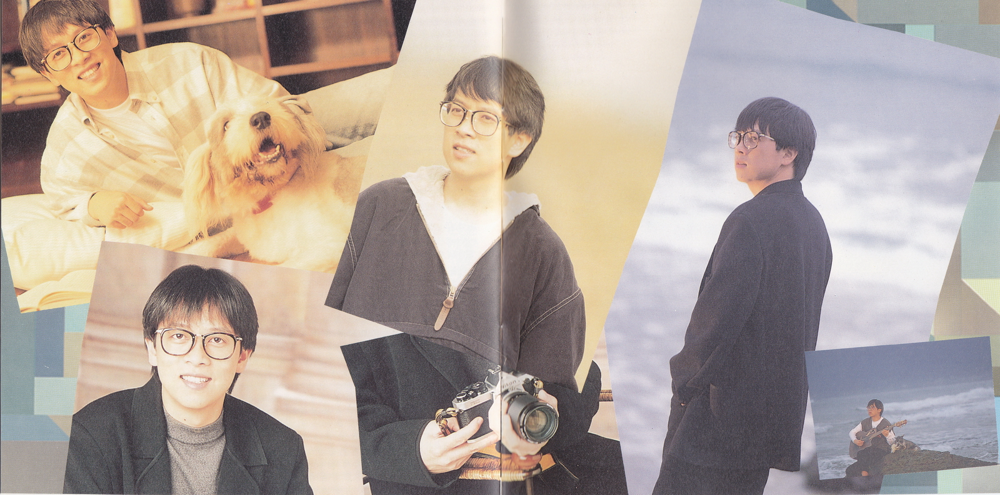

# 我是一棵秋天的树

UFO-92265-01

作词：许常德  
作曲：陈志远  
编曲：陈志远  
吉他：江建民  
录音：刘明德 (UFO)，王广武 (白金)  
混音：王广武，林一平，张雨生  
混音录音室：白金  
MV 导演：张荣贵  
MV 出演：潘蓉

## 歌词

我是一棵秋天的树 稀少的叶片显得有些孤独    
偶尔燕子会飞到我的肩上 用歌声描述这世界的匆促

我是一棵秋天的树 枯瘦的枝干少有人来停驻  
曾有对恋人在我胸膛刻字   我弯不下腰无法看清楚

我是一棵秋天的树 时时仰望天等待春风吹拂  
但是季节不曾为我赶路 我很有耐心不与命运追逐

我是一棵秋天的树 安安静静守着小小疆土  
眼前的繁华我从不羡慕 因为最美的在心不在远处

# I DON'T WANNA SAY GOODBYE

UFO-92265-02

作词：陈乐融  
作曲：陈志远  
编曲：陈志远  
吉他：江建民  
合声：陈丽莉，黄秀侦，陈秀珠  
录音：王广武 (白金)  
混音：王广武，林一平，张雨生  
混音录音室：白金  
MV 导演：未知[^1]

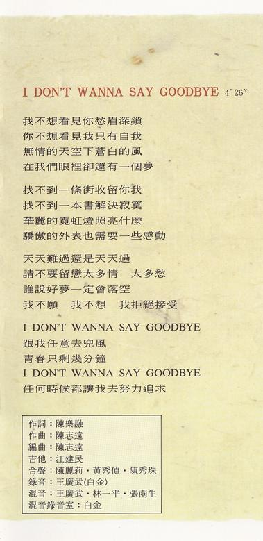

## 歌词

我不想看见你愁眉深锁  
你不想看见我只有自我  
无情的天空下苍白的风  
在我们眼里却还有一个梦

找不到一条街收留你我  
找不到一本书解决寂寞  
华丽的霓虹灯照亮什么  
骄傲的外表也需要一些感动

天天难过还是天天过  
请不要留恋太多情 太多愁  
谁说好梦一定会落空  
我不愿 我不想 我拒绝接受

I DON'T WANNA SAY GOODBYE  
跟我任意去兜风  
青春只剩几分钟  
I DON'T WANNA SAY GOODBYE  
任何时候都让我去努力追求

# 多梦的岁月

UFO-92265-03

作词：李子恒  
作曲：吴大卫  
编曲：涂惠源  
吉他：倪方来  
合声：杨新玲，李鼎慧，萧玉玲，林一平，刘明德，张雨生  
录音：ERIC (丽风)，王俊杰，王伟明 (白金)  
混音：王伟明，林一平  
混音录音室：白金

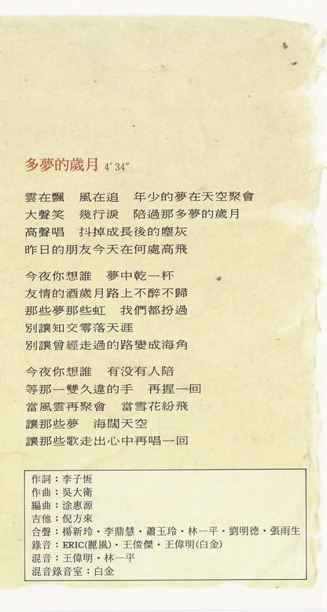

## 歌词

云在飘 风在追 年少的梦在天空聚会  
大声笑 几行泪 陪过那多梦的岁月  
高声唱 抖掉成长后的尘灰  
昨日的朋友今天在何处高飞

今夜你想谁 梦中干一杯  
友情的酒岁月路上不醉不归  
那些梦 那些虹 我们都扮过  
别让知交零落天涯  
别让曾经走过的路变成海角

今夜你想谁 有没有人陪  
等那一双久违的手 再握一回  
当风云再聚会 当雪花纷飞  
让那些梦 海阔天空  
让那些歌 走出心中再唱一回

# 爱上你的一切

UFO-92265-04

作词：陈乐融  
作曲：林一平  
编曲：屠颖  
吉他：倪方来  
合声：孙建平，陈秀珠，孙安林  
录音：王俊杰 (白金)  
混音：王伟明，林一平  
混音录音室：白金

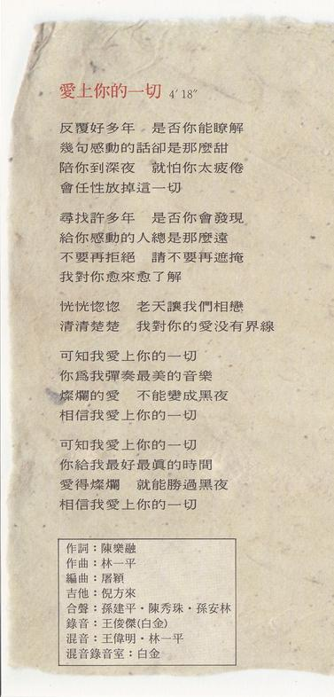

## 歌词

反覆好多年 是否你能了解  
几句感动的话却是那么甜  
陪你到深夜 就怕你太疲倦  
会任性放掉这一切

寻找许多年 是否你会发现  
给你感动的人总是那么远  
不要再拒绝 请不要再遮掩  
我对你愈来愈了解

恍恍惚惚 老天让我们相恋  
清清楚楚 我对你的爱没有界线

可知我爱上你的一切  
你为我弹奏最美的音乐  
灿烂的爱 不能变成黑夜  
相信我爱上你的一切

可知我爱上你的一切  
你给我最好最真的时间  
爱得灿烂 就能胜过黑夜  
相信我爱上你的一切

# 挣扎

UFO-92265-05

作词：陈乐融  
作曲：陈志远  
编曲：陈志远  
吉他：江建民  
合声：张雨生  
录音：王广武 (白金)  
混音：王广武，林一平  
混音录音室：白金

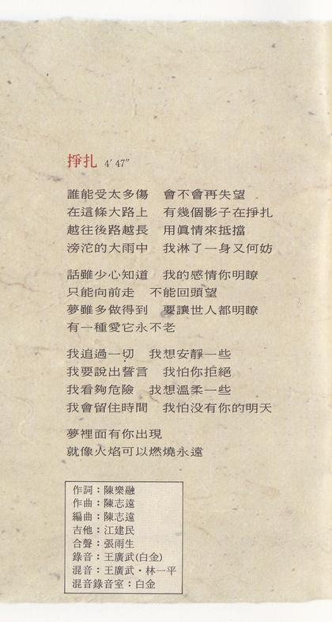

## 歌词

谁能受太多伤 会不会再失望  
在这条大路上 有几个影子在挣扎  
越往后路越长 用真情来抵挡  
滂沱的大雨中 我淋了一身又何妨

话虽少心知道 我的感情你明了  
只能向前走 不能回头望  
梦虽多做得到 要让世人都明了  
有一种爱它永不老

我追过一切 我想安静一些  
我要说出誓言 我怕你拒绝  
我看够危险 我想温柔一些  
我会留住时间 我怕没有你的明天  
梦里面有你出现  
就像火焰可以燃烧永远

# 大海

UFO-92265-06

作词：陈大力  
作曲：陈大力，陈秀男  
制作：陈大力，陈秀男  
编曲：RICKY HO  
钢琴，键盘：RICKY HO  
贝斯：EDDIE MARZUKI  
电吉他：JONATHAN KOH  
录音：台北 张永夫 (白金)，新加坡 MO LEE (STUDIO C)，EUNICE YOUNG  
MV 导演：杨布新

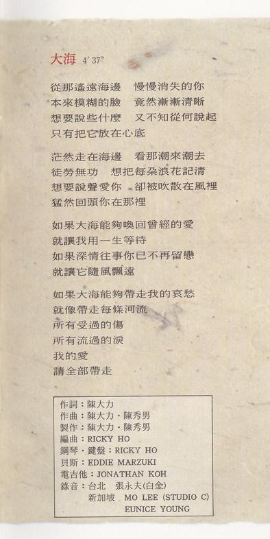

## 歌词

从那遥远海边 慢慢消失的你  
本来模糊的脸 竟然渐渐清晰  
想要说些什么 又不知从何说起  
只有把它放在心底

茫然走在海边 看那潮来潮去  
徒劳无功 想把每朵浪花记清  
想要说声爱你 却被吹散在风里  
猛然回头你在那里

如果大海能够唤回曾经的爱  
就让我用一生等待  
如果深情往事你已不再留恋  
就让它随风飘远

如果大海能够带走我的哀愁  
就像带走每条河流  
所有受过的伤  
所有流过的泪  
我的爱  
请全部带走

# 宁可让我苦

UFO-92265-07

作词：张雨生  
作曲：张雨生  
编曲：孙崇伟  
吉他：倪方来  
合声：王天佑 林一平 刘明德 张雨生  
录音：ERIC 王家栋 (丽风)  
混音：王家栋  
混音录音室：丽风

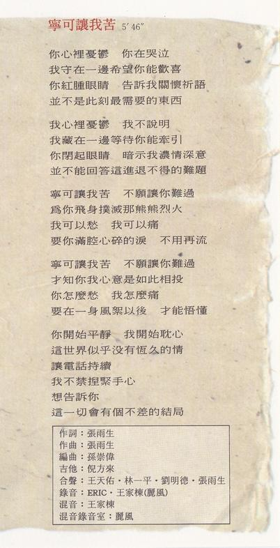

## 歌词

你心里忧郁 你在哭泣  
我守在一边希望你能欢喜  
你红肿眼睛 告诉我关怀祈语  
并不是此刻最需要的东西

我心里忧郁 我不说明  
我藏在一边等待你能牵引  
你闭起眼睛 暗示我浓情深意  
并不能回答这进退不得的难题

宁可让我苦 不愿让你难过  
为你飞身扑灭那熊熊烈火  
我可以愁 我可以痛  
要你满腔心碎的泪 不用再流

宁可让我苦 不愿让你难过  
才知你我心意是如此相投  
你怎么愁 我怎么痛  
要在一身风絮以后 才能悟懂

你开始平静 我开始耽心  
这世界似乎没有恒久的情  
让电话持续  
我不禁捏紧手心  
想告诉你  
这一切会有个不差的结局

# 不管不管

UFO-92265-08

作词：郑华娟  
作曲：郑华娟  
编曲：李正帆  
吉他：江建民  
合声：张雨生  
录音：ERIC (丽风)，王广武 (逹采)  
混音：王广武，林一平，张雨生  
混音录音室：逹采

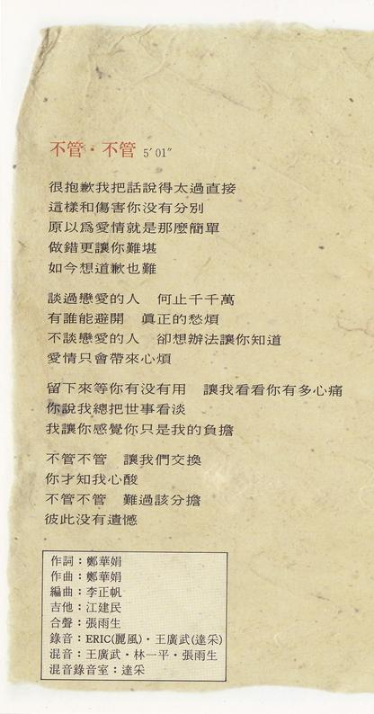

## 歌词

很抱歉我把话说得太过直接  
这样和伤害你没有分别  
原以为爱情就是那么简单  
做错更让你难堪  
如今想道歉也难

谈过恋爱的人 何止千千万  
有谁能避开 真正的愁烦  
不谈恋爱的人 却想办法让你知道  
爱情只会带来心烦

留下来等你有没有用 让我看看你有多心痛  
你说我总把世事看淡  
我让你感觉你只是我的负担

不管不管 让我们交换  
你才知我心酸  
不管不管 难过该分担  
彼此没有遗憾

# 把世界分一半给你

UFO-92265-09

作词：刘虞瑞  
作曲：吴大卫  
编曲：屠颖  
吉他：倪方来  
合声：孙建平，陈秀珠，孙安林  
录音：王伟明 (白金)  
混音：王伟明，林一平  
混音录音室：白金

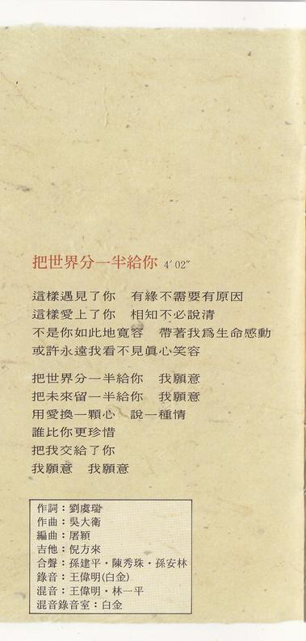

## 歌词

这样遇见了你 有缘不需要有原因  
这样爱上了你 相知不必说清  
不是你如此地宽容 带着我为生命感动  
或许永远我看不见真心笑容

把世界分一半给你 我愿意  
把未来留一半给你 我愿意  
用爱换一颗心 说一种情  
谁比你更珍惜  
把我交给了你  
我愿意 我愿意

# 心底的中国

UFO-92265-10

作词：张雨生  
作曲：张雨生  
编曲：陈志远  
吉他：江建民  
合声：王天佑，林一平，刘明德，江天赋，张雨生  
录音：王家栋，ERIC (丽风)  
混音：王广武，林一平，张雨生  
混音录音室：白金

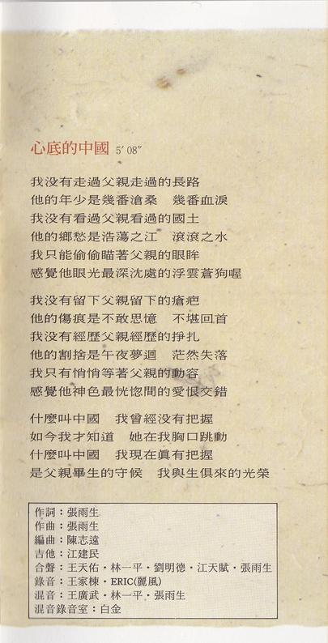

## 歌词

我没有走过父亲走过的长路  
他的年少是几番沧桑 几番血泪  
我没有看过父亲看过的国土  
他的乡愁是浩荡之江 滚滚之水  
我只能偷偷瞄着父亲的眼眸  
感觉他眼光最深沉处的浮云苍狗喔

我没有留下父亲留下的疮疤  
他的伤痕是不敢思忆 不堪回首  
我没有经历父亲经历的挣扎  
他的割舍是午夜梦回 茫然失落  
我只有悄悄等着父亲的动容  
感觉他神色最恍惚间的爱恨交错

什么叫中国 我曾经没有把握  
如今我才知道 她在我胸口跳动  
什么叫中国 我现在真有把握  
是父亲毕生的守候 我与生俱来的光荣

# 制作团队

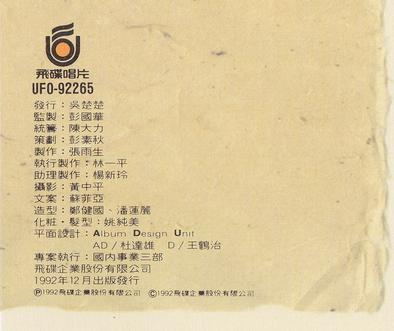

|    负责    |       人员        |
| :--------: | :---------------: |
|    发行    |      吴楚楚       |
|    监制    |      彭国华       |
|    统筹    |      陈大力       |
|    策划    |      彭素秋       |
|    制作    |      张雨生       |
|  执行制作  |      林一平       |
|  助理制作  |      杨新玲       |
|    摄影    |      黄中平       |
|    文案    |      苏菲亚       |
|    造型    |  郑健国，潘莲丽   |
| 化妆，发型 |      姚纯美       |
|  平面设计  | Album Design Unit |
|     AD     |      杜达雄       |
|     D      |      王鹤治       |
|  专案执行  |   国内事业三部    |

飞碟企业股份有限公司  
1992 年 12 月出版发行  
Ⓟ1992 飞碟企业股份有限公司  
Ⓒ1992 飞碟企业股份有限公司

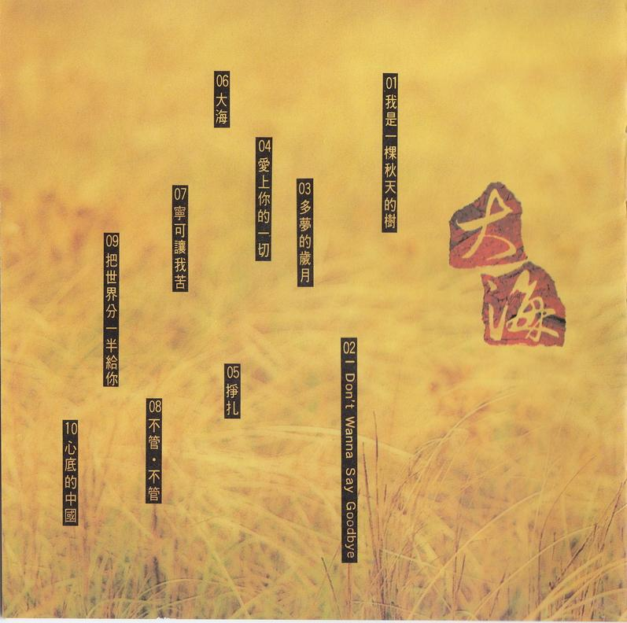

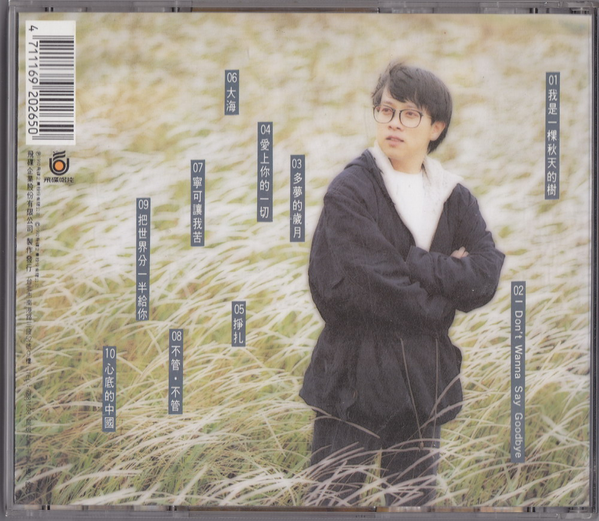

整理：郈斐，向晚  
校对：郈斐

[^1]: 网上能找到 MV，但不知道导演是谁
