# 一天到晚游泳的鱼
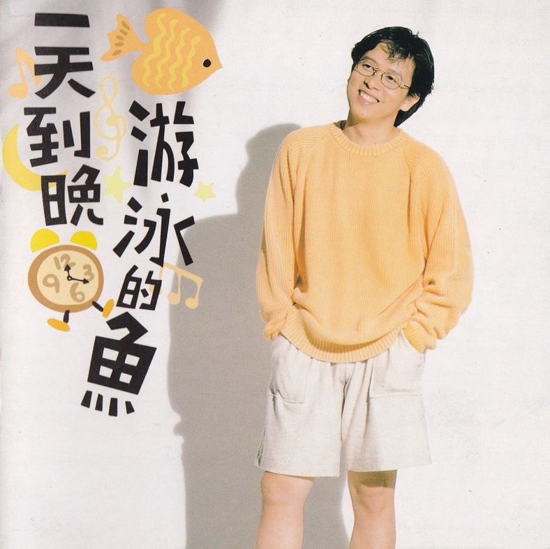

## 文案
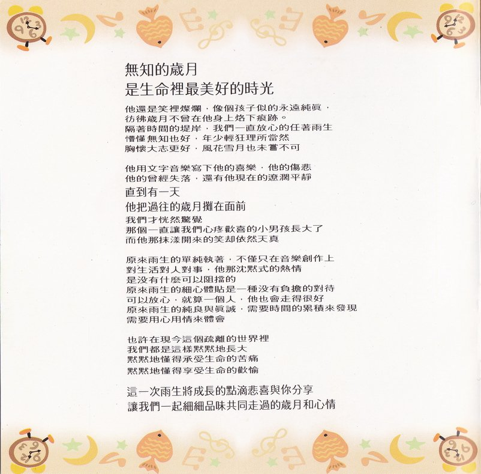

**无知的岁月**  
**是生命里最美好的时光**

他还是笑容灿烂，像个孩子似的永远纯真，  
彷佛岁月不曾在他身上烙下痕迹。  
隔着时间的堤岸，我们一直放心的任着雨生  
懵懂无知也好，年少轻狂理所当然  
胸怀大志更好，风花雪月也未尝不可

他用文字音乐写下他的喜乐，他的伤悲  
他的曾经失落，还有他现在的辽阔平静  
**直到有一天**  
**他把过往的岁月摊在面前**  
我们才恍然惊觉  
那个一直让我们心疼欢喜的小男孩长大了  
而他那抹漾开来的笑却依然天真

原来雨生的单纯执著，不仅只在音乐创作上  
对生活对人对事，他那沉默式的热情  
是没有什么可以阻挡的  
原来雨生的细心体贴是一种没有负担的对待  
可以放心，就算一个人，他也会走得很好  
原来雨生的纯良与真诚，需要时间的累积来发现  
需要用心用情来体会

也许在现今这个疏离的世界里  
我们都是这样默默地长大  
默默地懂得承受生命的苦痛  
默默地懂得享受生命的欢愉  

**这一次雨生将成长的点滴悲喜与你分享**  
**让我们一起细细品味共同走过的岁月和心情**

## 青涩的记忆
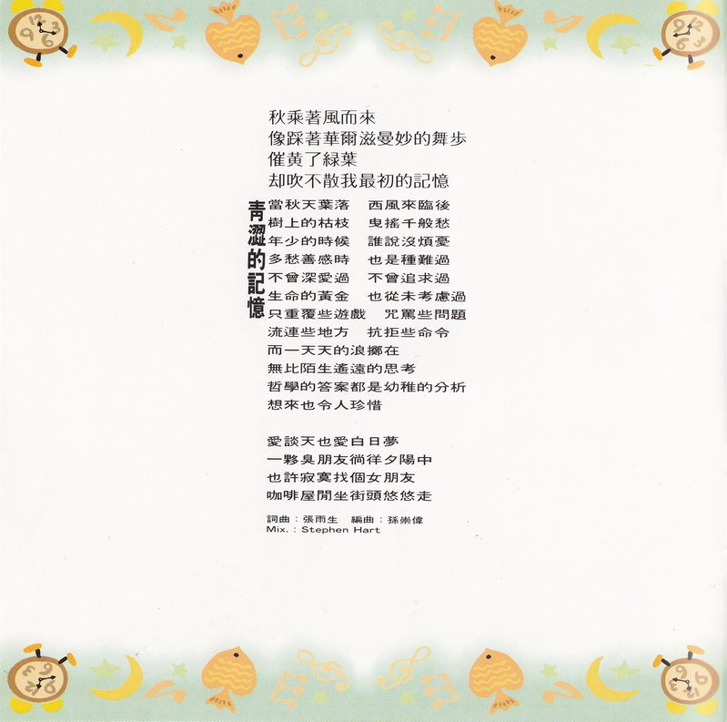

### 文案
秋乘着风而来  
像踩着华尔兹曼妙的舞步  
催黄了绿叶  
却吹不散我最初的记忆

### 歌词
当秋天叶落 西风来临后  
树上的枯枝 曳摇千般愁  
年少的时候 谁说没烦忧  
多愁善感时 也是种难过  
不曾深爱过 不曾追求过  
生命的黄金 也从未考虑过  
只重复些游戏 咒骂些问题  
流连些地方 抗拒些命令  
而一天天的浪掷在  
无比陌生遥远的思考  
哲学的答案都是幼稚的分析  
想来也令人珍惜

爱谈天也爱白日梦  
一伙臭朋友徜徉夕阳中  
也许寂寞找个女朋友  
咖啡屋闲坐 街头悠悠走

| 负责  |     人员     |
| :---: | :----------: |
| 词曲  |    张雨生    |
| 编曲  |    孙崇伟    |
|  Mix  | Stephen Hart |

## 是否真的爱我
### 歌词
是否真的爱我  
别对我沉默  
这月色美丽的夜晚  
你在想什么
是否真的爱我  
别对我冷漠  
你心里有什么样的话  
尽管对我说
还记得曾经编织的梦想  
也许你早遗忘  
绚烂的爱情在多年以后  
也许渐渐变得平淡
你可知不是我不了解爱情  
微妙难捉摸  
不是我不怀疑弦外的爱情会迷惑  
总是那肩并肩走过的岁月  
刻划在心头  
切切的叮咛着我  
与你长相厮守

|   负责   |  人员  |
| :------: | :----: |
|   词曲   | 熊天益 |
|   编曲   | 陈志远 |
|  Guitar  | 江建民 |
| B. Vocal | 张雨生 |
|   Mix    | Mr. K  |

## 海的呼唤

（纯音乐）

## 一天到晚游泳的鱼
### 歌词
情愿困在你怀中 困在你温柔  
不想一个人寂寞 无边漂泊  
就像鱼儿水里游 你的心河流向我  
不眠不休的追求

一天到晚游泳的鱼啊 鱼不停游  
一天到晚想你的人啊 爱不停休  
从来不想回头 不问天长地久  
因为我的爱覆水难收

多少喜乐在心中 慢慢游  
多少忧愁不肯走 流向心头  
就像鱼儿水里游 永远不会问结果  
他们知道爱情没尽头

一天到晚游泳的鱼啊 鱼不停游  
一天到晚想你的人啊 爱不停休  
沧海多么辽阔 再也不能回首  
只要你心里永远留我

合音：  
鱼儿鱼儿鱼儿水中游  
游来游去啊乐悠悠  
鱼儿鱼儿鱼儿慢慢游
宝哥：沧海乐悠悠 从不觉不自由
鱼儿鱼儿鱼儿水中游
宝哥：你看那沧海多么辽阔 再也不能回首
鱼儿鱼儿鱼儿慢慢游
宝哥：情海不由我 追求没有尽头
鱼儿鱼儿鱼儿水中游
宝哥：不问天长地久 从来不想回头
鱼儿鱼儿鱼儿慢慢游

|  负责   |                       人员                       |
| :-----: | :----------------------------------------------: |
|   词    |                      许常德                      |
|   曲    |                      陈复明                      |
|  编曲   |                      陈志远                      |
| B.Vocal | 马玉芬・林美满・林美瑛・郑知明 陈复明・张雨生 |
|   Mix   |                      Mr. K                       |

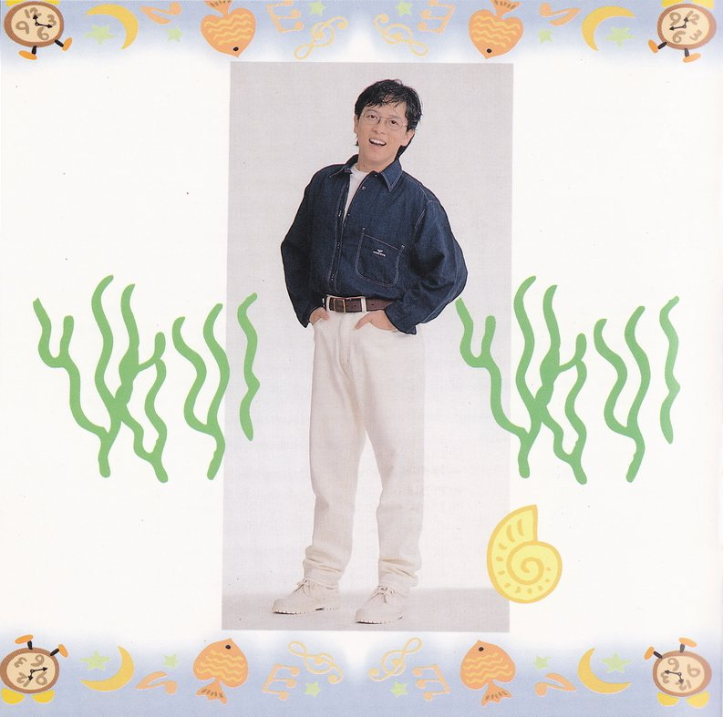

## 冰点

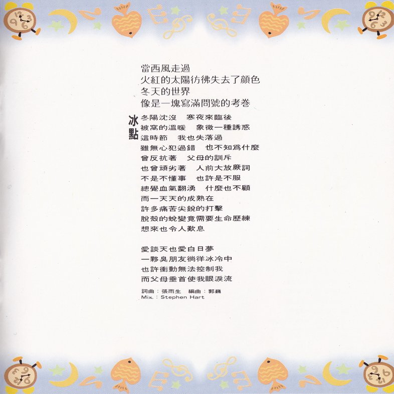

### 文案
当西风走过  
火红的太阳仿佛失去了颜色  
冬天的世界  
像是一块写满问号的考卷

### 歌词
冬阳沉没 寒夜来临后  
被窝的温暖 象征一种诱惑  
这时节 我也失落过  
虽无心犯过错 也不知为什么  
曾反抗着 父母的训斥  
也曾顽劣着 人前大放厥词  
不是不懂事 也许是不服  
总觉血气翻涌 什么也不顾  
而一天天的成熟在  
许多痛苦尖锐的打击  
脱壳的蜕变竟需要生命历练  
想来也令人叹息

爱谈天也爱白日梦  
一伙臭朋友徜徉冰冷中  
也许冲动无法控制我  
而父母垂首使我眼泪流

| 负责  |     人员     |
| :---: | :----------: |
| 词曲  |    张雨生    |
| 编曲  |     郭巍     |
|  Mix  | Stephen Hart |

## 妹妹晚安
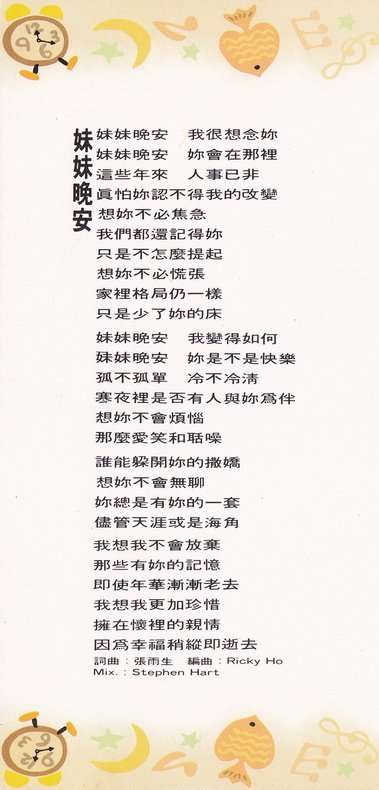

### 歌词
妹妹晚安 我很想念妳  
妹妹晚安 妳会在那里  
这些年来 人事已非  
真怕妳认不得我的改变  
想妳不必焦急  
我们都还记得妳  
只是不怎么提起  
想妳不必慌张  
家里格局仍一样  
只是少了妳的床

妹妹晚安 我变得如何  
妹妹晚安 妳是不是快乐  
孤不孤单 冷不冷清  
寒夜里是否有人与妳为伴  
想妳不会烦恼  
那么爱笑和聒噪

谁能躲开妳的撒娇  
想妳不会无聊  
妳总是有妳的一套  
尽管天涯或是海角

我想我不会放弃  
那些有妳的记忆  
即使年华渐渐老去  
我想我更加珍惜  
拥在怀里的亲情  
因为幸福稍纵即逝去

| 负责  |     人员     |
| :---: | :----------: |
| 词曲  |    张雨生    |
| 编曲  |     Ricky Ho     |
|  Mix  | Stephen Hart |

## 祈求
### 歌词
给我爱 换走无奈  
给我苦 让我记得温暖  
眼眸中 彷佛有阳光  
要照亮 最后一扇窗

给我泪 洗去悲哀  
给我路 让我走出未来  
谎言中 我依然守候  
不相信 世界没有梦

给我最灿烂的春天  
给我最狂热的夏天  
身处人海中  只有你我  
懂得天地间一片真

给我最缠绵的秋天  
给我最丰收的冬天  
时间带不走你我的梦  
我不想平凡过一生

|  负责  |    人员    |
| :----: | :--------: |
|   词   |   陈乐融   |
|   曲   |   吴大卫   |
|  编曲  | Blinda Foo |
| Guitar |   江建民   |
|  Mix   |   陈冠宇   |

## 三月的天真

### 文案
风停了，雨下过以后  
春神来了，伴着彩虹……

### 歌词
当风和日丽 阳春三月天  
灿烂的心境 醉人的诗篇  
或许红砖上 或许小湖沿  
缤纷的足迹 飞扬的笑靥  
纯洁的性灵 彷如刚清醒  
又似蒙蔽已久 才重新刷洗  
渴望了一切 自然的呼吸  
殷勤着肢体 交融不尽美景  
而一天天的感激在  
所有如泣如诉的情怀  
生命的意义升华为对那万物  
有情的了解明白

爱谈天也爱白日梦  
一伙臭朋友徜徉诗意中  
也许等待为了种神采  
为了对眼光为了一份爱

|   负责   |          人员          |
| :------: | :--------------------: |
|   词曲   |         张雨生         |
|   编曲   |         钟兴民         |
|  Guitar  |         张雨生         |
| Keyboard |         钟兴民         |
|   Drum   |         徐德昌         |
|   Bass   |         谭明辉         |
| B.Vocal  | 林一平・王天佑・张雨生 |
|   Mix    |      Stephen Hart      |

## 一人一个梦
### 歌词
调一杯酒 调成樱花红  
颜色淡的看不出用情多浓  
你永远不懂  
梦如果不成梦 翻来覆去的长夜里  
思念会刺的人心坎很痛

爱一个人 等他几分钟  
看他眼神和语气有何不同  
慢慢就会懂  
情如果放太重 就像心握在他手中  
爱与不爱都是那样的被动

难道不懂

给一人一个梦 梦都不会相同  
当感觉开始无法相容  
为何还要坚持感情 有始有终

给爱一个屏风 心灵隔成双重  
让自己可以监视自己  
当爱来时 宁愿孤独 不为所动

一人一个梦  
一人一个梦

|    负责     |      人员      |
| :---------: | :------------: |
|     词      |     林秋离     |
|     曲      |     熊美玲     |
|    编曲     |     陈志远     |
|   Guitar    |     江建民     |
| Percussions |     刘效松     |
|   B.Vocal   | 马玉芬・黄丽星 |
|     Mix     |     Mr. K      |

## 一步一徘徊
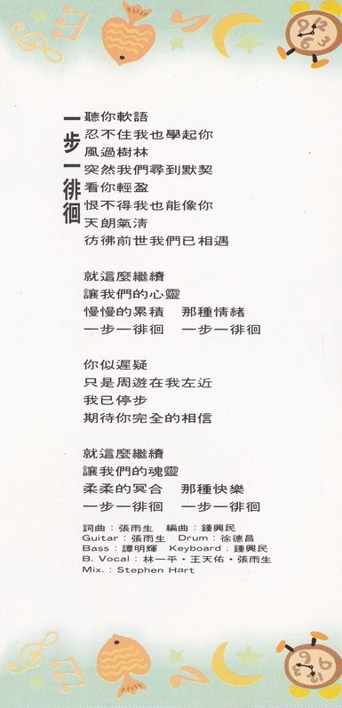

### 歌词
听你软语  
忍不住我也学起你  
风过树林  
突然我们寻到默契  
看你轻盈  
恨不得我也能像你  
天朗气清  
彷佛前世我们已相遇

就这么继续  
让我们的心灵  
慢慢的累积 那种情绪  
一步一徘徊 一步一徘徊

你似迟疑  
只是周游在我左近  
我已停步  
期待你完全的相信

就这么继续  
让我们的魂灵  
柔柔的冥合 那种快乐  
一步一徘徊 一步一徘徊

|   负责   |          人员          |
| :------: | :--------------------: |
|   词曲   |         张雨生         |
|   编曲   |         钟兴民         |
|  Guitar  |         张雨生         |
|   Drum   |         徐德昌         |
|   Bass   |         谭明辉         |
| Keyboard |         钟兴民         |
| B.Vocal  | 林一平・王天佑・张雨生 |
|   Mix    |      Stephen Hart      |

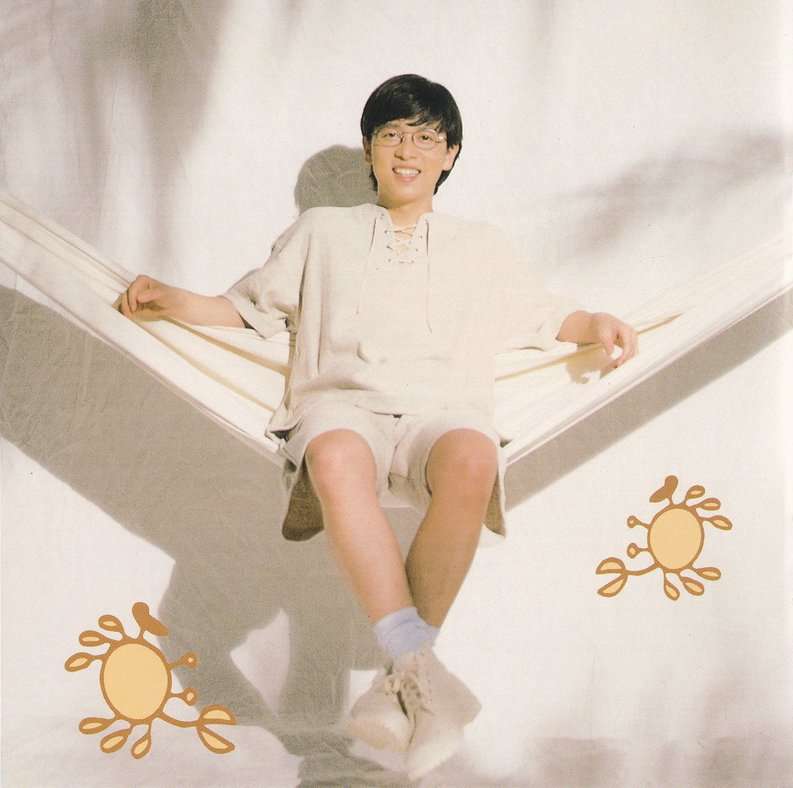

## 仲夏夜之梦
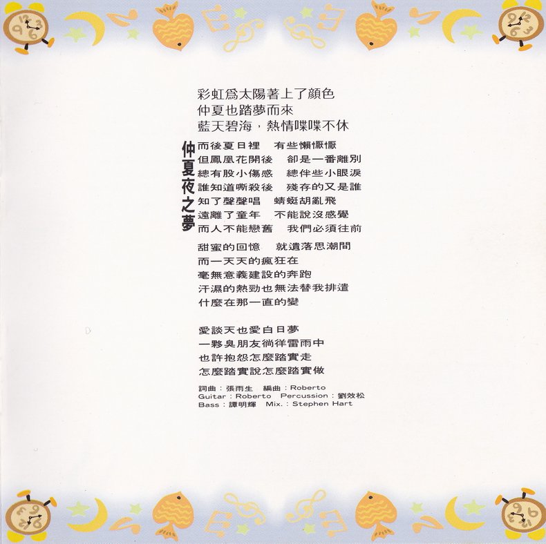

### 文案
彩虹为太阳着上了颜色  
仲夏也踏梦而来  
蓝天碧海，热情喋喋不休

### 歌词
而后夏日里 有些懒恹恹  
但凤凰花开后 却是一番离别  
总有股小伤感 总伴些小眼泪  
谁知道嘶杀后 残存的又是谁  
知了声声唱 蜻蜓胡乱飞  
远离了童年 不能说没感觉  
而人不能恋旧 我们必须往前

甜蜜的回忆 就遗落思潮间  
而一天天的疯狂在  
毫无意义建设的奔跑  
汗湿的热劲也无法替我排遣  
什么在那一直的变

爱谈天也爱白日梦  
一伙臭朋友徜徉雷雨中  
也许抱怨怎么踏实走  
怎么踏实说怎么踏实做

|    负责    |     人员     |
| :--------: | :----------: |
|    词曲    |    张雨生    |
|    编曲    |   Roberto    |
|   Guitar   |   Roberto    |
| Percussion |    刘效松    |
|    Bass    |    谭明辉    |
|    Mix     | Stephen Hart |

## 勿忘我
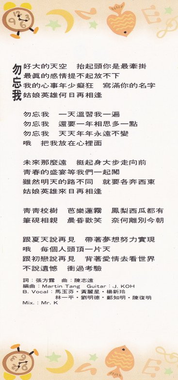
### 歌词
好大的天空 抬起头你是最牵挂  
最真的感情提不起放不下  
我的心事年少痴狂 写满你的名字  
姑娘英雄何日再相逢

勿忘我 一天温习我一遍  
勿忘我 还要一年相思多一点  
勿忘我 天天年年永远不变  
哦 把我放在心里面

未来那么远 挺起身大步走向前  
青春的盛宴等我们一起闯  
虽然明天的路不同 就要各奔西东  
姑娘英雄来日再相逢

青青校树 芭乐莲雾 凤梨西瓜都有  
笔砚相亲 晨昏欢笑 奈何离别今朝

跟夏天说再见 带着梦想努力实现  
哦 每个人头顶一片天  
跟初恋说再见 背着爱情去看世界  
不说遗憾 冲过考验

|  负责   |                           人员                           |
| :-----: | :------------------------------------------------------: |
|   词    |                          张方露                          |
|   曲    |                          陈志远                          |
|  编曲   |                       Martin Tang                        |
| Guitar  |                          J. KOH                          |
| B.Vocal | 马玉芬・黄丽星・杨新玲 林一平・刘明德・郑知明・陈复明 |
|   Mix   |                          Mr. K                           |

## 静夜星空
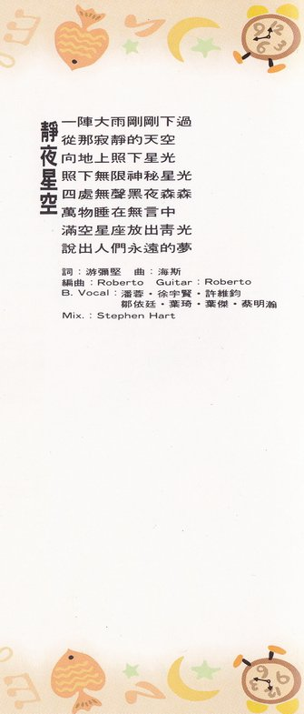

### 歌词
一阵大雨刚刚下过  
从那寂静的天空  
向地上照下星光  
照下无限神秘星光  
四处无声黑夜森森  
万物睡在无言中  
满空星座放出青光  
说出人们永远的梦

|  负责   |                        人员                        |
| :-----: | :------------------------------------------------: |
|   词    |                       游弥坚                       |
|   曲    |                        海斯                        |
|  编曲   |                      Roberto                       |
| Guitar  |                      Roberto                       |
| B.Vocal | 潘蓉・徐宇贤・许维钧 邹依廷・叶琦・叶杰・蔡明瀚 |
|   Mix   |                    Stephen Hart                    |

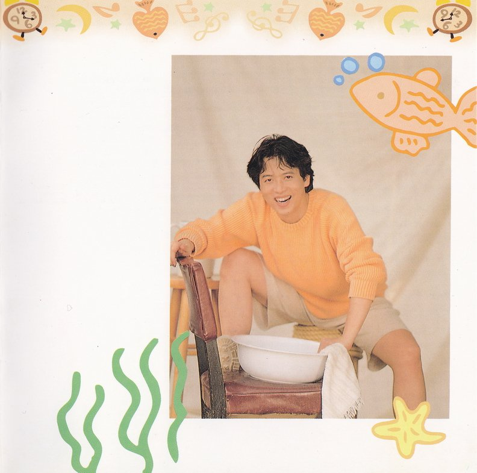

## 无知的岁月
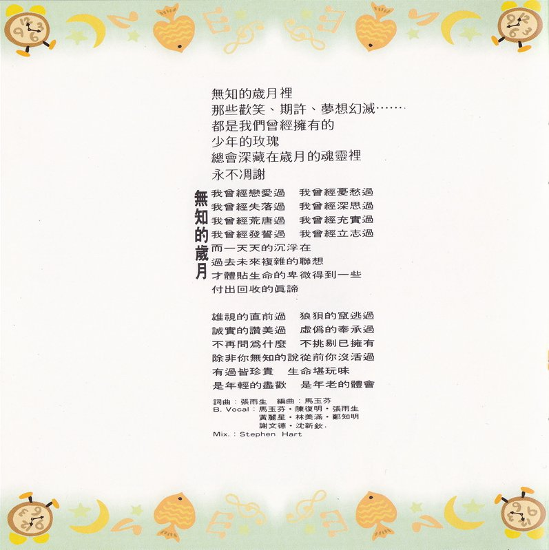

### 文案
无知的岁月里  
那些欢笑、期许、梦想幻灭……  
都是我们曾经拥有的  
少年的玫瑰  
总会深藏在岁月的魂灵里  
永不凋谢

### 歌词
我曾经恋爱过 我曾经忧愁过  
我曾经失落过 我曾经深思过  
我曾经荒唐过 我曾经充实过  
我曾经发誓过 我曾经立志过  
而一天天的沉浮在  
过去未来复杂的联想  
才体贴生命的卑微得到一些  
付出回收的真谛

雄视的直前过 狼狈的窜逃过  
诚实的赞美过 虚伪的奉承过  
不再问为什么 不挑剔已拥有  
除非你无知的说从前你没活过  
有过皆珍贵 生命堪玩味  
是年轻的尽欢 是年老的体会

|  负责   |                                人员                                |
| :-----: | :----------------------------------------------------------------: |
|  词曲   |                               张雨生                               |
|  编曲   |                               马玉芬                               |
| B.Vocal | 马玉芬・陈复明・张雨生 黄丽星・林美满・郑知明 谢文德・沈新钦 |
|   Mix   |                            Stephen Hart                            |

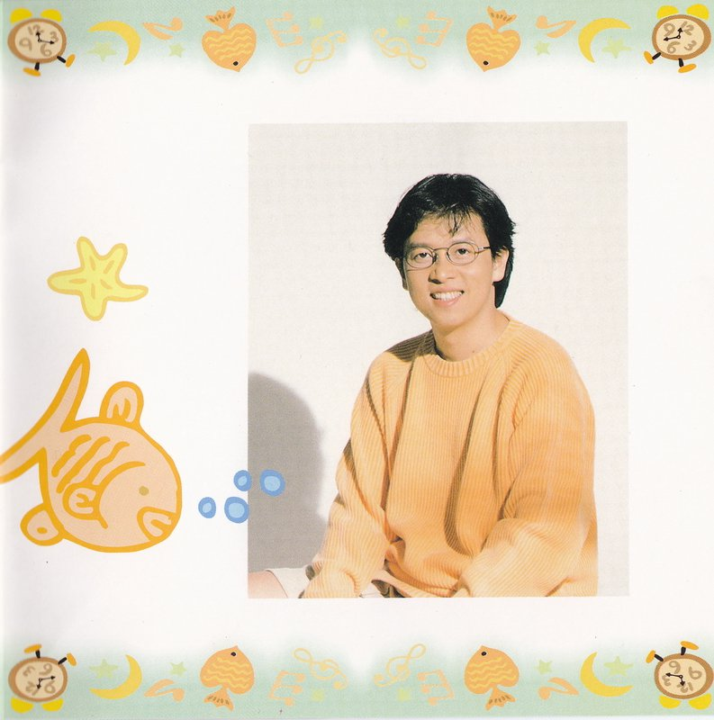

# 制作团队
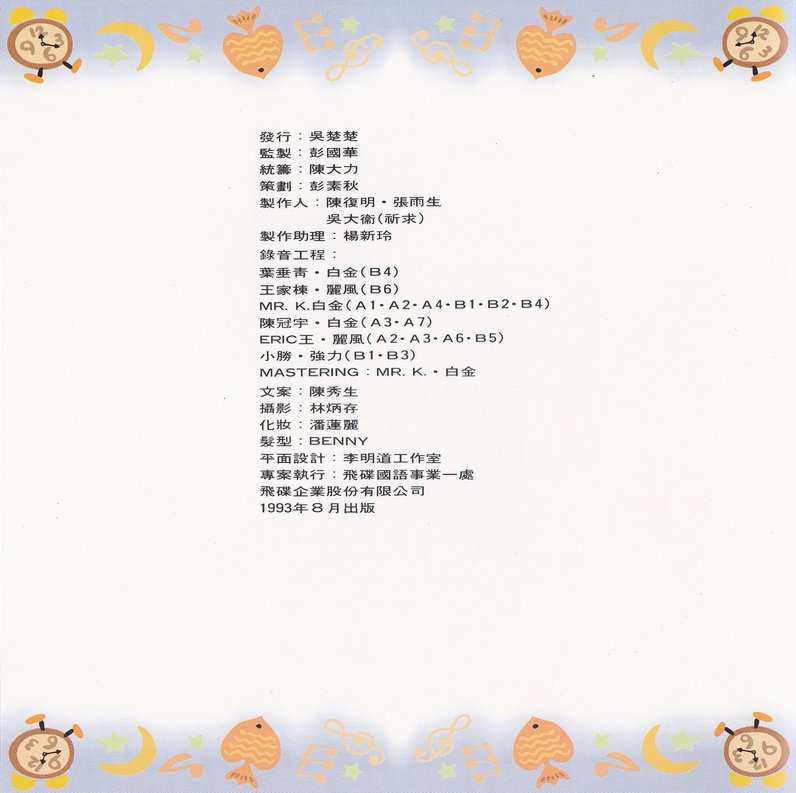

|      负责      |                                                                                 人员                                                                                 |
| :------------: | :------------------------------------------------------------------------------------------------------------------------------------------------------------------: |
|      发行      |                                                                                吴楚楚                                                                                |
|      监制      |                                                                                彭国华                                                                                |
|      统筹      |                                                                                陈大力                                                                                |
|      策划      |                                                                                彭素秋                                                                                |
|     制作人     |                                                                   陈复明・张雨生 吴大卫（祈求）                                                                   |
|    制作助理    |                                                                                杨新玲                                                                                |
|    录音工程    | 叶垂青・白金（B4） 王家栋・丽风（B6） MR.K.白金（A1・A2・A4・B1・B2・B4） 陈冠宇・白金（A3・A7） ERIC 王・丽风（A2・A3・A6・B5） 小胜・强力（B1・B3） |
|   MASTERING    |                                                                              MR.K・白金                                                                              |
|      文案      |                                                                                陈秀生                                                                                |
|      摄影      |                                                                                林炳存                                                                                |
|      化妆      |                                                                                潘莲丽                                                                                |
|      发型      |                                                                                BENNY                                                                                 |
| 音乐录影带导演 |                                              一天到晚游泳的鱼（张荣贵） 一人一个梦（未知） 是否真的爱我（赖伟康）                                              |
|    平面设计    |                                                                             李明道工作室                                                                             |
|    专案执行    |                                                                           飞碟国语事业一处                                                                           |
|    出版发行    |                                                                         飞碟企业股份有限公司                                                                         |
|    出版日期    |                                                                          1993 年 8 月 24 日                                                                          |

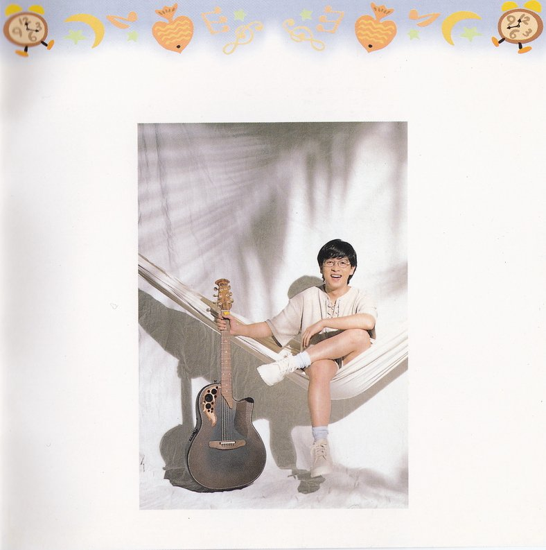

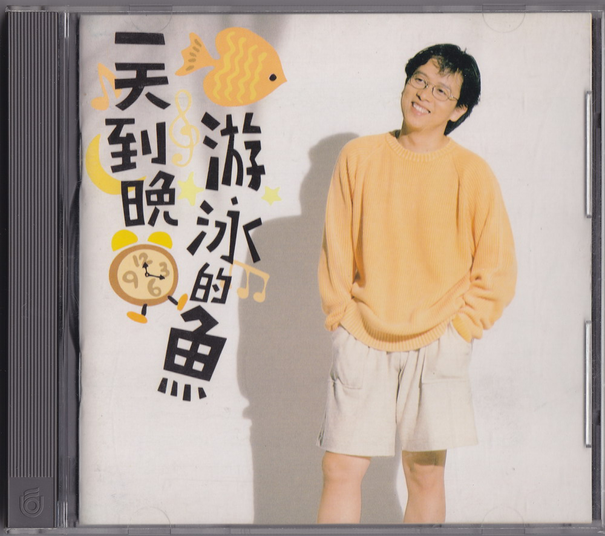

|   项目   |           内容            |
| :------: | :-----------------------: |
|   发行   |   飞碟企业股份有限公司    |
|   地址   |  台北市南港路三段 52 号 9 楼  |
|   电话   |          7881598          |
| 出版登记 |    局版台音字第 0521 号     |

ⓟ1993 飞碟企业股份有限公司  
ⓒ1993 飞碟企业股份有限公司

### 参考
-   [一天到晚游泳的鱼图册 - tieba.com](https://tieba.baidu.com/p/2084189463#!/l/p1)
-   [张雨生音乐作品合辑 - cangkus.com](https://www.cangkus.com/music/21672.html)
-   [一天到晚游泳的鱼 - tomchang.cn](https://www.tomchang.cn/music/album/14.html)
-   [一天到晚游泳的鱼 - yu-sheng.org](https://web.archive.org/web/20120824043855/http://www.yu-sheng.org/Music/album.php?action=sa&id=5)
  
整理：Finn & Rain、露水  
校对：露水、向晚