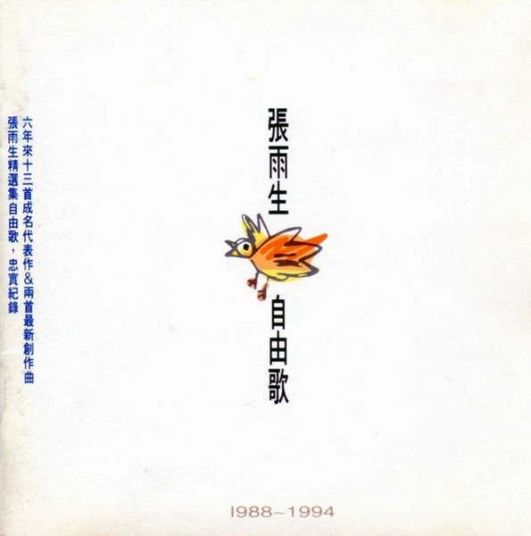
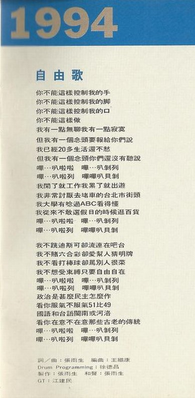
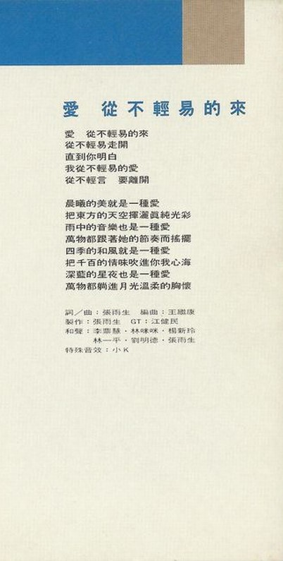

# 自由歌

# 文案

我对音乐其实并没有很特别的感觉。

只是，有的时候，我突然因某段乐音而得到慰解；有的时候，我仿佛能与某些小节灵犀相通；有的时候，我身体的某一部份似乎也同样起了与那位歌者类似的悸动或什么的，我也不太能抓得准。大概是情绪累积到一定程度，就容易进入那个浑然忘我的境界吧！

好比说，我很能体会唱高音的歌者，他们一字一句用的情用的力，甚至在拔高的当头牵动了那几条神经，转音的使腔里付出了多少的情感，我很能体会。在心灵神会、水乳交融同时，也舒放了压抑心底的千头万绪。这是音乐带给我的，我也一直期望能经由自己的放射，带给其它的人。虽然作音乐始终有沉重的市场压力，我个人闭门造车的努力不见得青睐于所有人，但我相信时间终会让“凯萨的归凯萨”。

如今的红尘，不过是将来的旧梦，以前，我常在云淡风清与万古留芳这两个人生信念中犹疑不决。现在好歹在万古留芳的门槛边，有了一个起跑的位置，接下来可以立德立言、也可以晚节不保，可以毕其功名实相符、也可以小差池遗臭后世，要怎么收获，先那么栽，不是吗！

「我不能带着鞘儿，翁翁央央的替人家飞；不能叫人家系在竹竿头上，赚一把小米！」这是胡适先生二十多岁的豪气。想想自己，前有三十大关排山倒海沛然莫之能御，后是一二十年弃我去我不可复追，立志固容易，要以冲百米的速度持续恐怕难免气喘一下；不过，我会坚持下去，很多人都在坚持着，直到更自由的天空向我们召以蔚蓝，更至高的情感向我们寓以纯真，我们绝不罢手！

现代人的通病是：得来不易的，极尽贪婪；行将绝迹的，极尽慌乱；名著于外的，极尽逢迎；利字当头的，暗通款曲。你想同其流吗？你正合其污吗？……

「多少英雄事，尽付笑谈中」！

张雨生于阳明山“无不痴斋”

民国八十三年一月七日

# 自由歌

你不能这样控制我的手  
你不能这样控制我的脚  
你不能这样控制我的口  
你不能这样做  
我有一点无聊我有一点寂寞  
但我有一个念头要报给你们说  
我已经二十多生活还不愁  
但我有一个念头你们还没有听说  
哔...叭啦啦 哔...叭剥列  
哔...叭啦列 哔哔叭贝剥  
我闲了就工作我累了就出游  
我非常讨厌去堵车的台北市街头  
我大学有念过 ABC 看得懂  
我从来不敢选假日的时候逛百货  
哔...叭啦啦 哔...叭剥列  
哔...叭啦列 哔哔叭贝剥

我不跳迪斯科却流连在吧台  
我不赌六合彩却爱帮人猜明牌  
我不看打棒球却骂别人很菜  
我不想受束缚只要自由自在  
哔...叭啦啦 哔...叭剥列  
哔...叭啦列 哔哔叭贝剥  
政治是什么民主怎么作  
看你服气不服气 51 比 49  
国语和台语 闽南或河洛  
看你在意不在意那些古老的传统  
哔...叭啦啦 哔...叭剥列  
哔...叭啦列 哔哔叭贝剥

# 爱从不轻易的来

爱 从不轻易的来  
从不轻易走开  
直到你明白  
我从不轻易的爱  
从不轻言 要离开

晨曦的美就是一种爱  
把东方的天空挥洒真纯光彩  
雨中的音乐也是一种爱  
万物都跟着她的节奏而摇摆  
四季的和风就是一种爱  
把千百的情味吹进你我心海  
深蓝的星夜也是一种爱  
万物都躺进月光温柔的胸怀
