# 自由歌

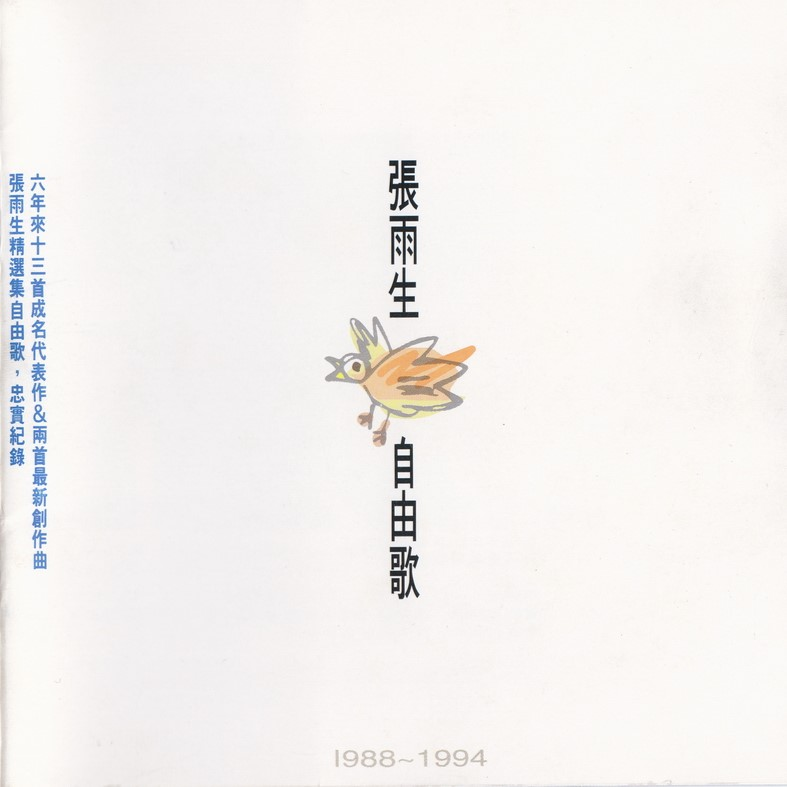

# 文案

你喜欢唱“我的未来不是梦”的张雨生  
雨生喜欢唱“带我去月球”的张雨生  
你喜欢 装扮好看一点的张雨生  
雨生喜欢 唱歌自在一点的张雨生

偶像歌手的转型很辛苦  
创作艺人的自我突破更是困难  
选择在自由日  
集结雨生六年来的作品 别具深义

时间带走许多悲欢离合  
时间也留下许多成长的痕迹  
时间的感觉 像铁轨的延伸  
回头看 往前走  
蓦然转向 弯曲成圆

向来率性天真 单纯诚挚的雨生  
满腔熟血投注于音乐  
他在乎你 关心我们身边的一切  
敏锐的心 也会歌颂生命 高唱爱情  
然而  
歌唱是一条无悔的路  
创作是生命执着的选择  
自由是最重要的

雨生说  
曾经坚持的 自始至今从未放弃  
曾经付出的 而今而后更要努力

# 1988

# 以为你都知道 & 我的未来不是梦

“六个朋友”的岁月已好远好远  
感觉却依旧那么真  
何时能再聚  
重温旧梦

-   1988 年 3 月，雨生以所属之“METAL KIDS”获第一届热门音乐大赛优胜，及最佳主唱的殊荣。
-   1988 年 5 月「六个朋友」合辑出版，收录雨生“我的未来不是梦”及“以为你都知道”
-   “我的未来不是梦"风靡台湾  
    雨生唱活了每颗跳动的心

## 以为你都知道

作词：陈家丽  
作曲：翁孝良  
编曲：陈志远  
制作：翁孝良

以为你都知道 两颗心在相互关照  
难道是我把一切想象得那么好  
以为你都知道 你对我有多么重要  
不能相信你已经从我梦里逃跑

要我如何是好 以为你都知道  
和我一样忘不了  
用感觉在拥抱

这是第一次 我听不到自己的心跳  
这是第一次 我想要留住你往日的笑  
以为你都知道

## 我的未来不是梦

作词：陈家丽  
作曲：翁孝良  
编曲：陈志远  
制作：翁孝良

你是不是像我在太阳下低头  
流着汗水默默辛苦地工作  
你是不是像我就算受了冷落  
也不放弃自己想要的生活

你是不是像我整天忙着追求  
追求一种你想不到的温柔  
你是不是像我曾经茫然失措  
一次一次徘徊在十字街头

因为我不在乎别人怎么说  
我从来没有忘记我对自己的承诺  
对爱的执着  
我知道我的未来不是梦  
我认真的过每一分钟  
我的未来不是梦  
我的心跟着希望在动

# 烈火青春

烈火青春的少年们  
如今已各有一片天地  
“METAL KIDS”那段除了书本就是唱歌的日子  
亦永不复还

-   1988 年 8 月「烈火青春」纪念专辑出版  
    收录雨生“烈火青春”及“Heaven on fire”2 首歌曲

烈火青春合辑是为纪念第一届热门音乐大赛录制  
雨生以「最佳主唱」得奖人的身份特别演出

作词：陈乐融  
作曲：陈志远  
编曲：陈志远  
制作：马兆骏  
演唱：张雨生、姚可杰、邰正宵、张启娜

沸腾的夜在跳动  
跟着摇滚的节奏  
敲打的岁月在你和我  
嘹亮的歌声在风中  
用感觉擦亮你我期待的脸庞  
用心灵温暖黑夜孤独的泪光

这一刻我将远走  
爱是我唯一所有  
外面的世界如此辽阔  
年轻的我不再回头  
用感觉擦亮你我期待的脸庞  
用心灵温暖黑夜孤独的泪光

让青春烈火燃烧永恒  
让生命闪电划过天边  
用所有热情换回时间  
让年轻的梦没有终点  
让青春烈火燃烧永恒  
让生命闪电划过天边  
向浩瀚星空许下诺言  
让年轻的心永不改变

# 和天一样高

装满自信发动引擎  
他要飞得和天一样高  
和梦一样远

-   1988 年 10 月雨生入围金龙奖「最有前途歌艺」新人奖  
    “和天一样高”收录自「天天想你」专辑

作词：陈家丽  
作曲：翁孝良  
编曲：陈志远  
制作：翁孝良

装满自信发动引擎  
向梦想直线飞行  
追过时光 超越自己  
在希望之中冲击  
我有一颗比任何人  
都还要狂热的心  
愿意接受任何一种  
最不平凡的邀请  
我要和天一样高  
寻找一种美丽的情操  
我要和天一样高  
我的未来才能看得到

# 天天想你

对雨生而言  
七白金的销售记录只是数字  
他在乎的是  
那 35 万颗热情的心、围绕的爱

-   1988 年 11 月第一张个人专辑「天天想你」出版  
    创下 35 万张的销售记录 雨生成为年度唱片风云人物

作词：陈乐融  
作曲：陈志远  
编曲：陈志远  
制作：翁孝良

当我伫立在窗前  
你愈走愈远  
我的每一次心跳  
你是否听见  
当我徘徊在深夜  
你在我心田  
你的每一句誓言  
回荡在耳边

隐隐约约闪动的双眼  
藏着你的羞怯 加深我的思念  
两颗心的交界  
你一定会看见 只要你愿意走向前

天天想你 天天问自己  
到什么时候才能告诉你  
天天想你 天天守住一颗心  
把我最好的爱留给你

# 1989

# 如果你冷 & 永远不回头

「七匹狼」  
雨生的第一部电影  
汗水交织着欢乐的美好经验

-   1989 年 3 月「七匹狼」电影原声带专辑出版  
    收录“如果你冷”、“我喜欢疯狂”、“永远不回头”和“看见”四首歌曲[^1]，且该片创下三千万的票房佳绩
-   同时雨生当选 1988 年度十大歌唱新人奖榜首

## 如果你冷

作词：杨立德  
作曲：钮大可  
编曲：陈志远  
制作：陈秀男、翁孝良

如果你冷  
我将你拥入怀中  
如果你恨  
我替你擦去泪痕  
如果你爱我  
我要向全世界广播  
如果你离开我  
我会默默地承受  
我的爱为你开启  
像白色的闪电划破天际  
我的爱为你奔驰  
像红色的血液充满身体  
我只是要你知道一件事  
就是我爱你 就是我爱你  
爱你

## 永远不回头

作词：陈乐融  
作曲：陈志远  
编曲：陈志远  
制作：陈秀男、翁孝良  
演唱：张雨生、姚可杰、邰正宵、王杰

在天色破晓之前  
我想要爬上山巅 仰望星辰  
向时间祈求永远  
当月光送走今夜  
我想要跃入海面 找寻起点  
看誓言可会改变

年轻的泪水不会白流  
痛苦和骄傲 这一生都要拥有  
年轻的心灵还会颤抖  
再大的风雨 我和你也要向前冲

永远不回头 不管天有多高  
忧伤和寂寞 感动和快乐  
都在我心中  
永远不回头 不管路有多长  
黑暗试探我 烈火燃烧我  
都要去接受 永远不回头

# 没有烟抽的日子

雨生用他歌声  
为天安门前争自由的斗士  
加油打气！！

1989 年 8 月雨生即将入伍服役暂别歌坛

-   1989 年 6 月 雨生告别学生生涯，自政治大学外交系毕业
-   “没有烟抽的日子”一曲，是雨生为六四学运而作，词出自学运斗士王丹之手。后收录在「想念我」专辑里
-   1989 年 7 月第二张个人专辑「想念我」出版  
    再创佳绩，成为临别歌迷的献礼
-   1989 年 8 月，入伍服役

作词：王丹  
作曲：张雨生  
编曲：陈志远  
制作：翁孝良

没有烟抽的日子  
没有烟抽的日子  
我总不在你身旁  
而我的心里一直以你  
为我的唯一的 唯一的一份希望

天黑了 路无法延续到黎明  
我的思念一条条铺在 那个灰色小镇的街头  
你们似乎不太喜欢没有蓝色的鸽子飞翔

手里没有烟那就划一根火柴吧  
去抽你的无奈  
去抽那永远无法再来的一缕雨丝  
手里没有烟那就划一根火柴吧  
去抽你的无奈  
去抽那永远无法再来的一缕雨丝

在你想起了我后  
又没有烟抽的日子哦！

# 1992

# 湖心草深长

退伍后  
雨生赴美洛杉矶  
埋首音乐创作  
向创作歌手的目标迈进

1991 年 6 月雨生退伍  
1992 年 2 月「张雨生创作专辑 - 带我去月球」出版  
音乐制作、词曲创作全由雨生一手包办

作词：张雨生  
作曲：张雨生  
制作：张雨生

守着春天的火焰  
笑问天上的云霞  
我该不该细细想她  
疏星几点新月淡  
路上没有夜行人  
我该不该细细想她  
看我不喜也不悲  
她急得慌  
我想这样告诉她  
湖心草深长  
我心无处藏  
不避夏日的酷热  
骑车顶着艳阳天  
我该不该轻轻问她  
凡路总会有尽头  
凡人总要有归向  
我该不该轻轻问她

# 带我去月球

面对全世界救地球  
的环保行动  
雨生尽一己之力  
用歌声传送

-   1992 年 7 月「带我去月球」MTV 代表亚洲区入围 1992 全美音乐录影带奖

作词：张雨生  
作曲：张雨生  
Live 演出 制作：张雨生

走 带我走  
走出空气污染的地球  
走 带我走  
走出纷争喧扰的生活  
因为漫天黑烟  
腐蚀掉我的梦  
因为征战杀伐  
我就快要没有朋友  
不求轩 不求冕  
不为这红尘所囚

带我去月球 那里空气稀薄  
带我去月球 充满原始坑洞  
带我去月球 重力轻浮你我  
挣扎在一片荒漠 也不见嫦娥相从  
但我要背向地球 希望寄托整个宇宙

走 带我走  
看我虚步玲珑蹑星空  
走 带我走  
我爱醉卧亭台作风流  
不敢笑傲五洲  
也不愁天地悠悠  
只是狂歌一曲  
恍惚间就化入无穷  
将进酒 杯莫停  
人生不过一场大梦

看看我的瞳孔  
还燃不燃烧焰火  
看看我的笑容  
是不是还保有自我  
下弦月 上弦月  
就让我被月蚀吞没

# 我是一颗秋天的树 & 大海

无忧无愁的岁月已远  
笃定的眼神  
眉梢的轻愁  
雨生真的长大了

-   1992 年 12 月第四张个人专辑「大海」出版  
    销售突破六白金，并入围金曲奖

## 我是一颗秋天的树

作词：许常德  
作曲：陈志远  
编曲：陈志远  
制作：张雨生

我是一棵秋天的树  
稀少的叶片显得有些孤独  
偶尔燕子会飞到我的肩上  
用歌声描述这世界的匆促

我是一棵秋天的树  
枯瘦的枝干少有人来停驻  
曾有对恋人在我胸膛刻字  
我弯不下腰无法看清楚

我是一棵秋天的树  
时时仰望天等待春风吹拂  
但是季节不曾为我赶路  
我很有耐心不与命运追逐

我是一棵秋天的树  
安安静静守着小小疆土  
眼前的繁华我从不羡慕  
因为最美的在心不在远处

## 大海

作词：陈大力  
作曲：陈大力 陈秀男  
编曲：Ricky Ho  
制作：陈秀男

从那遥远海边 慢慢消失的你  
本来模糊的脸 竟然渐渐清晰  
想要说些什么 又不知从何说起  
只有把它放在心底

茫然走在海边 看那潮来潮去  
徒劳无功 想把每朵浪花记清  
想要说声爱你 却被吹散在风里  
猛然回头你在那里

如果大海能够唤回曾经的爱  
就让我用一生等待  
如果深情往事你已不再留恋  
就让它随风飘远

如果大海能够带走我的哀愁  
就像带走每条河流  
所有受过的伤  
所有流过的泪  
我的爱  
请全部带走

# 1993

# 一天到晚游泳的鱼

如果音乐是大海  
雨生愿是  
一天到晚游泳的鱼

-   1993 年 4 月参加舞台剧「淡水小镇」的演出
-   1993 年 6 月第五张个人专辑「一天到晚游泳的鱼」出版

作词：许常德  
作曲：陈复明  
编曲：陈志远  
制作：陈复明、张雨生

情愿困在你怀中 困在你温柔  
不想一个人寂寞 无边漂泊  
就像鱼儿水里游 你的心河流向我  
不眠不休的追求

一天到晚游泳的鱼啊 鱼不停游  
一天到晚想你的人啊 爱不停休  
从来不想回头 不问天长地久  
因为我的爱覆水难收

多少喜乐在心中 慢慢游  
多少忧愁不肯走 流向心头  
就像鱼儿水里游 永远不会问结果  
他们知道爱情没尽头

一天到晚游泳的鱼啊 鱼不停游  
一天到晚想你的人啊 爱不停休  
沧海多么辽阔 再也不能回首  
只要你心里永远留我

合音：  
鱼儿鱼儿（鱼儿）水中游  
游来游去啊乐悠悠  
鱼儿鱼儿（鱼儿）慢慢游

# 1994

# 自由歌 & 爱从不轻易的来

你喜欢什么样的雨生？！  
雨生喜欢什么样的自己  
自由自在  
创作音乐的张雨生

1994 年 1 月创作曲“自由歌”、“爱从不轻易的来”完成，展现摇滚新味的张雨生，同时「张雨生精选集自由歌」出版。

## 自由歌

作词：张雨生  
作曲：张雨生  
编曲：王继康  
Drum Programming：徐德昌  
制作：张雨生  
和声：张雨生  
GT：江建民

你不能这样控制我的手  
你不能这样控制我的脚  
你不能这样控制我的口  
你不能这样做  
我有一点无聊我有一点寂寞  
但我有一个念头要报给你们说  
我已经二十多生活还不愁  
但我有一个念头你们还没有听说  
哔...叭啦啦 哔...叭剥列  
哔...叭啦列 哔哔叭贝剥  
我闲了就工作我累了就出游  
我非常讨厌去堵车的台北市街头  
我大学有念过 ABC 看得懂  
我从来不敢选假日的时候逛百货  
哔...叭啦啦 哔...叭剥列  
哔...叭啦列 哔哔叭贝剥

我不跳迪斯科却流连在吧台  
我不赌六合彩却爱帮人猜明牌  
我不看打棒球却骂别人很菜  
我不想受束缚只要自由自在  
哔...叭啦啦 哔...叭剥列  
哔...叭啦列 哔哔叭贝剥  
政治是什么民主怎么作  
看你服气不服气 51 比 49  
国语和台语 闽南或河洛  
看你在意不在意那些古老的传统  
哔...叭啦啦 哔...叭剥列  
哔...叭啦列 哔哔叭贝剥

## 爱 从不轻易的来

作词：张雨生  
作曲：张雨生  
编曲：王继康  
制作：张雨生  
GT：江建民  
和声：李鼎慧、林咪咪、杨新玲、林一平、刘明德、张雨生  
特殊音效：小 K

爱 从不轻易的来  
从不轻易走开  
直到你明白  
我从不轻易的爱  
从不轻言 要离开

晨曦的美就是一种爱  
把东方的天空挥洒真纯光彩  
雨中的音乐也是一种爱  
万物都跟着她的节奏而摇摆  
四季的和风就是一种爱  
把千百的情味吹进你我心海  
深蓝的星夜也是一种爱  
万物都躺进月光温柔的胸怀

# 雨生的话

我对音乐其实并没有很特别的感觉。

只是，有的时候，我突然因某段乐音而得到慰解；有的时候，我仿佛能与某些小节灵犀相通；有的时候，我身体的某一部份似乎也同样起了与那位歌者类似的悸动或什么的，我也不太能抓得准。大概是情绪累积到一定程度，就容易进入那个浑然忘我的境界吧！

好比说，我很能体会唱高音的歌者，他们一字一句用的情用的力，甚至在拔高的当头牵动了那几条神经，转音的使腔里付出了多少的情感，我很能体会。在心灵神会、水乳交融同时，也舒放了压抑心底的千头万绪。这是音乐带给我的，我也一直期望能经由自己的放射，带给其它的人。虽然作音乐始终有沉重的市场压力，我个人闭门造车的努力不见得青睐于所有人，但我相信时间终会让“凯萨的归凯萨”。

如今的红尘，不过是将来的旧梦，以前，我常在云淡风清与万古留芳这两个人生信念中犹疑不决。现在好歹在万古留芳的门槛边，有了一个起跑的位置，接下来可以立德立言、也可以晚节不保，可以毕其功名实相符、也可以小差池遗臭后世，要怎么收获，先那么栽，不是吗！

「我不能带着鞘儿，翁翁央央的替人家飞；不能叫人家系在竹竿头上，赚一把小米！」这是胡适先生二十多岁的豪气。想想自己，前有三十大关排山倒海沛然莫之能御，后是一二十年弃我去我不可复追，立志固容易，要以冲百米的速度持续恐怕难免气喘一下；不过，我会坚持下去，很多人都在坚持着，直到更自由的天空向我们召以蔚蓝，更至高的情感向我们寓以纯真，我们绝不罢手！

现代人的通病是：得来不易的，极尽贪婪；行将绝迹的，极尽慌乱；名著于外的，极尽逢迎；利字当头的，暗通款曲。你想同其流吗？你正合其污吗？……

「多少英雄事，尽付笑谈中」！

张雨生于阳明山“无不痴斋”

民国八十三年一月七日

# 制作团队

飞碟唱片

|   负责   |  人员 / 工作室   |
| :------: | :--------------: |
|   发行   |      吴楚楚      |
|   监制   |      彭国华      |
|   统筹   |      陈大力      |
|   策划   |      彭素秋      |
|   文案   |  张方露、陈秀生  |
| 制作协力 |      杨新玲      |
|   录音   |   小 K、王秉皇   |
|   混音   |       小 K       |
|  录音室  |  白金、Hit Zone  |
| 视觉设计 |   李明道工作室   |
| 专案执行 | 飞碟国语事业一处 |

飞碟企业股份有限公司 1994 年 1 月出版  
Ⓟ1994 飞碟企业股份有限公司  
Ⓒ1994 飞碟企业股份有限公司

# 专辑扫描

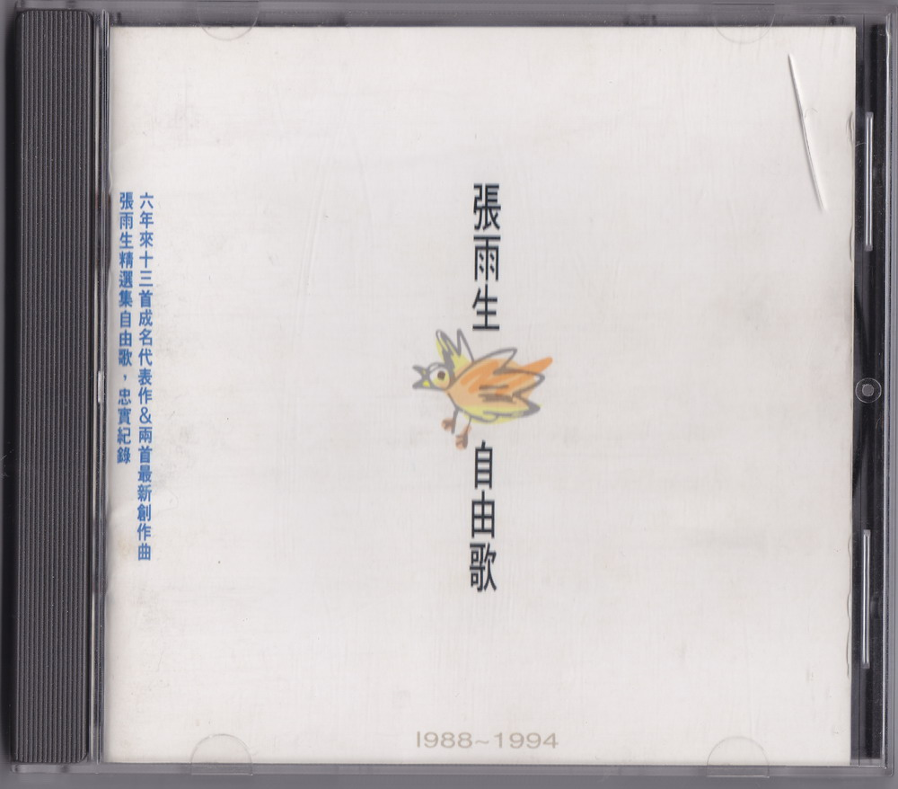

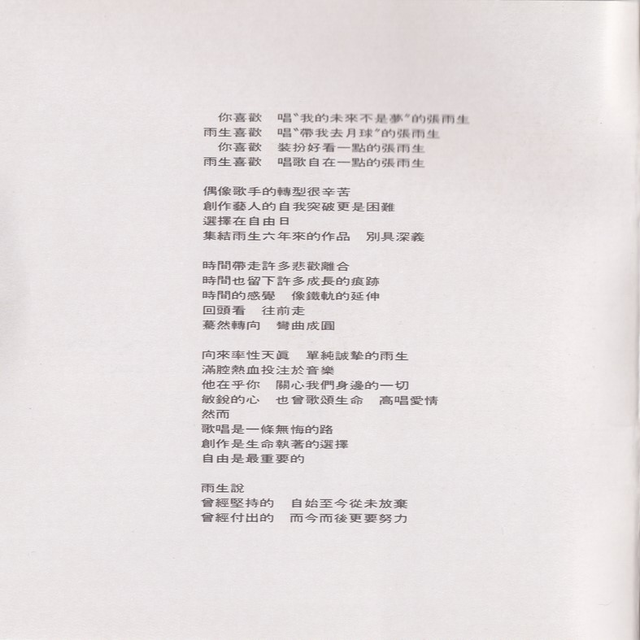

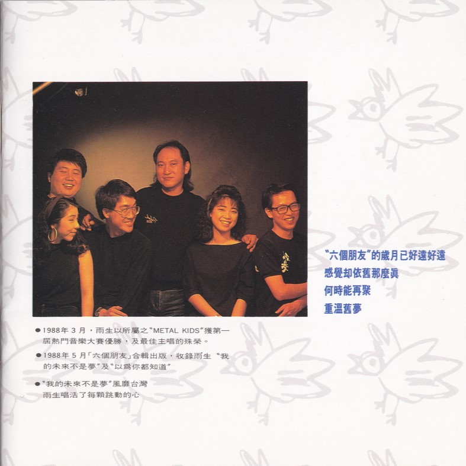

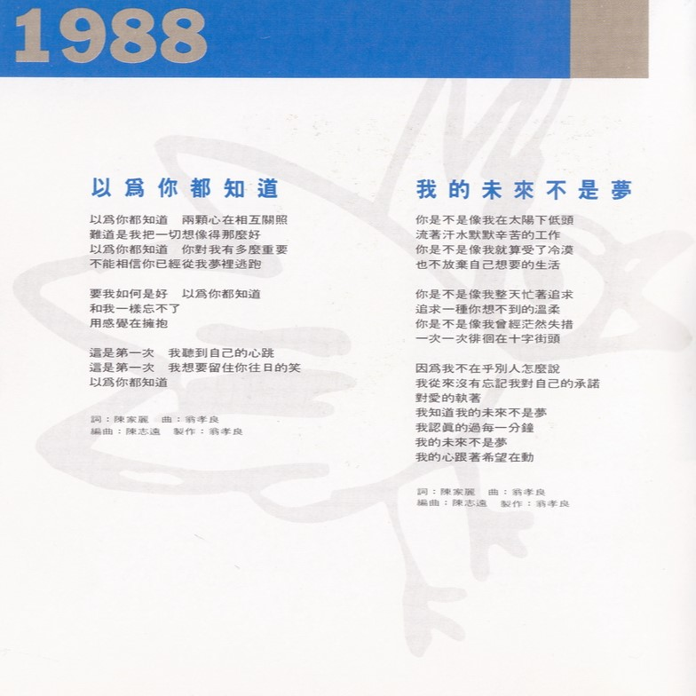

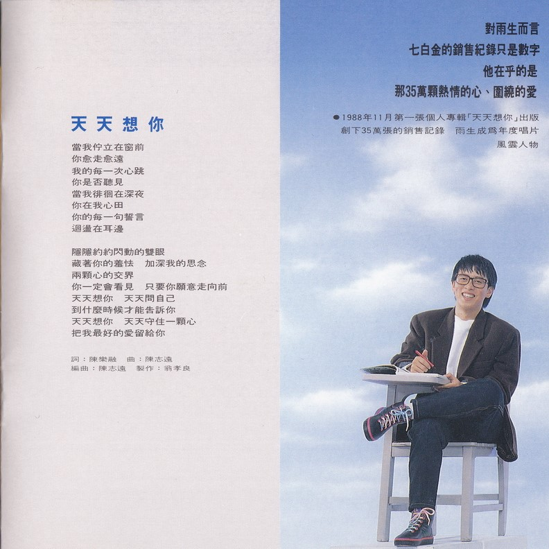

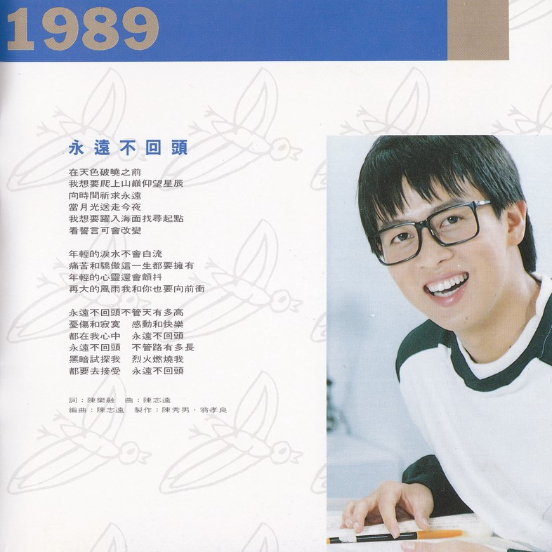

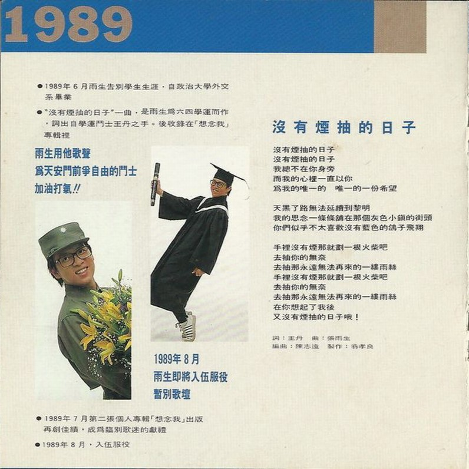

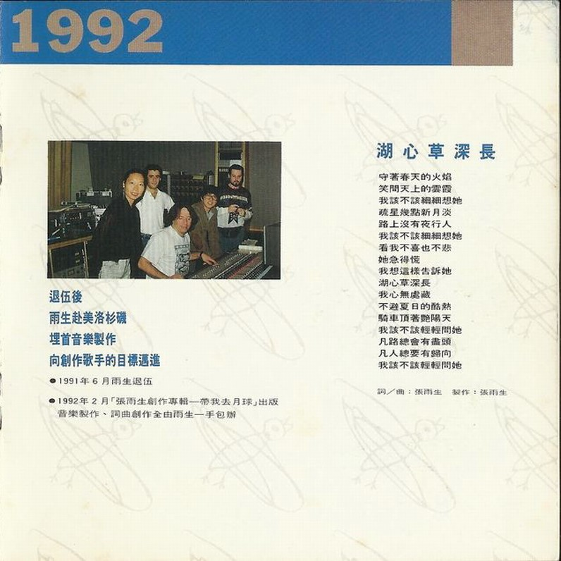

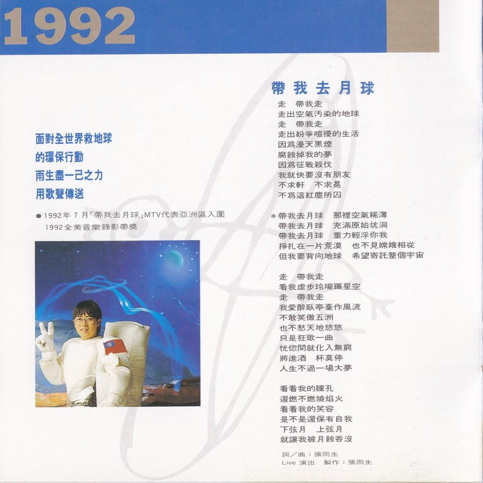

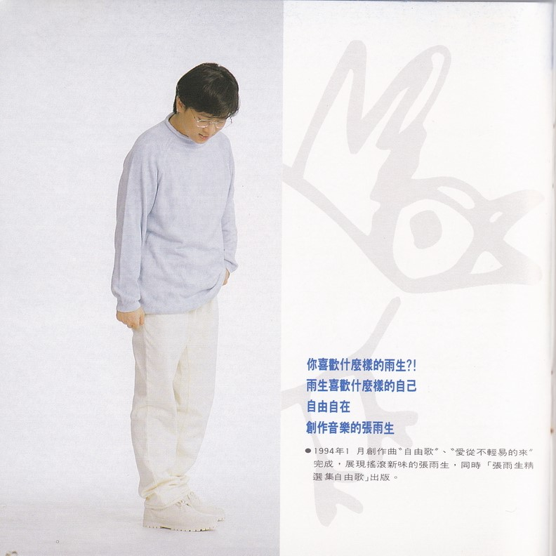

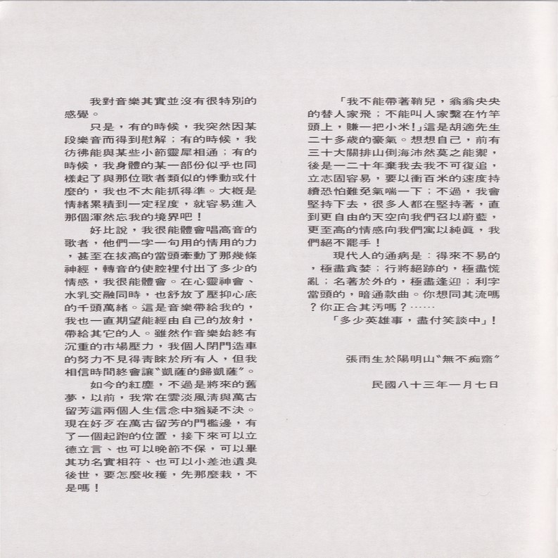

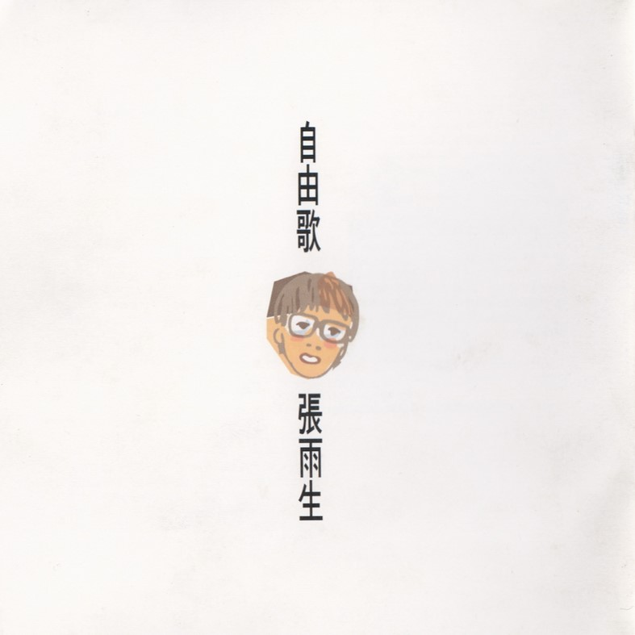

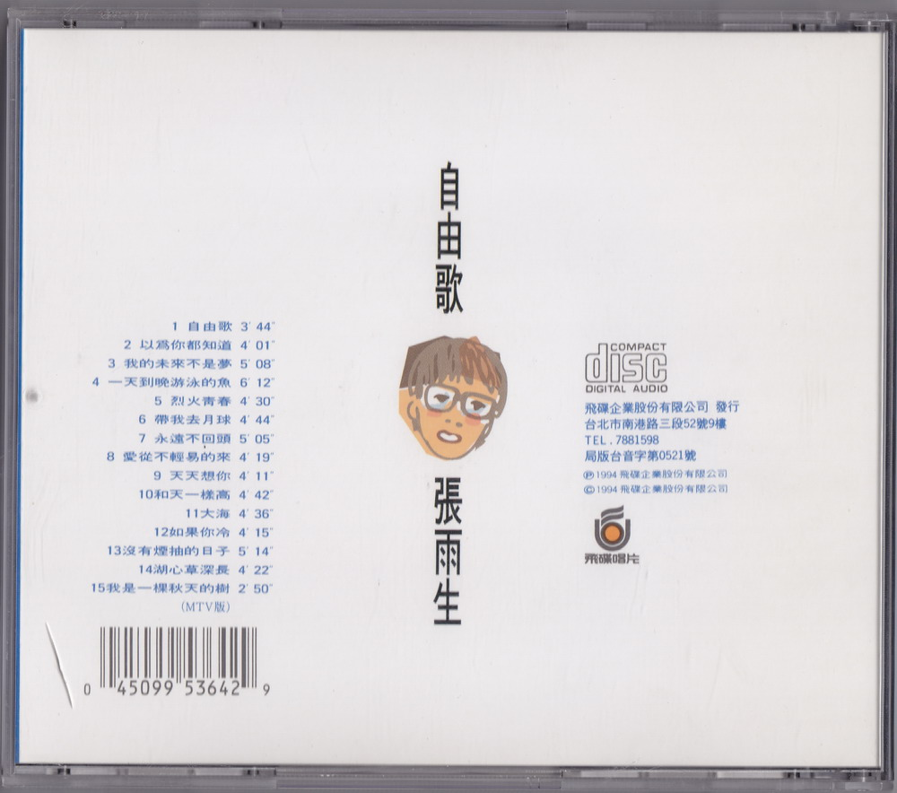

整理：健健、郈斐  
校对：向晚

当前页面缺陷：

1. 「没有烟抽的日子」和「湖心草深长」图片不够清晰
2. 发行时间维基百科和 tomchang.cn 冲突了

[^1]: 歌词本中少写了一首，张雨生演唱的《看见》也收录在「七匹狼」电影原声带专辑中。
