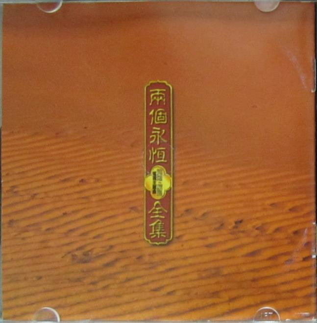
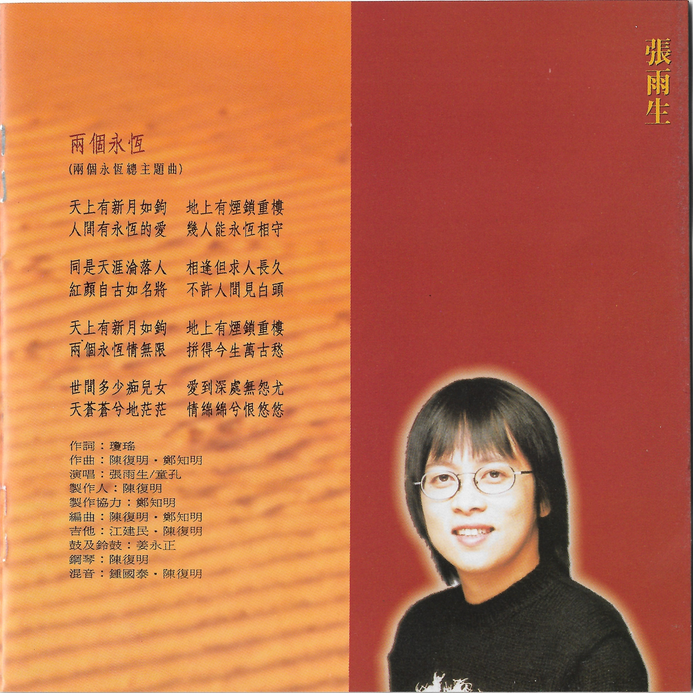

# 两个永恒电视主题曲全集

# 两个永恒

天上有新月如钩 地上有烟锁重楼  
人间有永恒的爱 几人能永恒相守

同是天涯沦落人 相逢但求人长久  
红颜自古如名将 不许人间见白头

天上有新月如钩 地上有烟锁重楼  
两个永恒情无限 拼得今生万古愁

世间多少痴儿女 爱到深处无怨尤  
天苍苍兮地茫茫 情绵绵兮恨悠悠

作词：琼瑶  
作曲：陈复明、郑知明  
演唱：张雨生、童孔  
制作人：陈复明  
制作协力：郑知明  
编曲：陈复明、郑知明  
吉他：江建民、陈复明  
鼓及铃鼓：姜永正  
钢琴：陈复明  
混音：钟国泰、陈复明

# 专辑照片

