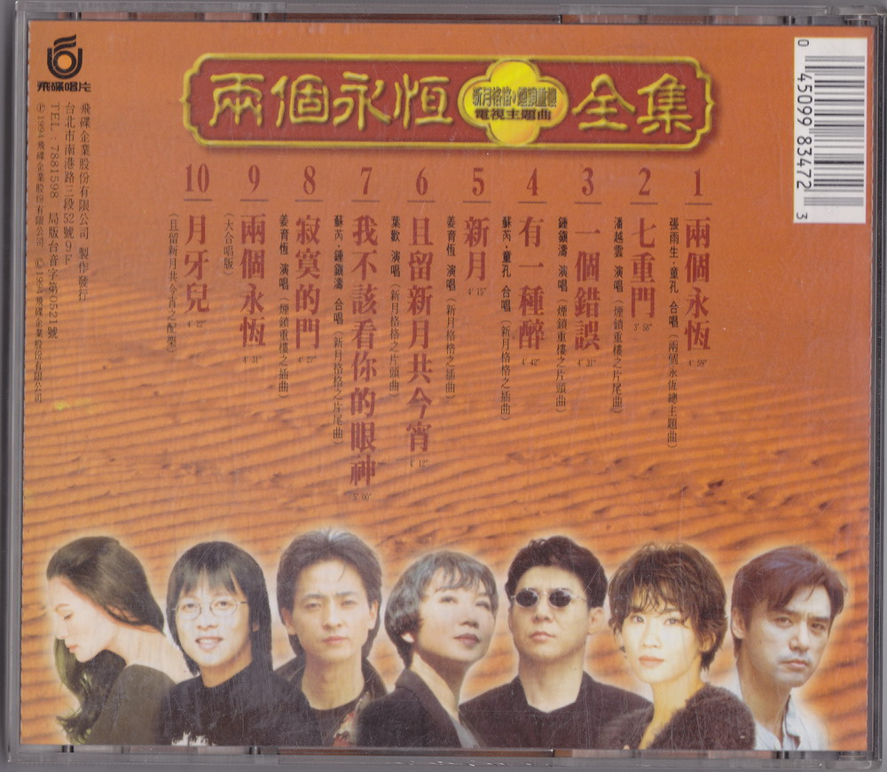

# 两个永恒电视主题曲全集

# 两个永恒

作词：琼瑶  
作曲：陈复明、郑知明  
编曲：陈复明、郑知明

天上有新月如钩  
地上有烟锁重楼  
人间有永恒的爱  
几人能永恒相守

同是天涯沦落人  
相逢但求人长久  
红颜自古如名将  
不许人间见白头

天上有新月如钩  
地上有烟锁重楼  
两个永恒情无限  
拼得今生万古愁

世间多少痴儿女  
爱到深处无怨尤  
天苍苍兮地茫茫  
情绵绵兮恨悠悠

# 专辑照片

当前页面缺陷：

1. 没有歌词本的扫描
