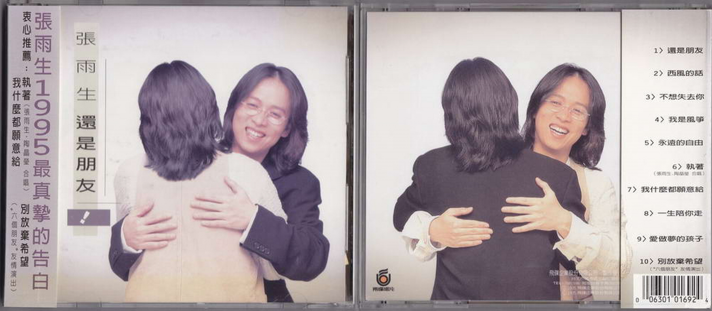
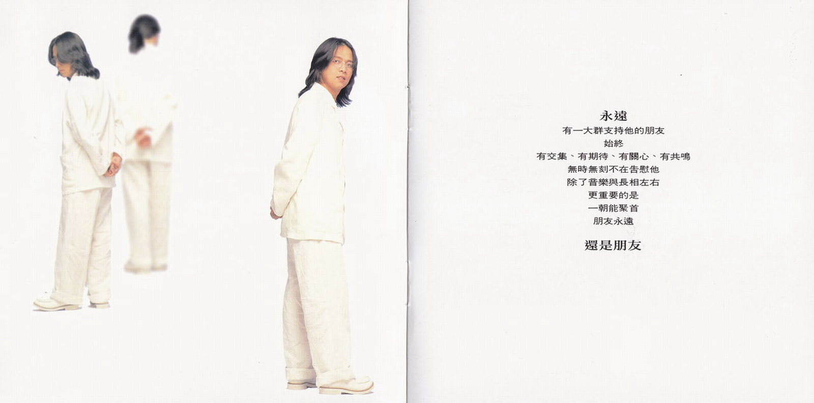
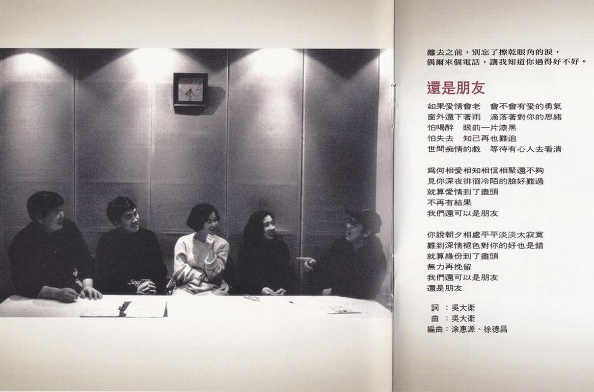
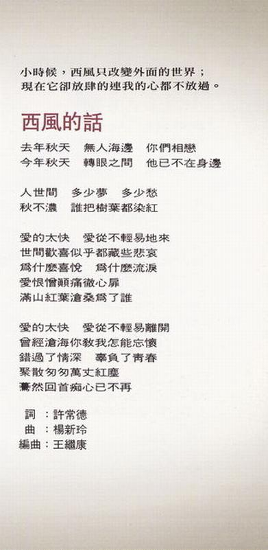
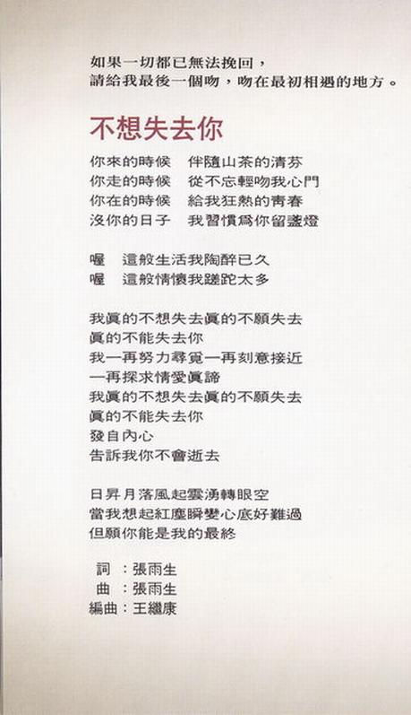
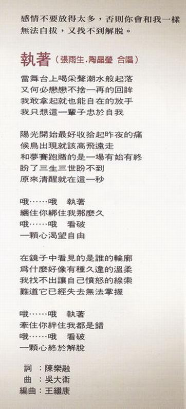
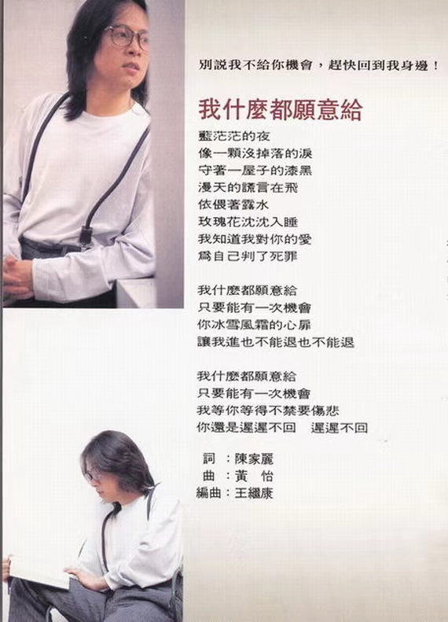
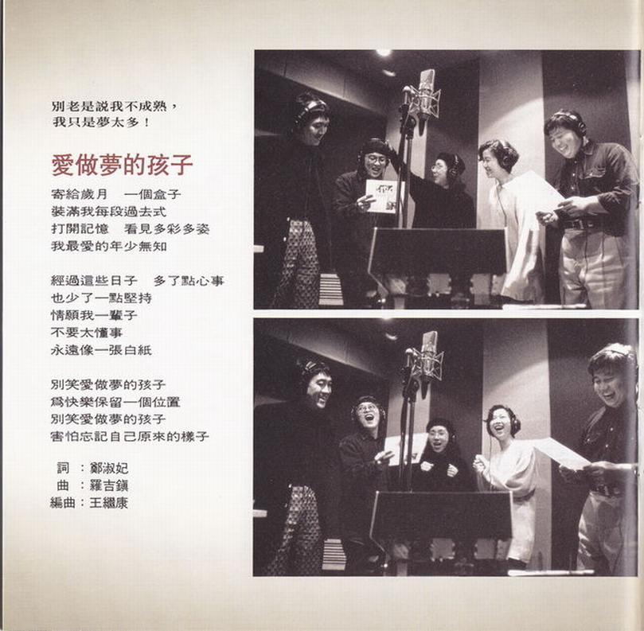
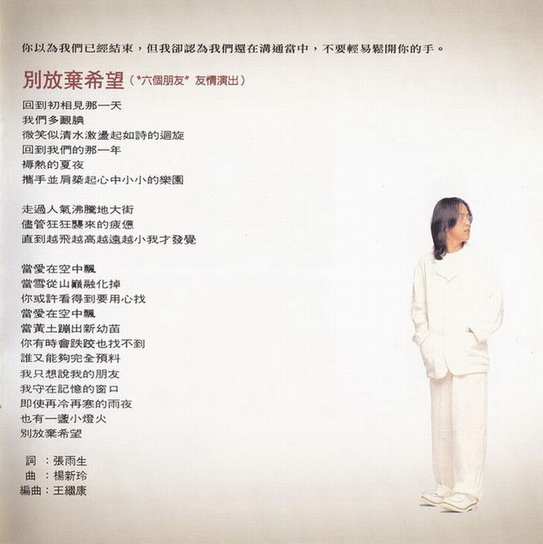
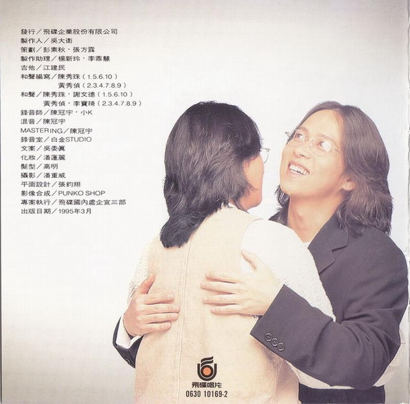

# 还是朋友

# 文案

**张雨生 1995 最真挚的告白**

**衷心推荐：**  
- **执着**（张雨生，陶晶莹 合唱）  
- **别放弃希望**（“六个朋友”友情演出）  
- **我什么都愿意给**

**永远**  
有一大群支持他的朋友  
始终  
有交集、有期待、有关心、有共鸣  
无时无刻不在告慰他  
除了音乐与长相左右  
更重要的是  
一朝能聚首  
朋友永远  
**还是朋友**

**张雨生**  
一个挣扎在理想与现实夹缝中的歌手  
总在他朗朗的笑里  
不经意发现一股笃定与执着的神采  
即使曾经笼罩在矛盾和冲突的氤氲之中  
但他从不低头

**我们**  
看到他正迂回步入自己的天空  
当然  
欣喜之余别忘了给他更多的掌声  
那是他由衷的冀望  
也是大家热切企盼的张雨生

# 还是朋友

0630-10169-2-01

作词：吴大卫  
作曲：吴大卫  
编曲：涂惠源，徐德昌  
MV 导演：陈怡君

## 导引

离去之前，别忘了擦干眼角的泪，  
偶尔来个电话，让我知道你过得好不好。

## 歌词

如果爱情会老 会不会有爱的勇气  
窗外还下着雨 滴落着对你的思绪  
怕喝醉 眼前一片漆黑  
怕失去 知己再也难追  
世间痴情的戏 等待有心人去看清

为何相爱相知相信相聚还不够  
见你深夜徘徊冷陌的脸好难过  
就算爱情到了尽头 不再有结果  
我们还可以是朋友

你说朝夕相处平平淡淡太寂寞  
难道深情褪色对你的好也是错  
就算缘份到了尽头 无力再挽留  
我们还可以是朋友 还是朋友

# 西风的话

0630-10169-2-02

作词：许常德  
作曲：杨新玲  
编曲：王继康

## 导引

小时候，西风只改变外面的世界；  
现在它却放肆的连我的心都不放过。

## 歌词

去年秋天 无人海边 你们相恋  
今年秋天 转眼之间 他已不在身边  

人世间 多少梦 多少愁  
秋不浓 谁把树叶都染红

爱的太快 爱从不轻易地来  
世间欢喜似乎都藏些悲哀  
为什么喜悦 为什么流泪  
爱恨憎颠痛彻心扉  
满山红叶沧桑为了谁

爱的太快 爱从不轻易离开  
曾经沧海你教我怎能忘怀  
错过了情深 辜负了青春  
聚散匆匆万丈红尘  
蓦然回首痴心已不再

# 不想失去你

0630-10169-2-03

作词：张雨生  
作曲：张雨生  
编曲：王继康

## 导引

如果一切都已无法挽回，  
请给我最后一个吻，吻在最初相遇的地方。

## 歌词
你来的时候 伴随山茶的清芬  
你走的时候 从不忘轻吻我心门  
你在的时候 给我狂热的青春  
没你的日子 我习惯为你留盏灯  

喔 这般生活我陶醉已久  
喔 这般情怀我蹉跎太多

我真的不想失去 真的不愿失去  
真的不能失去你  
我一再努力寻觅 一再刻意接近  
一再探求情爱真谛  
我真的不想失去 真的不愿失去  
真的不能失去你  
发自内心 告诉我你不会逝去

日升月落风起云涌转眼空  
当我想起红尘瞬变心底好难过  
但愿你能是我的最终

# 我是风筝

0630-10169-2-04

作词：郑智化  
作曲：郑智化  
编曲：王继康

## 导引

我想剪断那根线，让自己飘得更远，  
即时会支离破碎，至少也是心甘情愿。

## 歌词

我是风筝 喜欢在天空飞行  
无忧无虑 像风儿一样地轻  
我要飞过 梦和自由的边境  
去找一找 找回我单纯的心

我是风筝 有一根线在牵引  
害怕约定 却又放不开感情  
游游荡荡 也许是我的命运  
孤孤单单 没有人陪我同行

我是风筝 高高地飞  
我是风筝 天南地北  
一生注定不能后悔  
没有人管没有人陪

我是风筝 高高地飞  
我是风筝 我无所谓  
青春注定短暂凄美  
风停之后就要坠毁

# 永远的自由

0630-10169-2-05

作词：李子恒  
作曲：吴大卫  
编曲：王继康

## 导引

别问我什么是永远的自由，  
因为你必须先真正的去爱过。

## 歌词

因为寂寞所以有些温柔  
在你眼中感动在我心头  
因为有爱所以有些心痛  
燃烧生活堆积醒过的梦

荡漾的往事还活在胸口  
感觉温柔感觉心痛感觉飘泊  
陈年的眼泪是灵魂的酒  
干杯失去干杯拥有干杯你我

永远的自由 永远的歌  
悲伤快乐握的都是这双手  
永远你和我 永远的梦  
不分日夜总有一条漫长的路让爱走  
现实和梦想之间 欢笑和泪水边缘  
我的爱一如从前 我选择永远

# 执着（张雨生，陶晶莹 合唱）

0630-10169-2-06

作词：陈乐融  
作曲：吴大卫  
编曲：王继康  
MV 导演：张荣贵

## 导引

感情不要放得太多，否则你会和我一样  
无法自拔，又找不到解脱。

## 歌词

当舞台上喝采声潮水般起落  
又何必恋恋不舍一再的回眸  
我敢拿起就也能自在的放手  
我只想这一辈子忠于自我

阳光开始最好收拾起昨夜的痛  
候鸟出现就该高飞远走  
和梦赛跑赌的是一场有始有终  
盼了三生三世盼不到  
原来清醒就在这一秒

哦……哦 执着  
捆住你绑住我那么久  
哦……哦 看破  
一颗心渴望自由

在镜子中看见的是谁的轮廓  
为什么好像有种久违的温柔  
我找不出让自己愤怒的线索  
难道它已经失去无法掌握

哦……哦 执着  
牵住你绊住我都是错  
哦……哦 看破  
一颗心终于解脱

# 我什么都愿意给

0630-10169-2-07

作词：陈家丽  
作曲：黄怡  
编曲：王继康

## 导引

别说我不给你机会，赶快回到我身边！

## 歌词

蓝茫茫的夜 像一颗没掉落的泪  
守着一屋子的漆黑 漫天的谎言在飞  
依偎着露水 玫瑰花沉沉入睡  
我知道我对你的爱 为自己判了死罪

我什么都愿意给 只要能有一次机会  
你冰雪风霜的心扉  
让我进也不能退也不能退  

我什么都愿意给 只要能有一次机会  
我等你等得不禁要伤悲  
你还是迟迟不回 迟迟不回

# 一生陪你走

0630-10169-2-08

作词：星期三  
作曲：钱幽兰  
编曲：王继康

## 导引

永远是什么？  
对我来说，这辈子已经足够，  
不必再多作生生世世的承诺。

## 歌词

在梦里总是好 我想你一定知道  
说谎的声音听起来很甜美  
我不想欺骗你的眼泪  

在心里总是好 我想你不会知道  
爱过的恋人才能够体会  
梦中见不如藏在心扉

一生陪你走 一生为你执着  
在你的情海看我被淹没  
一生陪你走 一生永远不够  
我无怨无悔爱你到最后

# 爱做梦的孩子

0630-10169-2-09

作词：郑淑妃  
作曲：罗吉镇  
编曲：王继康

## 导引

别老是说我不成熟，  
我只是梦太多！

## 歌词

寄给岁月 一个盒子  
装满我每一段[^1] 过去式  
打开记忆 看见多彩多姿  
我最爱的年少无知

经过这些日子 多了点心事  
也多[^2]了一点坚持  
情愿我一辈子 不要太懂事  
永远像一张白纸

别笑爱做梦的孩子  
为快乐保留一个位置  
别笑爱做梦的孩子  
害怕忘记自己原来的样子

经过这些日子 多了点心事  
也少了一点坚持  
情愿我一辈子 不要太懂事  
永远像一张白纸

# 别放弃希望（“六个朋友”[^3]友情演出）

0630-10169-2-10

作词：张雨生  
作曲：杨新玲  
编曲：王继康

## 导引

你以为我们已经结束，但我却认为我们还在沟通当中，不要轻易松开你的手。

## 歌词

回到初相见那一天  我们多腼腆  
微笑似清水激荡起如诗的回旋  
回到我们的那一年  褥热的夏夜  
携手并肩筑起心中小小的乐园  
走过人气沸腾的[^4]大街  
尽管狂狂袭来的疲惫  
直到越飞越高越远越小我才发觉

当爱在空中飘  当雪从山巅融化掉  
你或许看得到要用心找  
当爱在空中飘  当黄土蹦出新幼苗  
你有时会跌跤也找不到  
谁又能够完全预料

我只想说我的朋友 我守在记忆的窗口  
即使再冷再寒的雨夜 也有一盏小灯火   
别放弃希望

# 制作团队

发行：飞碟企业股份有限公司  
制作人：吴大卫  
策划：彭素秋，张方露  
制作助理：杨新玲，李鼎慧  
吉他：江建民  
和声编写：陈秀珠（1.5.6.10），黄秀侦（2.3.4.7.8.9）  
和声：陈秀珠，谢文德（1.5.6.10），黄秀侦，李宝琦（2.3.4.7.8.9）  
录音师：陈冠宇，小 K  
混音：陈冠宇  
MASTERING：陈冠宇  
录音室：白金 STUDIO  
文案：吴委真  
化妆：潘莲丽  
发型：高明  
摄影：潘重威  
平面设计：张钧翔  
影像合成：PUNKO SHOP  
专案执行：飞碟国内处企宣三部  
出版日期；1995 年 3 月

飞碟唱片  
0630 10169-2

整理：向晚  
校对：露水

[^1]: 歌词本显示“每段”
[^2]: 歌词本显示“少”，雨生第一段唱的是“多”
[^3]: 六个朋友：一起到飞碟唱片的另外 6 位新人，分别是：娃娃，纽大可，孙向莹，陈本瑜，知己二重唱（曾宝明，吴志华），曾于 1988 年 5 月共同出过一张专辑《6 个朋友》
[^4]: 歌词本显示“地”