# 白色才情

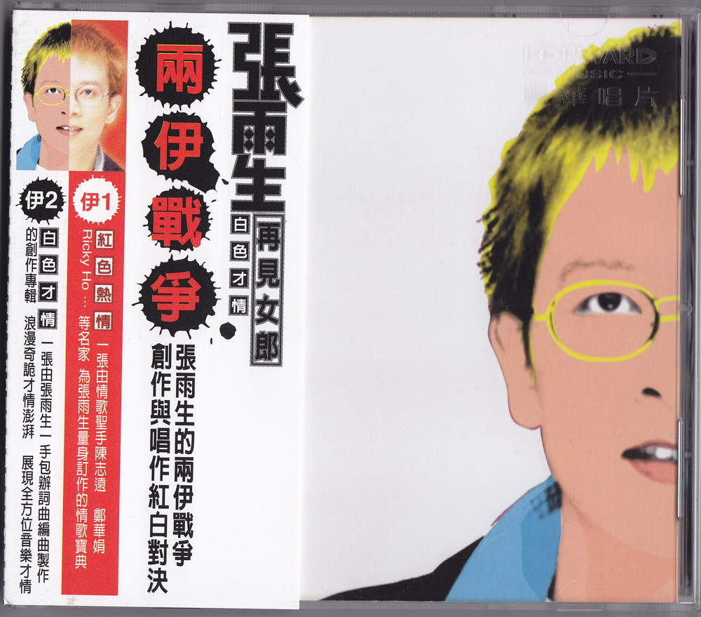

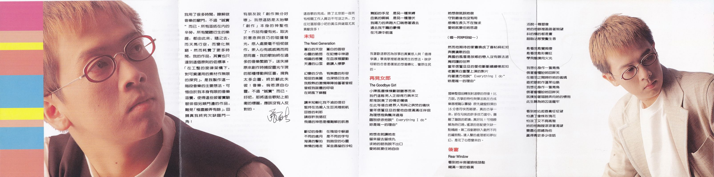

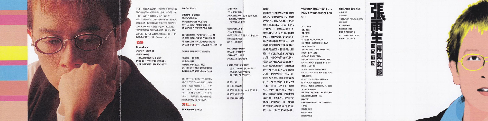

# 文案

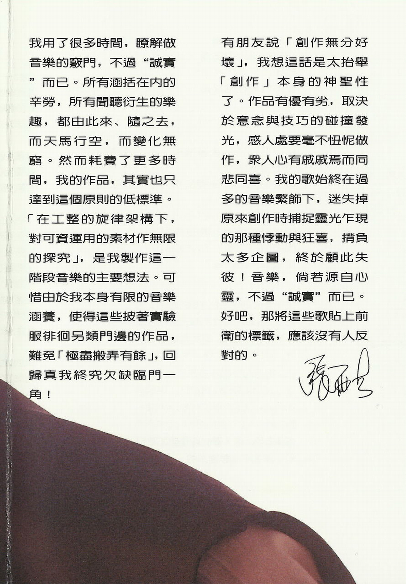

我用了很多时间，了解做音乐的窍门，不过“诚实”而已。所有涵括在内的辛劳，所有闻听衍生的乐趣都由此来、随之去，而天马行空，而变化无穷。然而耗费了更多时间，我的作品，其实也只达到这个原则的低标准。「在工整的旋律架构下，对可资运用的素材作无限的探究」，是我制作这一阶段音乐的主要想法。可惜由于我本身有限的音乐涵养，使得这些披着实验服徘徊另类门边的作品，难免「极尽搬弄有余」，回归真我终究欠缺临门一角！

有朋友说「创作无分好坏」，我想这话是太抬举「创作」本身的神圣性了。作品有优有劣，取决于意念与技巧的碰撞发光，感人处要毫不忸怩做作，众人心有戚戚焉而同悲同喜。我的歌始终在过多的音乐繁饰下，迷失掉原来创作时捕捉灵光乍现的那种悸动与狂喜，背负太多企图，终于顾此失彼！音乐，倘若源自心灵，不过"诚实"而已。好吧，那将这些歌贴上前卫的标签，应该没有人反对的。

张雨生

# 未知 (The Next Generation)

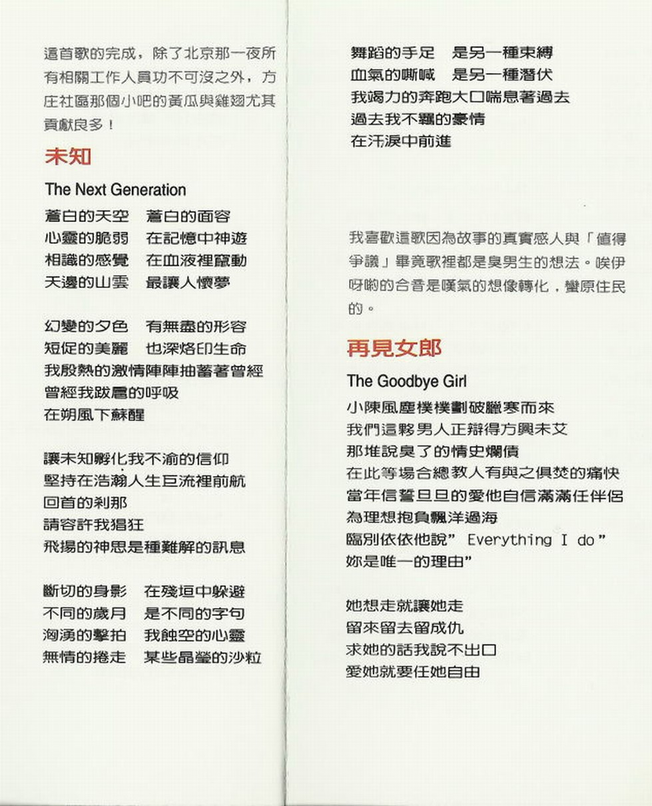

## 导引

这首歌的完成，除了北京那一夜所有相关工作人员功不可没之外，方庄社区那个小吧的黄瓜与鸡翅尤其贡献良多！

## 歌词

苍白的天空 苍白的面容  
心灵的脆弱 在记忆中神游  
相识的感觉 在血液里窜动  
天边的山云 最让人怀梦

幻变的夕色 有无尽的形容  
短促的美丽 也深烙印生命  
我殷热的激情阵阵抽蓄着曾经  
曾经我跋扈的呼吸  
在朔风下苏醒

让未知孵化我不渝的信仰  
坚持在浩瀚人生巨流里前航  
回首的刹那  
请容许我猖狂  
飞扬的神思 是种难解的讯息

断切的身影 在残垣中躲避  
不同的岁月 是不同的字句  
汹涌的击拍 我蚀空的心灵  
无情的卷走 某些晶莹的沙粒

舞蹈的手足 是另一种束缚  
血气的嘶喊 是另一种潜伏  
我竭力的奔跑大口喘息着过去  
过去我不羁的豪情  
在汗泪中前进

# 再见女郎 (The Goodbye Girl)

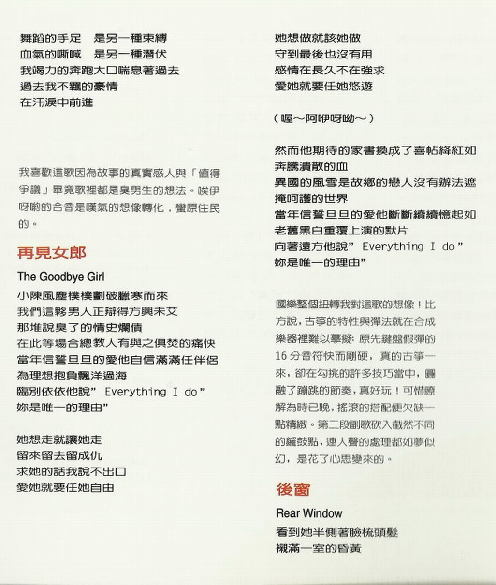

## 导引

我喜欢这歌因为故事的真实感人与「值得争议」毕竟歌里都是臭男生的想法。唉伊呀呦的合音是叹气的想像转化，蛮原住民的。

## 歌词

小陈风尘仆仆划破腊寒而来  
我们这伙男人正辩得方兴未艾  
那堆说臭了的情史烂债  
在此等场合 总教人有与之俱焚的痛快  
当年信誓旦旦的爱他自信满满任伴侣  
为理想抱负飘洋过海  
临别依依他说“Everything I do”  
妳是唯一的理由”

她想走就让她走  
留来留去留成仇  
求她的话我说不出口  
爱她就要任她自由

她想做就该她做  
守到最后也没有用  
感情在长久不在强求  
爱她就要任她悠游

（喔～阿咿呀呦～）

然而他期待的家书换成了喜帖绛红如  
奔腾溃散的血  
异国的风雪是故乡的恋人没有办法遮  
掩呵护的世界  
当年信誓旦旦的爱他断断续续忆起如  
老旧黑白重复上演的默片  
向着远方他说“Everything I do”  
妳是唯一的理由”

# 后窗 (Rear Window)

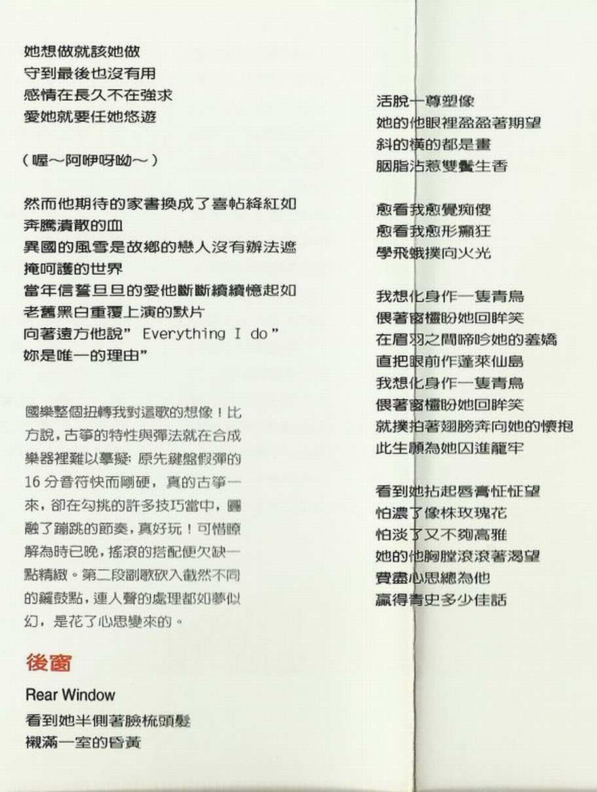

## 导引

国乐整个扭转我对这歌的想像！比方说，古筝的特性与弹法就在合成乐器里难以摹拟；原先键盘假弹的 16 分音符快而刚硬，真的古筝一来，却在勾挑的许多技巧当中，圆融了蹦跳的节奏，真好玩！可惜了解为时已晚，摇滚的搭配便欠缺一点精致。第二段副歌砍入截然不同的锣鼓点，连人声的处理都如梦似幻，是花了心思变来的。

## 歌词

看到她半侧着脸梳头发  
衬满一室的昏黄  
活脱一尊塑像  
她的他眼里盈盈着期望  
斜的横的都是画  
胭脂沾惹双鬓生香

愈看我愈觉痴傻  
愈看我愈形癫狂  
学飞蛾扑向火光

我想化身作一只青鸟  
偎着窗棂盼她回眸笑  
在眉羽之间啼吟她的羞娇  
直把眼前作蓬莱仙岛  
我想化身作一只青鸟  
偎着窗棂盼她回眸笑  
就扑抽着翅膀奔向她的怀抱  
此生愿为她囚进笼牢

看到她拈起唇膏怔怔望  
怕浓了像株玫瑰花  
怕淡了又不够高雅  
她的他胸膛滚滚着渴望  
费尽心思总为他  
赢得青史多少佳话

# 发晕 (Moonstruck)

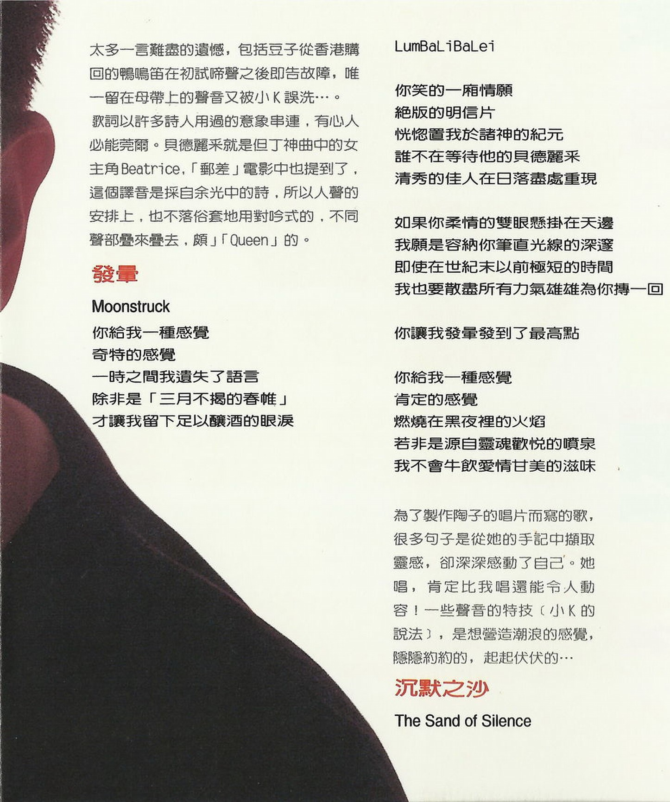

## 导引

太多一言难尽的遗憾，包括豆子从香港购回的鸭鸣笛在初试啼声之后即告故障，唯一留在母带上的声音又被小 K 误洗…。  
歌词以许多诗人用过的意象串连，有心人必能莞尔。贝德丽采就是但丁神曲中的女主角 Beatrice，「邮差」电影中也提到了，这个译音是采自余光中的诗，所以人声的安排上，也不落俗套地用对吟式的，不同声部叠来叠去，颇「Queen」的[^1]。

## 歌词

你给我一种感觉  
奇特的感觉  
一时之间我遗失了语言  
除非是「三月不揭的春帷」[^2]  
才让我留下足以酿酒的眼泪

LumBaLiBaLei

你笑的一厢情愿  
绝版的明信片  
恍惚置我于诸神的纪元  
谁不在等待他的贝德丽采  
清秀的佳人在日落尽处重现

如果你柔情的双眼悬挂在天边  
我愿是容纳你笔直光线的深邃  
即使在世纪末以前极短的时间  
我也要散尽所有力气雄雄为你搏一回

你让我发晕发到了最高点

你给我一种感觉  
肯定的感觉  
燃烧在黑夜里的火焰  
若非是源自灵魂欢悦的喷泉  
我不会牛饮爱情甘美的滋味

# 沉默之沙 (The Sand Of Silence)

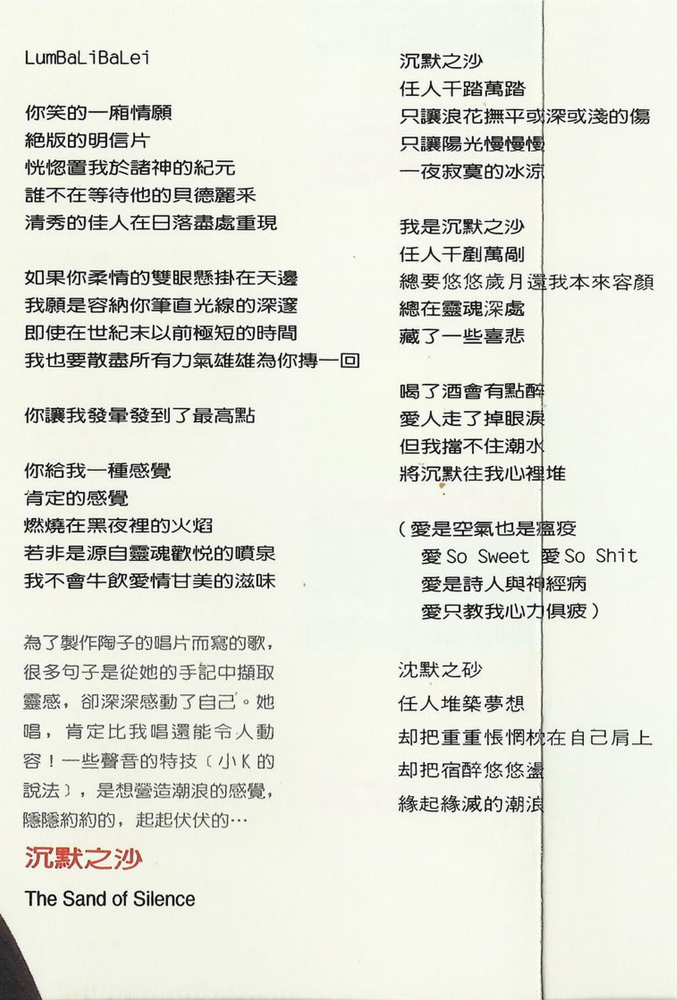

## 导引

为了制作陶子的唱片而写的歌，很多句子是从她的手记中撷取灵感，却深深感动了自己。她唱，肯定比我唱还能令人动容！一些声音的特技（小 K 的说法），是想营造潮浪的感觉，隐隐约约的，起起伏伏的…

## 歌词

沉默之沙  
任人千踏万踏  
只让浪花抚平或深或浅的伤  
只让阳光慢慢慢  
一夜寂寞的冰凉

我是沉默之沙  
任人千铲万剐  
总要悠悠岁月还我本来容颜  
总在灵魂深处  
藏了一些喜悲

喝了酒会有点醉  
爱人走了掉眼泪  
但我挡不住潮水  
将沉默往我心里堆

（爱是空气也是瘟疫  
爱 So Sweet 爱 So Shit  
爱是诗人与神经病  
爱只教我心力俱疲）

沉默之砂  
任人堆筑梦想  
却把重重怅惘枕在自己肩上  
却把宿醉悠悠荡  
缘起缘灭的潮浪

# 致谢

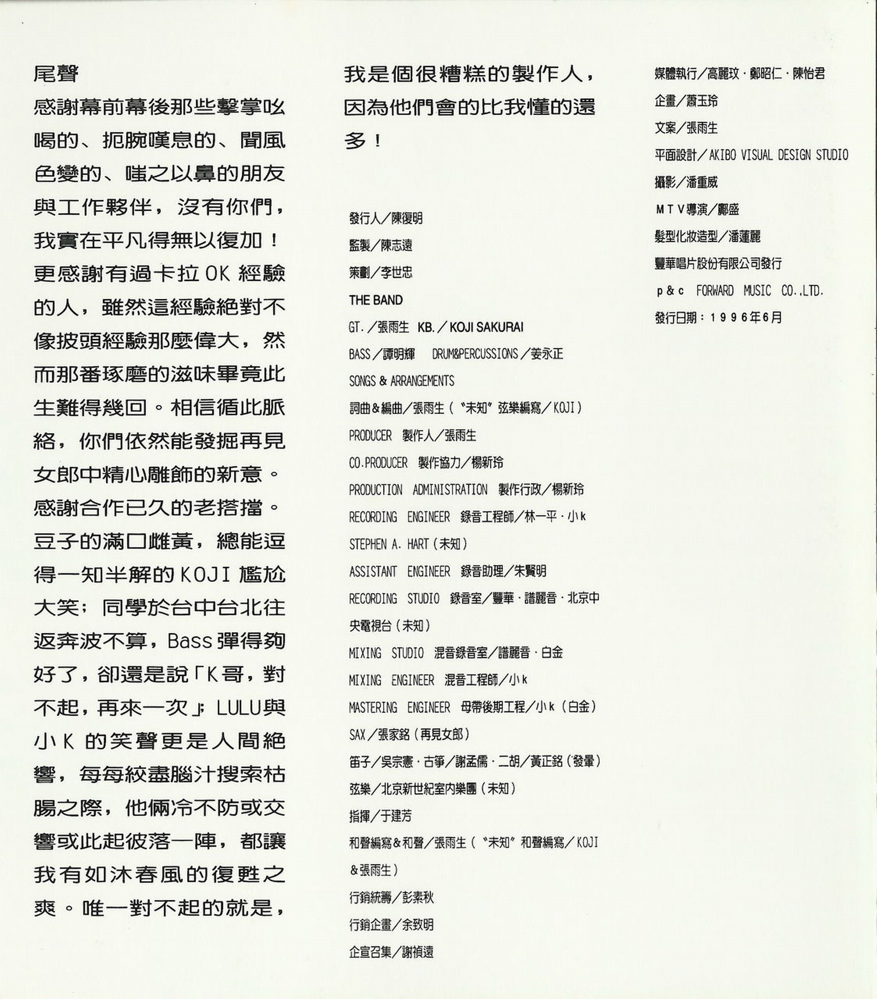

尾声

感谢幕前幕后那些击掌吆喝的、扼腕叹息的、闻风色变的、嗤之以鼻的朋友与工作伙伴，没有你们，我实在平凡得无以复加！更感谢有过卡拉 OK 经验的人，虽然这经验绝对不像披头经验那么伟大，然而那番琢磨的滋味毕竟此生难得几回。相信循此脉络，你们依然能发掘再见女郎中精心雕饰的新意。  
感谢合作已久的老搭档。豆子的满口雌黄，总能逗得一知半解的 KOJI 尴尬大笑；同学于台中台北往返奔波不算，Bass 弹得够好了，却还是说「K 哥，对不起，再来一次」；LULU 与小 K 的笑声更是人间绝响，每每绞尽脑汁搜索枯肠之际，他俩冷不防或交响或此起彼落一阵，都让我有如沐春风的复苏之爽。唯一对不起的就是，我是个很糟糕的制作人，因为他们会的比我懂的还多！

# 制作团队

|  负责  |  人员  |
| :----: | :----: |
| 发行人 | 陈复明 |
|  监制  | 陈志远 |
|  策划  | 李世忠 |

THE BAND

|       负责       |     人员     |
| :--------------: | :----------: |
|       GT.        |    张雨生    |
|       KB.        | KOJI SAKURAI |
|       BASS       |    谭明辉    |
| DRUM&PERCUSSIONS |    姜永正    |

SONS&ARRANGEMENTS

|                负责                |                  人员                  |
| :--------------------------------: | :------------------------------------: |
|             词曲&编曲              |                 张雨生                 |
|           “未知”弦乐编写           |                  KOJI                  |
|          PRODUCER 制作人           |                 张雨生                 |
|        CO.PRODUCER 制作协力        |                 杨新玲                 |
| PRODUCTION ADMINISTRATION 制作行政 |                 杨新玲                 |
|   RECORDING ENGINEER 录音工程师    | 林一平 · 小 K · STEPHEN A. HART (未知) |
|    ASSISTANT ENGINEER 录音助理     |                 朱贤明                 |
|      RECORDING STUDIO 录音室       | 丰华 · 谱丽音 · 北京中央电视台（未知） |
|      MIXING STUDIO 混音录音室      |              谱丽音· 白金              |
|     MIXING ENGINEER 混音工程师     |                  小 K                  |
|  MASTERING ENGINEER 母带后期工程   |              小 K（白金）              |
|                SAX                 |           张家铭（再见女郎）           |
|                笛子                |                 吴宗宪                 |
|                古筝                |                 谢孟儒                 |
|                二胡                |             黄正铭（发晕）             |
|                弦乐                |       北京新世纪室内乐团（未知）       |
|                指挥                |                 于建芳                 |
|           和声编写&和声            |                 张雨生                 |
|           “未知”和声编写           |              KOJI&张雨生               |
|              营销统筹              |                 彭素秋                 |
|              营销企画              |                 余致明                 |
|              企宣召集              |                 谢祯远                 |
|              媒体执行              |        高丽玟 · 郑昭仁 · 陈怡君        |
|                企画                |                 萧玉玲                 |
|                文案                |                 张雨生                 |
|              平面设计              |       AKIBO VISUAL DESIGN STUDIO       |
|                摄影                |                 潘重威                 |
|              MTV 导演              |            邝盛（再见女郎）            |
|            发型化妆造型            |                 潘莲丽                 |

丰华唱片股份有限公司发行  
P&C FORWARD MUSIC CO.LTD.

发行日期：1996 年 6 月

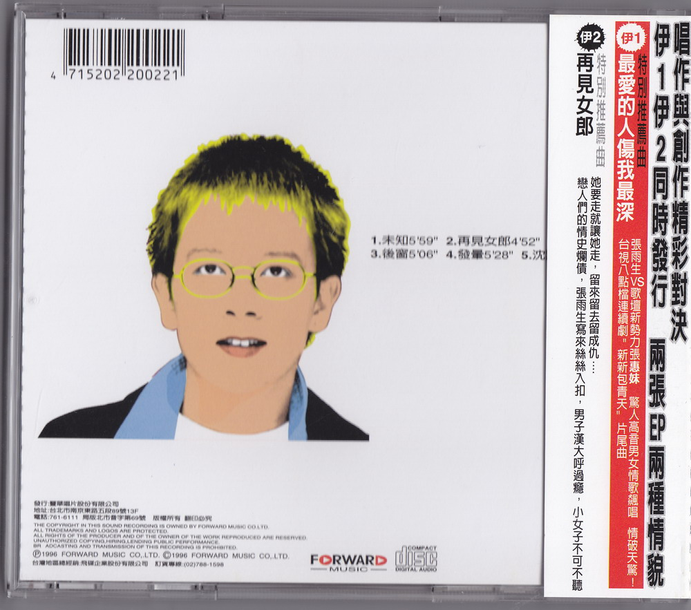

[^1]: 原作“颇」「Queen」”，多打了一个引号。
[^2]: 出自郑愁予的《错误》。
