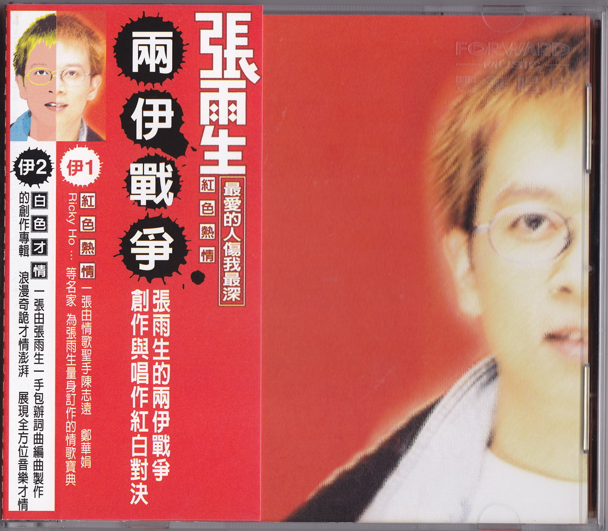
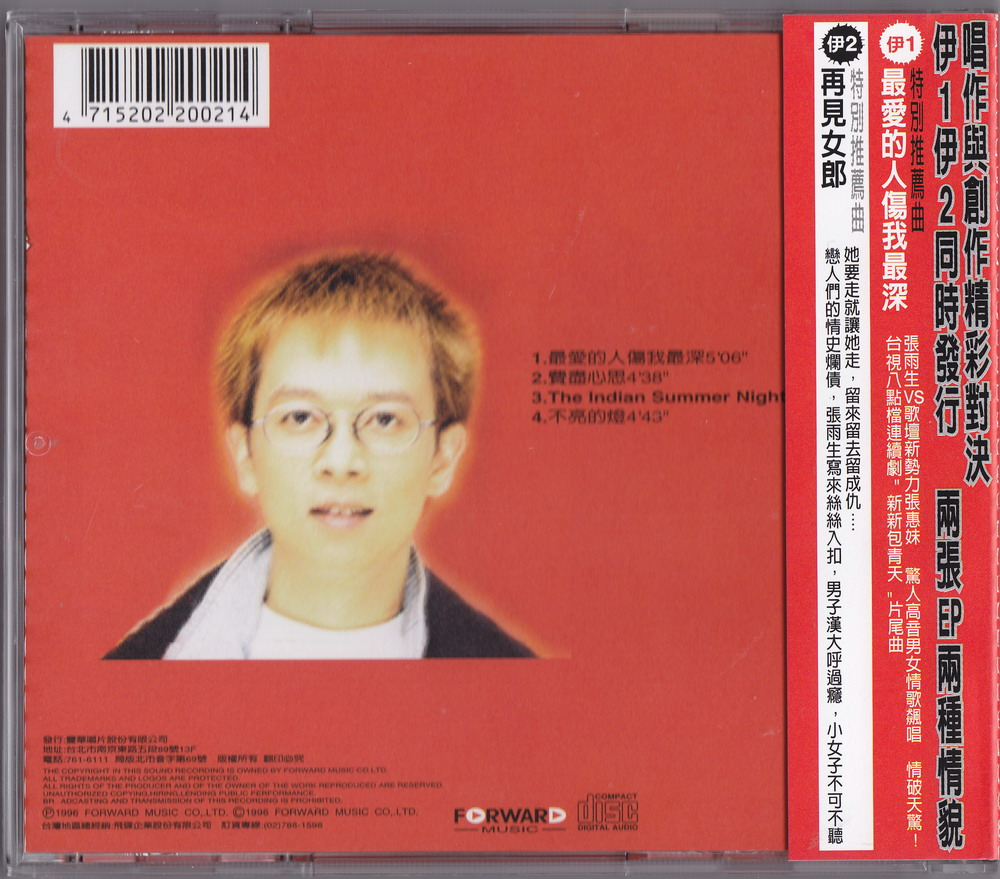
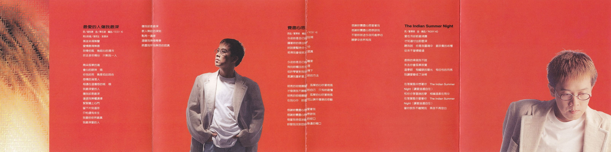
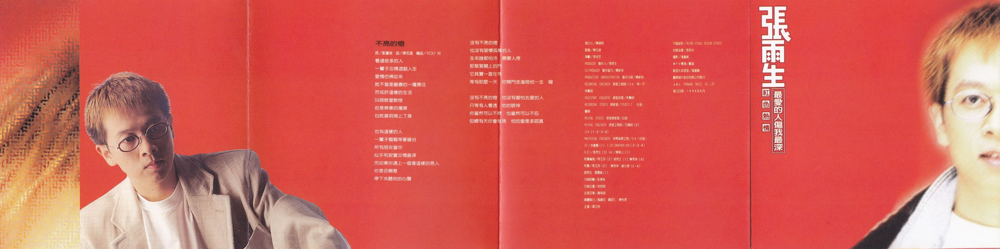

# 红色热情

## 最爱的人伤我最深
黑夜来得无声  
爱情散得无痕  
刻骨的风 卷起心的清冷  
吹去多年情份 只剩我一人

两朵孤单的魂  
会心的眼神 哦  
你我的苦 竟是如此吻合  
感情的沦落人  
相遇在这伤感的城 哦  
我最深爱的人  
伤我却是最深  
进退我无权选择  
紧紧关上心门  
留下片刻温存  
只怕还有来生  
我爱的依然最真  
我最深爱的人

伤我却是最深  
教人无助的深刻  
点亮一盏灯  
温暖我无悔青春  
燃尽我所有无怨的认真

| 负责  |   人员   |
| :---: | :------: |
|  词   |  邬裕康  |
|  曲   |  陈志远  |
| 编曲  | RICKY HO |

## 费尽心思
今夜你是否已经出城  
读着你的信出神  
你说要暂时分一分  
免得我会怪你太认真

今夜你是否已经离家  
飞向你向往的天涯  
或许学着对我放得下  
是让我重新爱上你的方法

明亮的街灯朦胧 孤单的心吹着晚风  
才发现我不了解的自己 只有你最懂  
明亮的街灯朦胧 孤单的心吹着晚风  
在我心中 你是可以抚平伤痕的感动

感谢你费尽心思爱着我  
感谢你费尽心思原谅我  
每当我徘徊在迷乱的街口  
你替我找到回你身边的借口

感谢你费尽心思爱着我  
感谢你费尽心思原谅我  
不管你旅途今夜何处停泊  
愿梦中依然有我

| 负责  |   人员   |
| :---: | :------: |
| 词曲  |  郑华娟  |
| 编曲  | RICKY HO |

## The Indian Summer Night
爱在冷却前最沸腾  
才知道付出那麽深  
听我说 你是我灵魂中 最珍贵的收获  
从来不曾怀疑过

虚假的承诺我不说  
失去你会孤单寂寞  
这季节 有耀眼的阳光 有任性的月亮  
别让爱变成了迷惘

在落叶风中想着你 The Indian Summer  
Night（让爱逍遥自在）  
和你分享云端的梦 相拥温柔在雨中  
在落叶风中爱着你 The Indian Summer  
Night（让爱逍遥自在）  
当你说永不离开我 黑夜不再空白

|  负责   |   人员   |
| :-----: | :------: |
|   词    |  郑华娟  |
| 曲·编曲 | RICKY HO |

## 不亮的灯
看过很多的人 一辈子忘情游戏人生  
爱情彷佛从来  
就不曾是严肃的一种责任  
而或许这样的生活  
叫做敢爱敢恨  
但是无辜的伤痕  
也就莫名背上了身

也有这样的人  
一辈子痴痴等着缘份  
所有朋友当中  
似乎和寂寞交情最深  
而如果你遇上一个像这样的男人  
你是否愿意  
停下来听他的心声

没有不亮的灯  
也没有习惯孤独的人  
生来谁都怕冷 需要人疼  
那紧紧关上的门  
它其实一直在等  
等有那麽一天 你开门走进陪他一生 喔

没有不亮的灯 也没有害怕去爱的人  
只等有人看透 他的眼神  
你当然可以不问 也当然可以不忍  
但总有天你会发现 他的认真

| 负责  |   人员   |
| :---: | :------: |
|  词   |  刘虞瑞  |
|  曲   |  陈志远  |
| 编曲  | RICKY HO |

# 制作团队

|       负责       |                  人员                  |
| :--------------: | :------------------------------------: |
|     发行人       |                陈復明                 |
|      监制        |                陈志远                 |
|      策划        |                李世忠                 |
|     制作人       |                张雨生                 |
|    制作协力      |                杨新玲                 |
|    制作行政      |                杨新玲                 |
|   录音工程师     |        小K · 林一平 · 朱贤明          |
|    录音助理      |                朱贤明                 |
|     录音室       |        STUDIO C · 白金 · 丰华         |
|   混音录音室     |                 白金                  |
|   混音工程师     |    王伟明（2） 小K（1·2·3·4）       |
| 母带后期工程     |           小K（白金）                 |
|       GT         |     余义贤（1） JONATHEN KOH(2·3·4) |
|      N.ET        |              张雨生（3）               |
|       SAX        |              萧东山（1）               |
|    和声编写      |  马玉芬（2） 张雨生（1） 陈秀珠（4） |
|      和声        | 马玉芬（2） 陈秀珠·谢文德（2.4） 张雨生&张惠妹（1） |
|    行销统筹      |                彭素秋                 |
|    行销企画      |                余致明                 |
|    企宣召集      |                谢祯远                 |
|    媒体执行      |      高丽玟 · 郑昭仁 · 陈怡君         |
|      企画        |                萧玉玲                 |
|    平面设计      |     AKIBO VISUAL DESIGN STUDIO        |
|    封面油画      |                李民中                 |
|      摄影        |                潘重威                 |
|     MTV导演      | 邝盛（最爱的人伤我最深）              |
| 发型化妆造型     |                潘莲丽                 |

丰华唱片股份有限公司发行
Ⓟ&ⒸFORWARD MUSIC CO., LTD.
发行日期：1996年6月