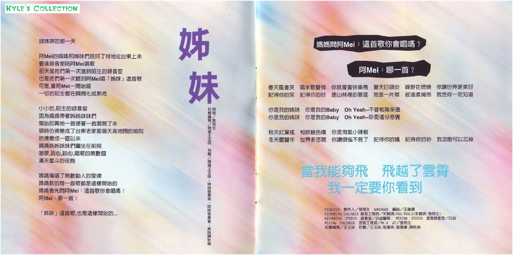
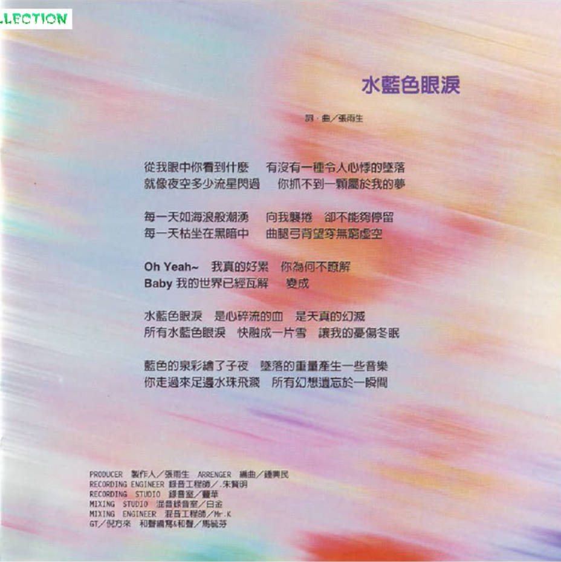

# 姊妹

# 姊妹

词曲：张雨生  
和声编写：妈妈王玉妹  
和声：妈妈王玉妹，妹妹张惠英，妹妹张惠春，表妹陈秋琳

## 导引

录姊妹的那一天

阿 Mei 的妈妈和姊妹们说好了特地从台东上来  
要进录音室陪阿 Mei 唱歌  
那天是她们第一次进到陌生的录音室  
也是她们第一次听到阿 Mei 唱「姊妹」这首歌  
可是，当阿 Mei 一开始唱  
一切的陌生都在瞬间化成熟悉

小小的，陌生的录音室  
因为妈妈带着姊姊妹妹们  
开始即兴地一首接着一首唱开了来  
顿时仿佛变成了台东老家那个天高地阔的前院  
仿佛变成一直以来  
妈妈姊姊妹妹们围坐在前院  
唱歌，谈心，谈心，唱歌的无数个  
满天星斗的夜晚

妈妈传唱了无数动人的旋律  
妈妈教的每一首歌都是这样开始的  
妈妈会先问阿 Mei：这首歌你会唱吗？  
阿 Mei：哪一首？

「姊妹」这首歌，也是这样开始的

## 歌词

春天风会笑 唱来歌声俏 你就像只快乐鸟 夏天日头炎 绿野在燃烧 你让世界更美好  
记得你的笑 记得你的好 是山林里的歌谣 我是一片草 被温柔拥抱 我想你一定知道

你是我的姐妹 你是我的 Baby Oh Yeah~不管相隔多远  
你是我的姐妹 你是我的 Baby Oh Yeah~珍爱这份感觉

秋天红叶摇 相映脸色娇 你是淘气小辣椒  
冬天庆丰年 世界多悠闲 你让烦恼不见了 记得你的娇 记得你的妙 我怎么可以忘掉

当我能够飞 飞越了云霄 我一定要你看到

## 制作团队

|             负责              |           人员 / 工作室            |
| :---------------------------: | :--------------------------------: |
|        PRODUCER 制作人        |               张雨生               |
|         ARRANGER 编曲         |               王继康               |
| RECORDING ENGINEER 录音工程师 | 朱贤明.PRO-TOOLS（朱贤明，张雨生） |
|    RECORDING STUDIO 录音室    |              白金丰华              |
|   MIXING STUDIO 混音录音室    |                白金                |
|  MIXING ENGINEER 混音工程师   |                Mr.K                |
|              GT               |               张雨生               |
|           和声编写            |               王玉妹               |
|             和声              |   王玉妹，张惠英，张惠春，陈秋琳   |

# 水蓝色眼泪

词曲：张雨生

从我眼中你看到什么 有没有一种令人心悸的坠落  
就像夜空多少流星闪过 你抓不到一颗属于我的梦

每一天如海浪般潮涌 向我袭卷 却不能够停留  
每一天枯坐在黑暗中 曲腿弓背望穿无穷虚空

Oh Yeah~ 我真的好累 你为何不了解  
Baby 我的世界已经瓦解 变成

水蓝色眼泪 是心碎流的血 是天真的幻灭  
所有水蓝色眼泪 融成一片雪 让我的忧伤冬眠

蓝色的泉彩绘了子夜 坠落的重量产生一些音乐  
你走过来足边水珠飞溅 所有幻想遗忘于一瞬间

|             负责              | 人员/工作室 |
| :---------------------------: | :---------: |
|             词曲              |   张雨生    |
|        PRODUCER 制作人        |   张雨生    |
|         ARRANGER 编曲         |   钟兴民    |
| RECORDING ENGINEER 录音工程师 |   朱贤明    |
|    RECORDING STUDIO 录音室    |    丰华     |
|   MIXING STUDIO 混音录音室    |    白金     |
|  MIXING ENGINEER 混音工程师   |    Mr.K     |
|              GT               |   倪方来    |
|         和声编写&和声         |   马毓芬    |

页面缺陷：

-   需要更清晰的封面
