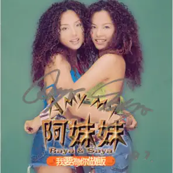
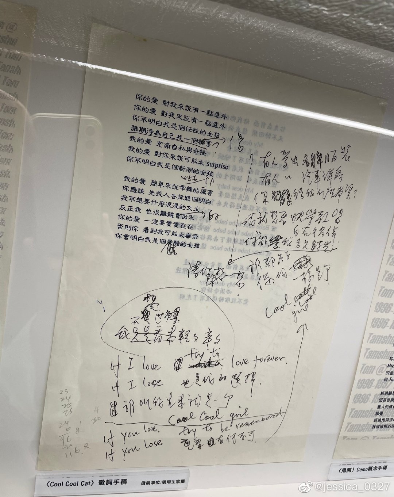

# 我要为你做饭

# BABE 让我告诉你

你走在前面 给我你的背影  
又不时回头 催我快赶上你  
My dear baby 我真想放弃  
爱不能追赶得没有了喘息

你走在前面 我看到你的背影  
但你的表情 却陌生得太神秘  
My dear baby 我真想放弃  
爱不能逃避得失去了联系

Oh baby baby baby baby baby 停一停  
Oh baby baby baby baby baby 听一听  
我不能这样继续下去与你的距离  
Oh baby baby baby baby 让我告诉你

你走在前面 声音也很遥远  
就算是晴天 我也躲在阴影里边  
My dear baby 必须告诉你  
爱不能灰暗得没有了光明

# COOL COOL CAT

你的爱 对我来说有一点意外  
你的爱 对我来说有一点意外  
你不明白 我是个任性的女孩  
谁期待 为自己找一个伤害

我的爱 充满自私与奇怪  
我的爱 对你来说可能太 surprise  
你不明白 我是个新潮的女孩

我的爱 简单来说辛辣的厉害  
你应该 先找人去探听个明白  
我不想要 什么浪漫的文采  
反正我 也很难体会的出来

你的爱 一定要实实在在  
否则你 看到我可能太无奈  
你会明白 我是个酷酷的女孩

有人爱出名牌服装  
有人爱出汽车洋房  
你能给我什么希望  
我就想要快乐歌唱  
我只想要自在徜徉  
你能爱我多久时光  
请你来想一想

If I love try to love forever  
If I lose 也是我的选择  
谁叫我生来就是一个 cool cool cat

If I love try to be remembered  
If I lose 重来有何不可  
谁都能像我一样是个 cool cool cat

# 哎唷！没什么

你又怎么啦 为什么还不想回家  
我的心情有一点复杂  
我只是想要找个人说说话  
今晚我就来陪你吧

都是我的他 教我心底乱如麻  
难道他又欺负你了吗  
不知道还该不该继续爱他  
别让自己变成可怜的傻瓜

你还想忍耐他多久 我不知道  
倒不如一次解决个干净利落  
你有把握 跟着我说  
哎唷没什么 哎唷放轻松  
男人这么多 辣妹何必回头  
哎唷没什么 哎唷放轻松  
朋友这么多 没有了爱情你还有个我

你又怎么啦 让自己哭成这模样  
他为什么躲我的电话  
我开始怀疑我比你还要傻 就别支支吾吾快点招了吧  
原来我的他 也不是什么样好卡  
他们总是顺手摘野花  
不知道 还该不该继续让他  
让他最后一脚把你踢开吗

不需要让自己烦恼 我也知道  
倒不如一次解决个干净利落  
你学我 跟着我说 大声地说  
哎唷没什么 哎唷放轻松  
男人这么多 辣妹何必回头  
哎唷没什么 哎唷放轻松  
朋友这么多 没有了爱情你还有个我

# 参考

相关链接：

-   [想你到月球 张雨生特展 10 - 蓁芯 0607@weibo.com​](https://weibo.com/2567125954/MmMXSgknO)

当前页面缺失：

-   发行时间
-   专辑封面
-   词曲作者信息
