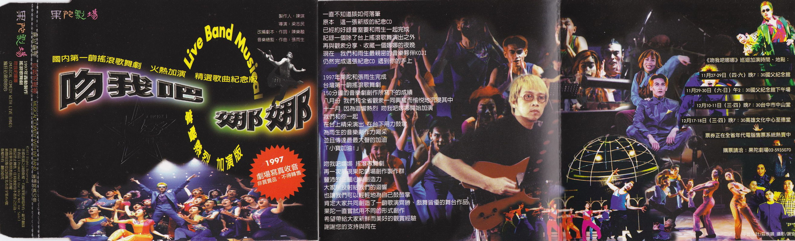
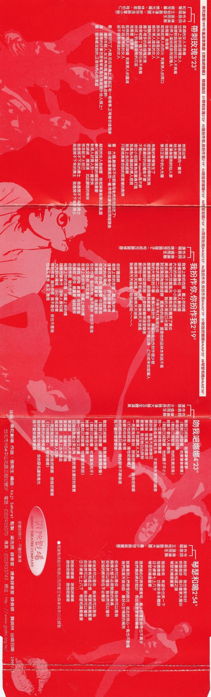

# 吻我吧娜娜

制作人：陳琪  
導演：梁志民  
改編劇本、作詞：陳樂融  
音樂總監、作曲：張雨生

一直不知道該如何落筆  
原本 這一張新版的紀念 CD  
已經約好錄音室要和雨生一起完成  
記錄一個除了台上搖滾歌舞演出之外  
再與觀眾分享、收藏一個娜娜的夜晚  
現在 我們和雨生 最親密的音樂夥伴 KOJI  
仍然完成這張紀念 CD 遞到你的手上

1997 年果陀和張雨生完成  
台灣第一齣搖滾歌舞劇  
150 分鐘的音樂劇創作所寫下的成績  
八月份 我們和全省觀眾一同興奮而愉悅地沉浸其中  
十一月 因為迴響熱烈 吻我吧娜娜開始加演  
我們和你一起  
在台上精彩演出 在台下用力鼓掌  
為雨生的音樂創作力喝采  
並且傳達最最大聲的加油  
「小寶加油！」

吻我吧娜娜 搖滾歌舞劇  
再一次展現果陀劇場創作製作群  
豐沛的企圖心與創造力  
大家所投射給我們的迴響  
也讓我們可以輕輕地為自己鼓鼓掌  
肯定大家共同創造了一齣歌演齊勝、戲舞皆優的舞台作品  
果陀一直嘗試用不同的形式創作  
希望帶給大家新鮮而美好的觀賞經驗  
謝謝您的支持與同在

## 雨生访谈 Ⅰ

做这个吻我吧娜娜这样子的，接这样的音乐剧它最大的挑战就是：事实上它的音乐非常非常的多、分量很大，然后里面有很多很多的歌（很多很多首的歌）要写。  
可是也正因为它分量很大，然后每一个角色又必须要恰如其分的、有代表它自己个性的一首音乐，所以在创作上面基本上它的空间很大。也就是说我可以很自由地很即兴地去设想，帮角色去设想一些东西，去帮它设计很特别很独特的音乐形态，所以让每一人出来都有他非常鲜明的一个角色的样子。

## 有个辣妹郝丽娜

作词：陈乐融  
作曲：张雨生  
编曲：Koji Sakurai

有個辣妹叫做郝麗娜
她天生凶悍人人怕
年過三十她還不出嫁
整天找人就想幹架

她眉毛濃（眉毛濃） 她眼睛大（眼睛大） 說起話來像機關槍 （不用保養不會故障）  
她不愛美（不愛美） 她不溫順（不溫順） 三從四德她全不會 （指指點點也無所謂）

有個辣妹叫做郝麗娜
她個性霹靂人人怕
不談戀愛她也不化妝
最無奈的是她老爸

她脾氣倔（脾氣倔） 她眼界高（眼界高） 批評男人她最在行 （別想輕易騙她上床）  
她臉皮厚（臉皮厚） 她膽子大（膽子大） 一生孤單又有何妨 （獨來獨往多麼瀟灑）

娜娜 娜娜 娜娜……

如果世界真的完美  
不該生出這個辣妹  
拆穿男人多少謊言  
破壞女人多少天真  
本來社會一片和諧  
偏偏她來顛倒是非  
女人就該服從男人  
豈能容她耀武揚威

男人們 上啊

有個辣妹叫做郝麗娜  
眾家兄弟千萬不要怕  
年過三十女人心裡慌  
不怕她們不投降  
郝麗娜　郝麗娜　郝麗娜……

## 我就是辣妹，怎样？！

這個世界有多大  
這個世界就有多糟  
心智健全的女人  
不該生在米羅城  
從童年痛苦到青春  
從一個家到另一個家 都是犯人  
雖然我是個女人  
我拒絕作倒楣的女人

我大聲笑　我大聲唱  
我活得自由快樂像隻小鳥  
誰說我一定要哭  
誰說我一定要撒嬌  
我和男人一模一樣  
可以抬頭挺胸神氣驕傲

我開步走　我睡懶覺  
我活得自由快樂像隻小鳥  
誰說我一定要嫁  
誰規定我不能邋遢  
我和男人平起平坐  
不用諂媚逢迎自貶身價

這個世界有多大  
這個世界就有多糟  
心智健全的女人  
不怕生在米羅城  
為無知付出了一生  
從一個家到另一個家 失去靈魂  
雖然我是個女人  
我絕不作古代的女人

你說我是個辣妹　怎樣？  
我就是辣妹　怎樣！

## 女人應如此

（郝麗絲）

生活　生活　生活  
生活不就是這個樣子  
看書　插花　刺繡  
從早到晚都無聊得要死

我不敢違抗爸媽的意思  
因為我有個溫柔和順的名字

我是個美女　也可以說是才女  
我是個美女　也幾乎可以說是聖女  
我是個美女　這都是天註定  
因為我有個美麗的名字

要我向東　我不會故意向西  
安排好要我出嫁  
我不會跑去出家

要我歌唱　我不可能唱得像要打架  
女人哪　不就應該這個樣子  
應該這個樣子

誰娶到我　都會是他的福氣

## 我扮作你，你扮作我

作詞：陳樂融  
作曲：張雨生  
演唱：陳幼芳（飾寇子）、柯叔元（飾路修森）

（寇）  
我穿上你的衣服　我戴上你的帽  
這樣改變身份　沒有人會知道  
大大的米羅城　小小兩名遊客

（路白）  
匆匆忙忙欣賞風光　興高采烈看見了美女

（寇）  
美女長得不怎麼樣　我的大哥卻口水直掉  
到底是因為他旅途疲勞 還是他的品味　還是他的品味本來就不高  
要追求郝家二小姐　不得不先打點郝伯伯  
我的大哥好的不學　偏偏叫我扮作  
偏偏叫我扮作　扮作個少爺

（路白）  
戲要演得好　服裝道具最重要  
管你原來什麼出身　打扮起來就能騙人

（寇）  
名牌服飾從頭到腳　什麼時候變得這麼驕傲  
最好他一輩子都追不到　我樂得天天逍遙  
我樂得天天逍遙　我樂得天天逍遙  
我啦啦啦……

（路白）  
你好囂張啊？

（寇）  
我穿上你的衣服　我戴上你的帽  
這樣改變身份　你爸爸會瘋掉  
大大的米羅城　小小兩名帥哥

（路白）  
你演我扮我　最重要你就是我  
我演你扮你　最重要我就是你  
你扮作我　我扮作你  
我不是你　你不是我  
我又是你　你又是我

## 雨生访谈 Ⅱ

光是比较有个性的一些音乐的话，比方说我们有用到了摇滚乐，那我们也用到了爵士乐，那呃有的时候呃在一些过场的时候，我们还会用到一些古典的啦，那其实蛮多的呃。
像女主角郝丽娜，我们每次让她出来的时候，因为她是一个独立自主的女性嘛，所以每次他出来的时候，我们都会希望让她是一个比较节奏强烈的，所以她有的时候出来唱歌，会有一些比较南美的那样子的，一种 Samba 的节奏的音乐。

## 帶刺玫瑰 Ⅰ

作詞：陳樂融  
作曲：張雨生  
演唱：王柏森（飾潘大龍）、舒宗浩（飾霍小開）  
和聲：顏芳馨、樊光耀、林靜君、程伯仁

柔順的女人不夠看  
世界上多的是這種女人  
隨便對我抛媚眼的女人不夠看  
世界上滿地找都有這種人  
我需要 我需要  
能挑起男人的烈火 刺激男人的胃口  
振作男人雄風的女人  
振作男人雄風的女人  
嬌豔的玫瑰不夠看  
園子裏多的是這種玫瑰  
隨便被園丁摘下的花朵不夠看  
地球上到處是這樣的花蕊  
我需要 我需要  
能挑起男人的嗅覺 刺激男人的靈魂  
卻不容易得逞的女人  
卻不容易得逞的女人

她很凶悍 像惡虎撲向一隻羊  
她太暴躁 像渾身是刺的仙人掌  
她最驕傲 像日正當中的大太陽

有趣的事情發生了  
這就是我要找的帶刺玫瑰  
不是最好的品種我不要  
不是 Mission Impossible 我不幹  
這位小姐就像爲我量身打造  
我真爲米羅城的男人悲哀  
我馬上去向她提親  
只要她真像你說的那麽樣的剽悍

## 帶刺玫瑰 Ⅱ

（潘大龍、湯圓）

（圓）  
無聊的工作他不愛  
每一天都想要新的挑戰  
別人請客吃到飽的大餐他不愛  
自己切自己煮吃得最痛快

（潘、圓）  
烏溜溜　白皙皙  
那麼好追的美女  
根本引不起興趣  
我有九牛二虎的力氣  
（他有九牛二虎的力氣）

越凶的女人我越愛 吵起架像砲彈四處亂竄  
拳打腳踢當運動的婚姻我最愛  
新男人好男人到一邊涼快  
軟綿綿 嬌滴滴  
如此聽話的妹妹  
根本配不上自己  
我是閑不下來的勇士 我是閑不下來的勇士  
我是閑不下來的勇士 我是閑不下來的勇士

## 雨生访谈 Ⅲ

所以我觉得在在做音乐，在创作歌舞剧这个方面，其实对创作人来讲，虽然挑战很大，但是也是很好玩的一件事情，因为其实他有很大很大的一个空间，可以去想象、可以去创作。

## 女人真如此？！

（郝麗娜）

生活　生活　生活  
生活不該是這個樣子

等吃　等睡　等嫁  
一生一世都像是個監獄  
我不想違抗爸媽的意思  
但是我有我獨立自主的意識  
我不是美女　勉強稱得上才女  
我不是美女　我也並不想當聖女  
我不是美女　並不是我故意  
雖然我有個俗氣的名字  
白馬王子　不是我追求的夢  
也不想洗衣燒飯　讓青春失去顏色  
愛的承諾　為何總在花前月下才有  
女人哪　難道真的只能如此  
真的只能如此  
誰了解我　也想有不同的故事

## 吻我吧娜娜 Ⅰ

作詞：陳樂融
作曲：張雨生  
演唱：王柏森（飾潘大龍）及全體演員

戰鼓已經敲響 我要摩拳擦掌  
（戰鼓已經敲響 他要摩拳擦掌 ）  
幸福的聲音在召喚  
（戰鼓已經敲響 他的志氣很高）  
她會不會投入我懷抱  
（戰鼓已經敲響 他的膽子不小 ）  
她一定要掉進我圈套
因爲我是最佳男主角 不能喪失男性的驕傲

要談情 我每天送她鮮花  
要吵架 我每天跟她磨牙  
要營養 我包她白白胖胖  
戰場上不能讓敵人太爽

## 吻我吧娜娜 Ⅱ

一見面我就會說

吻我吧娜娜 吻我吧娜娜  
（打他吧娜娜，捶他吧娜娜）  
我要和你終生依偎  
你的眼神瘋狂妩媚 我的腳步不願後退  
我不愛你還要愛誰

戰鼓已經敲響 我要摩拳擦掌  
（戰鼓已經敲響 他會遍體鱗傷）  
教堂的鍾聲在呼喚  
（戰鼓已經敲響 他會滿地找牙）  
她會不會有個水桶腰  
（戰鼓已經敲響 他會變成笑話 ）  
她一定要剛強又妖嬌

因爲我是最佳男主角 絕對要生最好的寶寶  
要溫暖 我給她大床棉被  
要興奮 我讓她三天不睡  
要珠寶 我馬上去作強盜  
搞革命不能讓敵人吃飽

## 吻我吧娜娜 Ⅲ

一見面我就會說

吻我吧娜娜 吻我吧娜娜  
（打他吧娜娜，Ｋ他吧娜娜）  
我是你的終極保镖  
我的脾氣配你剛好 你的惡名讓我增光  
我不愛你還要愛誰

## 鴿子與老鷹

（郝麗娜、潘大龍）

（娜）驢子讓人坐　你就是一頭驢子  
（潘）女人讓人騎　你就是一個女人  
（娜）驢子讓人坐　你就是一頭驢子  
（潘）女人讓人騎　你就是一個女人  
（娜）你好大的膽子想騎我 憑你的身材別作夢  
（潘）我打定了主意要抱你 不管你纖細或是臃腫  
（娜）你看起來就很沒氣質  
（潘）我買過的書都放家裡  
（娜）渾身上下古怪模樣  
（潘）自行設計不退流行  
（娜）渾身上下古怪模樣  
（潘）自行設計不退流行  
（娜）我看你最好死了心  
（潘）我看你越看越有趣  
（娜）留下來只是白費力  
（潘）這一生只跟你遊戲  
（娜）我是老鷹　可不是小白鴿  
（潘）我是老鷹　你就是小白鴿  
（娜）煩人煩人真煩人 從哪裡跑來的外星人  
（潘）美人美人真美人 米羅城唯一的俏佳人  
（娜）我看你眼睛應該洗一洗 姑娘我不會討好你  
（潘）男人們全都瞎了眼睛 怎麼不懂得照顧你  
（潘）美人美人真美人 米羅城唯一的佳人  
（娜）煩人煩人真煩人 哪裡跑來的外星人

## 霍氏音階

（霍小開）

Do Do Do 霍家小開就是我  
Re Re Re 看著你他不嫌累  
Me Me Me 我已對你著了迷  
Fa Fa Fa 因為你像一朵花  
So So So 男歡女愛別囉唆  
La La La 請你不要嫌棄他  
Si Si Si 快作霍家美嬌妻  
Do Si La So Fa Me Re Do Si  
相親相愛在一起

## 我要嫁了

（郝麗娜）

我要嫁了　我要嫁了  
我要當他的新娘  
你不必驚訝　因為我有新的生涯規劃  
我不是個愚笨的女人  
看得出大多數男人不適合結婚  
要他們守身如玉　專注一個女人  
算了　還是去教小狗打毛線比較可能

既然我夠聰明也夠勇敢  
既然我能端莊也能耍賴  
放棄大好條件坐在家裡  
不是太划不來

我要嫁了　我要嫁了  
我要當他的新娘  
我都很驚訝　他肯千里迢迢來當傻瓜  
他不是個普通的男人  
看得出我超越其他女人的靈魂  
我們倆勢均力敵　可以共度晨昏  
算了　不必再等白馬王子的深情一吻

這世上有光明也有黑暗  
這世上有快樂也有悲哀  
不入虎穴哪裡能得虎子  
讓我決定未來

## 誰說婚禮都是神聖的 Ⅰ

（眾人）

結婚了　結婚了　又有人要結婚了  
結婚了　結婚了　又有人要結婚了

結婚並不稀奇  
因為新娘是郝麗娜才稀奇  
她披上了白紗　她眼中沒有淚光  
不知她心情是悲是喜 不知她前途是兇是吉  
不知她心情是悲是喜 不知她前途是兇是吉

結婚了　結婚了　又有人要倒楣了  
結婚了　結婚了　又有人要倒楣了

結婚並不稀奇  
兩人各演一齣戲才稀奇  
她不像個傻瓜　她為何不再逞強  
不知她打的什麼算盤 不知她心中可有遺憾  
她打的什麼算盤 不知她心中可有遺憾

## 誰說婚禮都是神聖的 Ⅱ

（郝大爺、郝麗娜、郝麗絲、霍小開、眾人）

（郝）  
早上九點的婚禮　現在太陽已曬到頭頂  
還沒見到新郎的人影  
這個面子有誰能輸得起

（娜）  
有誰比我更丟臉　他從開始就瘋瘋癲癲  
現在他是不是反悔了  
我們像群呆子站在這裡

（絲）姊姊請你耐心點　我想姊夫就快要出現  
（娜白）姊夫？！哼！

（霍）大新聞呀大新聞　沒見過這麼新鮮的事  
（眾）什麼事？什麼事？  
（霍）潘大龍呀潘大龍　他一身裝扮把人嚇死  
（眾）怎麼死？怎麼死？

（霍）  
他頭上戴著新帽子　他腳上一雙破靴子  
他褲子髒得能滴油　他不中不西好脫俗

（霍白）他騎的是一匹老馬　是腳踏車 還是一團垃圾呢？

（霍、眾）  
看不出他是來結婚　還是尋仇  
看不出他是來結婚　還是尋仇

## 我是你的海港

（潘大龍、郝麗娜）

（潘）  
我是你的海港　你是我的山崗  
我能四處為家　你得癡心仰望  
我是你的太陽　你是我的月亮  
光輝由我創造　夜晚讓你分享  
我是你的主人　你是我的管家  
大家認清本分　自然不會吵架  
不許隨便頂嘴　叫你馬上回答  
共享天倫之樂　國家富強安康

（娜）  
我是你的海港　你是我的山崗  
聽聽這些謬論　令人血脈賁張  
我曬我的太陽　你賞你的月亮  
為何非要分出　尊卑強弱高下

（潘）  
我是你的主人　你是我的管家  
大家認清本分　自然不會吵架  
不許隨便頂嘴　叫你馬上回答  
共享天倫之樂　國家富強安康

（娜）  
大家都是主人　夫妻都要管家  
說話自有分寸　真愛不用勉強  
（潘：我是你的海港）  
我做我的學問　你喊你的口號  
（潘：我是你的太陽　你是我的月亮）  
要享天倫之樂　先把 EQ 提高

## 雨生访谈 Ⅳ

比较累，比我们在做 pop 的时候累很多。  
因为 pop 里面其实一首歌跟一首歌，这样下来没有什么时间的限制啊，中间你爱讲话讲多久就讲多久。  
可是嗯我们在做戏、在做这个这个音乐剧的时候，每一分每一秒啊，我们都要跟着演员他们的台词、他们的动作，然后看我们要注意 cue 点、我们要注意所有的时间，还有注意歌的长度。他了解台词，然后什么时候该发生什么事、什么时候我们要做什么音乐……  
所以一场下来几乎要用掉的体力、用掉的精神还蛮大的，所以做这个东西比较累，比做 pop 还累很多。

## 刺蝟碰上仙人掌

（湯圓）

讓我來打個比方　這對奇怪的夫婦  
就像刺蝟碰上了仙人掌  
一個唯我獨尊　一個得理不饒  
一點小小爭執　可以大鳴大放  
一個要散步　一個卻百米賽跑  
一個要吹風　一個卻穿起外套

看似無聊的舉動　有著高深的學問  
我腦袋太小　不能跟他們計較  
哇哇哇哇哇～

就像刺蝟碰上了仙人掌  
就像刺蝟碰上了仙人掌

## 籠中鳥

（郝麗娜）

活到這個年紀　不該不相信自己  
能夠有光　能夠有熱　能夠有愛  
儘管每個人都怕你　都想壓制你  
你豐潤的羽毛已經長成  
可以通得過風雨

為什麼大家都戰戰兢兢  
為什麼互相丢擲謊言和暴力  
誰是天生就軟弱  
誰又天生是機器戰警  
習慣加上自欺　我們成為現在這個樣子

我只知道　我不願不願作一隻籠中鳥  
不願向命運投降  
男人沒什麼可怕　婚姻也不一定糟糕  
膽小的人永遠進不了天堂

我不願不願作一隻籠中鳥 不願在夢裡飛翔  
只要付得起代價　自由就一定在前方  
只是需要彼此更多的體諒

活到這個年紀　不該不欣賞自己  
能夠微笑　能夠悲傷　能夠無奈  
就算每個人都愛你　都想取悅你  
如果你不懂得打開牢籠  
生活還是個難題

就算是個鬼地方　怎樣  
我也不會害怕　怎樣

## 琴瑟和鳴 Ⅰ

作詞：陳樂融  
作曲：張雨生  
演唱：王柏森（飾潘大龍）、黃小琥（飾郝麗娜）

妳對我好 我也會對你好  
妳跟我吵 我只會更大聲叫  
夫妻總有相處之道  
琴瑟和鳴最重要

我逗妳笑 希望你也笑一下  
我撒撒嬌 也要你多多體諒  
日子總會七上八下  
琴瑟和鳴最重要

## 考驗你的愛人

（寇子）

你要考驗你的愛人　不然你會被她考驗  
現在你就去求婚　然後再一起私奔  
生米煮成熟飯　香氣聞起來名正言順  
上車再補車票　也還是顧到司機的荷包

你要考驗你的愛人　不然你會被她考驗  
現在你開始出招　不然就等著套牢  
她是愛你的才藝　還是愛你的甜言蜜語  
喜歡你會搞笑　還是你看起來像長期飯票

考驗你的愛人　不要被她考驗  
時代注視著我們　我們一定要創造時代  
考驗你的愛人　不要被她考驗  
寧可她交出白卷　別等娶回家再來抱怨

呀呼！

## 荒郊野外

（潘大龍）

相信我　荒郊野外會有我  
夜再黑　遮風擋雨不嫌累  
我心底　對你一片真情意  
承認吧　不想繼續再裝傻  
怎麼做　親密關係能長久  
選擇她　就該說出真心話  
親愛的　三生有幸遇見你  
誰說男人沒有好東西  
相知相惜最甜蜜

## 雨生访谈 Ⅴ

有的时候啊像郝丽丝她妹妹，因为她是比较属于清纯少女派的，所以我们就把她设定成是一种像是偶像唱的那样子，偶像歌手唱歌的那一类型的抒情歌曲。所以其实如果大家来看戏的话，一定可以听得出来，这里面有非常非常多很好玩的东西，很好玩的音乐元素在里头。

## 愛情的奇蹟

（郝麗絲）

愛情造成了奇蹟　他為我隱姓埋名  
他的所作所為　都因為對愛情的信心

（路修森）我脫下自己的衣裳  
（霍小開）讓寇子冒名頂替

他的所作所為　都是對愛情的信心  
聽起來非常複雜　其實道理相當簡單  
不牽扯法律責任　只不過換換旗幟名稱  
人人都會發明理由　扇子就是用來搧風點火

愛情造成了奇蹟　他為我歷盡艱辛  
他的所作所為　都因為對愛情的無知

（路修森）我脫下自己的衣裳  
（寇子）當上個家庭教師

他的所作所為　都是愛情的奇蹟

## 男人征服

（霍小開、眾男）

（霍）  
偉大的時代就要來到了　親愛的男性同胞  
不必管什麼新好男人　那只是一個圈套  
我們儘管做萬獸之王

（眾男）  
偉大的時代就要來到了　親愛的男性同胞  
不必管什麼兩性平等　那只是一個圈套  
我們儘管翹著腿囂張

男人是機器　男人是上帝  
不管想或不想　隨時都得開機  
不管懂或不懂　凡事都有主意  
就算有心無力　也得裝腔作勢

男人活得真辛苦　活得真孤獨  
我們需要尊嚴光榮來彌補  
男人活得真幸福　活得真舒服  
世界給了我們女人來征服

## 女人反撲

（賈美美、郝麗絲、眾女）

（賈）
偉大的時代就要來到了　親愛的女性同胞  
不必管什麼男尊女卑　那只是一個圈套  
我們儘管把身體練好

（甲女）偉大的時代就要來到了　親愛的女性同胞  
（絲）不必管什麼等待壓抑　那只是一個圈套　我們儘管說我的需要

（眾女）

女人是母親　女人是土地  
不管想或不想　隨時都得傾聽  
不管懂或不懂　心思非得纖細  
就算身心俱疲　也得在旁服侍

女人活得真辛苦　活得真孤獨  
我們需要尊嚴光榮來彌補  
女人活得真幸福　活得真舒服  
現在終於可以對男人反撲

## 琴瑟和鳴 Ⅱ

（潘大龍、郝麗娜）

（合）你對我好　我也會對你好  
（合）你跟我吵　我只會更大聲叫  
（潘）夫妻總有相處之道  
（合）琴瑟和鳴最重要

（合）我逗你笑　希望你也笑一下  
（合）我撒撒嬌　也要你多多體諒

（娜）日子總會七上八下  
（合）琴瑟和鳴最重要

（合）  
既然婚約已將我倆套牢  
客人的禮金送得也不算少  
我們應該將計就計  
做出恩恩愛愛的模樣  
就算看到人們奇怪的眼光  
彼此的信心一點也不動搖  
我們就是天造地設  
最好心甘情願的擁抱

（潘）你依然可以是你  
（娜）我依然可以是我  
（潘）兩棵大樹不必限制  
（娜）誰的身高

（潘）你依然可以懂我  
（娜）我依然可以懂你  
（潘）妥協的奧妙就在  
（娜）不必聲張

（潘）你依然可以是你  
（娜）我依然可以是我  
（合）夫妻總有相處之道  
（合）琴瑟和鳴最重要

（潘）你依然可以懂我  
（娜）我依然可以懂你  
（潘）日子總會七上八下  
（合）琴瑟和鳴最重要

（潘）吻我吧娜娜　吻我吧娜娜  
（眾）吻他吧娜娜　吻他吧娜娜

（眾）  
你依然可以是你 我依然可以是我  
夫妻總有相處之道 琴瑟和鳴最重要  
吻我吧娜娜　吻我吧娜娜

## 制作团队

感謝點將股份有限公司同意王柏森參與本 CD 之錄製

出品：果陀劇場  
作曲：張雨生  
編曲：Koji Sakurai  
監製：梁志民  
錄音室：捷奏錄音室  
錄音師：龔銘祥  
出版日期：1997/11  
台北市 104 中山北路三段 32 號 3F  
電話：（02）5935070  
傳真：（02）5933743  
網址：[http://www.godot.org.tw/](http://www.godot.org.tw/)

果陀劇場  
多變的時代，不變的真情

## 专辑图片

## 参考

-   [音樂劇「吻我吧娜娜」全本歌詞（上） | 陳樂融自選輯](https://fc.iwant-in.net/?p=2197)
-   [音樂劇「吻我吧娜娜」全本歌詞（下） | 陳樂融自選輯](https://fc.iwant-in.net/?p=2198)
-   [张雨生 1997《吻我吧娜娜》摇滚歌舞剧全专辑分轨](https://www.bilibili.com/video/BV1Qqcfe1EYY)
