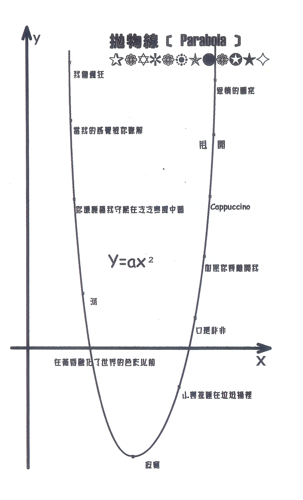
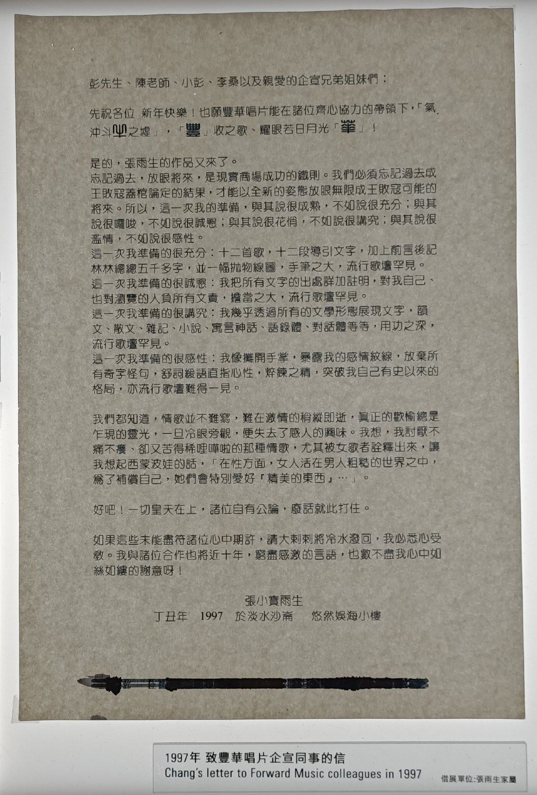
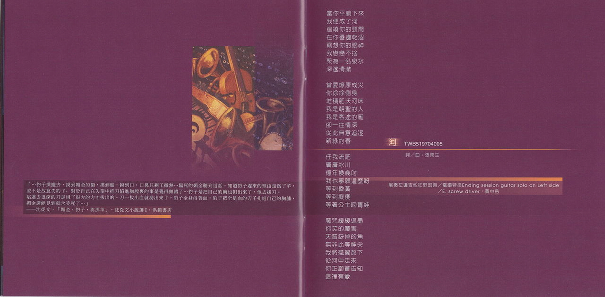
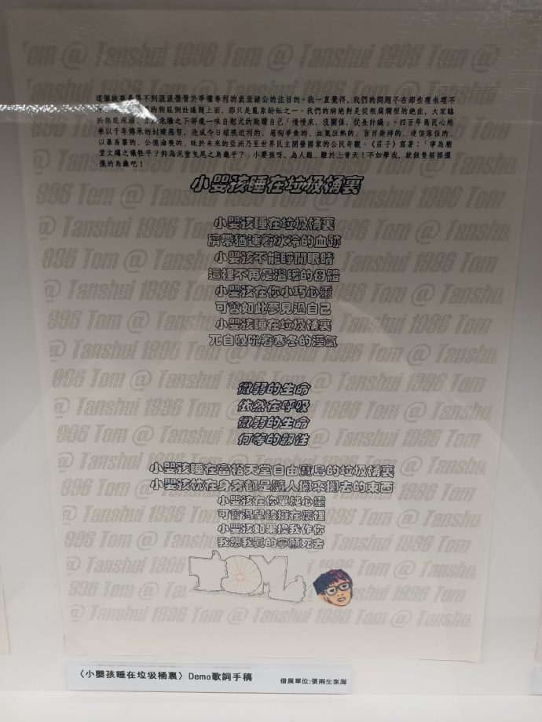
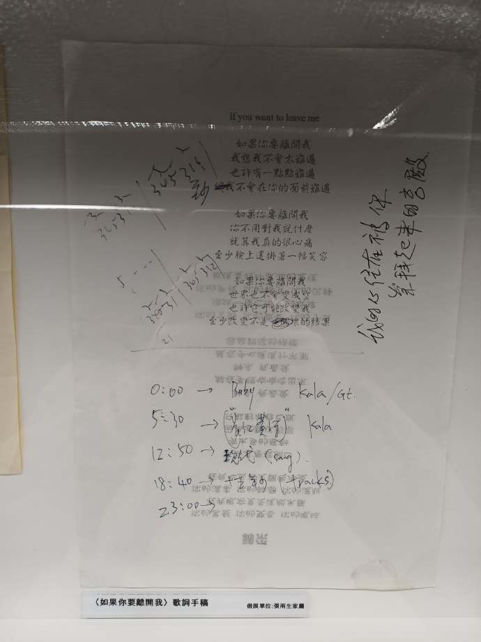
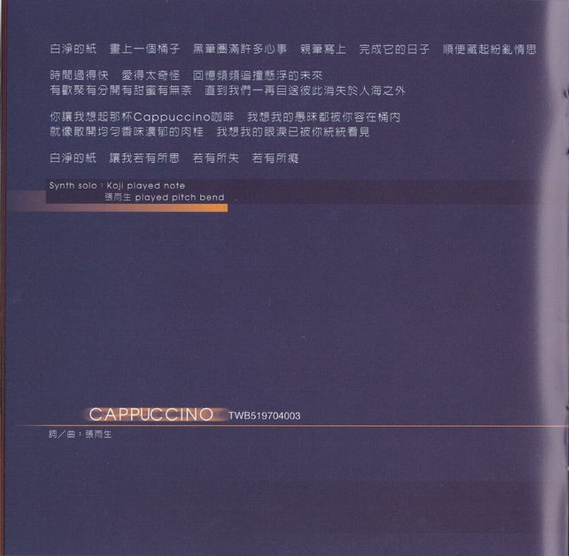
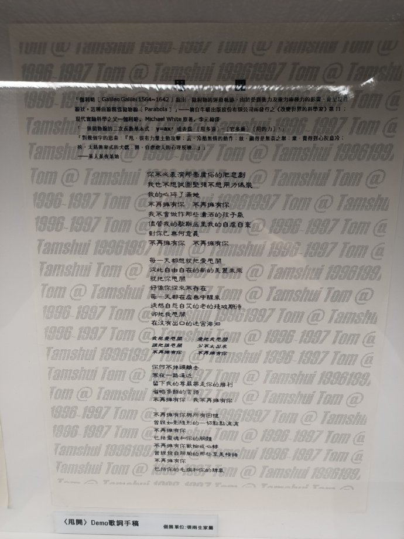
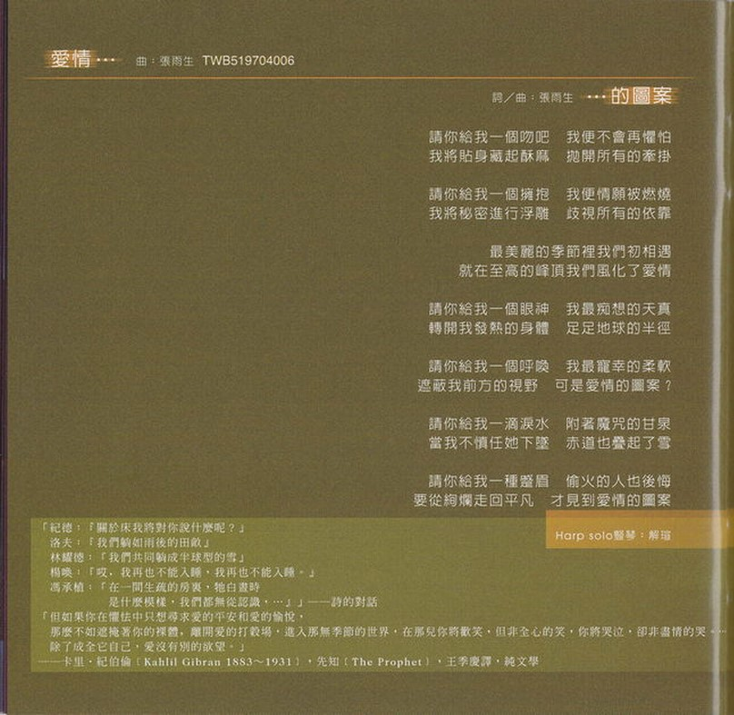

# 口是心非（抛物线版）

# 致丰华唱片企宣同事的信

彭先生、陈老师、小彭、李桑以及亲爱的企宣兄弟姐妹们：

先祝各位 新年快乐！也愿丰华唱片能在诸位齐心协力的带领下，「气冲斗牛之墟」，「丰」收之歌、耀眼若日月光「华」！

是的，张雨生的作品又来了。  
忘记过去，放眼将来，是现实商场成功的铁则。我们必须忘记过去成王败寇盖棺论定的结果，才能以全新的姿态放眼无限成王败寇可能的将来。所以，这一次我得准备，与其说很成熟，不如说很充分；与其说很啰嗦，不如说很诚恳；与其说很花俏，不如说很讲究；与其说很滥情，不如说很感性。  
这一次我准备的很充分：十二首歌，十二段导引文字，加上前言后记林林总总五千多字，并一幅抛物线图，手笔之大，流行歌坛罕见。  
这一次我准备的很诚恳：我把所有文字的出处详加注明，对我自己、也对浏览的人负所有文责，担当之大，流行歌坛罕见。  
这一次我准备的很讲究：我几乎透过所有的文字形态展现文字，韵文、散文、杂记、小说、寓言神话、语录体、对话体等等，用功之深，流行歌坛罕见。  
这一次我准备的很感性：我像摊开手掌，暴露我的感情纹线，放弃所有奇字怪句，舒词缓语直指心性，淬炼之精，突破我自己有史以来的格局，亦流行歌坛难得一见。

我们都知道，情歌并不难写，难在激情的稍纵即逝，真正的欢愉总是乍现的灵光，一旦冷眼旁观，便失去了感人的兴味。我想，我讨厌不痛不痒、却又苦得稀里哗啦的那种情歌，尤其被女歌者诠释出来，让我想起了西蒙波娃的话，「在性方面，女人活在男人粗糙的世界之中，为了补偿自己，她们会特别爱好『精美的东西』…」。

好吧！一切皇天在上，诸位自有公论，废话就此打住。

如果这些未能尽符诸位心中期许，请大剌剌将冷水泼回，我必悉心受教。我与诸位合作也将近十年，穷尽感激的言语，也数不尽我心中如丝如缕的谢意呀！

张小宝雨生

丁丑年 1997 于淡水沙仑 悠然娱海小楼

# 我会疯狂

## 导引

「凌晨 4:50，早觉者与边缘人有了不经意的交会。同样惺忪的睡眼，生命的活力却此消彼长。」  
「人，总在满足和贪多的火网下匍匐前进，总有成为俘虏的时候，受尽酷刑折腾，或幡然悔悟，或乐此不疲 ⋯ 相爱容易相处难，否则婚姻怎会成为爱情的坟场？宽容与知足，为什么要耗费几十年的光阴才得以领略呢？」———某人某夜于淡水  
「从民子到雪子对于他的爱的闪电，划过佐山的心里。」  
———川端康成（1899 ～ 1972），母亲初恋的人，伊豆的舞娘 ——— 川端康成十五篇短篇精选集，黄玉燕译

## 歌词

我会疯狂  
你的模样  
今生最美丽的图像  
谁能有魔力让我冻结一切神奇时刻  
任何代价我都愿意舍  
所有声音  
比不上你  
萦回我整个的魂灵  
尽世界蓦然熄了光明失了秩序  
我也相信仍然拥有你

占有不是我们爱恋的终结  
谁敢轻言他的承诺久远  
我只愿为你收拾起性情不想再顽强嬉游流浪  
只把桂冠为你献上

如果有爱能值得这些曲折  
如果有爱能值得这般火热  
如果有爱违背了道德在心灵千山万水  
孰是孰非谁理得出来

就像走了一圈又绕过一圈你跋涉长远却回到原点  
最初的狂喜与最终的宁谧如此和谐  
就像走了一圈又绕过一圈你跋涉长远再回到原点  
更替的季节与变换的日夜去不复回

等到失去的再回我身边  
等到失去的再回我身边  
等到失去的再回我身边  
我才有了力量将一切还原  
我才有了力量将记忆玩味  
我才有了力量将爱情完美  
我才有了力量将生命深远  
正如泉水充盈丰沛

# 当我的感觉被你了解

## 导引

「当有人欣赏你的作品  
很可能他误解了。  
很可能你对你自己经验的发掘  
还没深到只有自己理解的程度。」  
—— 罗智成 · 罗智成诗集「宝宝之书」· 第 12

「『哈哈哈！』阿 Q 十分得意的笑。  
『哈哈哈！』酒店里的人也九分得意的笑。」  
—— 鲁迅 · 阿 Q 正传 · 第三章末两行

## 歌词

当我的感觉被你了解  
我便拥有了全世界  
当你为我开启全世界  
我才找到我的残缺

因为我的快乐是你海天辽阔的笑  
往往一路抑扬顿挫直到天涯海角  
有时窒息的抑郁使我狂乱浮躁  
有时荒谬的景象使我亡命叛逃

你知道  
你知道

就说「快把垃圾向我倾倒  
把疲惫的心向我怀里靠」

当我的感觉被你了解  
我便拥有了全世界  
当你为我开启全世界  
我才走进了我心内的花园

# 你还愿为我守候在冷冷寒风中吗

## 导引

我找不到呀

## 歌词

你还愿为我守候在冷冷寒风中吗？微微贴触我的耳缘呵痒说情话  
即使当初你最爱傻楞楞的笑 日子一久难免看惯那单调

你还愿将我美好华年赞颂入诗吗？相处总会产生距离安全而疏远  
即使当初我坚持相思应成痴 想不起那些年冲动的直觉

你说爱情不会飞 只因多感而憔悴 问痴心妄想惹遍沧桑的人能入戏几分 露水朝华 还是孤注倾泄  
你说真心不会飞 只因脆弱而枯萎 问纸醉金迷欢场徘徊的人能领略几分 谁等待圣洁光辉 谁无所谓

我们再次循着记忆回到相恋的小街 湿风泥土青草混合甜美的气味  
没有精神的虚无 没有肉体的臭腐 静静溶进天地昏黄的洗浴

我说爱情不会远 只因多感放长线 想当年十五二十洁白的心怎么拥抱生命 快乐暖暖 藏在手掌外缘  
我说真心不会远 只因脆弱躲一边 我们都忘了心底深藏的那束火红玫瑰 谁奔向花花乐园 谁暗暗自怜

直到黑夜吞没最后的光线 直到月光撕扯云层而出现 我们手握着手背靠背 胡语乱言 知道情爱不能不咀嚼

爱情不会远 爱情不会飞 我心甘情愿毫无迟疑地吻你红热小脸 晶莹的泪划下喜极的痕  
真心不会飞 真心不会远 我心甘情愿毫无悔怨的疼你今世今生 让所有苦闷哀愁唱破喉咙

# 河

## 导引

「…豹子扑拢去，摸到媚金的额，摸到脸，摸到口；口鼻只剩了微热…临死的媚金听到这话，知道豹子迟来的理由是为了羊，并不是故意失约了，对于自己在失望中把刀陷进胸膛里的事是觉得做错了…豹子是把自己的胸也袒出来了，他去拔刀。陷进去很深的刀是用了很大的力才拔出的。刀一拔出血就涌出来了，豹子全身浴着血。豹子把全是血的刀子扎进自己的胸脯，媚金还能见到就含笑死了…」  
——沈从文 ·「媚金 · 豹子 · 与那羊」· 沈从文小说选 Ⅰ · 洪范书店

## 歌词

当你平躺下来 我便成了河  
回绕你的颈间 在你唇边干涸  
窃想你的眼神 我恋恋不舍  
聚为一泓泉水 深邃清澈

当爱燎原成灾 你徐徐侧身  
堆积肥沃河床 我是朝圣的人  
我是客途的雁 却一往情深  
从此无意追逐 新绿的春

任我流吧 层层冰川  
亿年换几吋 我也宁愿这么盼  
等到昏黄 等到痴傻  
等着公主吻青蛙

魔咒缓缓退尽 你笑的厉害  
天曾缺掉的角 无非此等神采  
我将残翼放下 从河中走来  
你正颔首告知 这里有爱

# 在黄昏融化了世界的色彩以前

## 导引

Note..朋友们频频列队结婚，我也被红色喜帖炸得不亦乐乎。  
这当然无关乎流行，只是到了年纪。  
从纯吃喝閙酒的宾客，一路做遍招待、司机、甚至伴郎（搞过乌龙、也閙了笑话），体恤他们在这样一种透过古老风俗迷信串接的典礼仪式当中，即心力交瘁，又要笑脸迎人的苦处。  
不过，那些笑意毕竟发自肺腑，诚如他们所言，结合是两个人的事、结婚却是两家子人的事。祝福他们！

## 歌词

在黄昏融化了世界的色彩以前  
我们的情绪达到至美的极限  
当月光歌颂着绝伦的天上诗篇  
我们的欢乐涌现节庆的境界

所以你说你情愿放弃自己的那一片天  
所以你说你情愿走向生命的另一回圈

相思会醉 爱恋能痴  
无可比拟的激情几回  
一对指戒 一诺百年  
一座从此 恬适的伊甸园？

在星辰造型出神圣的几何以前  
我们的心跳冲破古老的高原

当黎明破晓之姿粉刷彤霞一片  
我们的视野才拓展到地平线

所以你说你情愿挥别憧憬的爱情唯美  
所以你说你情愿迎接繁复的柴米油盐

# 寂寞

## 导引

找不到

## 歌词

瑟缩的人 哽咽的歌 赭红的黄昏  
穿透千古灰蒙的眼神  
就放肆的喊吧  
反正只有我一个  
我是窗口的静物  
徒留形状看不见灵魂

多少的时间 流失在眼前  
多少的思念 我丢弃又拾回  
日以继夜 日以继夜  
品尝它苦涩滋味

昏暗的灯 混乱的床 悸动的梦魇  
沉溺无边空想的失眠  
就忘形的哭吧  
反正只有我一个  
我是凌晨的薄雾  
疯狂迷恋低温的感觉

多少的时间 流失在眼前  
多少的思念 我丢弃又拾回  
日以继夜 日以继夜  
品尝它苦涩滋味

瑟缩的人 哽咽的歌  
赭红的黄昏 灰蒙的眼神  
昏暗的灯 混乱的床  
悸动的梦魇 空想的失眠

反正只有我一个  
反正只有我一个  
日以继夜 日以继夜  
日以继夜 日以继夜  
品尝它苦涩滋味

# 小婴孩睡在垃圾桶里

## 导引

这个故事是得不到汲汲营营于争权夺利的衮衮诸公的注目的。我一直觉得，我们的问题不在那些理也理不清、辩也辩不明的狗屁倒灶议题上面，那只是乱象纷纭之一。我们的病绝对是从根腐烂型的绝症，大家临于无底深渊，立于危墙之下却还一味自慰式的欺蒙自己「慢慢来，没关系，从长计议」。四百年岛民心态乘以千年传承的封建恶习，造成今日短视近利的、恶狗争食的、血气狂热的、盲目崇拜的、迷信落伍的、以暴易暴的、公德沦丧的、昧于未来的亚洲乃至世界民主开发国家的公民奇观。《庄子》写着：「宁为庙堂文绣之牺牲乎？抑为泥涂曳尾之乌龟乎？」小婴孩呀，为人难、难于上青天！不如学我，就做只摇摇摆摆的乌龟吧！

## 歌词

小婴孩睡在垃圾桶里  
脐带犹连着冰冷的血迹  
小婴孩不能睁开眼睛  
这里不再是温暖的母体  
小婴孩在你小巧心灵  
可曾如此梦见过自己  
小婴孩睡在垃圾桶里  
兀自吸吮这寒冬的湿气

微弱的声音  
依然在呼吸  
微弱的声音  
何等的任性

小婴孩睡在富裕天堂自由宝岛的垃圾桶里  
小婴孩枕在身旁都是随人掷来掷去的东西  
小婴孩在你单纯心灵  
可曾渴望能拥在怀里  
小婴孩如果换我作你  
我想我真的宁愿死去

# 口是心非

## 导引

「『我出卖了你，』她大胆地说。  
『我也出卖了你，』他说。  
她又厌恶地瞧了他一眼。  
『有时，』她说：『…你是由衷说这些话的。你想不到其他挽救自己的方法，你为了自己才这样说。你要别人去受苦，你关心的只是你自己。』  
『你关心的只是自己，』他附和说。  
『从此之后，你对那人的感情便不同了。』」  
—— 乔治 · 奥威尔（George Orwell 1903 ~ 1950）· 1984 · 邱素慧译 · 桂冠图书公司

## 歌词

口是心非 你深情的承诺都随着西风飘渺远走  
痴人梦话 我钟情的倚托就像枯萎凋零的花朵  
星火燎原 我热情的眼眸曾点亮最灿烂的天空  
晴天霹雳 你绝情的放手在我最需要你的时候

于是爱恨交错人消瘦  
怕是怕这些苦没来由  
于是悲欢起落人静默  
等一等这些伤会自由

口是心非 你矫情的面容都烙印在心灵的角落  
无话可说 我纵情的结果就像残破光秃的山头  
浑然天成 我纯情的悸动曾奔放最滚烫的节奏  
不可收拾 你滥情的抛空所有晶莹剔透的感受

# 如果你要离开我

## 导引

如果太阳此刻熄灭光茫，地球上的人要八分钟后才会知道…  
「Beatrice: 『I am gone, though I am here: there is no love in you: nay, I pray you let me go.』」—— William Shakespeare, Much Ado About Nothing, ACT  
「泉涸，鱼相与处于陆，相呴以湿，相濡以沫，不如相忘于江湖。」—— 庄子 · 大宗师

## 歌词

如果你要离开我  
我想我不会太难过  
也许有一点点难过  
至少不会在你的面前难过  
Leave me alone

如果你要离开我  
你不用对我说什么  
就算我真的很心痛  
至少脸上还挂着一幅笑容  
Leave me alone

如果你要离开我  
世界还是会向前走  
也许它慢慢改变我  
至少改变也不是坏的结果  
Leave me alone

如果你要离开我  
如果你要离开我  
如果你要离开  
请别到最后一刻才告诉我  
Leave me alone

# Cappuccino

## 导引

没找到

## 歌词

白净的纸 画上一个桶子 黑笔圈满许多心事  
亲笔写上 完成它的日子 顺便藏起纷乱情思

时间过得快 爱得太奇怪 回忆频频追撞悬浮的未来  
有欢聚有分开有甜蜜有无奈 直到我们一再目送彼此消失于人海之外

你让我想起那杯 Cappuccino 咖啡 我想我的愚昧都被你容在桶内  
就像散开均匀香味浓郁的肉桂 我想我的眼泪已被你统统看见

白净的纸 让我若有所思 若有所失 若有所痴

# 甩开

## 概念手稿

宇宙历 纪元混沌初开

我带着满目疮痍的城市穿过心情的满目疮痍  
那崇高的圣战终于回到第一次冲突的经纬线上偃旗息鼓  
美好华年率先弃械被俘虏为四窜的狼烟只是阴魂不散  
经过重击纯真的重击的重击的重击  
独裁者选择崇拜疯狂  
我选择披覆月球冷寂的表面

当超新星爆破幅射搭载光速扩散  
一度释放数倍于莫扎特短短 36 个寒暑所挤压的燃热形成更庞大于贝多芬交响曲于一秒钟内迸裂的唯有男女高音共鸣达于宇宙中心足以媲美的动能  
然而 无止无尽无边无际的电波巡弋  
随着罗斯托洛波维奇呼吸的巴哈上以孟德尔颂屏息凝神的小提琴翻腾迴旋下以拉威尔思绪绵远的「波丽露」踢足漫舞起在帕格尼尼的高深莫测伏在舒伯特的轻灵可喜

以为脆弱腌渍的发臭宿醉 只有极速过弯的离心力可以拉扯  
把呕吐于门外的灵魂一一捡拾回只要扭开音量便不管 Evans、Bird、Coltrane、Miles、Monk、Mingus、Stan、Benson、Joe、Wes、Django、Ella、Sarah、Billy、June 都震天憾地粗声粗气的响的房间  
原来不止每次转过关渡大桥与淡水河最不可思议的那个切面  
悲从中来便不可抑遏地与大屯山脉出海了

耳聋成瘾于 Chuck Berry、Jimi Hendrix、Led Zeppelin、Deep Purple、Michael Schenker、Van Halen，Jeff、Gary、Eric、Joe、Steve 串联的金属吉他火网  
眼也盲的心也盲的海市蜃楼盲的（妈的？）像 Jim Morrison 与 Janis Joplin 的昙花一现

经过颠覆日夜的颠覆的颠覆的颠覆 
回首音乐从地底滚滚而出自 L 型长桌之前  
薰人的传自母体酝酿的温暖硫磺原味包容我干烈且进退维谷的关于真、善、美的触觉  
经过甩开张雨生的甩开的甩开的甩开  
我被瞭解的误解为误解的瞭解成瞭解了误解也误解了瞭解……

## 导引

「伽利略（Galileo Galilei 1564~1642）指出，抛射物的运动轨迹，由于受到动力及重力两种力的影响，会呈现曲线状。这种曲线称为抛物线（Parabola）」——摘自牛顿出版股份有限公司所发行之《改变世界的科学家》第 11；现代实验科学之父——伽利略，Michael White 原着，李元绮译  
「一个抛物线的二次函数基本式：$y=ax^2$ 或表为 $(甩多远)=(它多重)(用的力)^2$」  
「对几个字的思索：『甩，很有力量主动攻击；丢，冷酷无情的动作；放，显得是无奈之举；弃，觉得到心灰意冷；拾，太慈善家式的犬儒；割，自虐虐人的心理反映…』」  
——某人某夜某地

## 歌词

你不必表演那套庸俗的肥皂剧  
我也不想试图坚强不想用力伪装  
我的心碎了满地  
不再拥有你 不再拥有你  
我不会做作那些潇洒的孩子气  
尽管我的歇斯底里我的自虐自弃  
对你已无何意义  
不再拥有你 不再拥有你

每一天都想就把爱甩开  
从此自由自在的新的美丽未来  
就把你甩开  
好像你从来不存在  
每一天都在虚无中醒来  
徒然自怨自艾的老的残破期待  
却把我甩开  
在没有出口的迷宫徘徊

我把爱甩开 爱把我甩开  
谁把谁甩开 分不太出来  
不再拥有你 不再拥有你

你何不掉头离去  
寒夜一路逼近  
留下我的尊严带走你的酒气  
省略多余的言语  
不再拥有你 我不再拥有你

不再拥有你与所有回忆  
曾经如影随形的一切点点滴滴  
不再拥有你  
包括灵魂和你的胴体  
不再拥有你欢愉或心悸  
曾经发自肺腑的那些至美情绪  
不再拥有你  
包括你的毛病和你的脾气

# 爱情的图案

## 导引

「纪德：『关于床我将对你说什么呢？』  
洛夫：『我们躺如雨后的田亩』  
林燿德：『我们共同躺成半球形的雪』  
杨唤：『哎，我再也不能入睡，我再也不能入睡。』  
冯承植：『在一间生疏的房里，他白昼时是什么模样，我们都无从认识，…』」——诗的对话  
「但如果你在惧怯中只想寻求爱的平安和爱的愉悦，  
那么不如遮掩着你的裸体，离开爱的打谷场，进入那无季节的世界，在那儿你将欢笑，但非全心的笑，你将哭泣，却非尽情的哭。…  
除了成全它自己，爱没有别的欲望。」  
—— 卡里 · 纪伯伦 (Kahlil Gibran 1883 ~ 1931) · 先知 (The Prophet) · 王季庆译 · 纯文学

## 歌词

请你给我一个吻吧 我便不会再惧怕  
我将贴身藏起酥麻 抛开所有的牵挂

请你给我一个拥抱 我便情愿被燃烧  
我将秘密进行浮雕 歧视所有的依靠

最美丽的季节里我们初相遇  
就在至高的峰顶我们风化了爱情

请你给我一个眼神 我最痴想的天真  
转开我发热的身体 足足地球的半径

请你给我一个呼唤 我最宠幸的柔软  
遮蔽我前方的视野 可是爱情的图案？

请你给我一滴泪水 附着魔咒的甘泉  
当我不慎任她下坠 赤道也叠起了雪

请你给我一种蹙眉 偷火的人也后悔  
要从绚烂走回平凡 才见到爱情的图案

# 专辑图片

