# 雨生欢禧城

# 文案

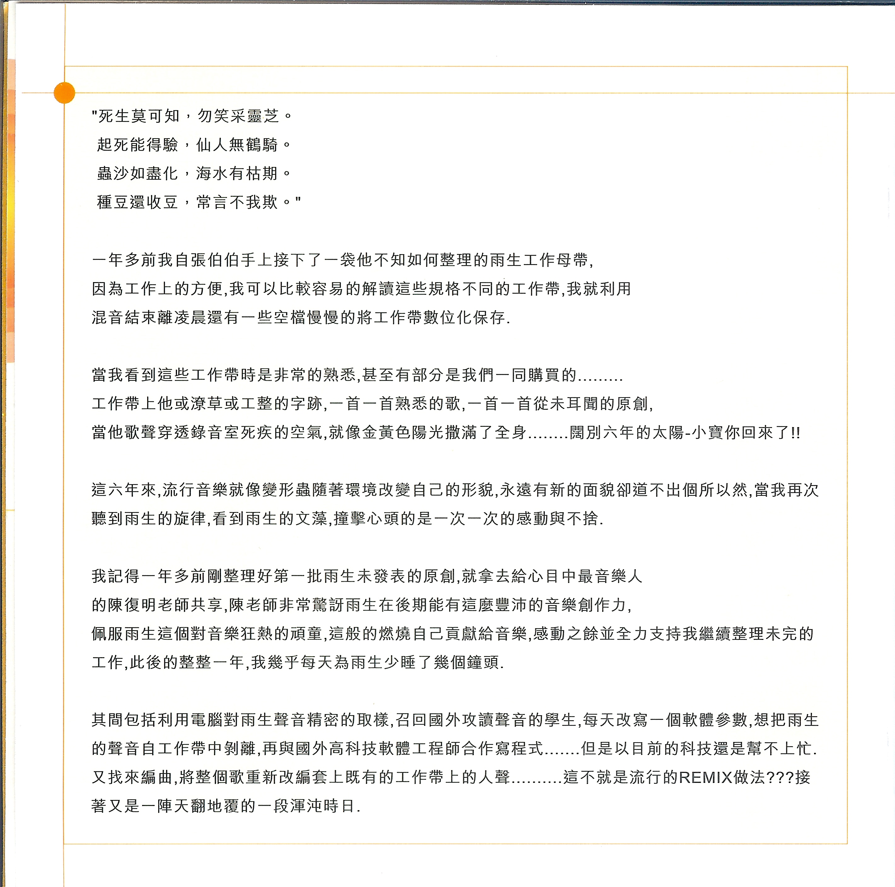
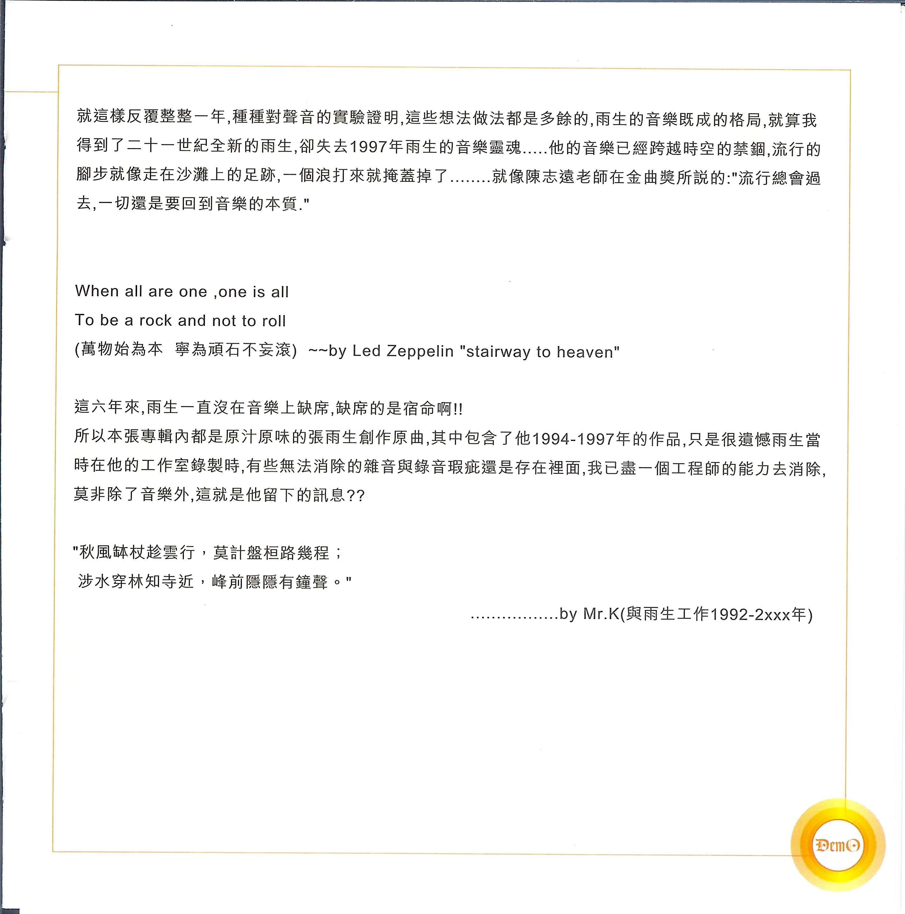

〝死生莫可知，勿笑采灵芝。  
 起死能得验，仙人无鹤骑。  
 虫沙入尽化，海水有枯期。  
 种豆还收豆，常言不我欺。〞

一年多前我自张伯伯手上接下了一袋他不知如何整理的雨生工作母带，因为工作上的方便，我可以比较容易的解读这些规格不同的工作带，我就利用混音结束离凌晨还有一些空挡慢慢的将工作带数位化保存。

当我看到这些工作带时是非常的熟悉，甚至有部分时我们一同购买的………  
工作带上他或潦草或工整的字迹，一首一首熟悉的歌，一首一首从未耳闻的原创，
当他歌声穿透录音室死疾的空气，就像金黄阳光撒满了全身………阔别六年的太阳 - 小宝你回来了！！

这六年来，流行音乐就像变形虫随着环境改变自己的形貌，永远有新的面貌却道不出个所以然，当我再次听到雨生的旋律，看到雨生的文藻，撞击心头的是一次一次的感动与不舍。

我记得一年多前刚整理好第一批雨生未发表的原创，就拿去给心目中最音乐人
的陈复明老师共享，陈老师非常惊讶雨生在后期能有这么丰沛的音乐创作力，
佩服雨生这个对音乐狂热的顽童，这般的燃烧自己贡献给音乐，感动之余并全力支持我继续整理未完的工作，此后的整整一年，我几乎每天为雨生少睡了几个钟头。

其间包括利用电脑对雨生声音精密的取样，召回国外攻读声音的学生，每天改写一个软体参数，想把雨生的声音自工作带中剥离，再与国外高科技软体工程师合作写程式……但是以目前的科技还是帮不上忙。
又找来编曲，将整个歌曲重新改编套上既有的工作带上的人声………这不就是流行的 REMIX 做法？？？接着又是一阵天翻地覆的一段混沌时日。

就这样反复整整一年，种种对声音的实验证明，这些想法做法都是多余的，雨生的音乐既成的格局，就算我得到了二十一世纪全新的雨生，却失去 1997 年雨生的音乐灵魂……他的音乐已经跨越时空的禁锢，流行的脚步就像沙滩上的足迹，一个浪打来就掩盖掉了………就像陈志远老师在金曲奖所说的：〝流行总会过去，一切还是要回到音乐的本质。〞

When all are one ,one is all  
To be a rock and not to roll  
（万物始为本，宁为顽石不妄滚）~~by Led Zeppelin "stairway to heaven"

这六年来，雨生一直没在音乐上缺席，缺席的是宿命啊！！
所以本张专辑内部都是原汁原味的张雨生创作原曲，其中包含了他 1994-1997 年的作品，只是很遗憾雨生当时在他的工作室录制时，有些无法消除的杂音与录音瑕疵还是存在里面，我已尽一个工程师的能力去消除，莫非除了音乐外，这就是他留下的讯息？？

“秋风钵杖趁云行，莫计盘桓路几程；  
 涉水穿林知寺近，峰前隐隐有钟声。”

…………by Mr.k（与雨生工作 1992-2xxx 年）
   

# Only Once

TWB510331401

作词：张雨生
作曲：张雨生

## 歌词

Only once in your lifetime  Only once in your dream  Only once in your Paradise  也就足够  
Only once in your lifetime  Only once in your dream  Only once in your Paradise  我就足够  
在午夜过后的风雨里  不由自主的想着你  在微微颤颤的烛光里 轻而易举翻搅的情绪  
我凌空爱情在纠缠里 不容一点一些给恋窒息 让思念上瘾成了怀疑才招呼月色开怀痛饮  
来喝一杯  喝一杯就醉 红颜风雨无所谓 来喝一杯 一杯就醉 这是我的快乐 也是我的泪  
Only once in your lifetime  Only once in your dream  Only once in your Paradise  也就足够  
Only once in your lifetime  Only once in your dream  Only once in your Paradise  我就足够  

# 小时候

TWB510331402

作词：张雨生  
作曲：张雨生

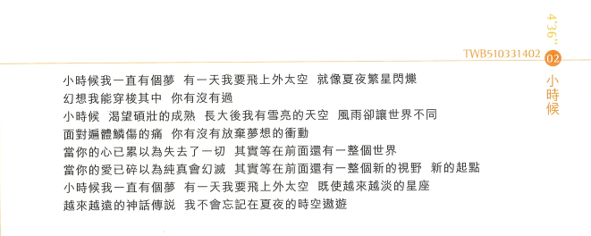

## 歌词

小时候我一直有个梦 有一天我要飞上外太空 就像夏夜繁星闪烁  
幻想我能穿梭其中 你有没有过  
小时候 渴望硕壮的成熟 长大后我有雪亮的天空 风雨却让世界不同  
面对遍体鳞伤的痛 你有没有放弃梦想的冲动  
当你的心已累以为失去了一切 其实等在前面还有一整个世界  
当你的爱已碎以为纯真会幻灭 其实等在前面还有一整个新的视野 新的起点  
小时候我一直有个梦 有一天我要飞上外太空 即使越来越淡的星座  
越来越远的神话传说 我不会忘记在夏夜的时空遨游

# 我的爱

TWB510331403

作词：张雨生  
作曲：张雨生

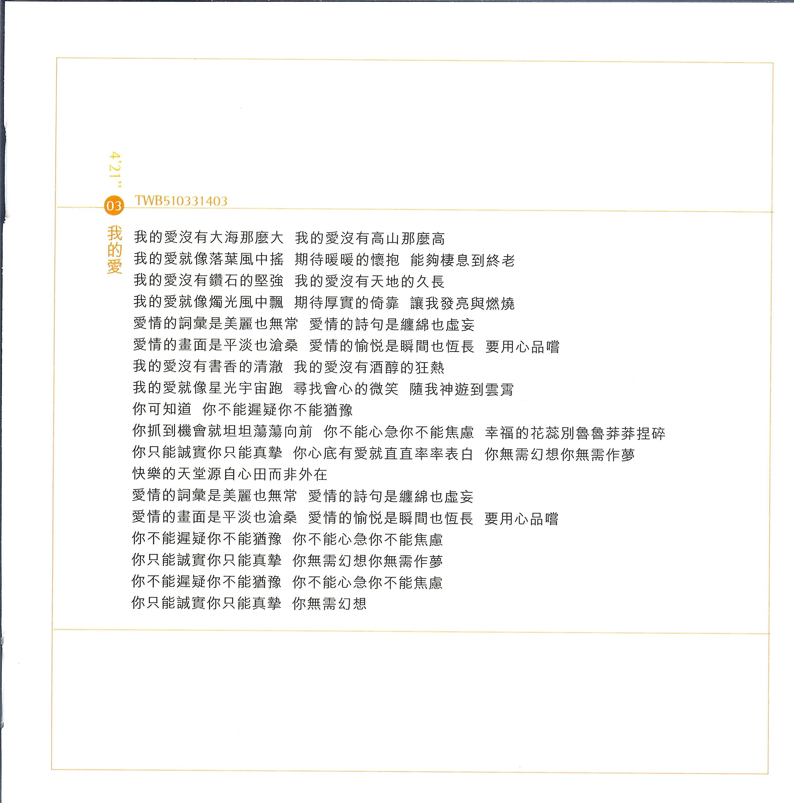

## 歌词

我的爱没有大海那么大 我的爱没有高山那么高  
我的爱就像落叶风中摇 期待暖暖的怀抱 能够栖息到终老  
我的爱没有钻石的坚强 我的爱没有天地的久长  
我的爱就像烛光风中飘 期待厚实的倚靠 让我发亮与燃烧  
爱情的词汇是美丽也无常 爱情的诗句是缠绵也虚妄  
爱情的画面是平淡也沧桑 爱情的愉悦是瞬间也恒长 要用心品尝  
我的爱没有书香的清澈 我的爱没有酒醇的狂热  
我的爱就像星光宇宙跑 寻找会心的微笑 随我神游到云霄  
你可知道 你不能迟疑你不能犹豫  
你抓到机会就坦坦荡荡向前 你不能心急你不能焦虑 幸福的花蕊别鲁鲁莽莽捏碎  
你只能诚实你只能真挚 你心底有爱就直直率率表白 你无需幻想你无需作梦  
快乐的天堂源自心田而非外在  
爱情的词汇是美丽也无常 爱情的诗句是缠绵也虚妄  
爱情的画面是平淡也沧桑 爱情的愉悦是瞬间也恒长 要用心品尝  
你不能迟疑你不能犹豫 你不能心急你不能焦虑  
你只能诚实你只能真挚 你无需幻想你无需做梦  
你不能迟疑你不能犹豫 你不能心急你不能焦虑  
你只能诚实你只能真挚 你无需幻想

# 爱过了头

TWB510331404

作词：张雨生  
作曲：张雨生

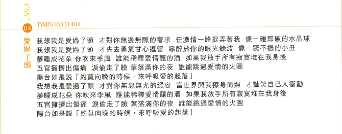

## 歌词

我想我是爱过了头 才对你无边无际的奢求 任激情一路捉弄着我 像一碰即破的水晶球  
我想我是爱过了头 才失去勇气甘心逗留 恶醉于你的眼光馀波  像一蹶不振的小丑  
梦睡成花朵 你吹来季风 谁能稀释爱情酿的酒 如果我放手所有的寂寞推在我身后  
五官拥挤出伤痛 泪偷走了脸 叶落满你的夜 谁能跳过爱情的火圈  
阳台如是说「约莫向晚的时候，来呼吸爱的起落」  
我想我是爱过了头 才对你无怨无尤的纵容 当世界与我擦身而过 才讪笑自己太冲动  
梦睡成花朵 你吹来季风 谁能稀释爱情酿的酒 如果我放手所有寂寞堆在我身后  
五官拥挤出伤痛 泪偷走了脸 叶落满你的夜 谁能跳过爱情的火圈  
阳台如是说「约莫向晚的时候，来呼吸爱的起落」

# 哭泣与耳语

TWB510331405

作词：张雨生  
作曲：张雨生

## 歌词

当你受委屈 噙住眼泪 低声哭泣 偎在附近 一些苦和记忆 吹来的耳语  
那么的冰冷 那么的无情 那么毫不保留 侵袭你孱弱身躯  
彷徨吗 你纯真心灵 炎凉的人时刻让你惊奇  
Baby 请别再用你的泪 为这荒芜的天地是非 他不值得你悲  
Baby 我们需要的是机会 让阳光晒红你圆圆甜甜 笑得正灿烂的脸  
无论如何 要张开热情的手臂 迎接明天 擦亮雪亮的尊严  
Baby 请别再用你的泪 为这荒芜的天地是非 他不值得你悲  
Baby 我们需要的是机会 让阳光晒红你圆圆甜甜 笑的正灿烂的脸  
Baby 请别再用你的泪 为这荒芜的天地是非 他不值得你悲  
Baby 我们需要的是机会 让阳光晒红你圆圆甜甜 笑的正灿烂的脸  

# 传言

TWB510331406

作词：张雨生  
作曲：张雨生

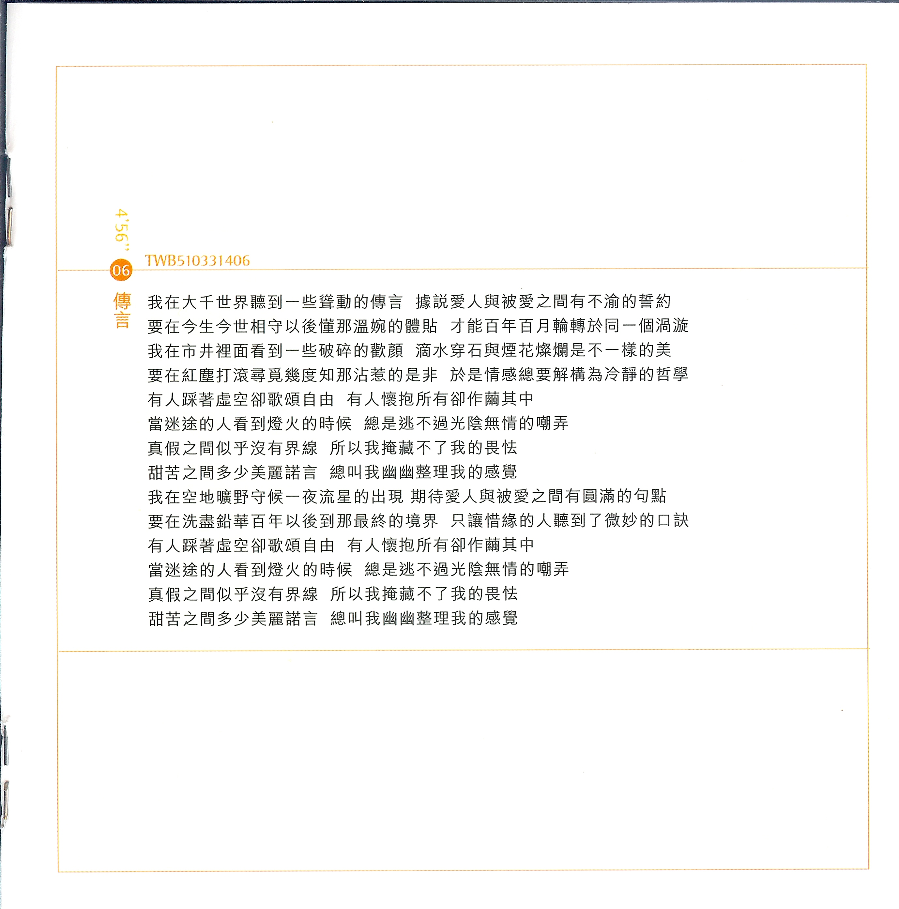

## 歌词

我在大千世界听到一些耸动的传言 据说爱人与被爱之间有不渝的誓约  
要在今生今世相守以后懂那温婉的体贴 才能百年百月轮转于同一个涡旋  
我在市井里面看到一些破碎的欢颜 滴水穿石与烟花灿烂是不一样的美  
要在红尘打滚寻觅几度知那沾惹的是非 于是情感总要解构为冷静的哲学  
有人踩着虚空却歌颂自由 有人怀抱所有却作茧其中  
当迷途的人看到灯火的时候 总是逃不过光阴无情的嘲弄  
真假之间似乎没有界限 所以我掩藏不了我的畏怯  
甜苦之间多少美丽诺言 总叫我幽幽整理我的感觉  
我在空地狂野守候一夜流星的出现 期待爱人与被爱之间有圆满的句点  
要在洗尽铅华百年以后到那最终的境界 只让惜缘的人听到了微妙的口诀  
有人踩着虚空却歌颂自由 有人怀抱所有却作茧其中  
当迷途的人看到灯火的时候 总是逃不过光阴无情的嘲弄  
真假之间似乎没有界限 所以我掩藏不了我的畏怯  
甜苦之间多少美丽诺言 总叫我幽幽整理我的感觉

# 你赢

TWB510331407

作词：张雨生  
作曲：张雨生

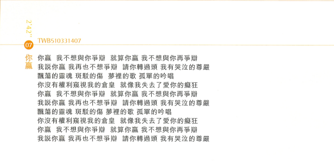

## 歌词

你赢 我不想与你争辩 就算你赢 我不想与你争辩  
我说你赢 我再也不想争辩 请你转过头 我有哭泣的尊严  
飘荡的灵魂 斑驳的伤 梦里的歌 孤单的吟唱  
你没有权力窥视我的仓皇 就像我失去了爱你的痴狂  
你赢 我不想与你争辩 就算你赢 我不想与你争辩  
我说你赢 我再也不想争辩 请你转过头 我有哭泣的尊严  
飘荡的灵魂 斑驳的伤 梦里的歌 孤单的吟唱  
你没有权力窥视我的仓皇 就像我失去了爱你的痴狂  
你赢 我不想与你争辩 就算你赢 我不想与你争辩  
我说你赢 我再也不想争辩 请你转过头 我有哭泣的尊严

# 寂寞

TWB510331408

作词：张雨生  
作曲：张雨生

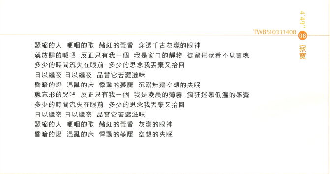

## 歌词

瑟缩的人 哽咽的歌 赭红的黄昏 穿透千古灰蒙的眼神  
就放肆的喊吧 反正只有我一个 我是窗口的静物 徒留形状看不见灵魂  
多少的时间流失在眼前 多少的思念我丢弃又拾回  
日以继夜 日以继夜 品尝它苦涩的滋味  
昏暗的灯 混乱的床 悸动的梦魇 沉溺无边空想的失眠  
就忘形哭吧 反正只有我一个 我是凌晨的薄雾 疯狂迷恋低温的感觉  
多少的时间流失在眼前 多少的思念我丢弃又拾回  
日以继夜 日以继夜 品尝它苦涩的滋味  
瑟缩的人 哽咽的歌 赭红的黄昏 穿透千古 灰蒙的眼神  
昏暗的灯 混乱的床 悸动的梦魇 沉溺无边 空想的失眠

# 单身旅记

TWB510331409

作词：张雨生  
作曲：张雨生

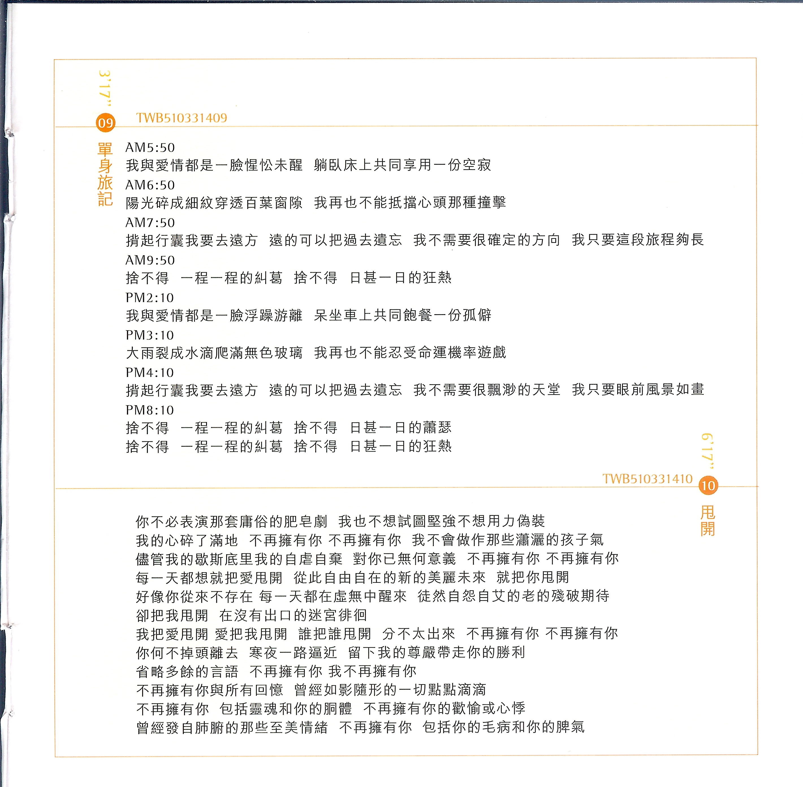

## 歌词

AM5:50  
我与爱情都是一脸惺忪未醒 躺卧床上共同享用一份空寂  
AM6:50  
阳光碎成细纹穿透百叶窗隙 我再也不能抵抗心头那种撞击  
AM7:50  
背起行囊我要去远方 远的可以把过去遗忘 我不需要很确定的方向 我只要这段旅程够长  
AM9:50  
舍不得 一程一程的纠葛 舍不得 日甚一日的狂热  
AM2:10  
我与爱情都是一脸浮躁游离 呆坐车上共同饱餐一份孤僻  
AM3:10  
大雨裂成水滴爬满无色玻璃 我再也不能忍受命运机率游戏  
PM4:10  
背起行囊我要去远方 远的可以把过去遗忘 我不需要飘渺的天堂 我只要眼前风景如画  
PM8:10  
舍不得 一程一程的纠葛 舍不得 日甚一日的萧瑟  
舍不得 一程一程的纠葛 舍不得 日甚一日的狂热

# 甩开

TWB510331410

作词：张雨生  
作曲：张雨生

## 歌词

你不必表演那套庸俗的肥皂剧 我也不想试图坚强不想用力伪装  
我的心碎了满地 不再拥有你 不再拥有你 我不会做作那些潇洒的孩子气  
尽管我的歇斯底里我的自虐自弃 对你已无何意义 不再拥有你 不再拥有你  
每一天都想把爱甩开 从此自由自在的新的美丽未来 就把你甩开  
好像你从来不存在 每一天都在虚无中醒来 突然自怨自艾的老的残破期待  
却把我甩开 在没有出口的迷宫徘徊  
我把爱甩开 爱把我甩开 谁把谁甩开 分不太出来 不再拥有你 不再拥有你  
你何不掉头离去 寒夜一路逼近 留下我的尊严带走你的酒气  
省略多余的言语 不再拥有你 我不再拥有你  
不再拥有你无与所有回忆 曾经如影随形的一切点点滴滴  
不再拥有你 包括灵魂和你的胴体 不再拥有你的欢愉或心悸  
曾经发自肺腑的那些至美情绪 不再拥有你 包括你的毛病和你的脾气

注：选用了网路上比较合理的听写
| 原听写→校对 |
| :---------: |
|  胜利→酒气  |
|  徒然→突然  |

# 眼睛里的湖水

TWB510331411

作词：张雨生  
作曲：张雨生

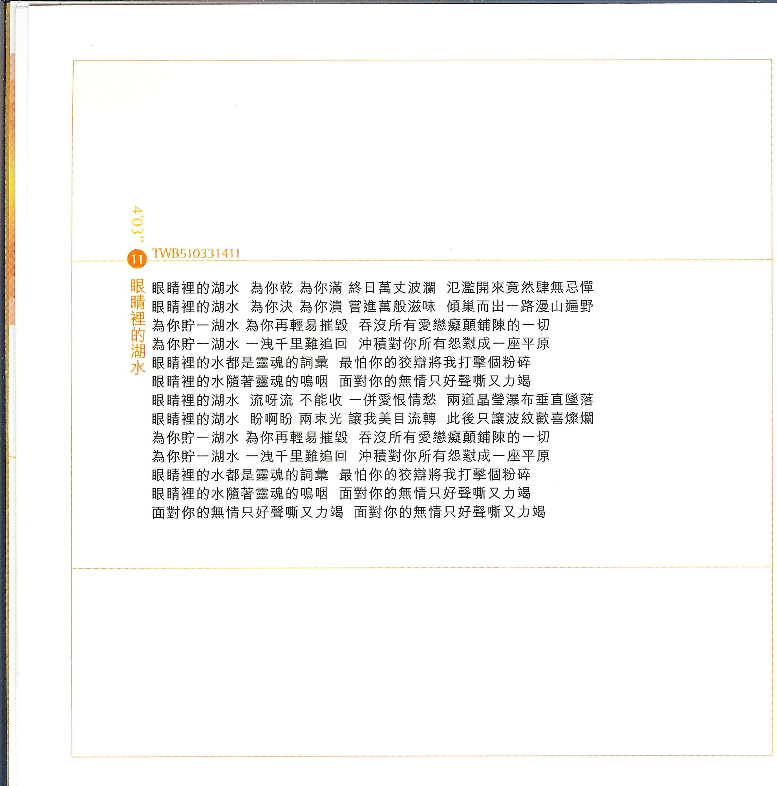

## 歌词

眼睛里的湖水 为你干 为你满 终日万丈波澜 泛滥开来竟然肆无忌惮  
眼睛里的湖水 为你绝 为你溃 尝尽万般滋味 倾巢而出一路满山遍野  
为你贮一湖水 为你再轻易摧毁 吞没所有爱恋痴癫颠铺陈的一切  
为你贮一湖水 一泄千里难追回 冲击对你所有怨怼成一座平原  
眼睛里的水都是灵魂的词汇 最怕你的狡辩将我打击个粉碎  
眼睛里的水随着灵魂的呜咽 面对你的无情只好声嘶又力竭  
眼睛里的湖水 流呀流 不能收 一并爱恨情愁 两道晶莹瀑布垂直坠落  
眼睛里的湖水 盼啊盼 两束光 让我美目流转 此后只让波纹欢喜灿烂  
为你贮一湖水 为你再轻易摧毁 吞没所有爱恋痴癫颠铺陈的一切  
为你贮一湖水 一泄千里难追回 冲击对你所有怨怼成一座平原  
眼睛里的水都是灵魂的词汇 最怕你的狡辩将我打击个粉碎  
眼睛里的水随着灵魂的呜咽 面对你的无情只好声嘶又力竭  
面对你的无情只好声嘶又力竭 面对你的无情只好声嘶又力竭

# 'O Sole Mio

TWB510331412

作词：张雨生  
作曲：张雨生

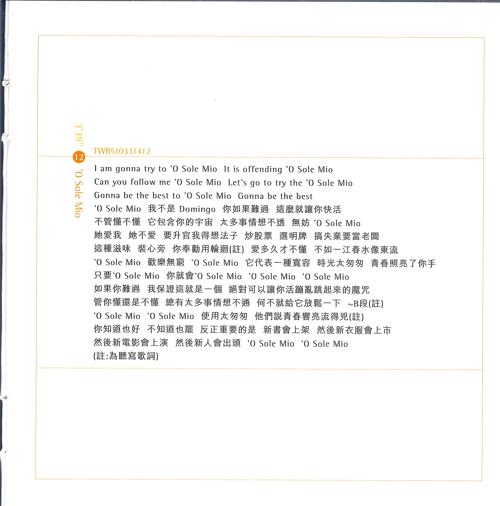

## 歌词

I am gonna try 'O Sole Mio It is offending 'O Sole Mio  
Can you follow me 'O Sole Mio Let's go to try the 'O Sole Mio  
Gonna be the best to 'O Sole Mio Gonna be the best  
'O Sole Mio 我不是 Domingo 你如果难过 这么就让你快活  
不管懂不懂 它包含你的宇宙 太多事情想不透 无妨'O Sole Mio  
她爱我 她不爱 要升官我得想法子 炒股票 选明牌 搞事业要当老板  
这种滋味 装心旁 你奉献用轮回 (注) 爱多久踩不动 不如一江春水向东流  
'O Sole Mio 换乐无穷 'O Sole Mio 它代表一种宽容 时光太匆匆 青春照亮了你手  
只要'O Sole Mio 你就会'O Sole Mio 'O Sole Mio 'O Sole Mio  
如果你离开 我保证这就是一个 绝对可以让你活蹦乱跳起来的魔咒  
尽管你懂还是不懂 总有太多事情想不通 何不就给它放松一下 ~B 段 (注)  
'O Sole Mio 'O Sole Mio 使用太匆匆 他们说青春响亮流得凶 (注)  
你知道也好 不知道也罢 反正重要的是 新书会上架 然后新衣服会上市  
然后电影会上演 然后新人会出头 'O Sole Mio 'O Sole Mio  
(注：为听写歌词)

# 风留给春天

TWB510331413

作词：张雨生  
作曲：张雨生

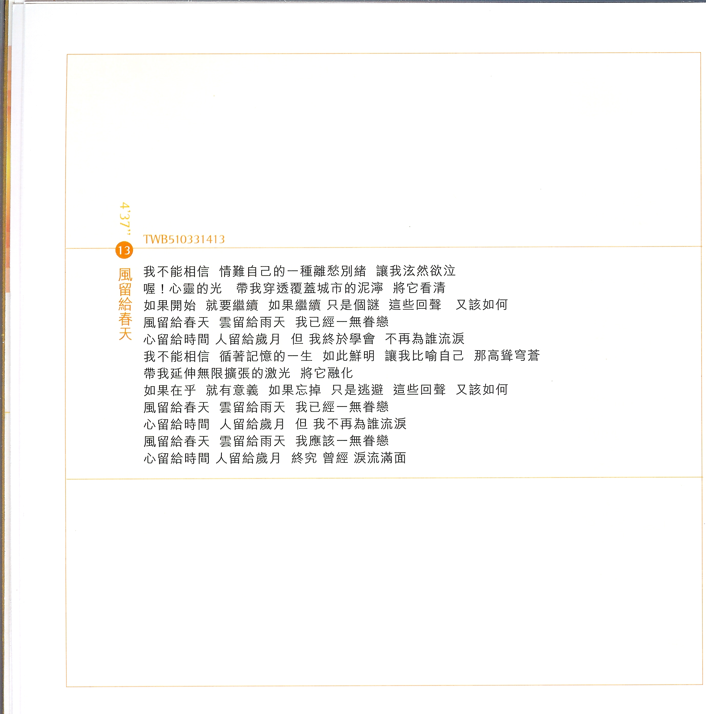

## 歌词

我不能相信 情难让我自己的一种离愁别绪 让我泫然欲泣  
喔 ! 心灵的光 带我穿透覆盖城市的泥泞 将它看清  
如果开始 就要继续 如果继续 只是个谜 这些回声 又该如何  
风留给春天 云留给雨天 我已经一无眷恋  
心留给世界 人留给岁月 但 我终于学会 不再为谁流泪  
我不能相信 循着记忆的一生 如此鲜明 让我比喻自己 那高耸穹苍  
带我延伸无限扩张的激光 将它融化  
如果在乎 就有意义 如果忘掉 只是逃避 这些回声 又该如何  
风留给春天 云留给雨天 我应该一无眷恋  
心留给时间 人留给岁月 但我不再为谁流泪  
风留给春天 云留给雨天 我应该一无眷恋  
心留给时间 人流给岁月 终究 曾经 泪流满面

# 有一道彩虹

TWB510331414

作词：张雨生  
作曲：张雨生

## 歌词

有一天 我和你走在一片金黄的花园 看着你舞蹈 迷惑我心弦  
深深期盼月亮成圆 我想朝夕在你身边 听你尽情唱 尽情笑  
希望他 正如诗人眼里幻变的睡莲 忽而在水面 转眼千年前 逃不开你隐约的眼  
好个咏叹不已的洁 除非天上来到人间  
我所爱你曾有情 但花园里面已缤纷艳丽 看光影投射一地  
啊 有一道彩虹 在你我的心中 从你的唇开始初春的夜空  
天枢天璇天玑天权天衡开阳摇光  
有一道彩虹 在你我的心中 从你的泪牵引农忙的节气  
立秋处暑白露秋分寒露霜降才有了意义  
海涅说：「爱人请将手放在我胸前」  
我也正捶打灵魂的雕像 接着他们留下的光  
要你一眼洞悉明白 从此不再傻不再慌  
我所爱你曾有情 但花园里面已缤纷艳丽 看光影投射一地  
啊 有一道彩虹 在你我的心中 从你的唇间开始初春的夜空  
天枢天璇天玑天权天衡开阳摇光  
有一道彩虹 在你我的心中 从你的泪牵引农忙的节气  
立秋处暑白露秋分寒露霜降才有了意义  
有一道彩虹 在你我的心中 从你的唇间开始初春的夜空  
天枢天璇天玑天权天衡开阳摇光  
有一道彩虹 在你我的心中 从你的泪牵引农忙的节气  
立秋处暑白露秋分寒露霜降才有了意义

注：选用了网路上比较合理的听写
|      原听写→校对      |
| :-------------------: |
|       轻轻→尽情       |
|       储存→初春       |
|     海也说→海涅说     |
| 转眼近眼前→转眼千年前 |

# 文案
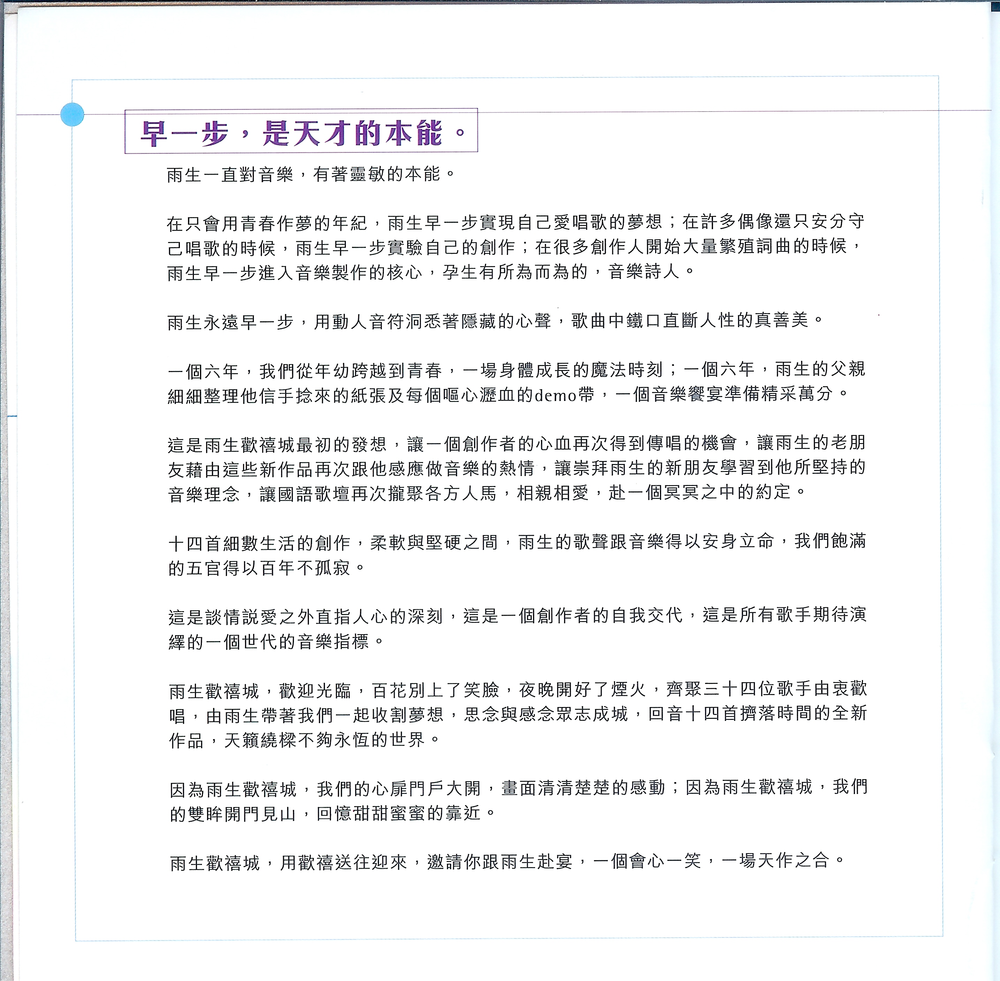

雨生一直对音乐，有着灵敏的本能。

在只会用青春做梦的年纪，雨生早一步实现自己爱唱歌的梦想；在许多偶像还只安分守己唱歌的时候，雨生早一步实验自己的创作；在很多创作人开始大量繁殖词曲的时候，雨生早一步进入音乐制作的核心，孕生有所为而为的，音乐诗人。

雨生永远早一步，用动人音符洞悉着隐藏的心声，歌曲中铁口直断人性的真善美。

一个六年，我们从年幼跨越到青春，一场身体成长的魔法时刻；一个六年，雨生的父亲细细整理他信手捻来的纸张及每个呕心沥血的 demo 带，一个音乐飨宴准备精彩万分。

这是雨生欢禧城最初的发想，让一个创作者的心血再次得到传唱的机会，让雨生的老朋友借由这些新作品再次跟他感应做音乐的热情，让崇拜雨生的新朋友学习到他所坚持的音乐理念，让过于歌坛再次拢聚各方人马，相亲相爱，赴一个冥冥之中的约定。

十四首细数生活的创作，柔软与坚硬之间，雨生的歌声跟音乐得以安身立命，我们饱满的五官得以百年不孤寂。

这是谈情说爱之外直指人心的深刻，这是一个创作者的自我交代，这是所有歌手期待演绎的一个世代的音乐指标。

雨生欢禧城，欢迎光临，百花别上了笑脸，夜晚开好了烟火，齐聚三十四位歌手由衷歌欢唱，由雨生带领我们一起收割梦想，思念与感念众志成城，回首十四首挤落时间的全新作品，天籁绕梁不够永恒的世界。

因为雨生欢禧城，我们的心扉门户大开，门面清清楚楚的感动，因为雨生欢禧城，我们的双眸开门见山，回忆甜甜蜜蜜的靠近。

雨生欢禧城，用欢禧送往迎来，邀请你跟雨生赴宴，一个会心一笑，一场天作之合。

# 小时候

作词：张雨生  
作曲：张雨生

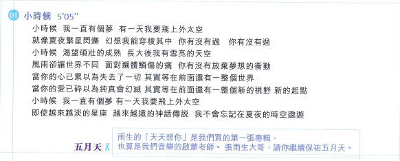

## 歌词

小时候我一直有个梦 有一天我要飞上外太空  
就像夏夜繁星闪烁 幻想我能穿梭其中 你有没有过 你有没有过  
小时候 渴望硕壮的成熟 长大后我有雪亮的天空  
风雨却让世界不同 面对遍体鳞伤的痛 你有没有放弃梦想的冲动  
当你的心已累以为失去了一切 其实等在前面还有一整个世界  
当你的爱已碎以为纯真会幻灭 其实等在前面还有一整个新的视野 新的起点  
小时候我一直有个梦 有一天我要飞上外太空 即使越来越淡的星座  
越来越远的神话传说 我不会忘记在夏夜的时空遨游

| 五月天                                                                                                   |
| :------------------------------------------------------------------------------------------------------- |
| 雨生的「天天想你」，是我们买的第一张专辑， 也算是我们音乐的启蒙老师。张雨生大哥，请你继续保佑五月天。 |

  

# 眼睛里的湖水

作词：张雨生  
作曲：张雨生

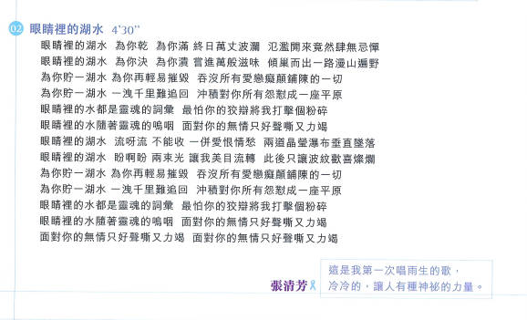

## 歌词

眼睛里的湖水 为你干 为你满 终日万丈波澜 泛滥开来竟然肆无忌惮  
眼睛里的湖水 为你绝 为你溃 尝尽万般滋味 倾巢而出一路满山遍野  
为你贮一湖水 为你再轻易摧毁 吞没所有爱恋痴癫颠铺陈的一切  
为你贮一湖水 一泄千里难追回 冲击对你所有怨怼成一座平原  
眼睛里的水都是灵魂的词汇 最怕你的狡辩将我打击个粉碎  
眼睛里的水随着灵魂的呜咽 面对你的无情只好声嘶又力竭  
眼睛里的湖水 流呀流 不能收 一并爱恨情愁 两道晶莹瀑布垂直坠落  
眼睛里的湖水 盼啊盼 两束光 让我美目流转 此后只让波纹欢喜灿烂  
为你贮一湖水 为你再轻易摧毁 吞没所有爱恋痴癫颠铺陈的一切  
为你贮一湖水 一泄千里难追回 冲击对你所有怨怼成一座平原  
眼睛里的水都是灵魂的词汇 最怕你的狡辩将我打击个粉碎  
眼睛里的水随着灵魂的呜咽 面对你的无情只好声嘶又力竭  
面对你的无情只好声嘶又力竭 面对你的无情只好声嘶又力竭

| 张清芳                                                   |
| :------------------------------------------------------- |
| 这是我第一次唱雨生的歌， 冷冷的，让人有种神秘的力量。 |

# 甩开

作词：张雨生  
作曲：张雨生

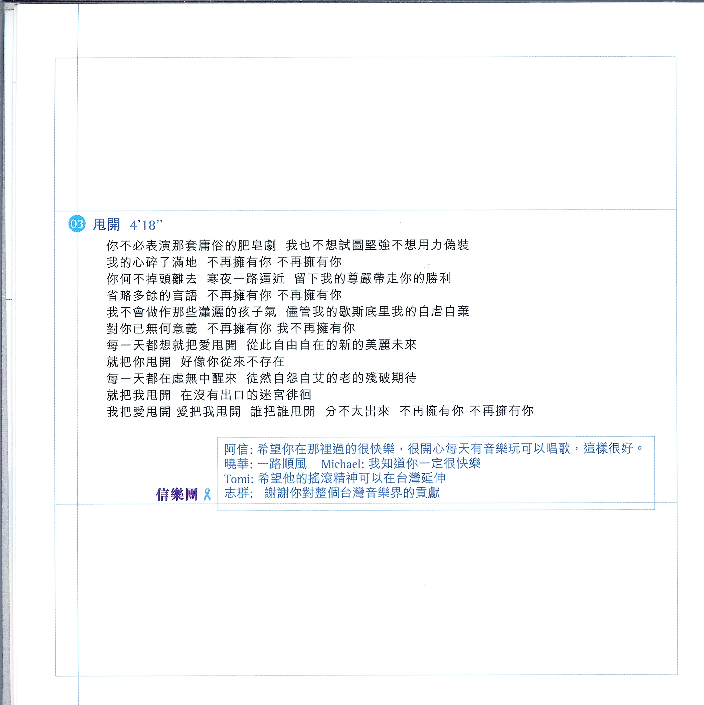

## 歌词

你不必表演那套庸俗的肥皂剧 我也不想试图坚强不想用力伪装  
我的心碎了满地 不再拥有你 不再拥有你 我不会做作那些潇洒的孩子气  
尽管我的歇斯底里我的自虐自弃 对你已无何意义 不再拥有你 不再拥有你  
每一天都想把爱甩开 彼此自由自在的新的美丽未来 就把你甩开  
好像你从来不存在 每一天都在虚无中醒来 徒然自怨自艾的老的残破期待  
就把我甩开 在没有出口的迷宫徘徊  
我把爱甩开 爱把我甩开 谁把谁甩开 分不太出来 不再拥有你 不再拥有你  
你何不掉头离去 寒夜一路逼近 留下我的尊严带走你的胜利  
省略多余的言语 不再拥有你 我不再拥有你  
不再拥有你无与所有回忆 曾经如影随形的一切点点滴滴  
不再拥有你 包括灵魂和你的胴体 不再拥有你的欢愉或心悸  
曾经发自肺腑的那些至美情绪 不再拥有你 包括你的毛病和你的脾气

| 信乐团                                                                                                                                                                                        |
| :-------------------------------------------------------------------------------------------------------------------------------------------------------------------------------------------- |
| 阿信：希望你在那里很快乐，很开心每天有音乐玩可以唱歌，这样很好。 晓华：一路顺风  Michael：我知道你一定很快乐 Tomi：希望他的摇滚精神可以在台湾延伸 志群：谢谢你对整个台湾音乐界的贡献 |

# 你赢

作词：张雨生  
作曲：张雨生

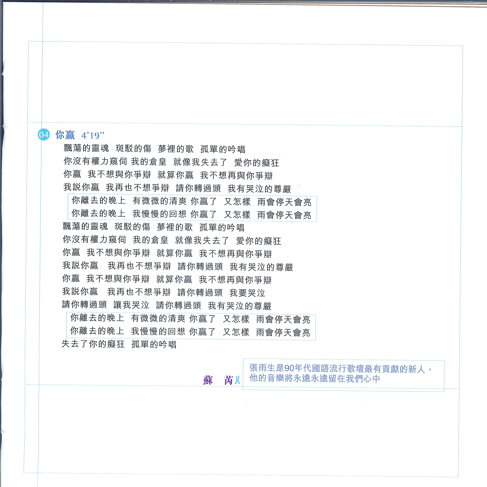

## 歌词

飘荡的灵魂 斑驳的伤 梦里的歌 孤单的吟唱  
你没有权力窥伺 我的仓皇 就像我失去了 爱你的疯狂  
你赢 我不想与你争辩 就算你赢 我不想再与你争辩  
我说你赢 我再也不想争辩 请你转过头 我有哭泣的尊严  
你离去的晚上 有微微的清爽 你赢了 又怎样 雨会停天会亮  
你离去的晚上 我慢慢的回想 你赢了 又怎样 雨会停天会亮  
飘荡的灵魂 斑驳的伤 梦里的歌 孤单的吟唱  
你没有权力窥伺 我的仓皇 就像我失去了 爱你的疯狂  
你赢 我不想与你争辩 就算你赢 我不想再与你争辩  
我说你赢 我再也不想争辩 请你转过头 我有哭泣的尊严  
你赢 我不想与你争辩 就算你赢 我不想再与你争辩  
我说你赢 我再也不想争辩 请你转过头 我要哭泣  
请你转过头 让我哭泣 请你转过头 我有哭泣的尊严  
你离去的晚上 有微微的清爽 你赢了 又怎样 雨会停天会亮  
你离去的晚上 我慢慢的回想 你赢了 又怎样 雨会停天会亮  
失去了你的疯狂 孤单的吟唱  

| 苏芮                                                                     |
| :----------------------------------------------------------------------- |
| 张雨生是 90 年代国语流行歌坛最有贡献的新人， 他的音乐永远留在我们心中 |

# 爱过了头

作词：张雨生  
作曲：张雨生

## 歌词

我想我是爱过了头 才对你无边无际的奢求 任激情一路捉弄着我 像一碰即破的水晶球  
我想我是爱过了头 才失去勇气甘心逗留 恶醉于你的眼光馀波  像一蹶不振的小丑  
梦睡成花朵 你吹来季风 谁能稀释爱情酿的酒 如果我放手所有的寂寞推在我身后  
五官拥挤出伤痛 泪偷走了脸 叶落满你的夜 谁能跳过爱情的火圈  
阳台如是说「约莫向晚的时候，来呼吸爱的起落」  
我想我是爱过了头 才对你无怨无尤的纵容 当世界与我擦身而过 才讪笑自己太冲动  
梦睡成花朵 你吹来季风 谁能稀释爱情酿的酒 如果我放手所有寂寞堆在我身后  
五官拥挤出伤痛 泪偷走了脸 叶落满你的夜 谁能跳过爱情的火圈  
阳台如是说「约莫向晚的时候，来呼吸爱的起落」

| 范逸臣                                                                                     |
| :----------------------------------------------------------------------------------------- |
| 很崇拜他，他留给后辈一个追求的目标， 把他当成一个榜样去跟随，来砥砺自己更努力去做音乐。 |

# 爱情与耳语

作词：张雨生  
作曲：张雨生

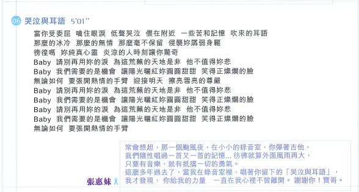

## 歌词

当你受委屈 噙住眼泪 低声哭泣 偎在附近 一些苦和记忆 吹来的耳语  
那么的冰冷 那么的无情 那么毫不保留 侵袭你孱弱身躯  
彷徨吗 你纯真心灵 炎凉的人时刻让你惊奇  
Baby 请别再用你的泪 为这荒芜的天地是非 他不值得你悲  
Baby 我们需要的是机会 让阳光晒红你圆圆甜甜 笑得正灿烂的脸  
无论如何 要张开热情的手臂 迎接明天 擦亮雪亮的尊严  
Baby 请别再用你的泪 为这荒芜的天地是非 他不值得你悲  
Baby 我们需要的是机会 让阳光晒红你圆圆甜甜 笑的正灿烂的脸  
Baby 请别再用你的泪 为这荒芜的天地是非 他不值得你悲  
Baby 我们需要的是机会 让阳光晒红你圆圆甜甜 笑的正灿烂的脸
无论如何 要张开热情的手臂

| 张惠妹                                                                                                                                                                                                                                                                             |
| :--------------------------------------------------------------------------------------------------------------------------------------------------------------------------------------------------------------------------------------------------------------------------------- |
| 常会想起，那一个台风夜，在小小的录音室，你弹着吉他， 我们随性唱过一首又一首的记忆... 仿佛就算外面风雨再大， 只要有音乐，就有抵挡一切的勇气。 这么多年过去了，当我在录音室里，唱着你留下的「哭泣与耳语」， 我才发现，你给我的力量，一直在我心理不曾离开。谢谢你！宝哥。 |

# Only Once

作词：张雨生
作曲：张雨生

## 歌词

Only once in your lifetime  Only once in your dream  Only once in your Paradise  也就足够  
Only once in your lifetime  Only once in your dream  Only once in your Paradise  我就足够  
在午夜过后的风雨里  不由自主的想着你  在微微颤颤的烛光里 轻而易举翻搅了情绪  
我凌空爱情在纠缠里 不容一点一些给恋窒息 让思念上瘾成了怀疑才招呼月色开怀痛饮  
来喝一杯  喝一杯就醉 红颜风雨无所谓 来喝一杯 一杯就醉 这是我的快乐 也是我的泪  
Only once in your lifetime  Only once in your dream  Only once in your Paradise  也就足够  
Only once in your lifetime  Only once in your dream  Only once in your Paradise  我就足够

| 庾澄庆             |
| :----------------- |
| 音乐的生命是永恒的 |

# 我的爱

作词：张雨生  
作曲：张雨生

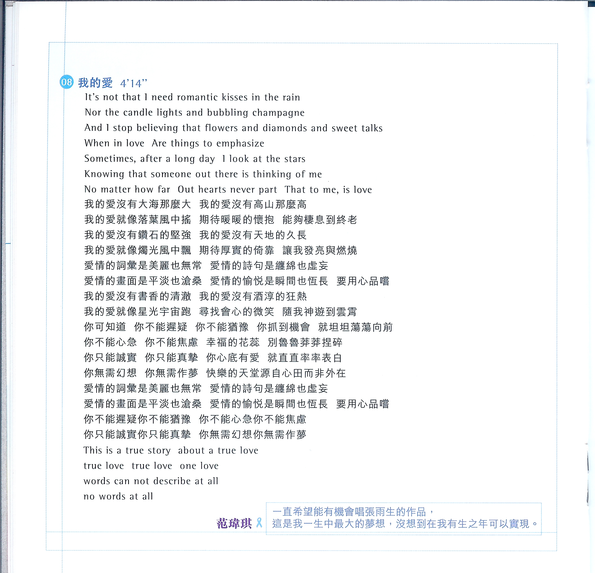

## 歌词

It's not that I need romantic kisses in the rain  
Nor the candle lights and bubbling champagne  
And I stop believing that flowers and diamonds and sweet talks  
When in love Are things to emphasize  
Sometimes, after a long day I look at the stars  
Knowing that someone out there is thinking of me  
No matter how far Out hearts never part That to me, is love  
我的爱没有大海那么大 我的爱没有高山那么高  
我的爱就像落叶风中摇 期待暖暖的怀抱 能够栖息到终老  
我的爱没有钻石的坚强 我的爱没有天地的久长  
我的爱就像烛光风中飘 期待厚实的倚靠 让我发亮与燃烧  
爱情的词汇是美丽也无常 爱情的诗句是缠绵也虚妄  
爱情的画面是平淡也沧桑 爱情的愉悦是瞬间也恒长 要用心品尝  
我的爱没有书香的清澈 我的爱没有酒醇的狂热  
我的爱就像星光宇宙跑 寻找会心的微笑 随我神游到云霄  
你可知道 你不能迟疑 你不能犹豫 你抓到机会 就坦坦荡荡向前  
你不能心急 你不能焦虑 幸福的花蕊 别鲁鲁莽莽捏碎  
你只能诚实 你只能真挚 你心底有爱 就直直率率表白  
你无需幻想 你无需作梦 快乐的天堂源自心田而非外在  
爱情的词汇是美丽也无常 爱情的诗句是缠绵也虚妄  
爱情的画面是平淡也沧桑 爱情的愉悦是瞬间也恒长 要用心品尝  
你不能迟疑你不能犹豫 你不能心急你不能焦虑  
你只能诚实你只能真挚 你无需幻想你无需作梦  
This is a true story about a true love  
true love true love one love  
words can not describe at all  
no words at all

| 范玮琪                                                                                 |
| :------------------------------------------------------------------------------------- |
| 一直希望能有机会唱张雨生的作品， 这是我一生最大的梦想，没想到在我有生之年可以实现。 |

# 单身旅记

作词：张雨生  
作曲：张雨生

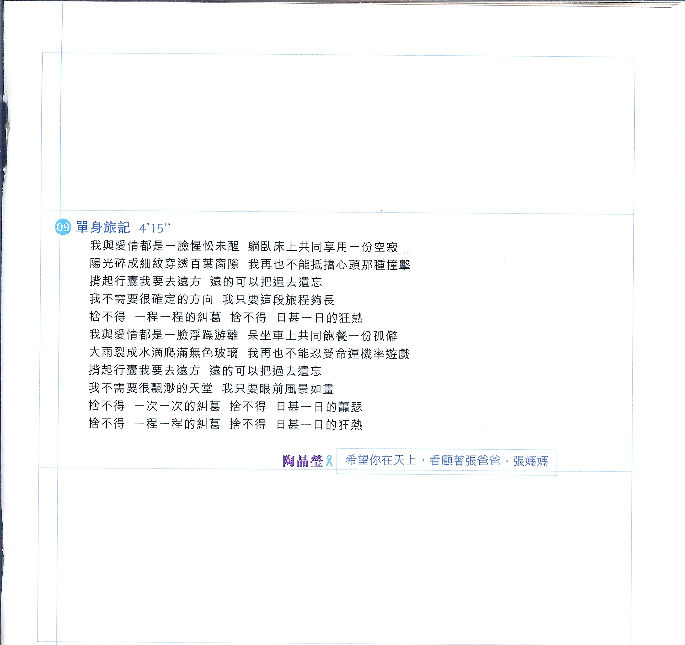

## 歌词

AM5:50  
我与爱情都是一脸惺忪未醒 躺卧床上共同享用一份空寂  
AM6:50  
阳光碎成细纹穿透百叶窗隙 我再也不能抵抗心头那种撞击  
AM7:50  
背起行囊我要去远方 远的可以把过去遗忘 我不需要很确定的方向 我只要这段旅程够长  
AM9:50  
舍不得 一程一程的纠葛 舍不得 日甚一日的狂热  
AM2:10  
我与爱情都是一脸浮躁游离 呆坐车上共同饱餐一份孤僻  
AM3:10  
大雨裂成水滴爬满无色玻璃 我再也不能忍受命运机率游戏  
PM4:10  
背起行囊我要去远方 远的可以把过去遗忘 我不需要飘渺的天堂 我只要眼前风景如画  
PM8:10  
舍不得 一程一程的纠葛 舍不得 日甚一日的萧瑟  
舍不得 一程一程的纠葛 舍不得 日甚一日的狂热

| 陶晶莹                             |
| :--------------------------------- |
| 希望你在天上，看护者张爸爸，张妈妈 |

# 寂寞

作词：张雨生  
作曲：张雨生

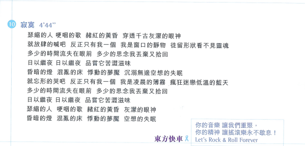

## 歌词

瑟缩的人 哽咽的歌 赭红的黄昏 穿透千古灰蒙的眼神  
就放肆的喊吧 反正只有我一个 我是窗口的静物 徒留形状看不见灵魂  
多少的时间流失在眼前 多少的思念我丢弃又拾回  
日以继夜 日以继夜 品尝它苦涩的滋味  
昏暗的灯 混乱的床 悸动的梦魇 沉溺无边空想的失眠  
就忘形哭吧 反正只有我一个 我是凌晨的薄雾 疯狂迷恋低温的感觉  
多少的时间流失在眼前 多少的思念我丢弃又拾回  
日以继夜 日以继夜 品尝它苦涩的滋味  
瑟缩的人 哽咽的歌 赭红的黄昏 穿透千古 灰蒙的眼神  
昏暗的灯 混乱的床 悸动的梦魇 沉溺无边 空想的失眠

| 东方快车                                                                    |
| :-------------------------------------------------------------------------- |
| 你的音乐 让我们重聚 你的精神 让摇滚永不歇息 Let's Rock & Roll Forever |

# 风留给春天

作词：张雨生  
作曲：张雨生

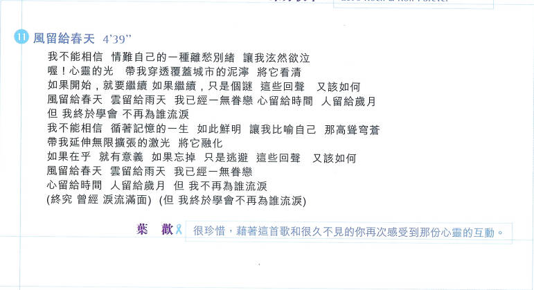

## 歌词

我不能相信 情难我自己的一种离愁别绪 让我泫然欲泣  
喔 ! 心灵的光 带我穿透覆盖城市的泥泞 将它看清  
如果开始 就要继续 如果继续 只是个谜 这些回声 又该如何  
风留给春天 云留给雨天 我已经一无眷恋  
心留给世界 人留给岁月 但 我终于学会 不再为谁流泪  
我不能相信 循着记忆的一生 如此鲜明 让我比喻自己 那高耸穹苍  
带我延伸无限扩张的激光 将它融化  
如果在乎 就有意义 如果忘掉 只是逃避 这些回声 又该如何  
风留给春天 云留给雨天 我应该一无眷恋  
心留给时间 人留给岁月 但我不再为谁流泪  
风留给春天 云留给雨天 我应该一无眷恋  
心留给时间 人流给岁月 终究 曾经 泪流满面

| 叶欢                                                       |
| :--------------------------------------------------------- |
| 很珍惜，藉著这首歌和很久不见的你再次感受到那份心灵的互动。 |

# 'O Sole Mio

TWB510331412

词：张雨生
曲：Eduardo di Capua

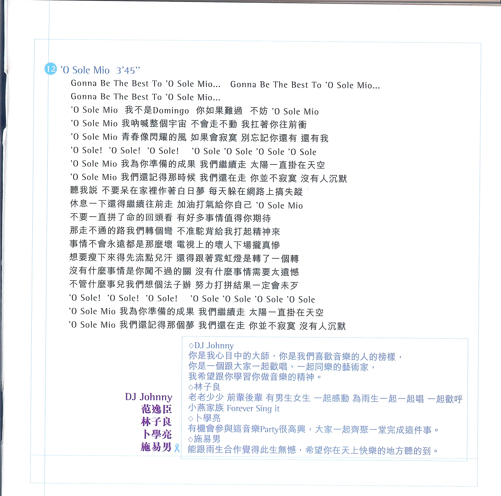

## 歌词

Gonna be the best 'O Sole Mio...  Gonna be the best 'O Sole Mio...  
Gonna be the best 'O Sole Mio...  
'O Sole Mio 我不是 Domingo 你如果难过 不妨 'O Sole Mio  
'O Sole Mio 我呐喊整个宇宙 不会走不动 我扛着你往前冲  
'O Sole Mio 青春像闪耀的风 如果会寂寞 别忘记你还有我 还有我  
'O Sole！ 'O Sole！ 'O Sole 'O Sole 'O Sole 'O Sole  
'O Sole Mio 我为你准备的成果 我们继续走 太阳一直挂在天空  
'O Sole Mio 我们还记得那时候 我们还在走 你并不寂寞 没有人沉默  
听我说 不要每天待在家里做着白日梦 每天躲在网络上面搞失踪  
休息一下还得继续往前走 加油打气给你自己 'O Sole Mio  
不要一直拼了命地回头看 有好多事情值得你期待  
在走不动的路我们转个弯 不准驼背给我打起精神来  
事情不会永远都是那么坏 电视上的坏人下场搞真惨  
想要瘦下来得先流点儿汗 还得跟着霓虹灯是转了一个转  
没有什么是你闯不过的关 没有什么事情需要太遗憾  
不管什么事儿我们想个法子办 努力打拼结果一定会未歹  
'O Sole！ 'O Sole！ 'O Sole 'O Sole 'O Sole 'O Sole  
'O Sole Mio 我为你准备的成果 我们继续走 太阳依旧挂在天空 一直在天空  
'O Sole Mio 我们还记得那个梦 我们还在走 你并不寂寞 没有人沉默

| DJ Johnny、林子良、小燕家族、卜学亮、施易男                                                                                                                                                                                                                                                                                                                                                            |
| :----------------------------------------------------------------------------------------------------------------------------------------------------------------------------------------------------------------------------------------------------------------------------------------------------------------------------------------------------------------------------------------------------- |
| ◇DJ Johnny 你是我心目中的大师，你是我们喜欢音乐人的榜样， 你是一个跟大家一起欢唱、一起同乐的艺术家， 我希望跟你你学习你做音乐的精神。  ◇林子良 老老少少 前辈后辈 有男生女生 一起感动 为雨生一起一起唱 一起欢呼 小燕家族 Forever Sing it  ◇卜学亮 有机会参与这音乐 Party 很高兴，大家一起齐聚一堂完成这件事。  ◇施易男 能跟雨生合作觉得此生无憾，希望你在天上快乐的地方听得到。 |

# 传言

作词：张雨生  
作曲：张雨生

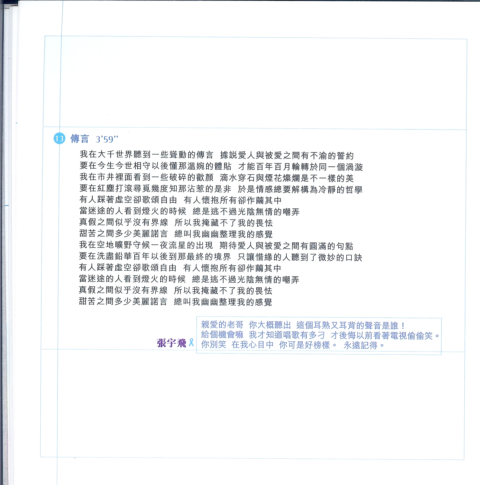

## 歌词

我在大千世界听到一些耸动的传言 据说爱人与被爱之间有不渝的誓约  
要在今生今世相守以后懂那温婉的体贴 才能百年百月轮转于同一个涡旋  
我在市井里面看到一些破碎的欢颜 滴水穿石与烟花灿烂是不一样的美  
要在红尘打滚寻觅几度知那沾惹的是非 于是情感总要解构为冷静的哲学  
有人踩着虚空却歌颂自由 有人怀抱所有却作茧其中  
当迷途的人看到灯火的时候 总是逃不过光阴无情的嘲弄  
真假之间似乎没有界限 所以我掩藏不了我的畏怯  
甜苦之间多少美丽诺言 总叫我幽幽整理我的感觉  
我在空地狂野守候一夜流星的出现 期待爱人与被爱之间有圆满的句点  
要在洗尽铅华百年以后到那最终的境界 只让惜缘的人听到了微妙的口诀  
有人踩着虚空却歌颂自由 有人怀抱所有却作茧其中  
当迷途的人看到灯火的时候 总是逃不过光阴无情的嘲弄  
真假之间似乎没有界限 所以我掩藏不了我的畏怯  
甜苦之间多少美丽诺言 总叫我幽幽整理我的感觉  

| 张宇飞                                                                                                                                                   |
| :------------------------------------------------------------------------------------------------------------------------------------------------------- |
| 亲爱的老哥 你大概听出 这个耳熟又耳背的声音是谁！ 给个机会嘛 你才知道唱歌又多刁 才后悔以前看著电视偷偷笑 你别笑 在我心目中 你可是好榜样。永远记得。 |

# 有一道彩虹

作词：张雨生  
作曲：张雨生

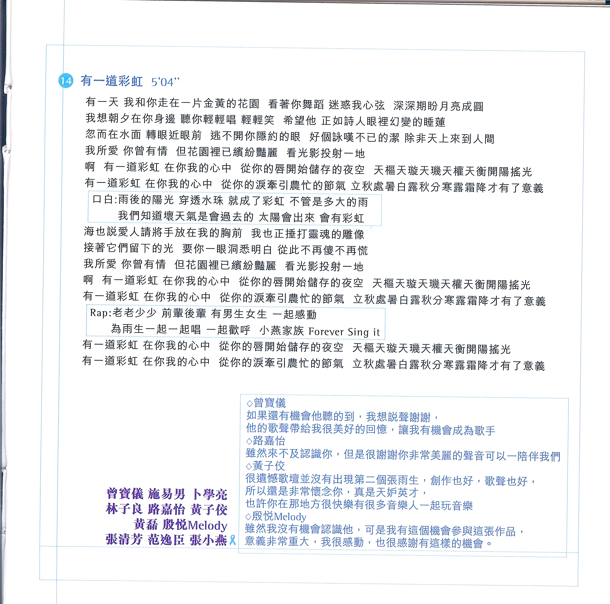

## 歌词

有一天 我和你走在一片金黄的花园 看着你舞蹈 迷惑我心弦 深深期盼月亮成圆   
我想朝夕在你身边 听你轻轻唱 轻轻笑 希望他 正如诗人眼里幻变的睡莲  
忽而在水面 转眼近眼前 逃不开你隐约的眼 好个咏叹不已的洁 除非天上来到人间  
我所爱 你曾有情 但花园里面已缤纷艳丽 看光影投射一地  
啊 有一道彩虹 在你我的心中 从你的唇间开始储存的夜空 天枢天璇天玑天权天衡开阳摇光  
有一道彩虹 在你我的心中 从你的泪牵引农忙的节气 立秋处暑白露秋分寒露霜降才有了意义  
口白：雨后的阳光 穿透水珠 就成了彩虹 不管是多大的雨  
      我们知道坏天气是会过去的 太阳会出来 会有彩虹  
海也说爱人请将手放在我胸前 我也正捶打灵魂的雕像  
接着他们留下的光 要你一眼洞悉明白 从此不再傻不再慌  
我所爱 你曾有情 但花园里面已缤纷艳丽 看光影投射一地  
啊 有一道彩虹 在你我的心中 从你的唇间开始储存的夜空 天枢天璇天玑天权天衡开阳摇光  
有一道彩虹 在你我的心中 从你的泪牵引农忙的节气 立秋处暑白露秋分寒露霜降才有了意义  
Rap: 老老少少 前辈后辈 有男生女生 一起感动  
     为女生一起唱 一起欢呼 小燕家族 Forever Sing it  
有一道彩虹 在你我的心中 从你的唇间开始储存的夜空 天枢天璇天玑天权天衡开阳摇光  
有一道彩虹 在你我的心中 从你的泪牵引农忙的节气 立秋处暑白露秋分寒露霜降才有了意义

| 曾宝仪 施易男 卜学亮 林子良 路嘉怡 黄子佼 黄磊 殷悦 Melody 张清芳 范逸臣 张小燕                                                                                                                                                                                                                                                                                                                                                                                                               |
| :-------------------------------------------------------------------------------------------------------------------------------------------------------------------------------------------------------------------------------------------------------------------------------------------------------------------------------------------------------------------------------------------------------------------------------------------------------------------------------------------- |
| ◇曾宝仪 如果还有机会他听得到，我想说谢谢， 他的歌手带给我很美好的回忆，让我优惠成为歌手  ◇路嘉怡 虽然来不及认识你，但是很谢谢你非常美丽的声音可以一陪伴我们  ◇黄子佼 很遗憾歌坛并没有出现第二个张雨生，创作也好，歌声也好， 所以还是非常想念你，真是天妒英才， 也许你在那地方很快乐有很多音乐人一起玩音乐  ◇殷悦 Melody 虽然我没有机会认识他，可是我有这个机会参与这张作品， 意义非常大，我很感动，也很感谢有这样的机会 |

# 歌曲发行信息

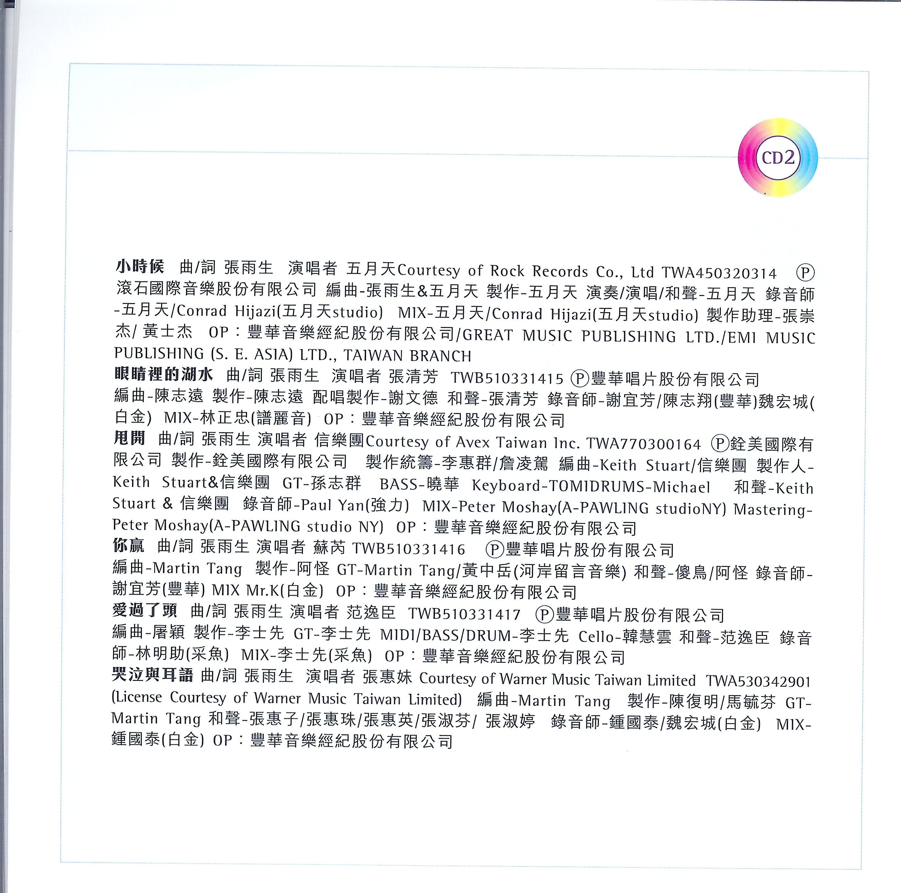

| **小时候**     |                                                                                                        |
| -------------- | ------------------------------------------------------------------------------------------------------ |
| 曲/词          | 张雨生                                                                                                 |
| 演唱者         | 五月天 Courtesy of Rock Records Co.,Ltd                                                                |
| TWA450320314   | Ⓟ滚石国际音乐股份有限公司                                                                              |
| 编曲           | 张雨生&五月天                                                                                          |
| 制作           | 五月天                                                                                                 |
| 演奏/演唱/和声 | 五月天                                                                                                 |
| 录音师         | 五月天 Conrad Hijazi(五月天 studio)                                                                    |
| MIX            | 五月天/Conrad Hijazi(五月天 studio)                                                                    |
| 制作助理       | 张崇杰/黄士杰                                                                                          |
| OP             | 丰华音乐经纪股份有限公司/GREAT MUSIC PUBLISHING LTD./EMI MUSICPUBLISHING(S. E. ASIA)LTD..TAIWAN BRANCH |

| **眼睛里的湖水** |                                    |
| ---------------- | ---------------------------------- |
| 曲/词            | 张雨生                             |
| 演唱者           | 张清芳                             |
| TWB510331415     | Ⓟ丰华唱片股份有限公司              |
| 编曲             | 陈志远                             |
| 制作             | 陈志远                             |
| 配唱制作         | 谢文德                             |
| 和声             | 张清芳                             |
| 录音师           | 谢宜芳/陈志翔 (丰华) 魏宏城 (白金) |
| MIX              | 林正忠 (谱丽音)                    |
| OP               | 丰华音乐经纪股份有限公司           |

| **甩开**     |                                     |
| ------------ | ----------------------------------- |
| 曲/词        | 张雨生                              |
| 演唱者       | 信乐团 Courtesy of Avex Taiwan Inc. | TWA770300164 |  |
| TWA770300164 | Ⓟ铨美国际有限公司                   |
| 制作         | 铨美国际有限公司                    |
| 制作统筹     | 李惠群/詹凌驾                       |
| 编曲         | Keith Stuart/信乐团                 |
| 制作人       | Keith Stuart & 信乐团               |
| GT           | 孙志群                              |
| BASS         | 晓华                                |
| Keyboard     | TOMI                                |
| DRUMS        | Michael                             |
| 和声         | Keith Stuart & 信乐团               |
| 录音师       | Paul Yan (强力)                     |
| MIX          | Peter Moshay (A-PAWLING studio NY)  |
| Mastering    | Peter Moshay (A-PAWLING studio NY)  |
| OP           | 丰华音乐经纪股份有限公司            |

| **你赢**     |                                  |
| ------------ | -------------------------------- |
| 曲/词        | 张雨生                           |
| 演唱者       | 苏芮                             |
| TWB510331416 | Ⓟ丰华唱片股份有限公司            |
| 编曲         | Martin Tang                      |
| 制作         | 阿怪                             |
| GT           | Martin Tang/黄中岳(河岸留言音乐) |
| 和声         | 傻鸟/阿怪                        |
| 录音师       | 谢宜芳 (丰华)                    |
| MIX          | Mr.K(白金)                       |
| OP           | 丰华音乐经纪股份有限公司         |

| **爱过了头**   |                          |
| -------------- | ------------------------ |
| 曲/词          | 张雨生                   |
| 演唱者         | 范逸臣                   |
| TWB510331417   | Ⓟ丰华唱片股份有限公司    |
| 编曲           | 屠颖                     |
| 制作           | 李士先                   |
| GT             | 李士先                   |
| MIDI/BASS/DRUM | 李士先                   |
| Cello          | 韩慧云                   |
| 和声           | 范逸臣                   |
| 录音师         | 林明助 (采鱼)            |
| MIX            | 李士先 (采鱼)            |
| OP             | 丰华音乐经纪股份有限公司 |

| **哭泣与耳语** |                                                   |
| -------------- | ------------------------------------------------- |
| 曲/词          | 张雨生                                            |
| 演唱者         | 张惠妹 Courtesy of Warner Music Taiwan Limited    |
| TWA530342901   | (License Courtesy of Warner Music Taiwan Limited) |
| 编曲           | Martin Tang                                       |
| 制作           | 隙复明/马毓芬                                     |
| GT             | Martin Tang                                       |
| 和声           | 张惠子/张惠珠/张惠英/张淑芬/张淑婷                |
| 录音师         | 钟国泰/魏宏城 (白金)                              |
| MIX            | 钟国泰 (白金)                                     |
| OP             | 丰华音乐经纪股份有限公司                          |

| **Only Once** |                                                        |
| ------------- | ------------------------------------------------------ |
| 曲/词         | 张雨生                                                 |
| 演唱者        | 庾澄庆 Courtesy of Sony Music Entertainment Taiwan Ltd |
| TWA470350001  | Ⓟ2003 Sony Music Entertainment Taiwan ltd.             |
| 编曲          | 涂惠源                                                 |
| 制作          | 徐德昌/黄伟峰                                          |
| GT            | 黄中岳 (河岸留言音乐)                                  |
| 和声          | 庾澄庆                                                 |
| 录音师        | 黄伟峰/李天行/江浩廷 (强力)                            |
| MIX           | 黄伟峰 (强力)                                          |
| OP            | 丰华音乐经纪股份有限公司                               |

| **我的爱**        |                                             |
| ----------------- | ------------------------------------------- |
| 曲/词             | 张雨生                                      |
| 演唱者            | 范玮琪 Courtesy of Linfair Records Limited. |
| TWD250319101      | Ⓟ2003 Linfair Records Limited.              |
| 编曲              | 黄中岳 (河岸留言音乐)                       |
| 制作              | 马毓芬                                      |
| GT                | 黄中岳                                      |
| Midi Strings 编曲 | 于京延                                      |
| 和声编写          | 马毓芬                                      |
| 和声              | 马毓芬/陈俊廷/王雅君/林怡芳/王弘洲/高正杰   |
| RAPPER            | 彭靖惠                                      |
| 录音师            | 陈陆泰 (福茂)/许财翁 (强力)                 |
| MIX               | 钟国泰 (白金)                               |
| OP                | 丰华音乐经纪股份有限公司                    |

| **单身旅记** |                                                       |
| ------------ | ----------------------------------------------------- |
| 曲/词        | 张雨生                                                |
| 演唱者       | 陶晶莹                                                |
| TWB510331418 | Ⓟ丰华唱片股份有限公司                                 |
| 编曲         | 钟成虎                                                |
| 制作         | 黄韵玲 (果核音乐)                                     |
| GT           | 钟成虎                                                |
| 和声         | 黄韵玲                                                |
| 录音师       | 谢宜芳 (丰华)/张瑞麟 (音沛)/杨大纬 (杨大综音乐工作室) |
| MIX          | Mr.K(白金)                                            |
| OP           | 丰华音乐经纪股份有限公司                              |

| **寂寞**     |                           |
| ------------ | ------------------------- |
| 曲/词        | 张雨生                    |
| 演唱者       | 东方快车                  |
| TWB510331419 | 丰华唱片股份有限公司      |
| 编曲         | 东方快车                  |
| 制作         | 东方快车                  |
| GT           | Mike Mclaughlin           |
| BASS         | 盛子贞                    |
| Keyboard     | 侯志坚                    |
| 和声         | 姚可杰                    |
| 录音师       | 盛子贞/谢宜芳 (丰华)      |
| MIX          | 盛子真 (撒哈拉)Mr.K(白金) |
| OP           | 丰华音乐经纪股份有限公司  |

| **风留给春天** |                          |
| -------------- | ------------------------ |
| 曲/词          | 张雨生                   |
| 演唱者         | 菜欢                     |
| TWB510331420   | 丰华唱片股份有限公司     |
| 编曲           | 王豫民                   |
| 制作           | 马毓芬                   |
| GT             | 倪方来                   |
| 和声编写       | 马毓芬                   |
| 和声           | 马毓芬/古皓              |
| 录音师         | 张瑞麟 (丰华/白金)       |
| MIX            | 钟国泰 (白金)            |
| OP             | 丰华音乐经纪股份有限公司 |

| **'0 Sole Mio** |                                  |
| --------------- | -------------------------------- |
| 曲/词           | 张雨生                           |
| TWB510331421    | Ⓟ丰华唱片股份有限公司            |
| 编曲            | 吕绍淳                           |
| 制作            | 阿怪                             |
| GT              | 张国玺                           |
| 录音师          | 谢宜芳 (丰华/东城)/张瑞麟 (音沛) |
| MIX             | Mr.K(白金)                       |
| OP              | 丰华音乐经纪股份有限公司         |

| **傅言**      |                             |
| ------------- | --------------------------- |
| 曲/词         | 张雨生                      |
| 演唱者        | 张宇飞                      |
| TWB510331422  | Ⓟ丰华唱片股份有限公司       |
| 编曲          | 吕绍淳                      |
| 制作          | Mr.K                        |
| 配唱制作      | 于光彦                      |
| GT            | 黄中岳 (河岸留言音乐)       |
| 和声编写/和声 | 郑知明                      |
| 录音师        | 谢宜芳 (丰华)/魏宏城 (白金) |
| MIX           | Mr.K(白金)                  |
| OP            | 丰华音乐经纪股份有限公司    |

| **有一道彩虹** |                                  |
| -------------- | -------------------------------- |
| 曲/词          | 张雨生                           |
| TWB510331423   | 丰华唱片股份有限公司             |
| 编曲           | 钟兴民                           |
| 制作           | 马毓芬                           |
| GT             | 黄中岳 (河岸留言音乐)            |
| Bass           | 邱培荣                           |
| 录音师         | 谢宜芳/蒋自强/钟国泰 (白金/丰华) |
| MIX            | 钟国泰 (白金)                    |
| OP             | 丰华音乐经纪股份有限公司         |

©丰华唱片股份有限公司
发行日期 2003 年 10 月

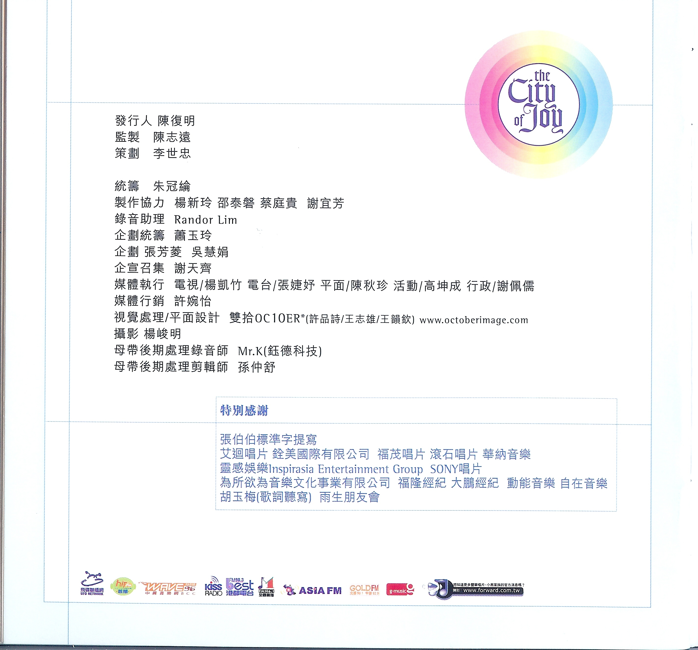

|        负责        |                                人员                                 |
| :----------------: | :-----------------------------------------------------------------: |
|       发行人       |                               陈复明                                |
|        监制        |                               陈志远                                |
|        策划        |                               李世忠                                |
|        统筹        |                               朱冠纶                                |
|      制作协力      |                     杨新玲 邵泰磐 蔡庭贵 谢宜芳                     |
|      录音助理      |                             Randor Lim                              |
|      企划统筹      |                               萧玉玲                                |
|        企划        |                            张芳菱 吴慧娟                            |
|      企宣召集      |                               谢天齐                                |
|      媒体执行      |     电视/杨凯竹 电台/张婕妤 平面/陈秋珍 活动/高坤成 行政/谢佩儒     |
|      媒体行销      |                               许婉怡                                |
| 视觉处理/平面设计  | 双拾 OC10ER*(许品诗/王志雄/王韵钦) www.octoberimage.com  |
|        摄影        |                               杨峻明                                |
| 母带后期处理录音师 |                           Mr.K(钰德科技)                            |
| 母带后期处理剪辑师 |                               孙仲舒                                |

| 特别感谢                                                                                                                                                                                                                          |
| --------------------------------------------------------------------------------------------------------------------------------------------------------------------------------------------------------------------------------- |
| 张伯伯标准字提写 艾回唱片 铨美国际有限公司 褔荗唱片 滚石唱片 华纳音乐 灵感娱乐 Inspirasia Entertainment Group SONY 唱片 为所欲为音乐文化事业有限公司 福隆经纪 大鹏经纪 动能音乐 自在音乐 胡玉梅 (歌词听写) 雨生朋友会 |

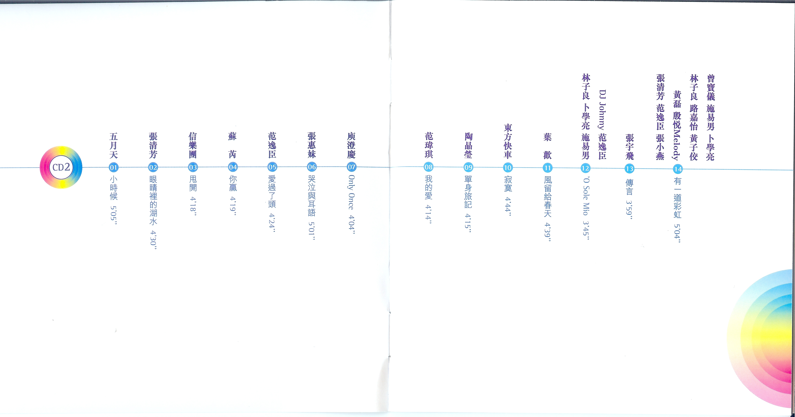
|                            |                       |
| -------------------------- | --------------------- |
|        |   |
|        |                       |
|        |  |
| 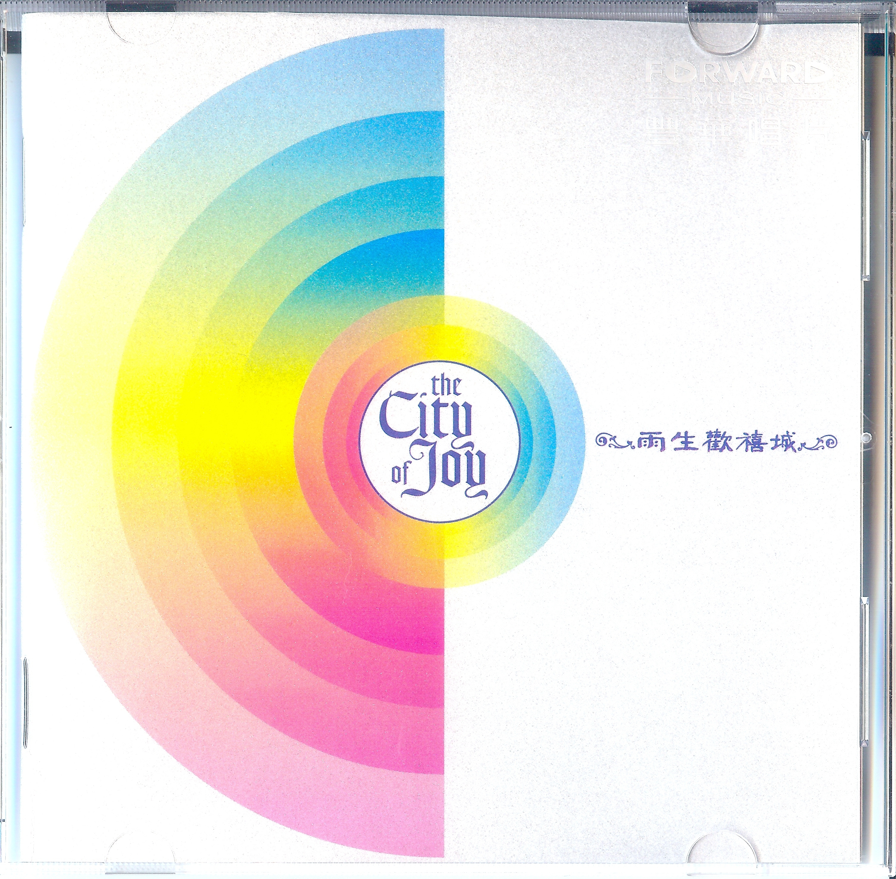      | 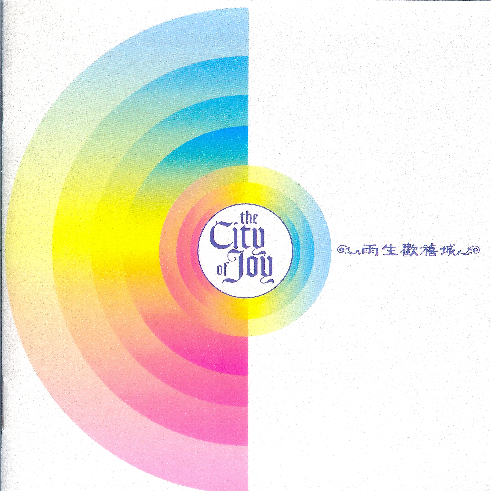 |
|       |                       |
|  | 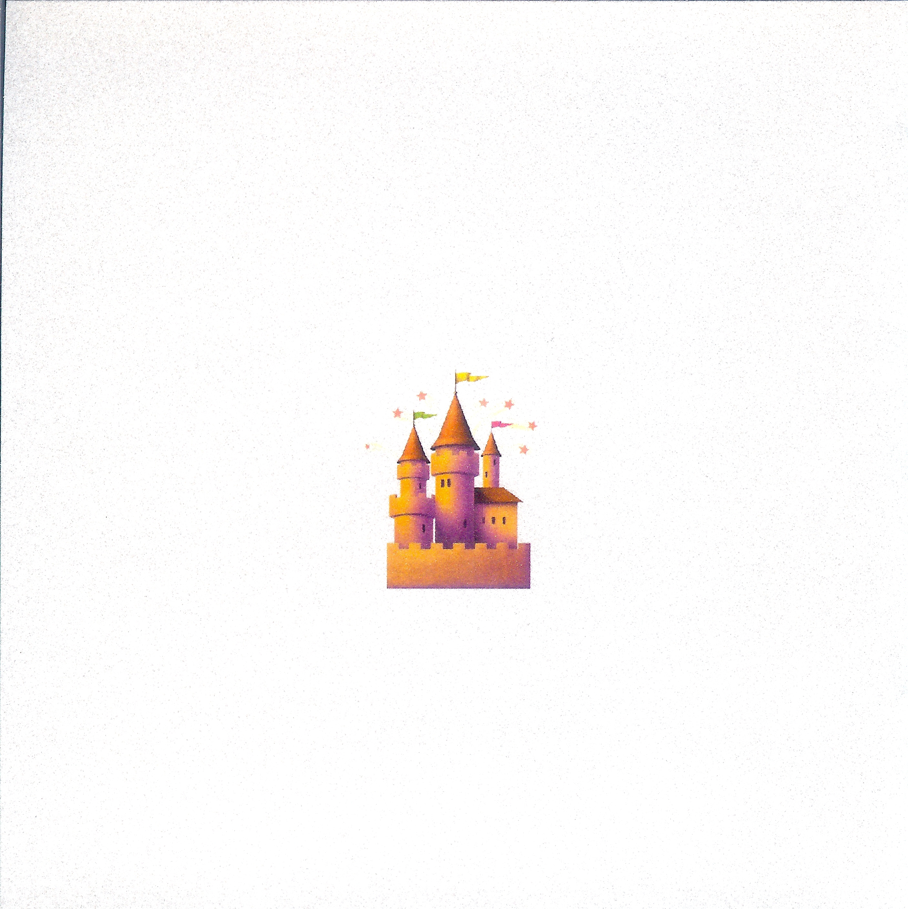 |