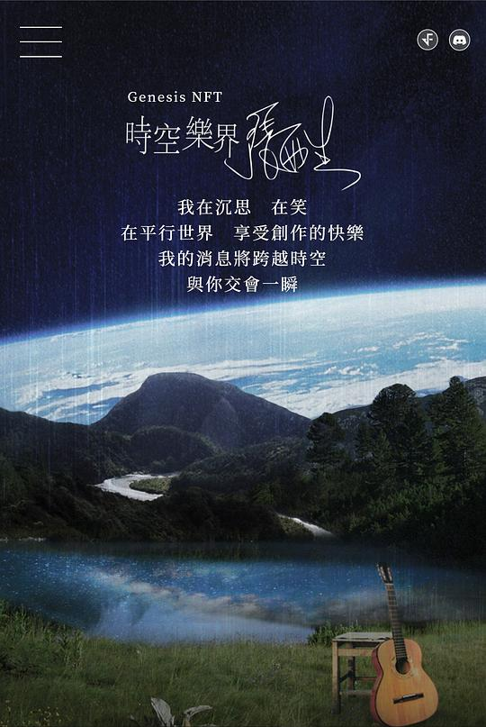

# 乐界

# 年老

当我年老 领悟知天命的诀窍 就不再会对脸上皱纹斤斤计较  
当我年老 享有人生洗练的骄傲 就不会再为幼稚的青春苦苦哭嚎  
当我年老 征服时光轮轴的奥妙 就不会再因爱欲熊熊燃烧  
当我年老 吟诵每个感性的欢笑 何妨干硬的手脚 何妨那无牙一笑

你为何要流泪 这不是为了谁 你会品尝到滋味  
就像一首歌 完美的搭配 我满足每一刻
忘却一身疲惫  
围绕我周围 宁静与和谐  
回味与沉醉 所有生命的美

这和平的感觉  
将存在我心扉  
永伴我长眠

小子们都想问我  
关于孤独与衰老  
我不能安慰你们的焦躁  
当我的心灵常在躯壳之外逍遥  
听水听蝉听蛙叫  
望生望死望尘嚣

大自然的骨架 人工的脊椎 撑起文明火焰  
多少个季节 狂欢和惭愧 是神圣的歌谣  
宽容一切犯罪  
用心灵感觉 逝去的岁月  
不会再埋怨 心灵此今蜷睡

这和平的感觉  
将存在我心扉  
永伴我长眠

# 我们的歌

我为你唱过的那一首歌 你还能不能跟我和  
在枫叶嫣红的最饱满时刻 回忆却如许清澈  
经过了人世的分分合合 这些容颜你是否记得  
尽管走过来又平顺波折 增添笑谈里一番声色

我们曾经拥有整个梦
曾经拥抱在山峰中  
我们爱上整个梦
即使在世界失踪

每一个晚上 最佳的时光 我们一起唱  
每一个晚上 无尽的奔忙 我们一起唱  
跟着我们的歌 乘坐星光马车 沿着时光轨痕 涉过青春那条爱河  
我们的歌 乘坐星光马车 沿着时光轨痕 撒开所有宇宙美和真

我为你诉说的那个故事 如今虽然都已成往事  
当微笑在你我的唇边荡起 谁也不会点破那种默契  
缘深的时候要尽情去爱 别向朝露祈求旭日的光彩  
当心灵因旋律而感动流泪 歌声会高亢甜美

我们曾经拥有这个梦  
曾经拥抱在山峰中  
我们难舍这个梦  
即使在世界失踪

每一个晚上 最佳的时光 我们一起唱  
每一个晚上 无尽的奔忙 我们一起唱  
跟着我们的歌 乘坐星光马车 沿着时光轨痕 涉过青春那条爱河  
我们的歌 乘坐星光马车 沿着时光轨痕 撒开所有宇宙美真

# 坐上你的车

我坐上你的车 像坐进凄苦的愁云  
带进你的车里 还有我久未受潮干燥的心灵  
无论细心探寻稀疏斑驳白发 埋着有多深沉的思念  
台北乌云缓缓堆积  
低气压想来还有好一阵持续

我坐上你的车 看你不时恍惚的神情  
随着转弯紧张 是我已迷失在现代的生命  
方向盘似是你曾握不住的过往  
紧紧把着把着 我好一阵鼻酸的情绪

我坐上你的车 像输了一甲子的沉寂  
血红瞩目的数字 让我有泫然欲泣的心悸  
匆匆打开车门 也打开半世纪尘封的狼烟  
台北恶浊的空气  
正呛得我红肿双眼

向前望 向前望 别回头想  
向前望 向前望 别回头想  
一程一程的车行  
一程一程点算自己  
未尽的天年  
你皱褶的手纹有着比三十五层大楼更坚毅的沉稳  
别回头 看热泪盈眶的我

# 一直这样唱

她突然对我笑 一半明一半又暗 让我禁不住地想 禁不住地乱 在一旁  
说穿吧那爱情 悲欢聚散谁不看惯 让我禁不住地乱 禁不住地想 躲开她  
是非 谁会牵挂  
哭笑 怎么无常  
情愫 纵走横闯  
感觉 等着枯黄  
我一直这样唱 一直这样唱 唱到我心慌 这歌 有几个人懂它  
我一直这样唱 一直这样唱 唱到我失望 这情 有几个人容纳

# 了解之后

谁说了解之后的结果是分离  
永恒的一定又是相爱不渝  
社会的限制 成长的压力  
使得你我不再熟悉  
再一次的见面  
只是平添陌生几许  
无奈的眼神尽是  
内心犀利的抗议  
为何你我已不再熟悉

海誓山盟不过是梦幻的糖衣  
认罪之后尽是后悔哭泣  
不必后悔 何必哭泣  
回眸之间仍是那句  
我爱你

爱你 爱你 我爱你  
我爱你 你不要忘记  
我爱你 爱你

# 给我一个痛快

烟雾中浮现一幅画  
有好多瑰丽的画  
我喜欢这样静静地  
让时间从容过去  
伤口中酥麻着快感  
为原始的兽性震撼  
我期待这样疯狂地  
把空虚囫囵填平

总想为每件事找理由  
每个理由都是空洞  
总想形容我每个心痛  
当我被诅咒的时候

给我一个痛快  
给我即兴摇摆  
哪怕是烟或酒就只要能填充无奈

永无意义的狂欢中  
因为我生怕那寂寞  
回忆是治不愈的创痛  
常令我午夜惊梦  
仍然有纯洁的私欲  
我问你相不相信  
谁敢说他不戴面具  
影愁愁到底认屈

不是想证明我已成熟  
只是想表现得与众不同  
当你们指责我的时候  
希望你们能听我说

给我一个痛快  
给我即兴摇摆  
哪怕是烟或酒就只要能填充无奈

# 参考

相关链接：

- [乐界 2022 Demo \| lyrics EternallyAscend@github](https://eternallyascend.github.io/lyrics/Demo2022/)
