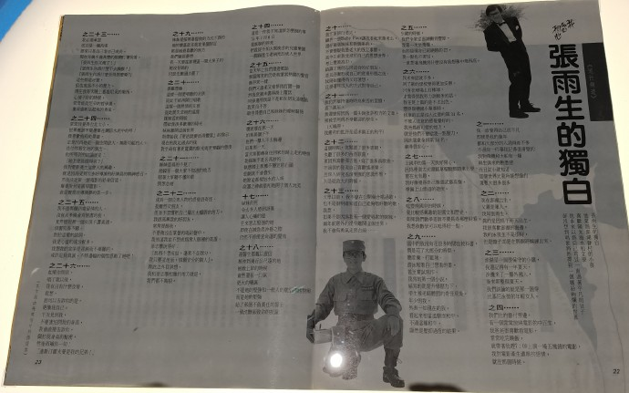

# 张雨生的独白

## 之一……

我一直觉得自己很平凡，
即使是我的童年，
都和大部分的人过得差不多。
不过有一件事是我记得很清楚的，
我对飞机和大船有一种
与生俱来的熟悉感，
而且从小就知道，
这个世界比我所能想象的，
还要大很多很多。

## 之二……

我在澎湖出生，
父亲是军人，
我叫张雨生，
真的是因为下雨天出生，
我很喜欢澎湖的海边，
我的泳技不是很好，
但是胆子却是在那个时候练出来。

## 之三……

澎湖是一个很保守的小镇，
我还记得有一年夏天，
沙滩来了一群外国人，
后来那整个夏天，
我们谈论的就是那一个穿
比基尼泳装的年轻女人。

## 之四……

我们住的眷村旁边，
有一个常常放映电影的中正堂，
我爸爸很喜欢看电影，
常常吃完晚饭，
就带着我赶 7:00 上演一场五块钱的电影，
我对电影产生深厚的感情，
就在那个时候。

## 之五……

9 岁的时候，
我们全家从澎湖搬到丰原，
我第一次坐飞机，
坐的是现在已经绝迹的 727，
我一点也不害怕，
一直想着飞机为什么没有我想象中飞得高。

## 之六……

我本来话就不多，
到了新的学校变得更加安静，
只有在球场上打棒球，
才看得到我努力说较多的话，
我在班上真的是不太出色，
丰原瑞穗国小毕业时，
我拿的正是没人注意的第 34 名，
不被人注意的感觉蛮好的，
我爸妈最可爱的地方，
就是他们不曾给我一点压力，
因此我拿全班第 34 名，
拿得很安心。

## 之七……

上国中的第一天我好开心，
因为理个大光头戴草帽骑脚踏车上学，
实在太有趣，
我好象觉得自己像个武艺高强，
准备上山修道的游侠。

## 之八……

念丰南国中的时候，
我比较感兴趣的是国文和历史，
如果我们数学老师不要长得那么好看，
我想我的数学可以念得好一点。

## 之九……

那时的我没有花很多时间念教科书，
倒是花了大部分的时间，
听音乐、打篮球、
游泳和看自己想看的书，
甚至尝试写作。
我写的第一个小说，
描写的就是升学压力下，
学生被老师体罚的奇怪现象。
年少的我，
外表一如现在的我，
看起来相当温驯而和平，
不过这种和平，
显然是压抑过度的结果。

## 之十……

我在家里排行老大，
虽然一张 Baby Face 让我看起来像老么，
还好两个妹妹和两个弟弟，
不曾怀疑我是老大的既定事实。
高中以前我沉浸于自己的思想世界，
考上丰原高中，
结识了几个志同道合的好朋友，
并且逐渐形成自己的意识型态之后，
我开始懂得为父母着想，
且学着用成人的方式对待自己。

## 之十一……

我仍然维持着时时写东西的习惯。
高三那年，
我还曾经因为一篇尖锐批评校方的文章，
被教官列为不受欢迎的学生。
（天晓得，
我严苛的批评正是追求真正的和平）

## 之十二……

这个时期，我阅读了很多书籍，
也听了很多的西洋歌曲，
更因为喜欢弹吉他，写了很多首歌曲，
不过真的发现自己喜欢摇滚乐，
且深入研究摇滚乐的演变，
与每个摇滚乐团的意识型态，
则是念政大的时候。

## 之十三……

大学以前，我不曾在公开场合唱过歌，
也不是很明确知道自己能够唱好听的歌，
我想，
如果不是因为我有一个爱唱歌的妹妹，
两年前意外的提早离开这个世界，
我不会有勇气走到台前……

## 之十四……

这是一件我不知道该怎么说的事。
75 年 7 月 6 日，
我妹妹的猝死，
把我从不知人间疾苦的儿童乐园，
一脚踢进生老病死的成人世界。

## 之十五……

当天早上我们还通过电话，
那头传来的仍是她惯常热闹的声音，
像平常一样，
我们又温柔又强悍得打闹一阵，
然后意犹未尽得挂上电话。
同学还问我是不是和女朋友通电话，
我笑而不答，
暗自得意自己和妹妹的暧昧关系。

## 之十六……

坏就坏在那一天，
如果那个下午，
他们一群人不去海边，
如果那一天，
当大家都转身往回家的路上走的时候，
我妹妹不莫名其妙的
执意踏上那块不稳定的石头，
悲剧就不会发生。
她原是那样怕水的人呀，
命运之神真是和她开了个大玩笑。

## 之十七……

妹妹的死，
令太多人感到讶异。
让人心痛的是，
生来意志坚强的她，
即使在被急流冲昏之际，
仍然不肯接受命运的摆布。

## 之十八……

连医生都难以置信，
被冲到几百公尺远的她，
被救上岸的时候，
竟然还有一口气。
更大的嘲讽，
不是她的坚强和一般人的脆弱两相对照，
而是她的坚强，
给了那个不负责任的医生，
一个沉没却致命的抗议。

## 之十九……

妹妹是按照基督教的方式下葬的，
她的坟墓就在我家果园附近，
那是她最喜欢的地方。
我们曾经梦想，
有一天要在那里盖一间大房子的，
她没有毁约，
只是先搬过去罢了。

## 之二十……

很难想象，
这样一个爱唱歌的女孩，
从此不能再开口唱歌；
这样一个热情的女孩，
从此就失去她的温度。
妹妹活的时候，
带给我很多欢乐时光。
妹妹离开这个世界，
则带给我「要活就要活得丰富」的启示。
现在的我比过去的我，
对生命有着更宽阔的眼光与更乐观的态度。

## 之二十一……

妹妹是真的不见了，
她躲在一个大家不知道的地方，
唱着大家听不懂的歌。
我想念她。

## 之二十二……

成为一个公众人物的感觉很奇怪，
我虽然喜欢交朋友，
但并不习惯把自己摆在太耀眼的地方。
我很高兴我的好朋友，
常常提醒我，
不要淹没在掌声和喝采声中。
我知道我并不想成为众人眼里的英雄，
徐志摩说得好：
「我再不想成仙，蓬莱不是我分，
我只要这地面，情愿安分的做人」。
除此之外我猜想，
我和徐志摩相像的地方就是，
我们都不够狠。

## 之二十三……

我必须承认，
成功是一种拘束，
原来只是自己看自己成长，
现在有几千几万双的眼睛盯着我看。
「张雨生你又瘦了！」
「张雨生你为什么不去演戏？」
「张雨生你为什么长得那么矮！？」
这些都是好意，
但也成为不小的压力。
现在我每天晚上都看尼采的东西，
心情不好的时候，
常常能从尼采的哲学里，
获得重新站起来的勇气。

我很想念和「Metal Kids」在西门町 Penthouse 做场子的日子，我们没有什么目的，只是唱着我们想唱的歌曲，那种「不管别人接受不接受」的表演方式，实在过瘾[^1]。

大三上的时候，我写了一首描述退役军人生活的歌曲「他们」，得了学校创作歌谣比赛第一名，这个奖带给我很大的信心，对我而言，唱歌是一种情感的释放，创作则是理想的实现。「他们」这首歌曲所描写的农民，正是我可爱的父亲大人。

念政大真是一个快乐的选择，我在学校附近租了一个房子，同居的对象是两个大男生，一个人窝在家里，听 CD、看小说、看录影带、弹吉他，就是我的全部。偶尔友人来访，我们就会骑着脚踏车在校园里闲逛，政大校园是该有的都有了，她的直堤、后山、夕阳、雨景和彩虹，简直就是美得不能承受，直接让人疯狂。我为什么已经大四了呢？

## 之二十四……

常常我觉得台北太小，
世界应该不是建筑在钢筋水泥中的呀！
我喜欢梅莉史翠普，
正是因为她是一个空间很大、无限可能的人。
往往你看完她的演出，
你所得到的结论就是：
「她怎么能做得到？」
我对电影产生这么大的兴趣，
就是因为受到太多好导演和好演员的精神感召，
然后决定做一个电影的终身信徒。
毕业后到美国学电影，
就是我实现我导演梦的第一步。

## 之二十五……

我不是那种到处留情的人，
没有太多机会写情书的我，
竟然曾经被一个女孩子赞美过，
情书写得不错。
对于这样的说词，
我是心虚的成分较多。
我想我的文字是迟钝而不华丽的，
或许是我真诚、不修边幅的个性感动了她吧！

好久没回家了，等期末考一结束，我第一件事就是赶快搭国光号飞奔回家，每次回丰原的路上，我总是想起国中时候一次『失了手的离家事件』[^2]。

中二那年，我因为和爸妈吵架，竟然买好了车票，准备来个不告而别，一个人偷偷的跑回澎湖老家，结果为了回家拿内衣裤，被爸妈逮了个正着，禁足了一个礼拜，跷家的孩子做不成，倒成了笼中之鸟。想起来就好笑，那时候真的把跷家当成一种骄傲，啊！令人脸红的，14 岁男生『跷家失败记』。

## 之二十六

如果你问我，
唱了歌以后，
我有没有什么改变，
我想，
我可以告诉你的是，
更像我自己。
下次见到我，
不要害怕问我的身高，
我会直接告诉你，
关于我身高的秘密，
然后再补你一句：
「达斯汀霍夫曼是我的兄弟！」

### 参考

本文又名《我的童年往事》，發表日期：1988-11-05 出處：《飛碟雜誌》【No.32 ～ 34】。

-   [『我的童年往事』 - pixnet.net](https://windlsx.pixnet.net/blog/post/809952)

当前页面缺陷：

-   缺少《飞碟杂志》的图片来源
-   不知道当前图片的出处
-   当前图片不够清晰

[^1]: 不在图片中，但是大部分文章都有记录这一段话
[^2]: 不在图片中，但是大部分文章都有记录这一段话
