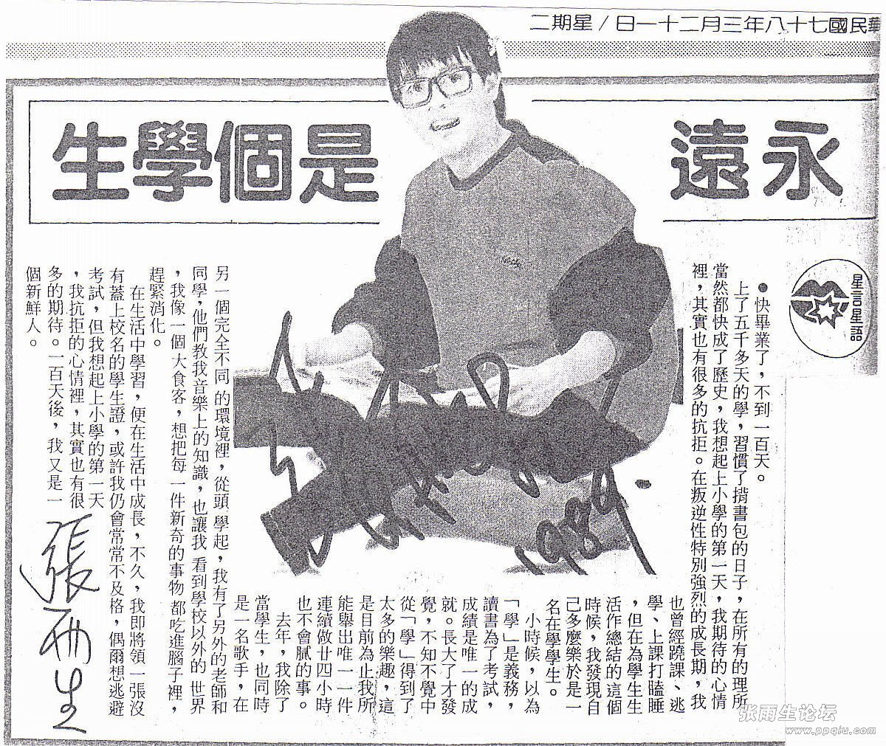

# 永远是个学生

快毕业了，不到一百天。

上了五千多天的学，习惯了背书包的日子，在所有的理所当然都快成了历史，我想起上小学的第一天，我期待的心情里，其实也有很多的抗拒。在叛逆性特别强烈的成长期，我也曾经逃学、上课打瞌睡，但在为学生生活作总结的这个时候，我发现自己多么乐于是一名在学学生。

小时候，以为「学」是义务，读书为了考试，成绩是唯一的成就。长大了才发觉，不知不觉中从「学」得到了太多的乐趣，这是目前为止我所能举出唯一一件连续做廿四小时也不会腻的事。

去年，我除了当学生，也同时是一名歌手，在另一个完全不同的环境里，从头学起，我有了另外的老师和同学，他们教我音乐上的知识，也让我看到学校以外的世界，我像一个大食客，想把每一件新奇的事物都吃进脑子里，赶紧消化。

在生活中学习，便在生活中成长，不久，我即将领一张没有盖上校名的学生证，或许我仍会常常不及格，偶尔想逃避考试，但我想起上小学的第一天，我抗拒的心情里，其实也有很多的期待。一百天后，我又是一个新鲜人。

## 参考

发表于 1989 年 3 月 21 的《民生报》【星言星语】

-   [张雨生剪报海报等收藏 - tieba.baidu.com](https://tieba.baidu.com/p/2084189445#!/l/p1)
-   [永远是个学生 - tomchang.com](https://www.tomchang.cn/archive/article/66.html)
