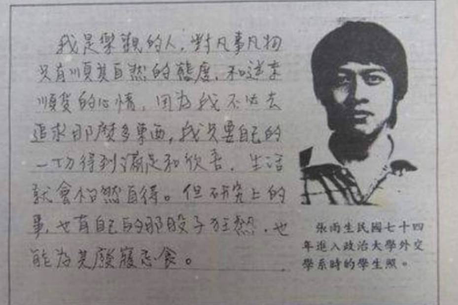

## 我的乐观人生态度

我是乐观的人，对凡事凡物只有顺其自然的态度，和逆来顺受的心情，因为我不必去追求那么多东西，我只要自己的一切得到满足和欣喜，生活就会怡然自得。但研究上的事，也有自己的那股子狂热，也能为其废寝忘食。

1997 年 10 月 24 日发布于政大大学报

## 参考

[我的乐观人生态度-文章-张雨生网站 - TOMCHANG.CN](https://tomchang.cn/archive/article/67.html)

当前页面缺陷：
创作时间、背景未知
