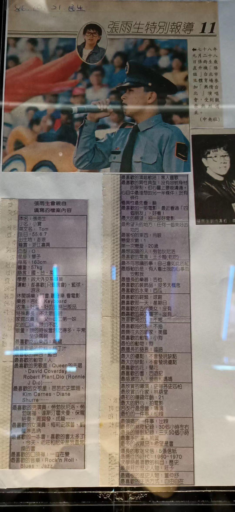

# 张雨生曾亲自填写的档案

本名︰张雨生

小名︰小宝

英文名︰Tom

生日︰55.6.7[^1]

出生地︰澎湖

籍贯︰浙江嘉兴

---

血型︰O

星座︰双子

身高︰163cm

体重︰57kg

语言︰国、台、英

---

学历︰政大外交系毕业

运动︰都喜欢（只要我会）、篮球、游泳

休闲娱乐︰读书、听音乐、看电影

乐器︰吉他、Keyboard

收集︰好书、好的音乐出版品

---

特殊专长︰不太敢自夸

家庭成员︰一父一母二弟一妹

吃的口味︰辣的不吃

饭量︰饿的时候当然吃得多，平常至少两碗

最喜欢吃的东西︰鸡腿

---

最喜欢喝的饮料︰柳丁汁

最喜欢的颜色︰蓝色

最喜欢的动物︰人

最喜欢的男歌星︰Queen 的主唱、David Coverdale[^2]、Robert Plant[^3]、Dio（Ronnie J Dio）……

最喜欢的女歌星︰芭芭拉史翠姗、Kim Carnes、Diane Shurre……

---

最喜欢的男演员︰劳勃狄尼洛、劳勃瑞福、达斯汀霍夫曼、保罗纽曼、周润发、成龙……

最喜欢的女演员︰梅莉史翠普、凯萨琳透纳

最喜欢的一本书︰喜欢的书太多了，今天，老庄和尼采是我最常摸的书

最喜欢的口头禅︰一直在变

最喜欢的音乐︰Rock'n Roll、Blues、Jazz

---

最喜欢的演唱歌路︰黑人灵歌

最喜欢的异性典型︰没有容貌身材的限制，但心灵上要能沟通。

心目中最理想的另一半条件︰没有条件

看异性最先看︰脸

最喜欢的一部电影︰最近看过「四个朋友」，好看！

最大的愿望︰拍一部好电影

---

最希望去的地方︰任何一个美好的地方

最害怕的东西︰冷眼

恋爱次数︰1

第一次恋爱︰20 岁

最想认识的人︰劳勃狄尼洛

最喜欢的零食︰王子面（干吃）

---

最不可思议的事︰自己会如此的红

最感动的是︰有人看出我的心事而安慰我

最擅长的乐器︰吉他

最喜欢的装饰品︰没多大概念

最喜欢的水果︰西瓜

---

最喜欢的鞋类︰球鞋

最喜欢那一天︰星期日

最喜欢的古代美女︰没有

最喜欢的英文单字︰没有

最喜欢喝的酒︰不喝

---

最喜欢抽的菸︰不抽

最向往去的国家︰美国

最喜欢的动物︰小狗

最怕的动物︰狗

最擅长的语言︰国语

---

最大的优点︰不会发现缺点

最大的缺点︰不会发现优点

最喜欢的花︰兰花

最喜欢的书︰西游记

最感激的人︰爸爸和妈妈

---

最欣赏的导演︰史蒂芬史匹柏

最欣赏的作家︰林语堂

最初的赚钱年龄︰21

最大的野心︰拍电影

若改行最想当︰导演

最怕的一件事︰怕糗

---

最头痛的一件事︰出糗

最长的熬夜纪录︰30 个小时左右

最长的睡眠纪录︰三天 50 个小时

最拿手的菜︰煎蛋

最多的收藏品︰希望是书

---

最长的歌迷来信︰5 张信纸

最向往的时代︰1960 ~ 1970

求学时最喜欢的科目︰历史

最崇拜的历史人物︰庄子

---

最痛恨的历史人物︰董仲舒

最喜欢的生活方式︰自由自在

[^1]: 民国纪年，也就是 1966 年
[^2]: Whitesnake 乐队主唱
[^3]: Led Zeppelin 乐队主唱
