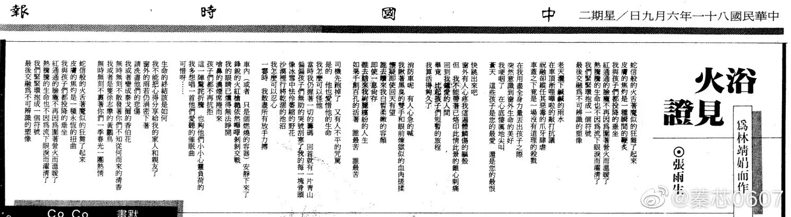

# 浴火见证

为林靖娟而作

> 林靖娟老师是第一位入祀忠烈祠的平民，她在 1992 年 5 月台北市健康幼儿园「火烧车事件」中，奋不顾身抢救幼童，却不幸罹难，舍身救人义举，引起社会广大回响。
> 发表于 1992 年 6 月 9 日的《中国时报》【人间副刊】

蛇信般的火舌着魔似的狂舞了起来 
皮肤的焦灼是一种瞬间的鞭炙 
我与孩子们都投降的垂坐 
红通通的脸庞不再因为围着营火而温暖了 
热腾腾的生命也不因为流下眼泪而濯清了 
我们紧紧环抱成一个符号 
最后交融为不可辨识的塑像

老天洒下咸咸的雨水 
在车顶淅沥哗啦的敲打抗议 
祝融却纵任其恶毒的爪牙肆虐 
车盖之下竟是一场没有道理的杀戮

在我用尽全身力量丢出孩子之际 
突然意识到窗外生命的美好 
我哽咽了 在心底凄厉地尖叫 
苍天 这些孩子是您的最爱 还是您的最恨

快跳出来吧 
窗外有人心疼我这遍体鳞伤的躯壳 
但 我不能带着已烙印此情此景的锥心刺痛 
回到我钟爱的人间 
毕竟 比起孩子们短暂的旅程 
我算活得够久了

消防车呢 有人心急的喊 
我瞅着黑臭的双手和眼前炼狱似的血肉搓揉 
怀疑即使回天有望 
谁去赎来我白皙柔嫩的容颜 
即使一息尚存 
谁去赔来我绚丽缤纷的人生 
如果千创百孔的活着 谁最苦 谁最苦

司机先跑掉了 又有人不平的咒骂 
是的 他也爱惜他的生命 
我怎么可以怪他 
当时我仍握着一切的筹码 回首就有一片青山 
偏偏孩子们无助的哭号刮寒了我的每一块骨头 
像冰雪中怯伶萎缩的野花 沙漠里行将干涸的池沼 
我怎么可以忍心 
一霎时 我散尽所有放手力搏

车内（或者 只是个燃烧的容器）安静下来了 
锋锐的火红枪楫依然哔哔剥剥交战 
我的眼睛已燻得无法睁开 
呛鼻的浓烟席卷而来 
孩子们都不再抗拒 
这一阵惊诧折腾 也够他们小小心灵负荷的 
我多想唱一首他们爱听的催眠曲 
可惜呀……

生命的终结该是如何 
我不能把心得分享给我的家人和亲友了 
窗外的雨若仍涓密下着 
请洗尽他们的悲伤 
我或者变成泰戈尔的香伯花 
无时无刻不散发着你们不知从何而来的清香 
我或者是只徐志摩的黄鹂鸟 
无时无刻不裹着你们一季春光一团热情

蛇信般的火舌着魔似的狂舞了起来 
皮肤的焦灼是一种瞬永恒的扭曲 
我与孩子们都投降的垂坐 
红通通的脸庞不再因为围着营火而温暖了 
热腾腾的生命也不因为流下眼泪而濯清了 
我们紧紧环抱成一个符号 
最后交融为不可辨识的塑像

## 参考

-   [浴火见证 － 为林靖娟而作 - tomchang.cn](https://www.tomchang.cn/archive/article/62.html)
