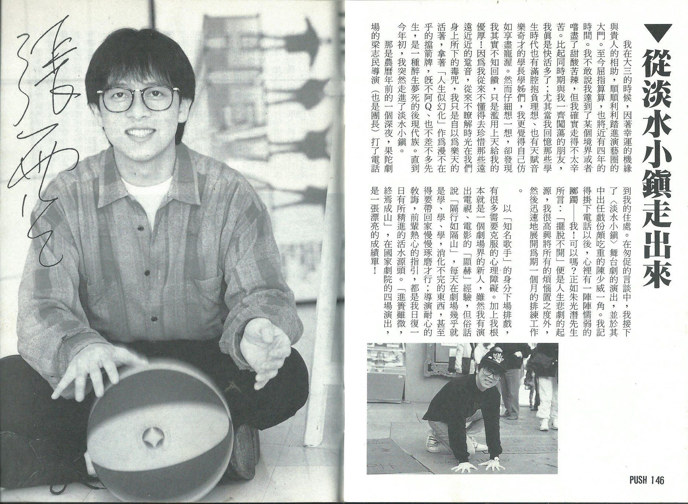
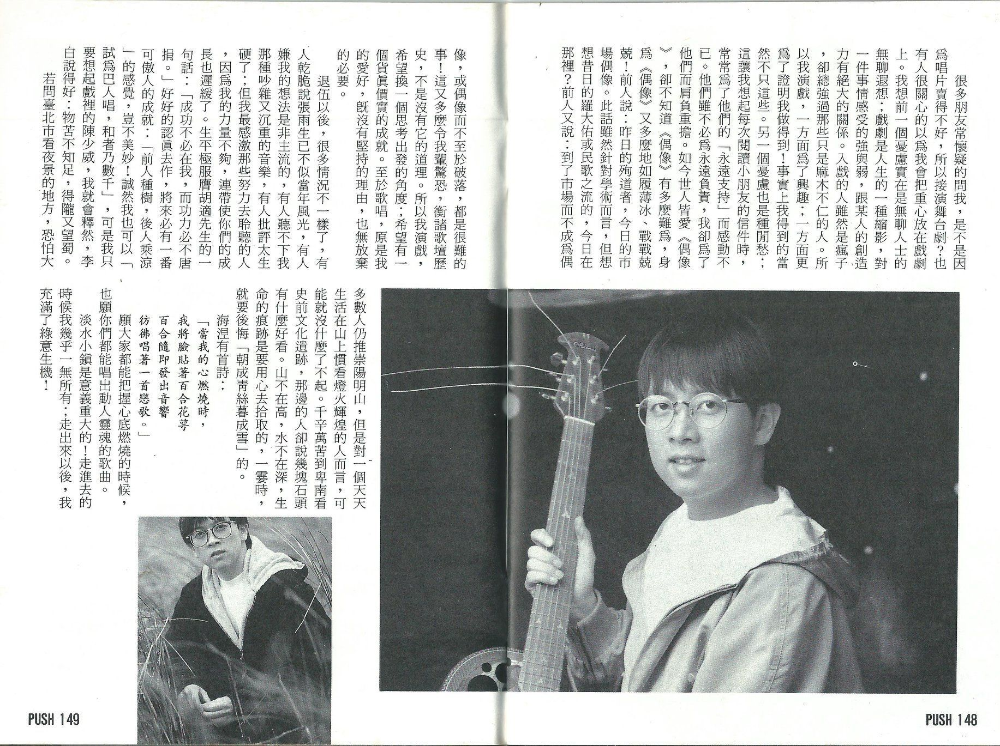

# 从淡水小镇走出来

我在大三的时候，因着幸运的机缘与贵人的相助，顺顺利利踏进演艺圈的大门。至今屈指算算，也将近有四年的时间。我不敢说我达到了某个境界或者尝尽了甜酸苦辣，但我确实走得不太辛苦。比起同时期与我一齐闯荡的朋友，我真是快活多了；尤其当我回忆那些学生时代也有满腔抱负理想、也有天赋音乐奇才的学长学姊们，我更觉得自己仿如享尽宠渥。然而仔细想一想，却发现我其实不知回馈，只是滥用上天给我的优厚！因为我从来不懂得去珍惜那些远远近近的跫音，从来不了解时光在我们身上所下的毒咒，我只是自以为乐天的活着，拿着「人生似幻化」作为漫不在乎的档箭牌，既不阿 Q、也不差不多先生，是一种醉生梦死的后现代族。直到今年初，我突然走进了淡水小镇。

那是农历年前的一个深夜，果陀剧场的梁志民导演（也是团长）打了电话到我的住处。在匆促的言谈中，我接下了<淡水小镇>舞台剧的演出，并于其中出任戏份颇吃重的陈少威一角。我记得挂下电话以后，心里有一阵阵懦弱的踯躅——我！可以吗？正如朱光潜先生所言：「摆脱不开」便是人生悲剧的起源[^1]，我很高兴将所有的烦恼置之度外，然后迅速地展开为期一个月的排练工作。

以「知名歌手」的身分下场排戏，有很多需要克服的心理障碍。加上我根本就是一个剧场界的新人，虽然我有演出电视、电影的「显赫」经验，但俗话说「隔行如隔山」，每天在剧场几乎就是学、学、学，消化不完的东西，甚至得要带回家慢慢琢磨才行；导演耐心的教诲，前辈热心的指引，都是我日复一日有所精进的活水源头。「进篑虽微，终焉成山」，在国家剧院的四场演出，是一张漂亮的成绩单！

很多朋友常怀疑的问我，是不是因为唱片卖得不好，所以接演舞台剧？也有人很关心的以为我会把重心放在戏剧上。我想前一个忧虑实在是无聊人士的无聊遐想；戏剧是人生的一种缩影，对一件事情感受的强与弱，跟某人的创造力有绝大的关系。入戏的人虽然是疯子，却总强过那些只是麻木不仁的人。所以我演戏，一方面为了兴趣；一方面更为了证明我做得到！事实上我得到的当然不只这些。另一个忧虑也是种闲愁；这让我想起每次阅读小朋友的信件时，常常为了他们的「永远支持」而感动不已。他们虽不必为永远负责，我却为了他们而肩负重担。如今世人皆爱《偶像》，却不知道《偶像》有多么难为，身为《偶像》又多么地如履薄冰、战战兢兢！前人说：昨日的殉道者，今日的市场偶像。此话虽然针对学术而言，但想想昔日的罗大佑或民歌之流的，今日在那里？前人又说：到了市场而不成为偶像，或偶像而不至于破落，都是很难的事！这又多么令我辈惊恐，衡诸歌坛历史，不是没有它的道理。所以我演戏，希望换一个思考出发的角度；希望有一个货真价实的成就。至于唱歌，原是我的爱好，既没有坚持的理由，也无放弃的必要。

退伍以后，很多情况不一样了，有人干脆说张雨生已不似当年风光，有人嫌我的想法是非主流的，有人听不下我那种吵杂又沉重的音乐，有人批评太生硬了；但我最感激那些努力去聆听的人，因为我的力量不够，连带使你们的成长也迟缓了。生平极服膺胡适先生的一句话：「成功不必在我，而功力必不唐捐。」好好的认真去作，将来必有一番可傲人的成就：「前人种树，后人乘凉」的感觉，岂不美妙！诚然我也可以「试为巴人唱，和者乃数千」，可是我只要想起戏里的陈少威，我就会释然，李白说得好：物苦不知足，得陇又望蜀。

若问台北市看夜景的地方，恐怕大多数人仍推崇阳明山，但是对一个天天生活在山上惯看灯火辉煌的人而言，可能就没什么了不起。千辛万苦到卑南看史前文化遗迹，那边的人却说几块石头有什么好看。山不在高，水不在深，生命的痕迹是要用心去拾取的，一霎时，就要后悔「朝成青丝暮成雪」的。

海涅有首诗：  
「当我的心燃烧时，  
我将脸贴着百合花萼  
百合随即发出音响  
彷佛唱着一首恋歌。」

愿大家都能把握心底燃烧的时候，也愿你们都能唱出动人灵魂的歌曲。

淡水小镇是意义重大的！走进去的时候我几乎一无所有；走出来以后，我充满了绿意生机。

## 参考

本文发表于 1993 年 1 月 1 日 的《PUSH 偶像杂志》第五期，146-149 页

-   [图片来源蓁芯 0607 的微博 - weibo.com](https://m.weibo.cn/status/4648817972480040)
-   [从淡水小镇走出来 - tomchang.cn](https://tomchang.cn/archive/article/58.html)

[^1]: 出自朱光潜《给青年的十二封信》中的《谈摆脱》
