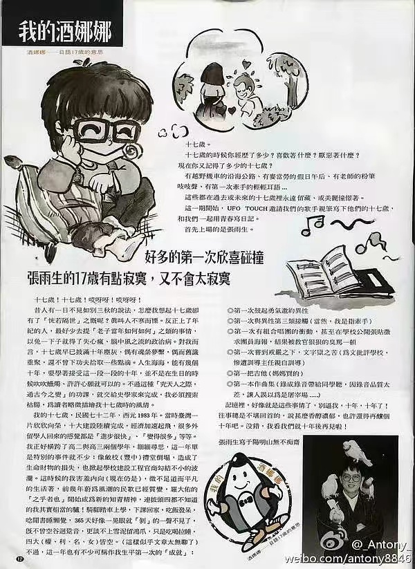

# 我的酒娜娜

> 酒娜娜——日语十七岁的意思

十七岁！十七岁！哎呀呀！哎呀呀！

昔人有一日不见如别三秋的说法，怎么我想起十七岁却有了「恍若隔世」之慨呢？真叫人不寒而栗。反正上了年纪的人，最好少去提「老子当年如何如何」之类的事情，以免一下子就得了失心疯、脑中风之流的政治病。对我而言，十七岁早已披满十年尘灰，偶有魂萦梦系，偶有旧识重聚，还不曾下功夫拾取一些点滴。人生海海，能有几个十年，要学着接受这一段一段的十年，并不是在生日的时候吹吹蜡烛、许许心愿就可以的。不过这种「究天人之际，通古今之变」的功课，就交给史学家来完成，我必须搜索枯肠，为读者略微描绘我十七岁的风情。

我的十七岁，民国七十二年，西元 1983 年。当时台湾一片欣欣向荣，十大建设陆续完成，经济加速起飞，很多外留学人回来的感觉都是「进步很快」、「变得很多」等等。我正好横跨了高二与高三两个学年，细细寻思，这一年单是特别的事件就不少：像敝校（丰中）礼堂倒塌，造成了生命财物的损失，也掀起学校建设工程官商勾结不小的波澜。这时候的我害羞内向（现在仍是），微不足道而平凡的生活着，前几年蔚为风潮的民歌已经质变，罗大佑的「之乎者也」开始成为新的知青精神，连披头四都不知道的我其实相当的驴！骑脚踏车上学，下课回家，吃饭发呆，唸闲书睡懒觉，365 天好像一晃眼就「剥」的一声不见了，既不曾空谷回跫音，更谈不上雪泥留鸿爪，只是吃喝拉睡，四大（权、利、名、女）皆空。（这样似乎文章太无聊了）不过，这一年也有不少可称作我生平第一次的「成就」：

-   第一次鼓起勇气邀约异性
-   第一次与异性第三类接触（当然，我是指牵手）
-   第一次有组合唱团的冲动，甚至在学校公开张贴征求团员海报，结果被教官狠狠的臭骂一顿
-   第一次尝到戒严之下，文字狱之苦（为文批评学校，惨受训导主任亲自训导）
-   第一把吉他（妈妈买的）
-   第一本作曲集（录成录音带给同学听，因录音质量太差，让人误以为是屠宰场……）

记忆里，好像就是这些事情了，别逼我，十年，十年了！往事总是不堪回首的，说什么香醇浓郁，也许还得再酿个十年吧。没错，我看我们十年后再见啦！

张雨生写于阳明山无不痴斋

当前页面缺陷：

1. 发表时间未知

## 参考

-   [我的酒娜娜-文章-张雨生网站 - tomchang.cn](https://tomchang.cn/archive/article/60.html)
