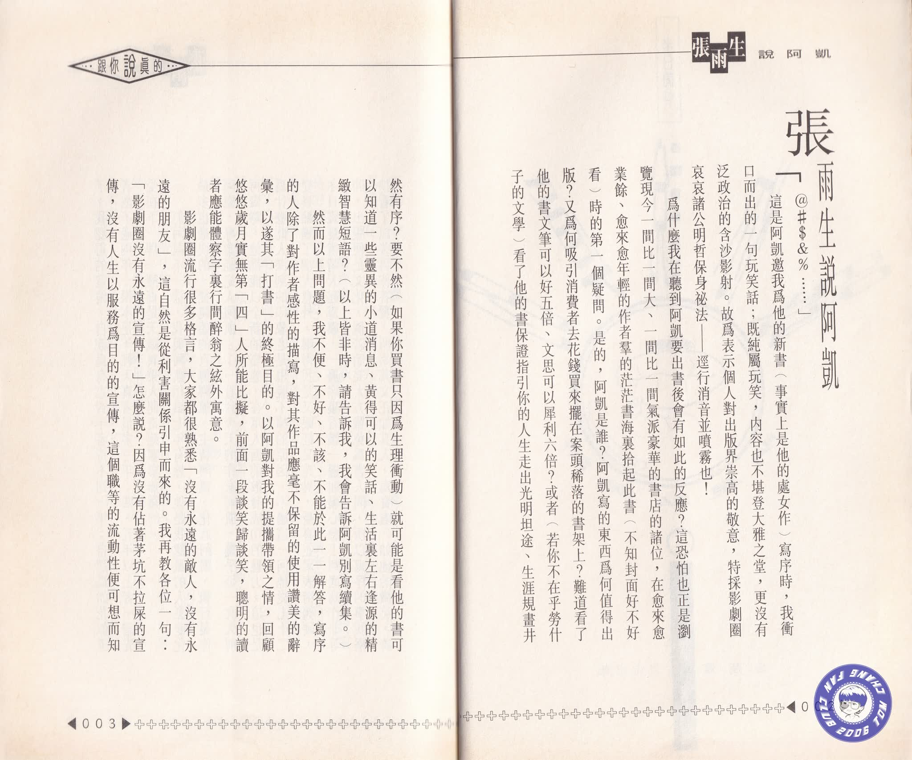
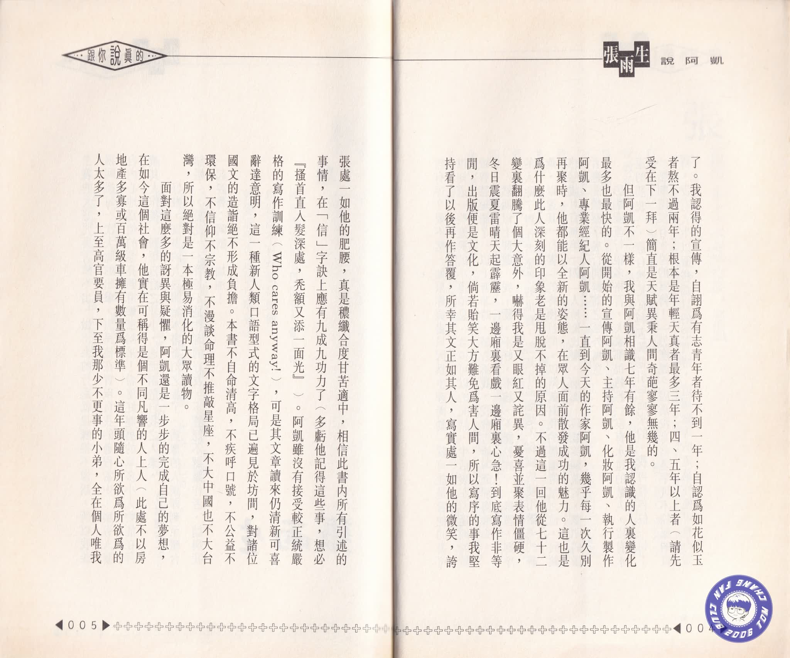
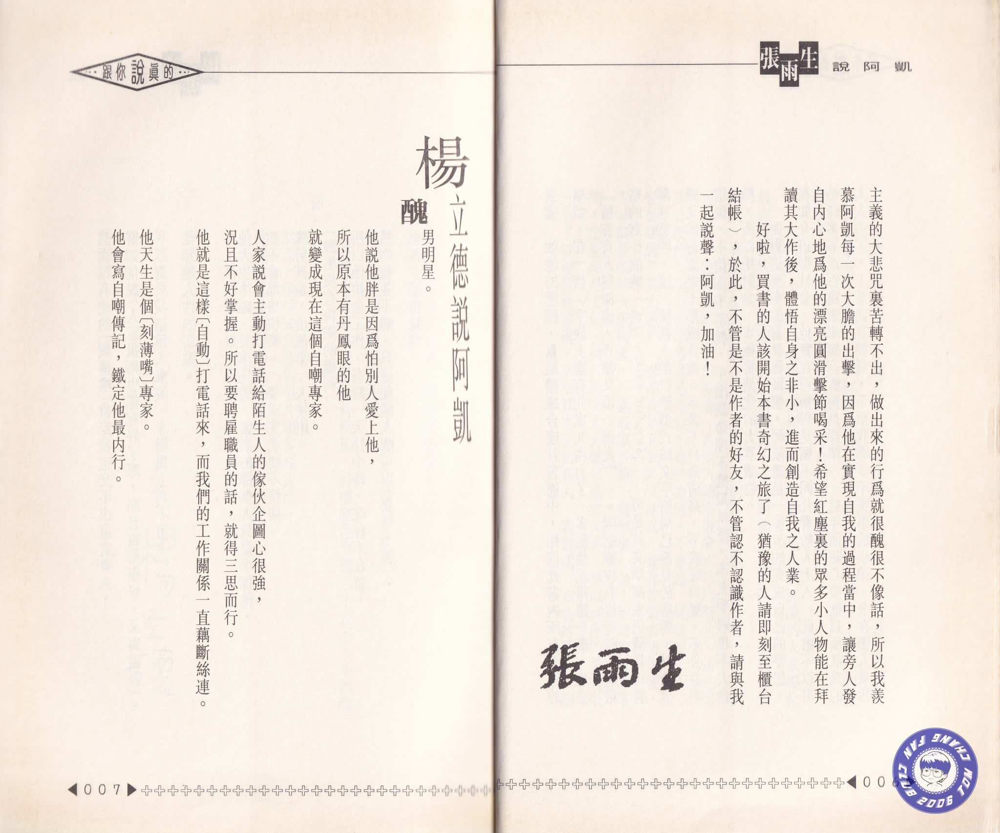

# 给阿凯的序

> 本文是雨生为阿凯的书《跟你说真的》所作的序

「＠＃＄＆％……」

这是阿凯邀我为他的新书（事实上是他的处女作）写序时，我冲口而出的一句玩笑话；既纯属玩笑，内容也不堪登大雅之堂，更没有泛政治的含沙影射。故为表示个人对出版界崇高的敬意，特采影剧圈衮衮诸公明哲保身秘法——迳行消音并喷雾也！

为什么我在听到阿凯要出书后会有如此的反应？这恐怕也正是浏览现今一间比一间大、一间比一间气派豪华的书店的诸位，在愈来愈业余、愈来愈年轻的作者群的茫茫书海里拾起此书（不知封面好不好看）时的第一疑问。是的，阿凯是谁？阿凯写的东西为何值得出版？又为何吸引消费者去花钱买来摆在案头稀落的书架上？难道看了他的书文笔可以好五倍、文思可以犀利六倍？或者（若你不在乎劳什子的文学）看了他的书保证指引你的人生走出光明坦途、生涯规画井然有序？要不然（如果你买书只因为生理冲动）就可能是看他的书可以知道一些灵异的小道消息、黄得可以的笑话、生活里左右逢源的精致智慧短语？（以上皆非时，请告诉我，我会告诉阿凯别写续集。）

然而以上问题，我不便、不好、不该、不能于此一一解答，写序的人除了对作者感性的描写，对其作品应毫不保留的使用赞美的辞汇，以遂其「打书」的终极目的。以阿凯对我的提携带领之情，回顾悠悠岁月实无第「四」人所能比拟，前面一段谈笑归谈笑，聪明的读者应能体察字里行间醉翁之弦外寓意。

影剧圈流行很多格言，大家都很熟悉「没有永远的敌人，没有永远的朋友」，这自然是从利害关系引申得来的。我再教各位一句：「影剧圈没有永远的宣传！」怎么说？因为没有占着茅坑不拉屎的宣传，没有人生以服务为目的的宣传，这个职等的流动性便可想而知了。我认得的宣传，自诩为有志青年者待不到一年；自认为如花似玉者熬不过两年；根本是年轻天真者最多三年；四、五年以上者（请先受在下一拜）简直是天赋异秉人间奇葩寥寥无几的。

但阿凯不一样，我与阿凯相识七年有余，他是我认识的人里变化最多也最快的。从开始的宣传阿凯、主持阿凯、化妆阿凯、执行制作阿凯、专业经纪人阿凯……一直到今天的作家阿凯，几乎每一次久别再聚时，他都能以全新的姿态，在众人面前散发成功的魅力。这也是为什么此人深刻的印象老是甩脱不掉的原因。不过这一回他从七十二变里翻腾了个大意外，吓得我是又眼红又诧异，忧喜并聚表情僵硬，冬日震夏雷晴天起霹雳，一边厢里看戏一边厢里心急！到底写作非等闲，出版便是文化，倘若贻笑大方难免为害人间，所以写序的事我坚持看了以后再作答复，所幸其文正如其人，写实处一如他的微笑，夸张处一如他的肥腰，真是秾纤合度甘苦适中，相信此书内所有引述的事情，在「信」字诀上应有九成九功力了（多亏他记得这些事，想必『搔首直入发深处，秃额又添一面光』）。阿凯虽然没有接受较正统严格的写作训练（Who cares anyway!），可是其文章读来仍清新可喜辞达意明，这一种新人类口语型式的文字格局已遍见于坊间，对诸位国文的造诣绝不形成负担。本书不自命清高，不疾呼口号，不公益不环保，不信仰不宗教，不漫谈命理不推敲星座，不大中国也不大台湾，所以绝对是一本极易消化的大众读物。

面对这么多的讶异与疑惧，阿凯还是一步步的完成自己的梦想，在如今这个社会，他实在可称得是个不同凡响的人上人（此处不以房地产多寡或百万级车拥有数量为标准）。这年头随心所欲为所欲为的人太多了，上至高官要员，下至我那少不更事的小弟，全在个人唯我主义的大悲咒里苦转不出，做出来的行为就很丑很不像话，所以我羡慕阿凯每一次大胆的出击，因为他在实现自我的过程当中，让旁人发自内心地为他的漂亮圆滑击节喝采！希望红尘里的众多小人物能在拜读其大作后，体悟自身之非小，进而创造自我之人业。

好啦，买书的人该开始本书奇幻之旅了（犹豫的人请即刻至柜台结帐），于此，不管是不是作者的好友，不管认不认识作者，请与我一起说声：阿凯，加油！

页面缺陷：

-   成文时间未知，阿凯在书中说，自己从日本回来以后，看到传真机上挂着雨生发给他的序文
-   等待上传书籍扫描件

## 参考

-   [《跟你说真的》的序 ── 张雨生说阿凯 - tomchang.cn](https://tomchang.cn/archive/article/59.html)
