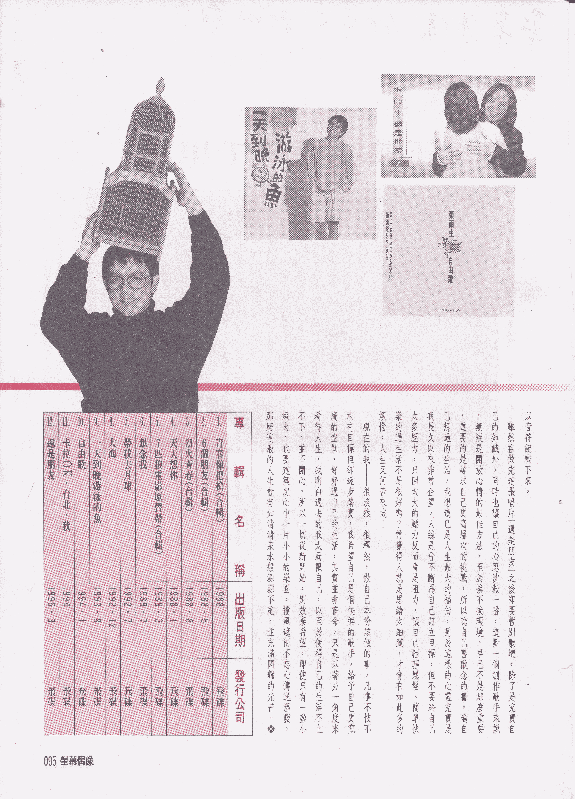

# 暂别歌坛感言

## 情绪之一，自己的心情自己感受！其实痛苦每一个人都有，何妨学着笑看人生，看看云、听听雨！身心清净、无忧无憾！

从当初只是个爱唱歌、玩乐团的学生，到专业执着的音乐人，这 7 年来，我觉得自己收获很多，不但交到许多志同道合的朋友，在经济上也不虞匮乏，同时也由一个对音乐懵懂不知到成为创作型歌手，一步步实现自己的音乐理想……这些可说是我这些年来的斩获。

虽然我曾为了理想与现实该如何平衡，及对自己的种种未来计划患得患失，但是在慢慢理出自己的情绪后，发现自己原来是可以释怀，毕竟所谓的成功，其实是该以平常心看待，又何必拘泥于那瞬间即逝且自己无法掌握的名利，正因为如此，我开始以着另一种角度重新审视自己，我感觉这样的人生，其实也可冠上「幸福」二字。这一路走来，要感谢的恩人很多，有这么多人帮助我，让我可以自由自在创作。有时连我自己都不太相信，至今，我仍不会写履历表，想来真觉自己是个异数！外交官没当成，反而成为埋首音乐创作的音乐人，一直记得大学新生训练时老师所说过的话，当外交官定要面孔姣好，身材适中，或许正因是如此，才打消我当外交官的恢宏壮志，不过至今我并不后悔；因为在音乐里，我获得许多前所未有的成就感。

记得在「六个朋友」合辑中，我因为唱了「我的未来不是梦」，在很短的时间里，我接受了来自各地的掌声，往后我也参加电影「七匹狼」演出，尝试以前未曾做过的事，于是许多的掌声也因而围绕着我，由于当时我正面临兵役问题，但是我仍毅然决定从军，因而在接受军事洗礼后，我重回歌唱岗位，再回来对我而言，可说是另一项挑战，一些无形的压力让我觉得直喘不过气来，毕竟我只是想要站在属于自己的舞台上尽情唱歌，同时对所有听歌的人负责，而可以不要管市场要求如何，于是我的疑问却一直在心中久久萦回，在这段时间里感谢一些朋友自始自终的鼓励，让我可以尽力扮演好自己的角色，不断进修，创作更多感动自己也感动别人的歌曲。

以前的我，在是否应该「执着」于音乐而心神动摇，事实上有许多事是可以「简化」，又何苦围绕在没有答案的问题里，所谓庸人自扰，我在音乐世界中，已得到快乐及满足，因为这些快乐也是任何事物无法取代，我始终认为给自己一个喘息的空间一定会是海阔天空，而所有的外在烦扰也不都只是人生过客，又何必汲汲营营苦苦追求。之后我不再给自己那些无谓及莫名的压力，我只想唱出自己对音乐的热爱，如同我对生命的看重一般，那么人生何曾有憾，又何曾有怨，毕竟我已经非常尽力。其实在这 7 年中，我真的获得很多，或许人生中的「得」、「失」不应只是短程的赋予定义，往长远看，或许得就失，失亦是得，又何必下的心太重呢？想想从前，看看现在，我更能以纯熟心境去看待自己所面临的的一切，我兴致勃勃的规划我的人生计划，一步步踏稳，希望自己永远保有一颗童稚却努力不辍的心，因此我将时间拉回校园，重拾书本，过自己想过的校园生活，对我而言，这是另一项人生课题，我会好好珍惜。

## 成长之二，企盼看见希望的灯火，即使只有一盏小灯火，也要建筑心中一片小小乐园，挡风遮雨、不忘传送温暖。

很多人在听到我要重回学生生活时，都是反对多过赞成，然而我却认为读书是一辈子的事，况且不同的阶段，都会有不同阶段的目标，毕竟人生能有多少个 10 年、20 年，我希望让生命中除了歌唱事业外，还能有别的目标。因而我给自己的时间，期望在 45 岁能成为学者，这即是远程目标。当然我不会再给自己添加压力，同时让学业、音乐齐头并进，一边念一边调整自己的步伐，只因唯有不断进修、学习、才能使得自己不断超越自我，而念书就是一个充实自己的过程之一。因为我早已将「音乐」当成我的终身职业，努力去建筑属于自己的音乐城堡。我觉得一切都是值得且令我回味无穷。

对于从学生时代即展开歌唱事业的我而言，在经过了这些年来的起起伏伏，我觉得过去的张雨生，是在辛勤努力不断自我要求中成长，然而未来的张雨生则是要将理想与抱负一一兑现。因此我会继续奋斗不懈的走下去，为自己的人生写下值得往后一一诉说的回忆。然而，这些年来的心情点滴也都在我的歌曲中尽诉无遗，往后仍将我的心事以音符记载下来。

虽然在做完这张唱片「还是朋友」之后即要暂别歌坛，除了是充实自己的知识外，同时也让自己的心思沉淀一番，这对一个创作歌手来说，无疑是开放心情的最佳方法，至于换不换环境，早已不是那么重要，重要的是寻求自己更高层次的挑战，所以念自己喜欢念的书，过自己想过的生活，我想这已是人生最大的福分，对于这样的心灵充实是我长久以来非常企望，人总是会不断为自己订立目标，但不要给自己太多压力，只因太大的压力反而会是阻力，让自己轻轻松松、简单快乐的过生活不是很好吗？常觉得人就是思绪太细腻，才会有如此多的烦恼，人生又何苦来哉！

现在的我——很淡然，很释然，做自己本分该做的事，凡事不忮不求有目标但却逐步踏实，我希望自己是个快乐的歌手，给予自己更宽广的空间，好好过自己的生活，其实并非宿命，只是以着另一角度来看待人生，我明白过去的我太局限自己，以至于使得自己的生活不上不下，并不开心，所以一切从新开始，别放弃希望，即使只有一盏小灯火，也要建筑起心中一片小小的乐园，挡风遮雨不忘传送温暖，那么这般的人生有如清清泉水般源源不绝，并充满闪耀的光芒。

  

## 参考

发表于 1995 年 4 月的《荧幕偶像》

-   [张雨生暂别歌坛感言 - tomchang.cn](https://tomchang.cn/archive/article/53.html)

照片提供：郝人

校对：Finn、Rain、健健

当前页面缺陷：

1. 缺少写作背景
