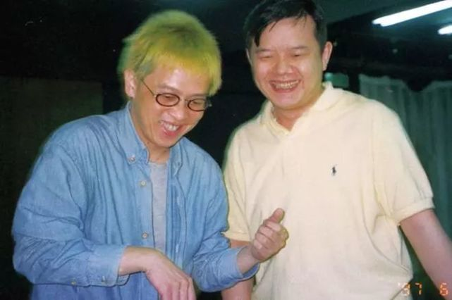
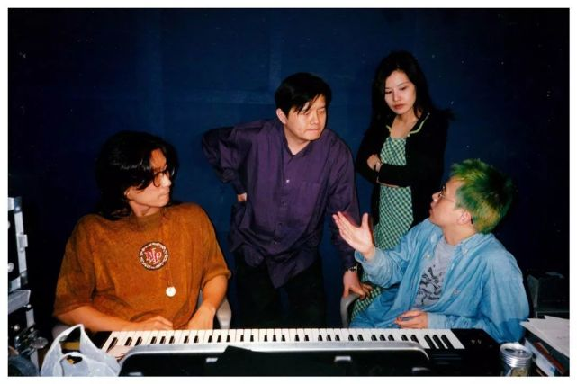

# 不可能的任务

这个案子从一开始就像「不可能的任务」！

梁导透过 E-mail，问我有没有兴趣搞一出音乐剧；他要我负责剧中所有的音乐部份，包括曲子、过场或背景等等反正大约两三个小时长度的音乐。老实说，兴趣，谁没有呢？对我而言，这样的机会不说千载难逢，至少也是十载难逢的。

我讶异的是，导演那个问题的重心竟不在我吃不吃得下来，而只是轻描淡写问我想不想玩！俗话说的好，肥水不落外人田，我等泛泛之辈，怎能再不懂得顺势而生、逆势而亡这颠扑不破的道理。于是，硬着头皮，铁了胆子，拍拍软弱虚胖的胸脯，我便扛下这个担子。然后……

我接触音乐剧其实很晚，但是，很快的就着迷得不能自拔。我一直幻想，如果能用我们熟悉的语言唱歌剧，那该是多么霹雳的一件美事。而这就好像用我们熟悉语言唱摇滚、唱蓝调音乐或唱艺术歌曲一样，绝不是那么难的。只有做了以后，不管好的、坏的，我们才可能有经验的累积与传承。「前人种树，后人乘凉」为了这个高远的目标，我们不能自私。

工作的进度应该说非常顺利。我看着剧本，一首歌、一首歌的想下来，家里的音乐器材设备有两个月的时间是从不关机的。常常写好一些东西，就飞车驰奔 Koji 家，跟他工作。还好，他刚从新店搬到天母，否则……。

交头两首歌给导演时，他的眉头并没有预期的如鲜花盛开般舒放。他说喜欢一首，另一首要我再想想。我想，二中取一，50% 的满意度对起步中的我，也算是褒多于贬吧。后来交歌开始以一箩筐一箩筐的份量计算，他也再没什么时间挑剔（写出来就万幸了，还要排舞、还要排戏），然而，「吻我吧娜娜」那首歌确实也给了我信心继续下去。

那些音乐，有心人可以听出我们取法的对象。而从漫无头绪的摸索，渐渐找了整个音乐可以遵循的方向，这期间学到的经验绝对是弥足珍贵的。我记得第一次到剧场看到自己做出来的音乐，经过导演、编舞的新诠释，那一种经过撞击产生美丽火花的感觉，在我心底久久不能散去。谢谢果陀剧场，谢谢导演。我迫不及待的想欣赏这群可爱而表演精准卖力的演员使出浑身解数，好好秀一场，可能是本世纪末以前，最超炫华丽的音乐戏剧盛宴。孟子有言，「耳之于声也，有同听焉」，但愿大家都能有普遍性的感官愉快，有一夜「美」的回忆。

> 音樂總監張雨生與梁志民導演

> 20 年前，櫻井弘二 Koji 老師(左)、梁志民導演(中)、張雨生(右)與製作人陳琪，常開會討論《吻我吧娜娜》音樂創作方向，2018 年櫻井弘二 Koji 老師將擔任編曲及音樂總監。

## 参考

本文作于舞台剧《问我吧娜娜》首演前。首演是 1997 年 8 月 1 日，所以只能确定在 1997 年 8 月前完成。

文章内容来自 [張雨生：用熟悉的語言唱歌劇，那該是多麼霹靂的事](https://www.ifuun.com/a2018051813173105/)。

页面缺陷：出处未知
