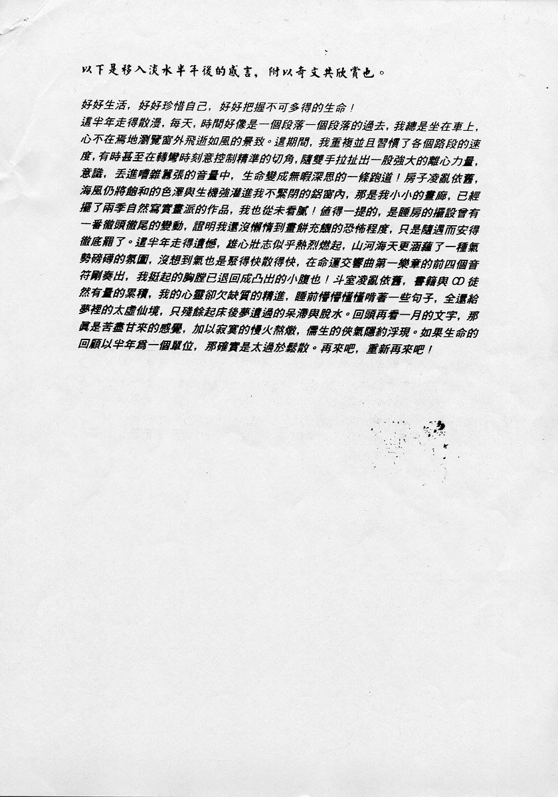

# 淡水感言

以下是移入淡水半年后的感言，附以奇文共欣赏也。

好好生活，好好珍惜自己，好好把握不可多得的生命！

这半年走得散漫，每天，时间好像是一个段落一个段落的过去，我总是坐在车上，心不在焉地浏览窗外飞逝如风的景致。这期间，我重复并且习惯了各个路段的速度，有时甚至在转弯时刻意控制精准的切角，随双手拉扯出一股强大的离心力量，意识，丢进嘈杂嚣张的音量中，生命变成无暇深思的一条跑道！房子凌乱依旧，海风仍将饱和的色泽与生机强灌进我不紧闭的铝窗内，那是我小小的画廊，已经摆了两季自然写实画派的作品，我也从未看腻！值得一提的，是睡房的摆设曾有一番彻头彻尾的变动，证明我还没懒惰到画饼充饥的恐怖程度，只是随遇而安得彻底罢了。这半年来走得遗憾，雄心壮志似乎热烈燃起，山河海天更涵蕴了一种气势磅礴的氛围，没想到气也是聚得快散得快，在命运交响曲第一乐章的前四个音符刚奏出，我挺起的胸膛已退回成凸出的小腹也！斗室凌乱依旧，书籍与 CD 徒然有量的累积，我的心灵却欠缺质的精进，睡前懵懵懂懂啃着一些句子，全还给梦里的太虚仙境，只残余起床后梦遗过的呆滞与脱水。回头再看一月的文字，那真是苦尽甘来的感觉，加以寂寞的慢火熬炖，儒生的侠气隐约浮现。如果生命的回顾以半年为一个单位，那确实是太过于松散。再来吧，重新再来吧！

## 参考

这篇文章可能是附在《带着爱的花粉种子》这封信后面的。

-   [张雨生手稿 - tieba.baidu.com](https://tieba.baidu.com/p/2084189476#!/l/p1)

当前页面缺陷：书写时间未知
