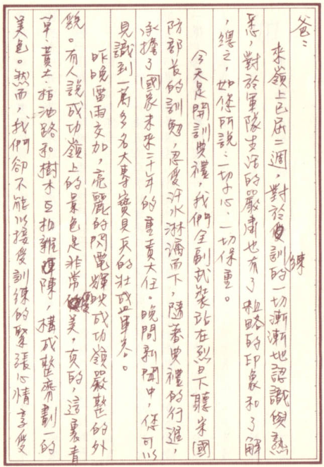
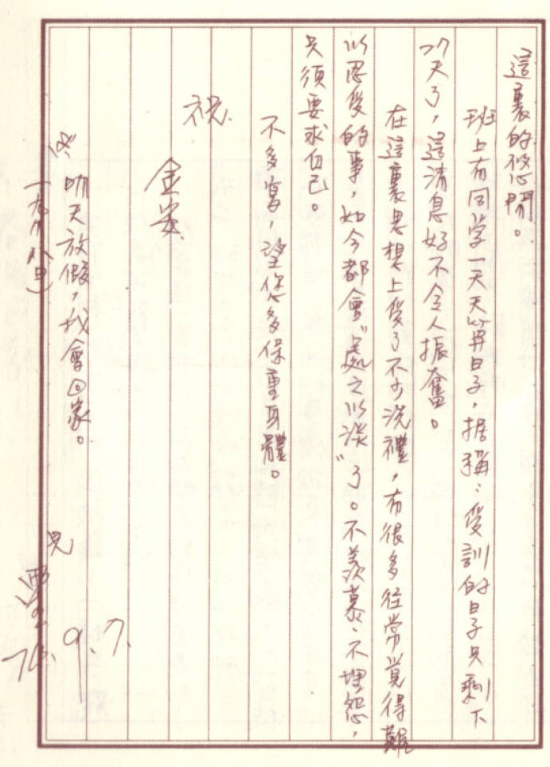

# 成功岭受训书

爸：

来岭上已届二周，对于受训练的一切渐渐地认识与熟悉，对于军队生活的严肃也有了粗略的印象和了解，总之，如您所说：一切小心，一切保重。

今天是开训典礼，我们全副武装站在烈日下听宋国防部长的训勉，忍受汗水淋漓而下，随着典礼的行进，承担了国家未来二十年的重责大任。晚间新闻中，您可以见识到一万多名大专宝贝兵的壮盛军容。

昨晚雷雨交加，亮丽的闪电辉映成功岭严整的外貌。有人说成功岭上的景色是非常优美，真的，这里青草、黄土、柏油路和树木互相杂陈，构成整齐划一的美色。然而，我们却不能以接受训练的紧张心情享受这里的悠闲。

班上有同学一天天算日子，据称：受训的日子只剩下 27 天了，这消息好不令人振奋。

在这里思想上受了不少洗礼，有很多往常觉得难以忍受的事，如今都会“处之以淡”了。不羡慕、不埋怨，只须要求自己。

不多写，望您多保重身体。

祝

金安

明天放假（九月八日），我会回家。

儿 雨生

74.9.7.

## 参考

-   [再见雨生 - github.com](https://github.com/yongsen/goodbye_tomzhang/tree/master)
-   [张雨生手稿 - tieba.baidu.com](https://tieba.baidu.com/p/2084189476#!/l/p1)
