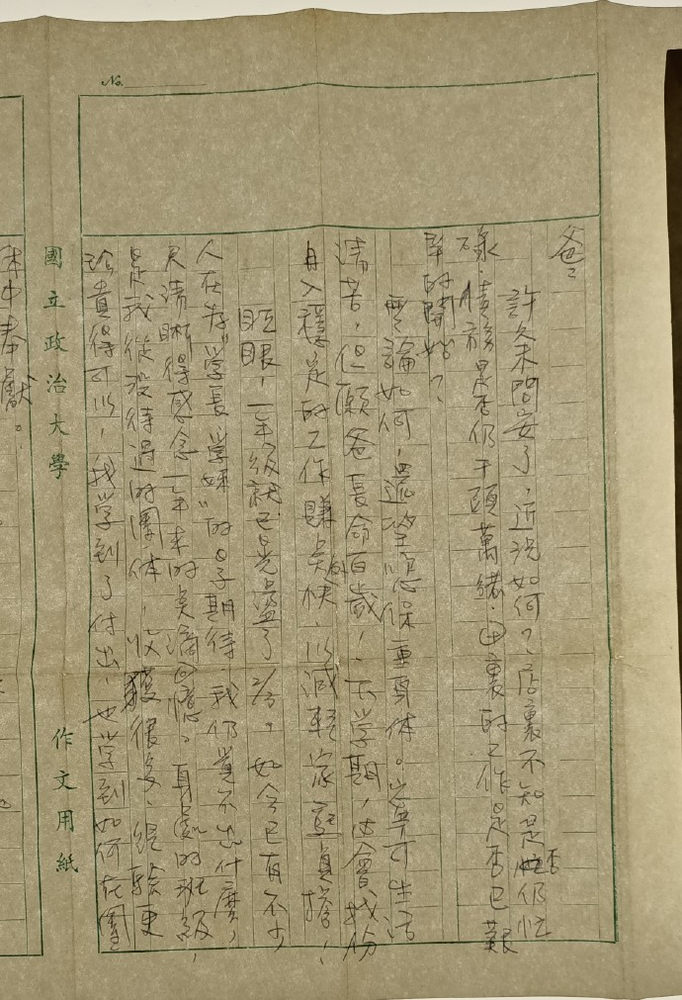
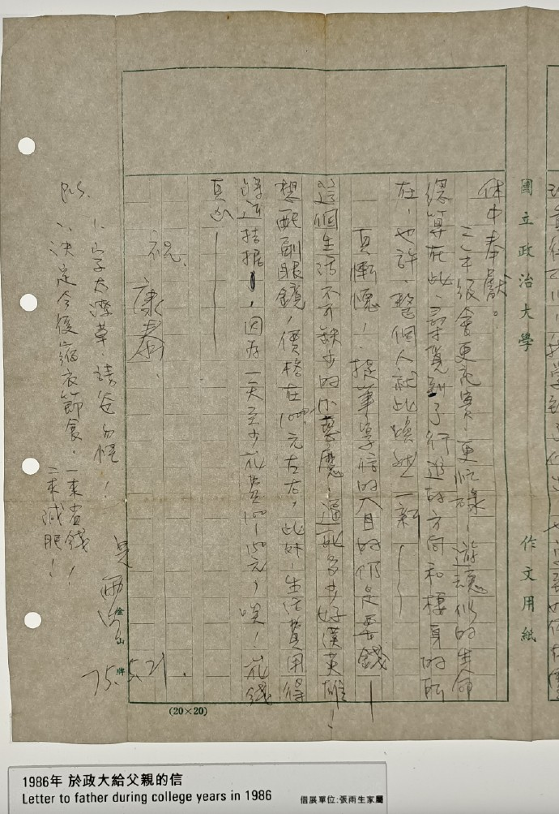

# 一年级心得

爸：

许久未问安了，近况如何？店里不知是否忙碌，债务是否仍千头万绪，田里的工作是否己艰辛的开始？

无论如何，还望您保重身体。宁可生活清苦，但愿爸长命百岁！下学期，必会找份月入稳定的工作赚点外快，以减轻家庭负担！

眨眼，一年级就已晃荡了 $\frac{2}{3}$，如今已有不少人在为“学长、学妹”的日子期待，我仍觉不出什么，只清晰得感念一年来的点滴回忆。身处的班级，是我从没待过的团体，收获很多、经验更珍贵得可以，我学到了付出，也学到如何在团体中奉献。

二年级会更充实、更忙碌，游魂似的生命总算在此寻觅到了行进的方向和栖身的所在，也许，整个人就此焕然一新~

真惭愧！提笔写信的目的仍是要钱——这个生活不可缺少的小恶魔，逼死多少好汉英雄！想配副眼镜，价格在 1000 元左右，此外，生活费用得将近拮据，因为一天至少花费 100-150 元，唉！花钱真凶~

祝
康泰

儿
雨生

75.5.21

P.S.

-   字太潦草，请爸勿怪！
-   决定今后缩衣节食，一来省钱，二来减肥！

## 参考

-   [想你到月球特展 14 - weibo.com](https://weibo.com/2567125954/MmN1ewdnz)
-   [家书字迹求辨认 - douban.com](https://www.douban.com/group/topic/289784449/)
