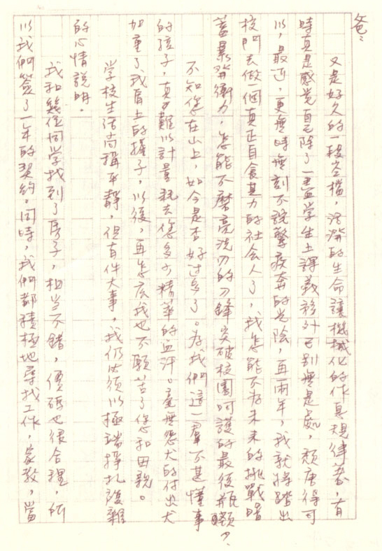
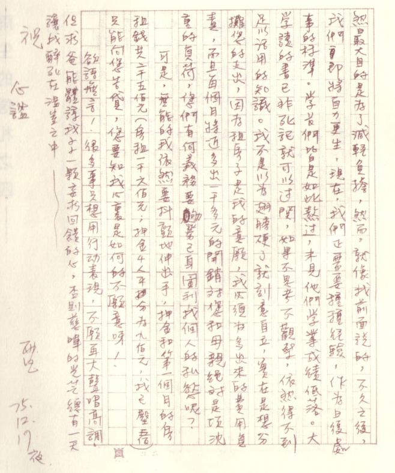

# 商谈在外租房子

爸：

又是好久的一段空档，活泼的生命让机械化的作息规律着，有时感觉自己除了一尽学生上课义务外已别无是处，颓唐得可以，最近，更无时无刻不诧惊疾奔的光阴，再两年，我就将踏出校门去做一个真正自食其力的社会人了，我怎能不为未来的挑战暗蓄暴发冲力，怎能不磨亮洗刃的刀锋突破校园呵护的最后瓶颈？

不知您在山上，如今是否好过多了。为我们这一群不甚懂事的孩子，真难以计量耗去您多少精萃的血汗。毫无怨尤的付出尤加重了我肩上的担子，以后，再怎么我也不愿苦了您和母亲。

学校生活尚称平静，但有件大事，我仍必须以极端挣扎复杂的心情说明。

我和几位同学找到房子，相当不错，价码也很合理，所以我们签了一年的契约。同时，我们都积极地寻找工作，家教，当然最大目的是为了减轻负担，然而，就像我前面说的，不久之后，我们即将自力更生，现在，我们正需要种种经验，作为日后处事的标准。学长们皆是如此熬过，未见他们学业成绩低落。大学读的书已非死记就可以过关，如果不思考不观察，依然得不到足以活用的知识。我不是以为翅膀硬了就刻意自立，实在是想分担您的支出，因为租房子是我的意愿，我必须为多出来的费用负责，而且每个月将近多出一千多元的开销对您和母亲绝对是项沈重的负荷，您们有何义务要劬劳己身图利我个人的私欲呢？

可是，无能的我依然要抖颤地伸出手，押金和第一个月的房租钱共二千五佰元（房租一千六佰元；押金 4 人平分为九佰元，我已壂五佰）只能向您告贷，您要知我心里是如何的不愿意呀！

却语无言！很多事只想用行动表现，不愿再大声唱高调。但求爸能体谅我小小一颗妄求反馈的心，否则慈晖的光芒总有一天让我醉死在温室之中~

祝

心谧

雨生

75.12.19 夜

## 参考

-   [再见雨生 - github.com](https://github.com/yongsen/goodbye_tomzhang/tree/master)
-   [张雨生手稿 - tieba.baidu.com](https://tieba.baidu.com/p/2084189476#!/l/p1)
-   [想念雨生 - tomchang.cn](https://www.tomchang.cn/archive/letter/76.html)
