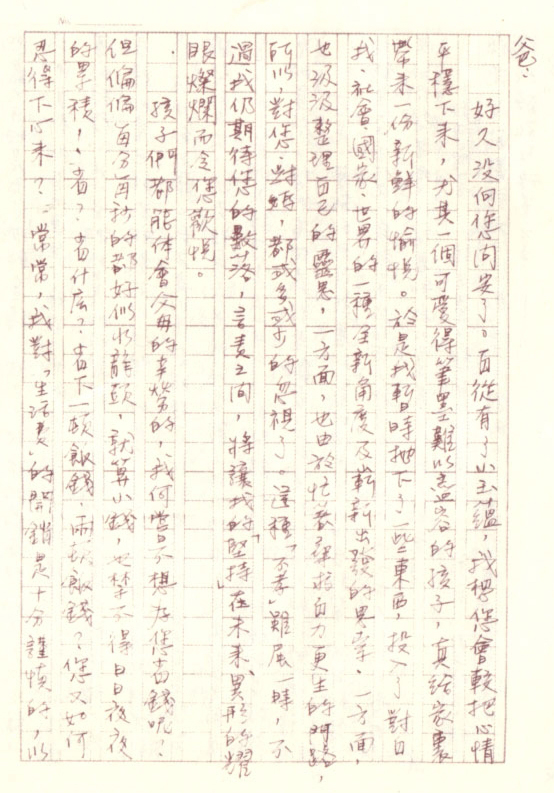
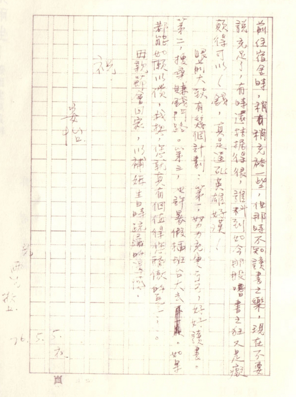

# 生活计划书

爸：

好久没向您问安了。自从有了小玉蕴，我想您会较把心情平稳下来，尤其一个可爱得笔墨难以尽容的孩子，真给家里带来一份新鲜的愉悦。于是我暂时抛下了一些东西，投入了对自我、社会、国家、世界的一种全新角度及崭新出发的思索，一方面，也汲汲整理自己的灵思，一方面，也由于忙着寻求自力更生的门路，所以，对您、对妈，都或多或少的忽视了。这种「不孝」虽属一时，不过我仍期待您的数落，言责之间，将让我的「坚持」在未来、异形的耀眼灿烂而令您欢悦。

孩子们都能体会父母的辛劳的，我何尝不想为您省钱呢？但偏偏每分每秒的都好似水龙头，就算小钱，也禁不得日日夜夜的累积！省？省什么？省下一顿饭钱，两顿饭钱？您又如何忍得下心来？常常，我对「生活费」的开销是十分谨慎的，以前住宿舍时，稍稍充裕一些，但那时不知读书之乐，现在不要说充足了，有时还拮据得很，谁料到如今那股嗜书之狂又是痴颠得可以！钱，真是逼死英雄好汉！

眼前大致有几个计划：第一，努力充实自己，好好读书。第二，搜寻赚钱门路。第三，也许暑假插班台大去~~不一定~~。如果都能如愿以偿，我想，您就真有个值得您骄傲的儿子了。

母亲节会回家，以补妈生日时疏漏的遗憾。

祝

安怡

儿 雨生 敬上

76.5.5.夜

## 参考

-   [再见雨生 - github.com](https://github.com/yongsen/goodbye_tomzhang/tree/master)
-   [张雨生手稿 - tieba.baidu.com](https://tieba.baidu.com/p/2084189476#!/l/p1)
-   [想念雨生 - tomchang.cn](https://www.tomchang.cn/archive/letter/77.html)
