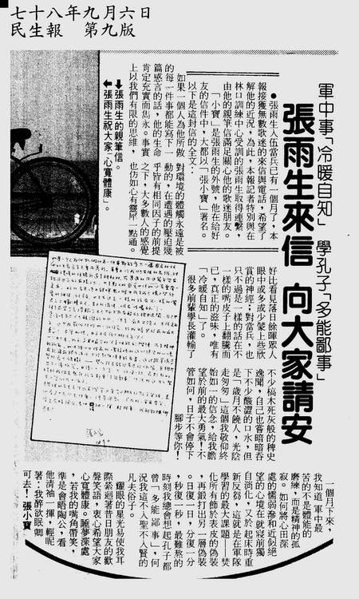

雨生服役期间写给歌迷的公开信

> 张雨生入伍当兵已有一个月了，《民生报》接获无数歌迷的来信与电话，希望了解他的近况，为此，本报记者特别与在林口训练中心受训的张雨生取得联系，由他的亲笔信满足关心他的歌迷朋友。「小宝」是张雨生的外号，他在给好友的信件中，大都以「张小宝」署名。

如果一个人为他做的每一件事都能写下一篇感言的话，他的生命肯定充实而隽永。事实上以我们有限的思维，对环境的体触永远是被动的，在遭遇的压迫几乎皆有相同因子的前提之下，大多数人的感觉也彷如心有灵犀一点通。好比看见落日余晖众人眼中或多或少蒙上些欣赏的神经；对当兵，也不过是一样的话在不一样的嘴皮子上翻腾而已，真正的滋味，唯有「冷暖自知」了。

很多前辈学长灌输了不少槁木死灰般的稗史逸闻，自己也常暗暗吞下不少酸涩的口水，但是「岁月不饶人，光阴走匆匆」这个我敬仰始终如一的信念，给我瞻望于前的最大勇气！不管如何，日子不会停下脚步等你！

一个月下来，我知道军中最苦的不是体能的磨练，而是精神的孤寂。如何将心田深处的懦弱渗和近似绝望的心境在就寝前独自消化，又于起床时重新反刍，这就是在军队学习的最大课题——焚化所有饰于表皮的伪装，再锻打出另一层伪装。日复一日，分复一分，秒复一秒，最难熬的时刻我总会想起孔子都曾「多能鄙事」，何况我这不入圣不入贤的凡夫俗子。

耀眼的星光易使我耳际萦回着昔日朋友的欢声笑语，衷心希望大家心宽体康。睡梦深处，若我的嘴角带笑，准是会晤陶公，看他清袖一挥，轻呢着：我醉欲眠卿可去！

张小宝

## 参考

本文发表于 1989 年 9 月 6 日的《民生报》第 9 版

-   [张雨生剪报海报等收藏 - tieba.baidu.com](https://tieba.baidu.com/p/2084189445#!/l/p1)
-   [雨生服役期间写给歌迷的公开信 - tomchang.cn](https://www.tomchang.cn/archive/letter/71.html)
