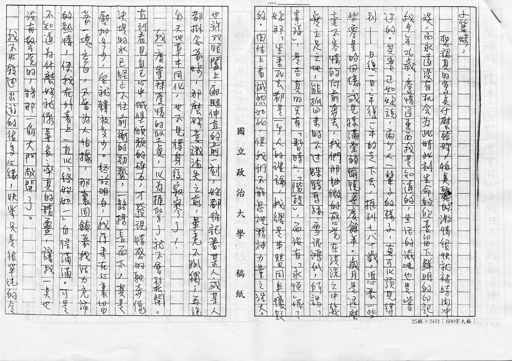
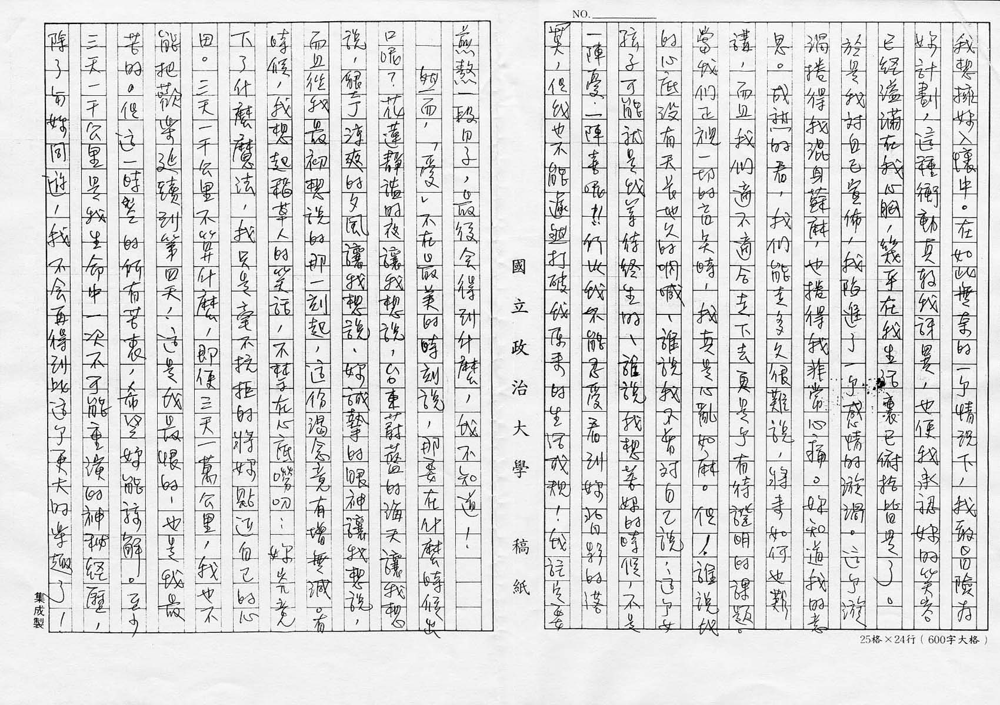
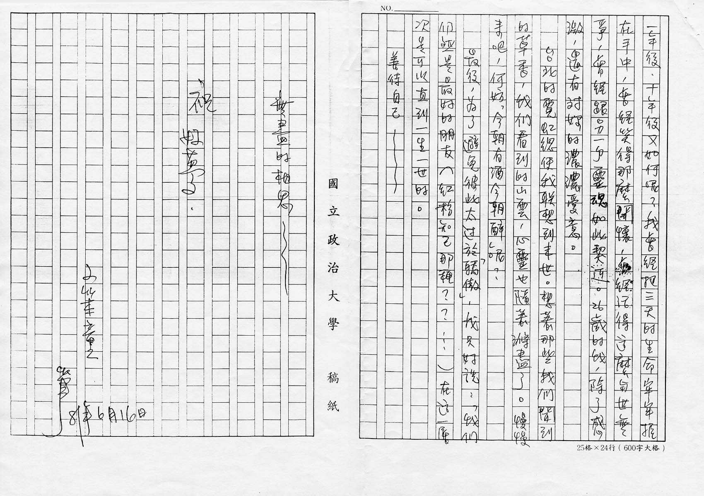

# 「爱」不在最美的时刻说，那要在什么时候出口呢？

小笨妹：

想认真的写点什么给妳，怕美丽的激情很快就被时间冲淡，而永远没有机会为此时此刻生命的欣喜留下鲜明的印记。我今年 26 岁，爱情这东西我是知道的，生活的滋味也是尝过的。其实正如妳说，两个人一辈子的样子，真可以预见得到 —— 日复一日、年复一年的走下去，捱到七、八十岁，凭着一些些零星的回忆，或儿孙满堂的愉悦安度余年。岁月是这么毫不容情的向前奔去，我们那细致的感觉在洪流之中几无立足之地，能抓回来的不过蛛丝马迹、雪泥鸿爪，所谓「幸福」，是否真的只有「暂时」、「阶段」，而没有「永恒」呢？妳那「生来死去都是一个人」的理论，我总是半赞同半怀疑的。肉体上看诚然如此，但我们不能忽视精神力量之浩大。也许双眼阖上，两腿伸直的前一刻，妳都惦记着某人，或某人都挂念着妳，那么妳意识消失之前，毕竟不孤独；再说与天地草木同化，也不见得身后寂寥了！

我一度崇拜爱情的坚贞，以为握紧了就不会松开。直到看见自己心中城堡倾颓的碎石，才发现情感的驰奔像决堤的水已经止不住前冲的劲势，一路扬长而下，真是压抑多少，它就释放多少。终于明白，我原来在心里留着一块空白，不曾为人占据，那里固锁着我活力充沛的热情，使我在外表上一直以「终始如一」自信满满。可是不知道为什么妳就像善良、率真的精灵，让我一点也没有警觉的，将那一扇大门敞开了。

我不必叙述出游的很多心绪，快乐只是很单纯的令我想拥妳入怀中。在如此无奈的一个情况下，我敢冒险为妳计划，这种冲动真教我讶异，也使我承认妳的笑容已经溢满在我心胸，几乎在我生活里已俯拾皆是了。于是我对自己宣布，我陷进了一个感情的漩涡。这个漩涡卷得我混身苏麻，也卷得我非常心痛。妳知道我的意思。成熟的看，我们能走多久很难说，将来如何也难讲，而且我们适不适合走下去更是个有待证明的课题。当我们正视一切的盲点时，我真是心乱如麻。但！谁说我的心底没有天长地久的呐喊、谁说我不曾对自己说：这个女孩子可能就是我等待终生的、谁说我想着妳的时候，不是一阵忧、一阵喜呢！！所以我不能忍受看到妳背影的落寞，但我也不能遽然打破我原来的生活成规！我注定要煎熬一段日子，最后会得到什么，我不知道！

然而，「爱」不在最美的时刻说，那要在什么时候出口呢？花莲静谥的夜让我想说，台东蔚蓝的海天让我想说，垦丁凉爽的夕风让我想说，妳诚挚的眼神让我想说，而且从我最初想说的那一刻起，这份渴念竟有增无减。有时候，我想起稻草人的笑话，不禁在心底唠叨：妳究竟下了什么魔法，我只是毫不抗拒的将妳贴近自己的心田。三天一千公里不算什么，即使三天一万公里，我也不能把欢乐延续到第四天！这是我最恨的，也是我最苦的。但这一时空的所有苦衷，希望妳能谅解。至少三天一千公里是我生命中一次不可能重演的神秘经历，除了与妳同游，我不会再得到比这个更大的乐趣了！一年后、十年后又如何呢？我曾经把三天的生命牢牢握在手中，曾经笑得那么开怀，曾经活得这么与世无争，曾经跟另一个灵魂如此契近。26 岁的我，除了感激，还有对妳的浓浓爱意。

台北的霓虹总使我联想到来世。想着那些我们闻到的草香，我们看到的山云，心灵也随着涤尽了。慢慢来吧，何妨「今朝有酒今朝醉」呢？

最后，为了避免彼此太过于「骄傲」，我只好说：「我们仍然是最好的朋友（红粉知己那种？？…）在这一层次是可以直到一生一世的」。

善待自己～～

无尽的相思～～

祝

好梦

小笨童 笔

81 年 6 月 16 日[^1]

[^1]: 民国 81 年，即 1992 年

图片来源：[张雨生手稿 - tieba.baidu.com](https://tieba.baidu.com/p/2084189476#!/l/p1)
