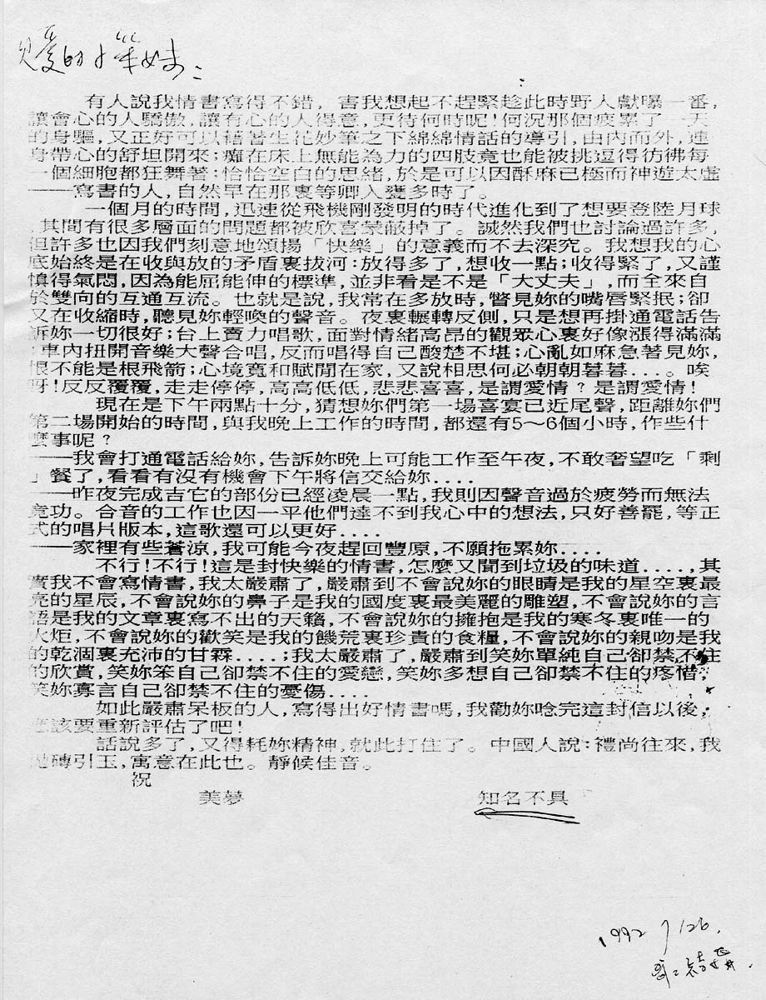

# 严肃呆板的我写不出好情书

亲爱的小笨妹：

有人说我情书写得不错，害我想起不赶紧趁此时野人献曝一番，让会心的人骄傲，让有心的人得意，更待何时呢！何况那个疲累了一天的身躯，又正好可以借着生花妙笔之下绵绵情话的导引，由内而外，连身带心的舒坦开来；瘫在床上无能为力的四肢竟也能被挑逗得彷佛每一个细胞都狂舞着；恰恰空白的思绪，于是可以因酥麻已极而神游太虚 —— 写书的人，自然早在那里等卿入瓮多时了。

一个月的时间，迅速从飞机刚发明的时代进化到了想要登陆月球，其间有很多层面的问题都被欣喜蒙蔽掉了。诚然我们也讨论过许多，但许多也因我们刻意地颂扬「快乐」的意义而不去深究。我想我的心底始终是在收与放的矛盾里拔河：放得多了，想收一点；收得紧了，又谨慎得气闷，因为能屈能伸的标准，并非看是不是「大丈夫」，而全来自于双向的互通交流。也就是说，我常在多放时，瞥见妳的嘴唇紧抿；却又在收缩时，听见妳轻唤的声音。夜里辗转反侧，只是想再挂通电话告诉妳一切很好；台上卖力唱歌，面对情绪高昂的观众心里好像涨得满满；车内扭开音乐大声合唱，反而唱得自己酸楚不堪；心乱如麻急着见妳，恨不能是根飞箭；心境宽和赋闲在家，又说相思何必朝朝暮暮…。唉呀！反反复覆，走走停停，高高低低，悲悲喜喜，是谓爱情？是谓爱情！

现在是下午两点十分，猜想妳们第一场喜宴已近尾声，距离妳们第二场开始的时间，与我晚上工作的时间，都还有 5 ～ 6 个小时，作些什么事呢？ 
—— 我会打通电话给妳，告诉妳晚上可能工作至午夜，不敢奢望吃「剩」餐了，看看有没有机会下午将信交给妳…… 
—— 昨夜完成吉它的部份已经凌晨一点，我则因声音过于疲劳而无法竟功。合音的工作也因一平他们达不到我心中的想法，只好善罢，等正式的唱片版本，这歌还可以更好…… 
—— 家里有些苍凉，我可能今夜赶回丰原，不愿拖累妳……

不行！不行！这是封快乐的情书，怎么又闻到垃圾的味道……，其实我不会写情书，我太严肃了，严肃到不会说妳的眼睛是我的星空里最亮的星辰，不会说妳的鼻子是我的国度里最美丽的雕塑，不会说妳的言语是我的文章里写不出的天籁，不会说妳的拥抱是我的寒冬里唯一的火炬，不会说妳的欢笑是我的饥荒里珍贵的食粮，不会说妳的亲吻是我的干涸里充沛的甘霖……；我太严肃了，严肃到笑妳单纯自己却禁不住的欣赏，笑妳笨自己却禁不住的爱恋，笑妳多想自己却禁不住的疼惜，笑妳寡言自己却禁不住的忧伤……

如此严肃呆板的人，写得出好情书吗，我劝妳念完这封信以后，应该要重新评估了吧！

话说多了，又得耗妳精神，就此打住了。中国人说：礼尚往来，我抛砖引玉，寓意在此也。静候佳音。

祝

美梦

知名不具

1992 7/26 哥哥结婚

## 参考

-   [张雨生手稿 - tieba.baidu.com](https://tieba.baidu.com/p/2084189476#!/l/p1)
