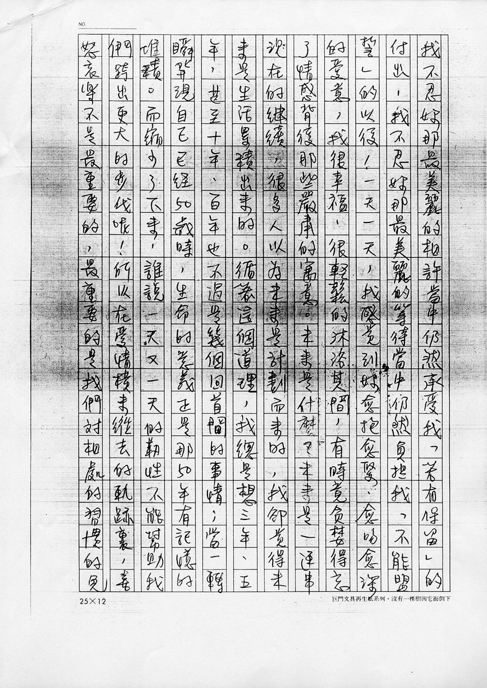

# 未来是什么

小笨妹：

这个时候，独自坐在茶馆喝茶，确实有点不可思议。尽管一切若以文字的眼光来看，不见得称不上风雅；只是在台北市里，此种闲情逸致好象只属于神经已不太协调的人类！其实不是为等妳，我还真没有借口这样静静地坐着、想着、写着，时间可以流失在浓重的鼻息吐吸之中，也可以一分一秒的被我一并写进了这些文字里！

昨天于台中再度翻开妳的信以后，心底一直滚动着一些情绪。其中妳形容这段恋情，用了「24 年来最美丽」的词句，真令我再三念诵而于心不忍。我不忍妳那最美丽的喜悦当中仍然有淡淡的「准备失去」的哀愁，我不忍妳那最美丽的经验当中仍然有无奈的「重重限制」的阴影，我不忍妳那最美丽的相许当中仍然承受我「若有保留」的付出，我不忍妳那最美丽的等待当中仍然负担我「不能盟誓」的以后！一天一天，我感觉到妳愈抱愈紧、愈吻愈深的爱意，我很幸福、很轻松的沐浴其间，有时竟贪婪得忘了情感背后那些严肃的寓意。未来是什么？未来是一连串现在的继续，很多人以为未来是计划而来的，我却觉得未来是生活累积出来的。循着这个道理，我总是想三年、五年，甚至十年、百年也不过是几个回首间的事情；当一转瞬发现自己已经 50 岁时，生命的意义正是那 50 年有记忆的堆积。而缩小了下来，谁说一天又一天的韧性不能帮助我们跨出更大的步伐呢！所以在爱情横来纵去的轨迹里，喜怒哀乐不是最重要的，最重要的是我们对相处的习惯的免疫能力。怎么说呢？当妳知道一天又一天的眼神相对所付予的意义都是一样的、妳知道一天又一天的双手交握所体触的力度都是一样的、妳知道一天又一天的欢畅笑语所感受的温柔都是一样的，无法忍受平凡的重复的妳，该怎么想这些毫无弹性的生活呢？是不是统统祭出「习惯」这一法宝，然后告诉自己爱情已死去。死去的，其实是我们的感情与对时空压力而疲乏的韧性，这是人性的悲哀。我所谓「免疫」，正如医学上以毒攻毒的方法，唯有承认我们内心的软弱，我们才能从垂死的灰烬当中再站起来。话扯远了，也扯深了，或许这样的午夜、这样的茶几、这样的盖杯、这样的音乐，才让我的心有如行空的天马一般东西南北闯荡，倘若妳觉得心烦，就令这些文字穿眼而过罢。

我向来是个急躁而思虑不纯熟的人，常为了无心做错的事情，自怨自艾很久。前面那些拼拼凑凑的文字，对一个熬夜剪带子的人而言，念来不啻是种难受的罪！如果妳读到此处，已有点心智纷杂的话，请狠狠的作弄稻草人，或者面向西边，以气功隔海密传训诫，我即使在睡梦之中，也必定慌乱爬起，向东叩头三次谢罪。

原子笔水时续时断，不知还能抒写多少。时间应在凌晨四点以后，我想到 48 小时之内就将飞越彼岸，精神竟怎么样也低靡不下去。尤其柜台处有二、三位嗓门不小的女生，以高分贝的笑声刺激着我的肾上腺，我也乐得振笔与妳作这无声的交谈。

昨天回丰原的路上，我的心情怪异的起起伏伏，想起许多年少的旧梦。突然发现最近的自己对未来实在太过于张皇失措了，以致于很多想法竟是只求心安就好。电话里是吞吞吐吐理不出头绪，但那时已决定要全力专心的把眼前的这张唱片[^1]工作留下一个不错的句点；听到妳的声音，我突然有些心疼，怕我专心的程度太矫枉过正，而疏忽对妳的嘘寒问暖。而且妳根本无能介入我的工作之中，我也不能理所当然的关心妳，在明暗之中，是要充分的信心才得以构成巨大有力的翅膀；但一路到年底的忙乱，我的胜算有多少、妳的胜算有多少，我们的胜算有多少，谁也无法保证，可是那些牵肠挂肚的，又总是令我们多花费倍于常人的气力，转来转去，躲东躲西，有时难免狼狈的被人逮了正着，有时不可避免的担忧别人脸色，行行后行行，除了我们彼此相互的舔舐伤口之外，是不可能有第三者的援手。多年以后，任谁也可以对陈年旧事一笑置之，是在发生的当下，得要自己肯定那份坚贞、自己欣赏那种毅力。所以我奋力工作，因为我答应我自己，我要站起来给他们看。这一张唱片以后，我的条件都只有一个，就是 —— 如果不让我全权处理整张唱片的风格与依照我的想法，我宁可不挂制作人的名！制作得再精致的皮偶，终究仍是傀儡！

距离挂下妳的电话，又过了一个小时。那些高分贝仍然萦绕在耳际，再过半个钟头，就要迎接中秋节的黎明了。我想太阳苦苦等候了一年，终于有机会让世人去瞧瞧他为月亮托映的光辉，所以今天他的出现，该是充满骄傲而虎虎生威的。店里客人似乎只剩下我了，刚刚有路人进来借电话，彷被锁在家门外，唉！走夜路的人，怎么能不带钥匙！

夜到最深处，却是天明的开始。而文章看似到了尽头，其实相思才浓郁起来。话说多了，我得停笔了。

虽然徐志摩说「数大便是美」，可是「恰到好处」也标致得有其韵味～～

祝 
美梦

笨童 
于石涛园

## 参考

-   [张雨生手稿 - tieba.baidu.com](https://tieba.baidu.com/p/2084189476#!/l/p1)
-   [未来是什么 - tomchang.cn](https://www.tomchang.cn/archive/letter/83.html)
-   [张雨生吐槽《大海》专辑 - bilibili.com](https://www.bilibili.com/video/BV1ba411w75W/)

[^1]: 专辑《大海》
