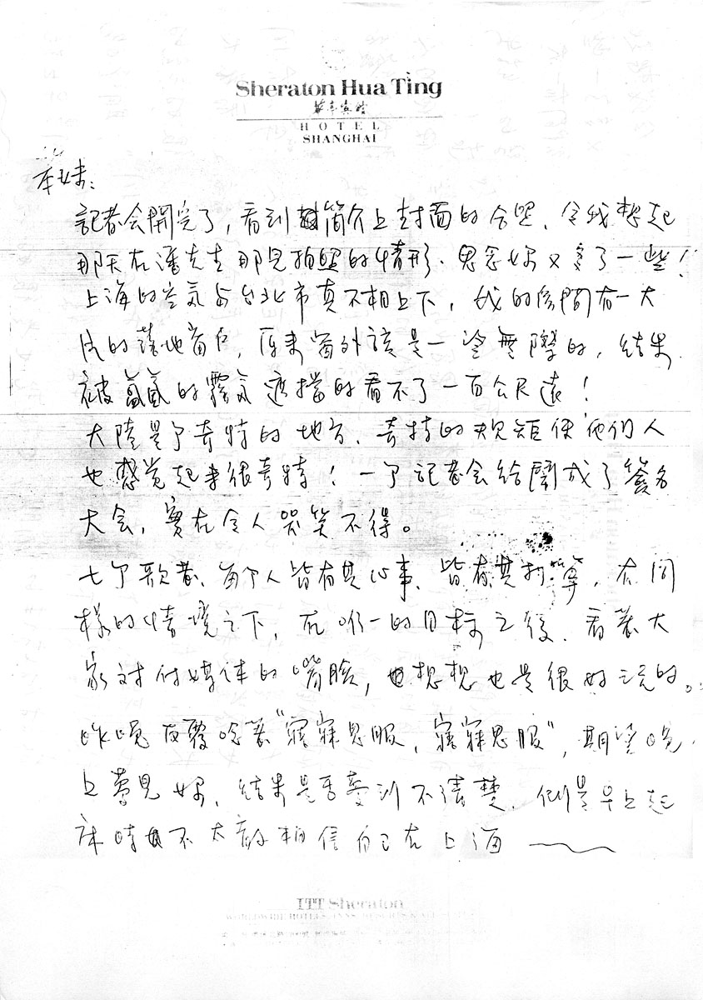
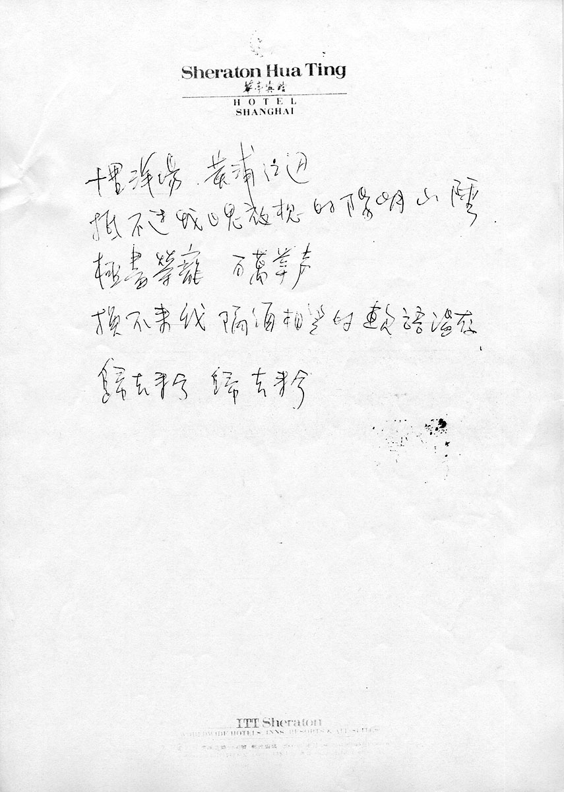

# 归去来兮

> 1993 年 1 月 1 日与 2 日，飞碟公司在上海举办了[「飞向未来」演唱会](https://baike.baidu.com/item/%E9%A3%9E%E7%A2%9F%E9%A3%9E%E5%90%91%E6%9C%AA%E6%9D%A51993%E4%B8%8A%E6%B5%B7%E6%BC%94%E5%94%B1%E4%BC%9A%E5%AE%9E%E5%86%B5%E7%89%B9%E8%BE%91/14893812)，张雨生于上海华亭宾馆写下了这封信。

笨妹：

记者会开完了，看到简介上封面的合照，令我想起那天在潘先生那儿拍照的情形，思念妳又多了一些！上海的空气与台北市真不相上下，我的房间有一大片的落地窗户，原来窗外该是一望无际的，结果被氲氤的雾气遮挡的看不了一百公尺远！

大陆是个奇特的地方，奇特的规矩使他们人也感觉起来很奇特！一个记者会给闹成了签名大会，实在令人哭笑不得。

七个歌者，每个人皆有其心事、皆有其打算，在同样的情境之下，在唯一的目标之后，看着大家对付媒体的嘴脸，想想也是很好玩的。

昨晚反覆念着“寤寐思服、寤寐思服”，期望晚上梦见妳，结果是否梦到不清楚，倒是早上起床时不太敢相信自己在上海～～

十里洋场 黄浦江边  
抵不过我日思夜想的阳明山陲  
极尽荣宠 百万掌声  
换不来我隔海相望的软语温存  
归去来兮 归去来兮

## 参考

-   [张雨生手稿 - tieba.baidu.com](https://tieba.baidu.com/p/2084189476#!/l/p1)
