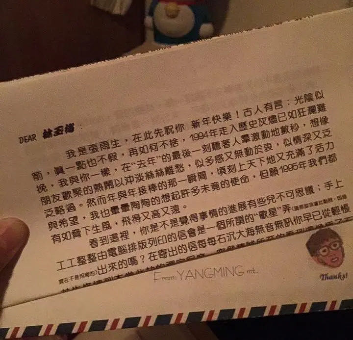

# 「卡拉 Ok‧台北‧我」宣传期写给歌迷的一封信

Dear 宝友：

我是张雨生，在此先祝你新年快乐！古人有言：光阴似箭，真一点也不假，再如何不舍，1994 年走入历史灰烬已如狂澜难挽，我与你一样，在「去年」的最后一刻听着人群激动地数秒，想象朋友欢聚的热闹以冲淡丝丝离愁，似多感又无动于衷，似深情又泛泛略过。然而年与年接棒的那一瞬间，顷刻上天下地又充满了活力与希望，我也晕晕陶陶的想起许多未竟的使命，但愿 1995 年我们都有如胁下生风，飞得又高又远。

看到这里，你是不是觉得事情的进展有些儿不可思议；手上工工整整由电脑排版列印的信会是一个所谓的「歌星」弄（请原谅我遣此动词，因为实在不是用写的）出来的吗？在寄出的信每每石沉大海无音无讯你早已从轻怅若失修练到本当此劫的禅定程度，突然精诚所至的看到这像极了石里蹦出来的猴子的信件，岂不怀疑是收到后反而倒霉透了的幸运信的改头换面？或者只是唱片公司的定期作业这次不知怎么雀屏中选？不用再猜，放下「既期待又怕受伤害」那一类制约反应吧！这一次货真价实是我 ─ 张雨生亲自为你绞尽脑汁「键」写此信，信不信，我至少花掉四个夜晚的工作时数，脑力激荡的构想两个月才竣此神功。如此一番大功夫独乐乐不妨众乐乐，所以利用计算机统一整理的方便，让许多曾同一时间感受同一怅惘的朋友这回能分享同一时刻的同一欢愉了，也藉此机会表达我个人对你以及很多始终让我如沐春风的朋友的谢忱。根据非正式的统计，这次从百件以上 1994 年八月后（1995 闰八月的巧合？）的来函中筛选出约 80 份，我，以一视同仁的精神，全部，览读过一遍，看完后才如大梦初醒。许多人对我以及「卡拉 OK」专辑的鼓励支持，甚至各各言之有物的聆赏感觉令我动容，而偶杂其间的严苛批判更让我肃然，那些动辄洋洋洒洒写五张以上密密麻麻信纸的朋友真不是盖的，揣想爱恨交加力透纸背的良苦用心，不禁使我缅想起文以载道的唐宋名人，这些朋友的文采以某个角度论析比韩柳欧阳不少逊色。捧的妙、骂的好、问的鬼哭神号，我不理睬，究竟难耐心底不吐不快的搔播，与其嗤我鸵头龟缩故作神秘答案随风飘散，宁可起身证道笑傲江湖惹它一城风絮。

然而我毕竟是凡人，要像孔子因材施教般的回应确实难，只能异中求同，再来模拟考试综合解答。你想过或不曾想过的，你想问或好奇于我的，你不能忍受或质因疑果的，辛稼轩说，「蛾儿雪柳黄金缕，笑语盈盈暗香去。众里寻它千百度。蓦然回首，那人却在，灯火阑珊处。」

Secret File No. 1：歌友联盟？

秀如与秀玉两位可爱的朋友在这张专辑的宣传期间南北奔波，热情的程度实令我于心不忍，其实一个组织的复杂又岂是她们小小单纯心灵所能扛起。根本上我很难过的要投下否定票给这个注定早夭的团体，因为历史上的恶例太多，曾有上千人的歌友会，缴了钱后也无疾而终。人力动员，要求其自发须天时地利配合，我既不可能每每选择寒暑假推出新作，宣传单位也不会牵就上下课的空档录像，青春的生命应该有更美好的追寻，无端分割你的时间借用你的光华，我不能如此啊！可是面对那白里透红脸蛋下的恳切，我不能不体恤这个心愿，其实有些事情也是我该做而一直做不到的，她们的想法是无庸置疑的在帮我。这些日子，我一直试着想藉助计算机科技完成两个系统，一是专属我的 BBS（电子布告栏，选举期间蛮出风头的）站，一是歌友的语音答询服务。前者可让有数据机的朋友透过计算机终端机直接与我的计算机连线，一如其它 BBS，除了电子信件往来，也可下传或上传各类档案，这样讯息的传递将快速而有效率，当然前提是你要有能够连线的一应设备。后者经由计算机语音界面，你可以打电话进站听取各类有关于我的消息，比方说，新歌试听，创作简介，我的亲自招呼问好，答询信箱等，甚至歌友与歌友的联系皆能自行运作，你只要电话在手，予取予求不是幻梦。我很希望由此空中式的交会取代过于型式化的联盟，既取其精髓又省却其繁芜。目前尚与设计师的沟通中，也许你对糸统的要求有更独到之处，可能的话请来函赐教，不胜感激。最快三四月间上线，请拭目以待。再一次谢谢秀玉秀如，请勿放弃妳们执着的精神与勇气。

Secret File No. 2：简单与复杂，流行与冷僻，清爽与飙高

是你吗？慷慨激昂像个愤世嫉俗的斗士，掩面轻叹像个饱尝冷暖的隐者，不顾一切书空咄咄就为当头棒喝我幡然觉悟。我想从退伍以后，这一直是争论于我心亦激辩于外的命题。没有人天生喜欢孤芳自赏，没有人愿意著述束之高阁，古人如是，我亦然。只是良窳标准何在，却不是一个容易厘清的现实。大唐杨玉环以肥美，晚清妇女缠足以为美，五十年以前谁说黑人美，所依所恃不过流行之风，有的青山依旧在，有的却早已衣冠成古坵。我的所作所为也是在为自己心中认定的美抛砖引玉的寻求认同，艺术倘不能纯粹，我不知那是否仍称为艺术。或有说：何不妥协于大众口味温室般的保护，以培育璨丽花蕊，汐止的金绸与 QQ 就持此看法吧；我并非没试过，「想念我」与「大海」，结果是造成纯粹性的创作完全淹没在丛林般伟壮的主打歌中，跼蹐一角失去既存的意义。「他们」、「心底的中国」都可惜了，可惜在沦为陪衬性的龙套，丧失主动放射的力量。所以我真真不能回头斑驳觅来路，唯有不断试鍊我心中的乐土，讨好歌迷毕竟不能忸怩作态！

Secret File No. 3：长发为君留？为君剪？

让我反问你，发禁彼时你可曾有过一丝一毫心底的怨楚，可曾有过一丁一点反叛的吶喊？我只想体验突然有一天灵光乍现引起的张曼玉式长发飘逸幻觉，有为者亦若是。自由的。让我再反问你，对处于百分之九十的人都投下不信任票的情况你能容忍多久，对关爱的眼神一致不看好的动作你又能继续多久？我只想试试我的极限，因为物极必反。

Secret File No. 4：永远为退出而准备？

我搞不清楚永远，一如我「永远」搞不清楚现在，我也向来不忍心贬低你的智商，玩一些难解的文字或拼图游戏，我希望透过媒体的言语能明澈似阳明山顶一望无际的夜景。一日为名，终生不休，那能说退就退。我的偶像李建复兄，在息歌多年照样先被拉出唱主题曲（同是我的偶像金庸先生的小说被惨不忍睹改编的戏），后又有新党党歌的领唱，回想当年退出种种岂能不悔当初之退吁叹维今之出。一日为名，终生不休，那能说退就退。我的少年狂情之所寄 Eagles 合唱团，解散之时宣称永不可能聚合复出，去年却先以演唱会召唤老的中的青的歌迷，后干脆再发行包括新作在内的现场专辑，回想当年退出信誓旦旦岂能不笑当初之退谬思维今之出。一日为名，终生不休，那能说退就退。可不是嘛！

Secret File No. 5：无不痴斋残篇断简？？？＠＃＃＠＄……

你不是无名氏，否则收不到此信。你也留下了住址，否则收不到此信。可是，如果你确实掌握曾有过付出的无名氏的第一手资料，请转告他们我铭感五内。

本文纯供学术研讨之用，请勿提供情书大全出版商，也别拿其中段落比作论说文模板，以免，咳咳，贻笑大方。

有许多时效性的信件，每每与我相见恨晚，像有朋友邀我出席钢琴独奏会，我非不为也是不逢其时也，又有台大诗社的朋友，我欲乘风而去，却得要等到落花时节再逢君了。如果我的电子管道建立起来，就能减少这些憾事的发生吧。

抢先预告，下一张专辑可能令亲者痛、仇者快，除了 easy-listening 的旋律，有识之士的你还听得出什么呢？

洛夫诗抄（谢谢安之）：

「至于人间琐事 
亦如夏末从山间升起的炊烟 
既非你，也非我 
所以不必深究 
我只担心找不到那种 
带点萧瑟味的邮票 
那么 
就贴一张落叶吧」

取自「酿酒的石头」「惊秋」之二。

Adios，我的朋友，这一封既不文情并茂也不惊天泣地的信终娓娓于声，细思我一路行来，平顺彷如新开张的溜冰场上高手的滑行，虽然我的傲气曾数度尸横遍野，但大体上我不能不傚吴秘书长唱感恩的心。明年的展望？三党和平共存！

结尾，还是泰戈尔吧

「你微笑着不对我说什么，我觉得这正是我已经久候的。」

张雨生 January 5 1995

## 参考

-   [『卡拉 Ok‧台北‧我』宣传期写给歌迷的一封信-信札-张雨生网站 - tomchang.cn](https://tomchang.cn/archive/letter/69.html)

出处为《雨生朋友会会刊 ​》1999 年 ​​​​​​​

当前页面缺陷：缺少图片以供校对
