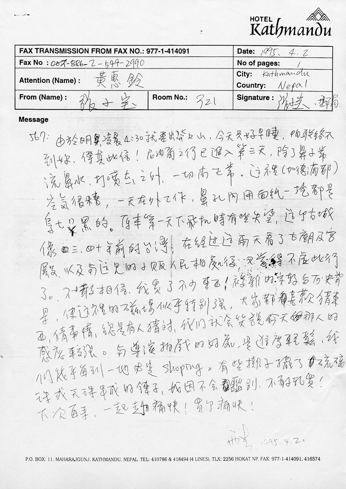

# 尼泊尔之行

567∶

由于明凌晨 4:30 就要出发上山，今天只好早睡，怕联络不到你，传真此信！尼泊尔之行已进入第三天，除了鼻子常流鼻水、打喷嚏之外，一切尚正常。这里（加德满都）空气很糟，一天在外工作，鼻孔内用面纸一挖都是乌七ㄇㄚ黑[^1]的。原本第一天下飞机时有些失望，这个古城像三、四十年前的台湾；在经过这两天看了古庙及宫殿，以及与这里的小贩人民相处后，又觉得不虚此行了。不敢相信，我买了不少东西！复杂的宗教与历史背景，使这里的磁场似乎特别强，大家都喜欢猜东西、猜事情，总是有人猜对，我们就会笑说今天那人的感应较强。与导演拍戏的好处，是进度轻松，我们几乎每到一地必定 shoping。有些摊子摆了琉璃珠或天珠串成的链子，我因不会鉴别，不敢乱买！

下次再来，一起走个痛快！买个痛快！

雨生 1995.4.2.

当前页面缺陷：不知道信件开头的 567 什么意思

[^1]: 「ㄇㄚ」读作「ma」，类似「乌漆麻黑」，参考 [乌漆麻黑还是黑漆麻乌？ - zhihu.com](https://www.zhihu.com/question/26062768)
