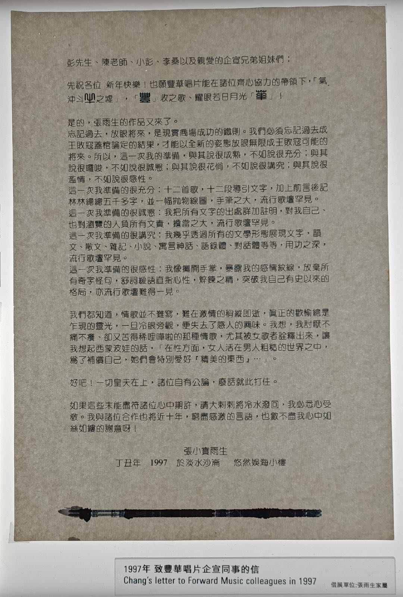
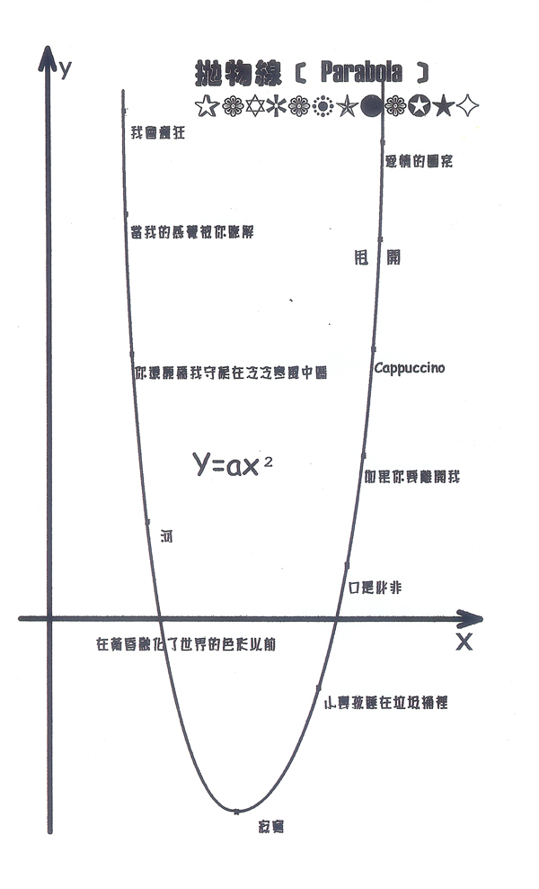

# 致丰华唱片企宣同事的信

彭先生、陈老师、小彭、李桑以及亲爱的企宣兄弟姐妹们：

先祝各位 新年快乐！也愿丰华唱片能在诸位齐心协力的带领下，「气冲斗牛之墟」，「丰」收之歌、耀眼若日月光「华」！

是的，张雨生的作品又来了。

忘记过去，放眼将来，是现实商场成功的铁则。我们必须忘记过去成王败寇盖棺论定的结果，才能以全新的姿态放眼无限成王败寇可能的将来。所以，这一次我的准备，与其说很成熟，不如说很充分；与其说很啰嗦，不如说很诚恳；与其说很花俏，不如说很讲究；与其说很滥情，不如说很感性。

这一次我准备的很充分：十二首歌，十二段导引文字，加上前言后记林林总总五千多字，并一幅抛物线图[^1]，手笔之大，流行歌坛罕见。

这一次我准备的很诚恳：我把所有文字的出处详加注明，对我自己、也对浏览的人负所有文责，担当之大，流行歌坛罕见。

这一次我准备的很讲究：我几乎透过所有的文字形态展现文字，韵文、散文、杂记、小说、寓言神话、语录体、对话体等等，用功之深，流行歌坛罕见。

这一次我准备的很感性：我像摊开手掌，暴露我的感情纹线，放弃所有奇字怪句，舒词缓语直指心性，淬炼之精，突破我自己有史以来的格局，亦流行歌坛难得一见。

我们都知道，情歌并不难写，难在激情的稍纵即逝，真正的欢愉总是乍现的灵光，一旦冷眼旁观，便失去了感人的兴味。我想，我讨厌不痛不痒、却又苦得稀里哗啦的那种情歌，尤其被女歌者诠释出来，让我想起了西蒙波娃的话，「在性方面，女人活在男人粗糙的世界之中，为了补偿自己，她们会特别爱好『精美的东西』…」。

好吧！一切皇天在上，诸位自有公论，废话就此打住。

如果这些未能尽符诸位心中期许，请大剌剌将冷水泼回，我必悉心受教。我与诸位合作也将近十年，穷尽感激的言语，也数不尽我心中如丝如缕的谢意呀！

张小宝雨生

丁丑年 1997 于淡水沙崙 悠然娱海小楼

当前页面缺陷：写信时间未知

## 参考

-   [雨生为新专辑『口是心非』写给唱片公司的一封信 - tomchang.cn](https://www.tomchang.cn/archive/letter/72.html)
-   [想你到月球 張雨生特展 14 - weibo.cn](https://m.weibo.cn/status/4854316487677929)
