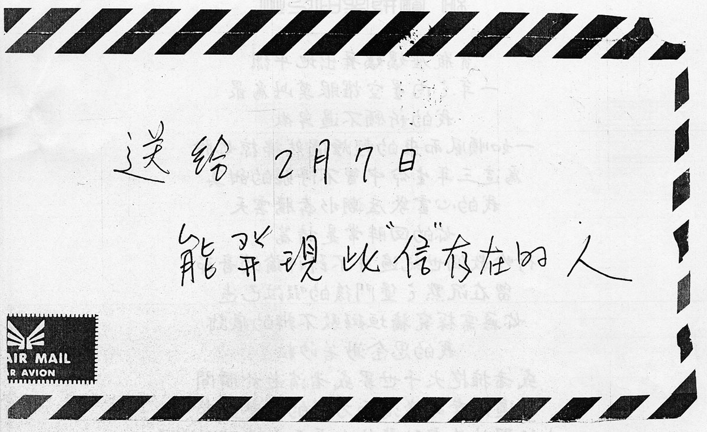
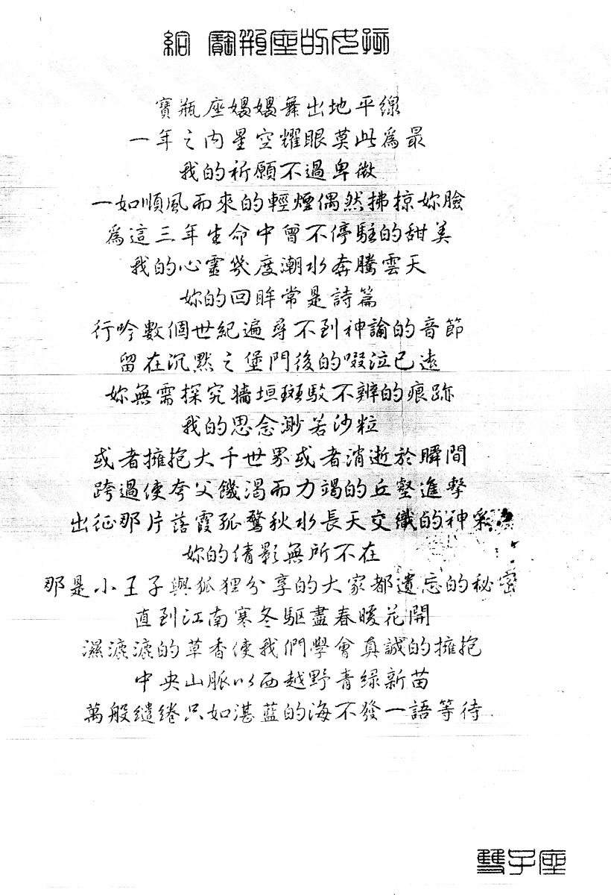

# 生日星座诗

送给 2 月 7 日能发现此“信”存在的人

给 宝瓶座的惠铃

宝瓶座袅袅舞出地平线  
一年之内星空耀眼莫此为最  
我的祈愿不过卑微  
一如顺风而来的轻烟偶然拂掠你脸  
为这三年生命中曾不停驻的甜美  
我的心灵几度潮水奔腾云天  
你的回眸常是诗篇  
行吟数个世纪遍寻不到神谕的音节  
留在沉默之堡门后的啜泣已远  
你无需探究墙垣斑驳不辨的痕迹  
我的思念渺若沙粒  
或者拥抱大千世界或者消逝于瞬间  
跨过使夸父饥渴而力竭的丘壑进击  
出征那片落霞孤鹜秋水长天交织的神采  
你的倩影无所不在  
那是小王子与狐狸分享的大家都遗忘的秘密  
直到江南寒冬驱尽春暖花开  
湿漉漉的草香使我们学会真诚的拥抱  
中央山脉以西越野青绿新苗  
万般缱绻只如湛蓝的海不发一语等待

双子座

当前页面缺陷：

1. 写信时间未知

# 参考

-   [张雨生手稿 - 百度贴吧](https://tieba.baidu.com/photo/p?tid=2084189476&pic_id=6142fbf2b2119313aebedca565380cd791238d22)
-   [张雨生写给女朋友的信 - 豆瓣](https://www.douban.com/group/topic/233018900/)
