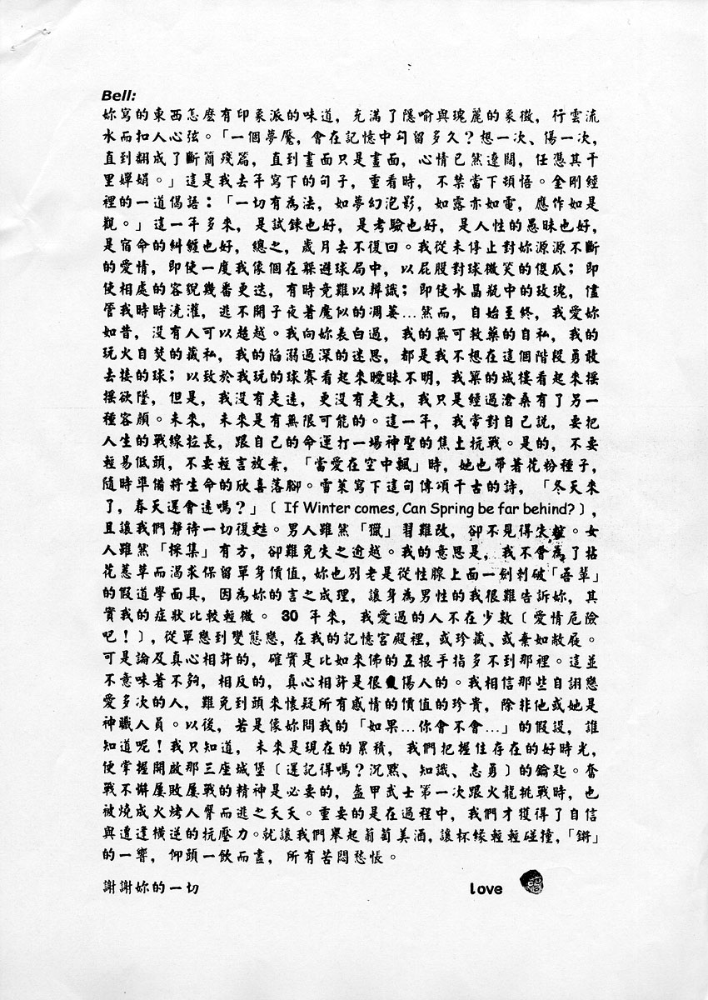

# 带着爱的花粉种子，随时准备将生命的欣喜落脚

Bell:

你写的东西怎么有印象派的味道，充满了隐喻与瑰丽的象征，行云流水而扣人心弦。
「一个梦魇，会在记忆中勾留多久？想一次、伤一次，直到翻成了断简残篇，直到画面只是画面，心情已然辽阔，任凭其千里婵娟。」[^1]这是我去年写下的句子，重看时，不禁当下顿悟。
金刚经里的一道偈语 ∶「一切有为法，如梦幻泡影，如露亦如电，应作如是观。」这一年多来，是试炼也好，是考验也好，是人性的愚昧也好，是宿命的纠缠也好，总之，岁月去不复回。
我从未停止对你源源不断的爱情，即使一度我像个在躲避球局中，以屁股对球微笑的傻瓜；即使相处的容貌几番更迭，有时竟难以辨识；即使水晶瓶中的玫瑰，尽管我时时浇灌，逃不开子夜着魔似的凋萎…然而，自始至终，我爱你如昔，没有人可以超越。
我向你表白过，我的无可救药的自私，我的玩火自焚的藏私，我的陷溺过深的迷思，都是我不想在这个阶段勇敢去接的球；以致于我玩的球赛看起来暧昧不明，我筑的城楼看起来摇摇欲坠，但是，我没有走远，更没有走失，我只是经过沧桑有了另一种容颜。

未来，未来是有无限可能的。这一年，我常对自己说，要把人生的战线拉长，跟自己的命运打一场神圣的焦土抗战。
是的，不要轻易低头，不要轻言放弃，「当爱在空中飘」时，她也带着花粉种子，随时准备将生命的欣喜落脚。
雪莱写下这句传颂千古的诗，「冬天来了，春天还会远吗？」（If Winter comes, Can Spring be far behind?），且让我们静待一切复苏。

男人虽然「猎」习难改，却不见得失控。女人虽然「采集」有方，却难免失之逾越。
我的意思是，我不会为了拈花惹草而渴求保留单身价值，你也别老是从性腺上面一剑刺破「吾辈」的假道学面具，因为你的言之有理，让身为男性的我很难告诉你，其实我的症状比较轻微。

30 年来，我爱过的人不在少数（爱情危险吧！），从单恋到变态恋，在我的记忆宫殿里，或珍藏、或弃如敝屣。可是论及真心相许的，确实是比如来佛的五根手指多不到那里。这并不意味着不够，相反的，真心相许是很伤人的。我相信那些自诩恋爱多次的人，难免到头来怀疑所有感情的价值的珍贵，除非他或她是神职人员。以后，若是像你问我的「如果…你会不会…」的假设，谁知道呢！
我只知道，未来是现在的累积，我们把握住存在的好时光，便掌握开启那三座城堡（还记得吗？沉默、知识、志勇）[^2]的钥匙。奋战不懈屡败屡战的精神是必要的，盔甲武士第一次跟火龙挑战时，也被烧成火烤人臀而逃之夭夭。重要的是在过程中，我们才获得了自信与遭逢横逆的抗压力。就让我们举起葡萄美酒，让杯缘轻轻碰撞，「锵」的一响，仰头一饮而尽，所有苦闷惆怅。

谢谢你的一切。

love

参考：

[信件打印稿 - tieba.baidu.com](https://tieba.baidu.com/p/2084189476#!/l/p1)

[^1]: 与《忧喜是一件双面衫》歌词十分相似
[^2]: [Robert Fisher 《The Knight in Rusty Armor》](https://book.douban.com/subject/26728923/)
