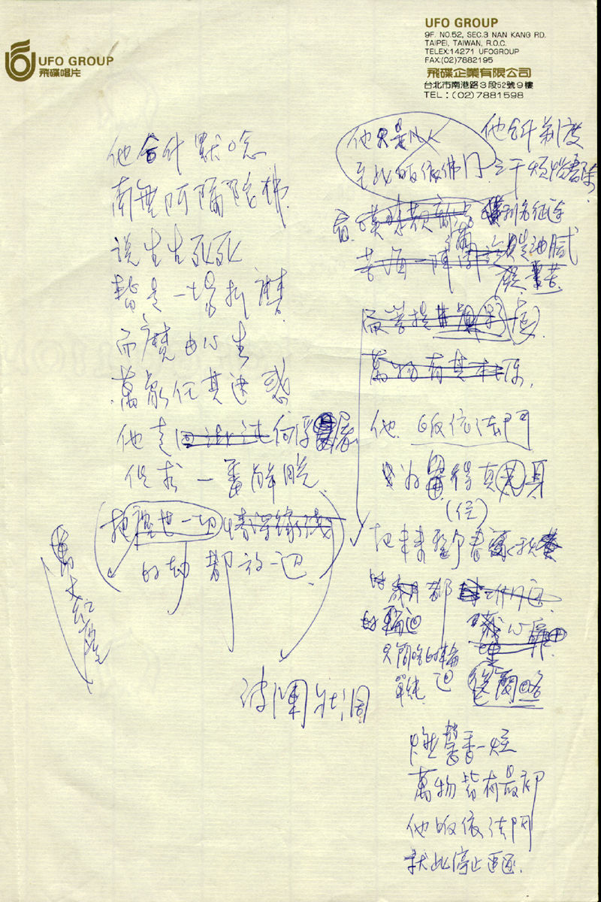
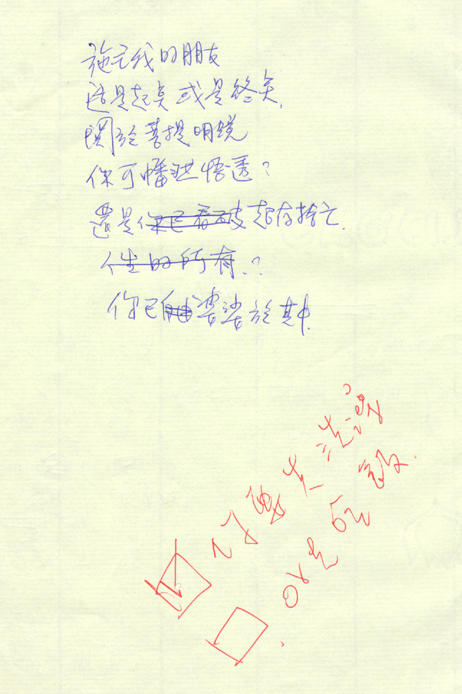

# 施主我的朋友

他合什默念 
南无阿弥陀佛 
说生生死死 
皆是一场折磨 
而魔由心生 
万象任其迷惑 
他走向~~混沌~~浮屠 
但求一番解脱 
把~~尘世一切~~万丈红尘~~情深缘浅~~波澜壮阔的劫都放一边

~~他是凡人~~ 
~~至此皈依佛门~~ 
他合什剃度 
三千烦恼尽除 
看~~叹悲欢离合~~利名征途 
~~苦海一阵周旋~~ 
满是油腻痴苦 
~~而菩提虚影~~ 
~~万物有其本源~~

他皈依法门 
为留得（住）真身 
把未来整个春~~夏~~秋~~冬~~ 
~~的岁月都封堆门边~~ 
~~的轮回都藏埋心扉~~ 
只简略单纯的轮回

燃馨香一炷 
万物皆有最初 
他皈依法门 
就此停止追逐

施主我的朋友 
这是起点或是终点 
关于菩提明镜 
你可幡然悟透？ 
还是~~你已看破~~超存舍亡 
~~人生的所有？~~ 
你已~~自由~~婆娑于其中

-   [x] 你要先洗澡
-   [ ] or 先吃饭

页面缺陷：

1. 创作时间未知

## 参考

-   [张雨生手稿 - tieba.baidu.com](https://tieba.baidu.com/p/2084189476#!/l/p1)
-   [《施主我的朋友》字迹辨识 - douban.com](https://www.douban.com/group/topic/329114306/)
